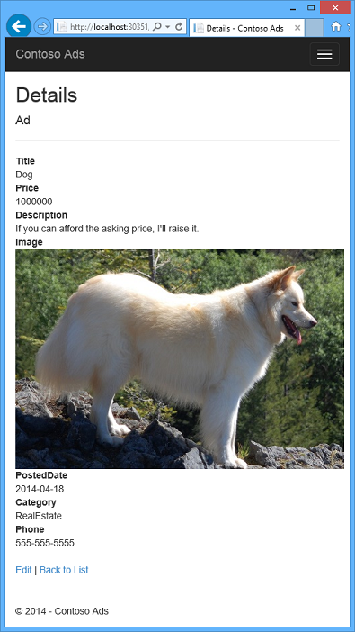
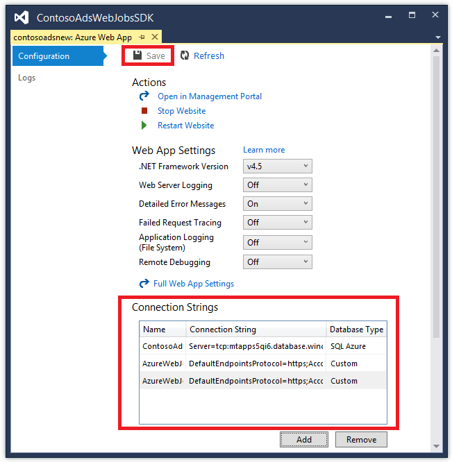
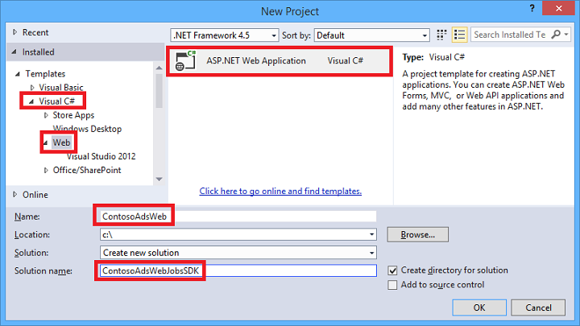
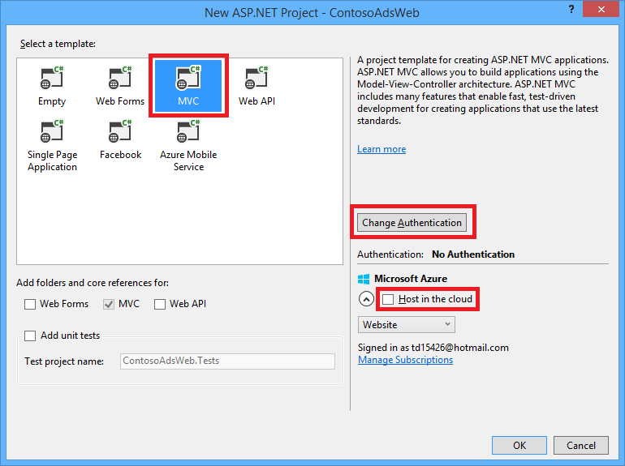
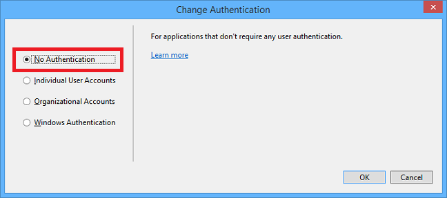

<properties
    pageTitle="Criar um WebJob .NET no serviço de aplicativo do Azure | Microsoft Azure"
    description="Crie um aplicativo de várias camado usando ASP.NET MVC e Azure. O front-end executa em um aplicativo web no serviço de aplicativo do Azure e back-end é executado como um WebJob. O aplicativo usa a estrutura de entidades, banco de dados SQL e filas de armazenamento do Azure e blobs."
    services="app-service"
    documentationCenter=".net"
    authors="tdykstra"
    manager="wpickett"
    editor="mollybos"/>

<tags
    ms.service="app-service"
    ms.workload="na"
    ms.tgt_pltfrm="na"
    ms.devlang="na"
    ms.topic="article"
    ms.date="10/28/2016"
    ms.author="tdykstra"/>

# Criar um WebJob .NET no serviço de aplicativo do Azure

Este tutorial mostra como escrever código para um aplicativo de ASP.NET MVC 5 várias camado simples que usa o [SDK do WebJobs](websites-dotnet-webjobs-sdk.md).

A finalidade do [WebJobs SDK](websites-webjobs-resources.md) é simplificar o código que você escreve para tarefas comuns que um WebJob pode realizar, como o processamento de imagens, fila de processamento, agregação RSS, manutenção de arquivo e enviar emails. O SDK do WebJobs possui recursos internos para trabalhar com o armazenamento do Azure e barramento de serviço, para agendamento de tarefas e tratamento de erros e para muitos outros cenários comuns. Além disso, foi projetada para ser extensível e não há um [repositório de origem para extensões de abrir](https://github.com/Azure/azure-webjobs-sdk-extensions/wiki/Binding-Extensions-Overview).

O aplicativo de amostra é um BBS anúncios. Os usuários podem carregar imagens para anúncios e um processo de back-end converte imagens em miniaturas. A página de lista do ad mostra as miniaturas e a página de detalhes do ad mostra a imagem de tamanho máximo. Aqui está uma captura de tela:

Este aplicativo de exemplo funciona com [filas Azure](http://www.asp.net/aspnet/overview/developing-apps-with-windows-azure/building-real-world-cloud-apps-with-windows-azure/queue-centric-work-pattern) e [blobs Azure](http://www.asp.net/aspnet/overview/developing-apps-with-windows-azure/building-real-world-cloud-apps-with-windows-azure/unstructured-blob-storage). O tutorial mostra como implantar o aplicativo de [Serviço de aplicativo do Azure](http://go.microsoft.com/fwlink/?LinkId=529714) e [Azure SQL Database](http://msdn.microsoft.com/library/azure/ee336279).

## Pré-requisitos

O tutorial supõe que você sabe como trabalhar com projetos do [ASP.NET MVC 5](http://www.asp.net/mvc/tutorials/mvc-5/introduction/getting-started) no Visual Studio.

O tutorial foi escrito para Visual Studio 2013. Se você ainda não tiver o Visual Studio, ele será instalado para você automaticamente quando você instala o SDK do Azure para .NET.

O tutorial pode ser usado com o Visual Studio de 2015, mas antes de executar o aplicativo localmente você precisa alterar o `Data Source` parte da cadeia de conexão do SQL Server LocalDB na Web. config e App arquivos de `Data Source=(localdb)\v11.0` para `Data Source=(LocalDb)\MSSQLLocalDB`. 

> [AZURE.NOTE] Você precisará de uma conta do Azure para concluir este tutorial:
  >
  > + Você pode [Abrir uma conta do Azure gratuitamente](https://azure.microsoft.com/pricing/free-trial/?WT.mc_id=A261C142F): obtenha créditos que você pode usar para experimentar serviços Azure pagos e até mesmo depois que eles são usados até você pode manter a conta e uso livre Azure serviços, como sites. Seu cartão de crédito nunca será cobrado, a menos que você explicitamente alterar suas configurações e peça para ser cobrados.
  >
  > + Você pode [Ativar benefícios do assinante MSDN](https://azure.microsoft.com/pricing/member-offers/msdn-benefits-details/?WT.mc_id=A261C142F): assinatura MSDN Your lhe créditos todo mês que você pode usar para serviços do Azure pagos.
  >
  >Se você quiser começar a usar o serviço de aplicativo do Azure antes de se inscrever para uma conta do Azure, vá para [Experimentar o serviço de aplicativo](http://go.microsoft.com/fwlink/?LinkId=523751), onde você pode criar imediatamente um aplicativo da web de curta duração starter no aplicativo de serviço. Não há cartões de crédito obrigatório; Não há compromissos.

## O que você aprenderá

O tutorial mostra como fazer as seguintes tarefas:

* Habilite o computador para desenvolvimento Azure instalando o SDK do Azure.
* Crie um projeto de aplicativo de Console que implanta automaticamente como um WebJob Azure quando você implanta o projeto web associado.
* Teste um back-end WebJobs SDK localmente no computador de desenvolvimento.
* Publica um aplicativo com um back-end WebJobs em um aplicativo web no aplicativo de serviço.
* Carregar arquivos e armazená-los no serviço do Azure Blob.
* Use o SDK do Azure WebJobs para trabalhar com blobs e filas de armazenamento do Azure.

## Arquitetura do aplicativo

O aplicativo de exemplo usa o [padrão de trabalho centrados em fila](http://www.asp.net/aspnet/overview/developing-apps-with-windows-azure/building-real-world-cloud-apps-with-windows-azure/queue-centric-work-pattern) transfira o trabalho que requer muita CPU da criação de miniaturas para um processo de back-end.

O aplicativo armazena anúncios em um banco de dados do SQL, usando entidade Framework Code First para criar as tabelas e acessar os dados. Para cada anúncio, o banco de dados armazena dois URLs: uma para a imagem em tamanho normal e outra para a miniatura.

Quando um usuário carrega uma imagem, o aplicativo web armazena a imagem em um [blob do Azure](http://www.asp.net/aspnet/overview/developing-apps-with-windows-azure/building-real-world-cloud-apps-with-windows-azure/unstructured-blob-storage)e armazena as informações de anúncio do banco de dados com uma URL que aponta para o blob. Ao mesmo tempo, ele grava uma mensagem para uma fila Azure. Em um processo de back-end executando como um WebJob do Azure, o SDK WebJobs controla a fila para novas mensagens. Quando uma nova mensagem for exibida, o WebJob cria uma miniatura de imagem e atualiza o campo de banco de dados do URL em miniatura para esse anúncio. Aqui está um diagrama que mostra como as partes do aplicativo interagem:

[AZURE.INCLUDE [install-sdk](../../includes/install-sdk-2015-2013.md)]

As tutoriais instruções se aplicam ao SDK do Azure para .NET 2.7.1 ou posterior.

## Criar uma conta de armazenamento do Azure

Uma conta de armazenamento do Azure fornece recursos para armazenar dados fila e blob na nuvem. Ele também é usado pelo SDK WebJobs para armazenar dados de log para o painel.

Em um aplicativo do mundo real, você normalmente cria contas separadas para aplicativo dados versus dados de registro em log e separada contabilizam para dados de teste versus dados de produção. Para este tutorial, você usará apenas uma conta.

1. Abra a janela **Server Explorer** no Visual Studio.

2. Clique com botão direito no nó do **Azure** e clique em **conectar-se ao Microsoft Azure**.

3. Entre usando suas credenciais do Azure.

5. Clique com botão direito **armazenamento** sob o nó Azure e, em seguida, clique em **Criar conta de armazenamento**.

3. Na caixa de diálogo **Criar conta de armazenamento** , insira um nome para a conta de armazenamento.

    O nome deve ser deve ser exclusivo (nenhuma outra conta de armazenamento do Azure pode ter o mesmo nome). Se o nome inserido já está em uso, você terá uma chance alterá-lo.

    A URL para acessar sua conta de armazenamento será *{name}*. core.windows.net.

5. Defina a lista suspensa **região ou grupo de afinidade** à região mais próximo.

    Esta configuração especifica quais data center Azure hospedará sua conta de armazenamento. Para este tutorial, sua escolha não fazer uma diferença notável. No entanto, para um aplicativo web de produção, desejar que o servidor web e sua conta de armazenamento para ser na mesma região para minimizar encargos de egresso de latência e de dados. O aplicativo da web (que você vai criar mais tarde) Data Center deve ser tão próxima possíveis para os navegadores acessando o web app para minimizar a latência.

6. Defina a lista suspensa de **replicação** **redundante localmente**.

    Quando a localização geográfica replicação estiver habilitada para uma conta de armazenamento, o conteúdo armazenado é replicado para um data center secundário para habilitar o failover para esse local no caso de um desastre maior no local principal. Replicação geográfica pode provoca custos adicionais. Para contas de teste e desenvolvimento, geralmente não deseja pagar pela replicação geográfica. Para obter mais informações, consulte [criar, gerenciar, ou excluir uma conta de armazenamento](../storage-create-storage-account/#replication-options).

5. Clique em **criar**.

    

## Baixe o aplicativo

1. Baixe e descompacte a [concluído solução](http://code.msdn.microsoft.com/Simple-Azure-Website-with-b4391eeb).

2. Inicie o Visual Studio.

3. No menu **arquivo** , escolha **Abrir > projeto/solução**, navegue até onde você baixou a solução e abra o arquivo de solução.

4. Pressione CTRL + SHIFT + B para criar a solução.

    Por padrão, o Visual Studio restaura automaticamente o conteúdo do pacote NuGet, que não foi incluído no arquivo *. zip* . Se os pacotes não restaurar, instalá-los manualmente indo para a caixa de diálogo **Gerenciar pacotes NuGet para solução** e clicar no botão **Restaurar** na parte superior direita.

5. No **Solution Explorer**, certifique-se de que **ContosoAdsWeb** seja selecionado como o projeto de inicialização.

## Configurar o aplicativo para usar sua conta de armazenamento

1. Abra o arquivo de *Web. config* do aplicativo no projeto ContosoAdsWeb.

    O arquivo contém uma cadeia de conexão de SQL e uma cadeia de caracteres de conexão de armazenamento do Azure para trabalhar com blobs e filas.

    A cadeia de conexão SQL aponta para um banco de dados do [SQL Server Express LocalDB](http://msdn.microsoft.com/library/hh510202.aspx) .

    A cadeia de conexão de armazenamento é um exemplo com espaços reservados para a chave de acesso e o nome de conta do armazenamento. Você vai substituir por uma cadeia de conexão que tem o nome e a chave da sua conta de armazenamento.  

    <pre class="prettyprint">&lt;connectionStrings&gt;
   &lt;Adicionar nome = "ContosoAdsContext" connectionString = "fonte de dados = \v11.0 (localdb); Inicial catálogo = ContosoAds; Segurança integrada = verdadeiro; Para MultipleActiveResultSets = verdadeiro; "providerName="System.Data.SqlClient "/&gt;
   &lt;Adicionar nome ="AzureWebJobsStorage"connectionString =" DefaultEndpointsProtocol = https; AccountName =<mark>[accountname]</mark>; AccountKey =<mark>[accesskey]</mark>"/&gt; 
    &lt;/connectionStrings      &gt;</pre>

    A cadeia de conexão de armazenamento é chamada AzureWebJobsStorage porque esse é o nome que usa o SDK do WebJobs por padrão. O mesmo nome é usado aqui para que você precise definir apenas um valor de cadeia de conexão no ambiente do Azure.

2. No **Server Explorer**, sua conta de armazenamento sob o nó de **armazenamento** de atalho e, em seguida, clique em **Propriedades**.

    

3. Na janela de **Propriedades** , clique em **Chaves de conta de armazenamento**e, em seguida, clique nas reticências.

    

4. Copie a **cadeia de Conexão**.

    

5. Substitua a cadeia de conexão de armazenamento no arquivo *Web. config* com a cadeia de conexão que você acabou de copiar. Verifique se que você seleciona tudo dentro das aspas, mas não incluindo as aspas antes de colar.

6. Abra o arquivo *App* no projeto ContosoAdsWebJob.

    Este arquivo tem duas cadeias de caracteres de conexão de armazenamento, uma para os dados de aplicativo e outra para o registro em log. Você pode usar contas de armazenamento separado para registrar em log e dados de aplicativo e você pode usar [várias contas de armazenamento para os dados](https://github.com/Azure/azure-webjobs-sdk/blob/master/test/Microsoft.Azure.WebJobs.Host.EndToEndTests/MultipleStorageAccountsEndToEndTests.cs). Para este tutorial, você usará uma conta de armazenamento único. As cadeias de caracteres de conexão possuem espaços reservados para as chaves de conta de armazenamento. 
    <pre class="prettyprint">&lt;configuração&gt; 
    &lt;connectionStrings&gt;
   &lt;Adicionar nome = "AzureWebJobsDashboard" connectionString = "DefaultEndpointsProtocol = https; AccountName =<mark>[accountname]</mark>; AccountKey =<mark>[accesskey]</mark>"/&gt;
   &lt;Adicionar nome ="AzureWebJobsStorage"connectionString =" DefaultEndpointsProtocol = https; AccountName =<mark>[accountname]</mark>; AccountKey =<mark>[accesskey]</mark>"/&gt;
   &lt;Adicionar nome ="ContosoAdsContext"connectionString =" fonte de dados = \v11.0 (localdb); Inicial catálogo = ContosoAds; Segurança integrada = verdadeiro; Para MultipleActiveResultSets = verdadeiro; " /&gt; 
    &lt;/connectionStrings&gt;
   &lt;inicialização&gt;
   &lt;versão supportedRuntime = "v 4.0" sku = ". NETFramework, versão = v 4.5 "/&gt; 
    &lt;/startup&gt;
&lt;/configuração                             &gt;</pre>

    Por padrão, o SDK WebJobs procura cadeias de caracteres de conexão chamadas AzureWebJobsStorage e AzureWebJobsDashboard. Como alternativa, você pode [armazenar a conexão de cadeia de caracteres no entanto desejado e passar no explicitamente para o `JobHost` objeto](websites-dotnet-webjobs-sdk-storage-queues-how-to.md#config).

7. Substitua as duas cadeias de caracteres de conexão de armazenamento com a cadeia de conexão que você copiou anteriormente.

8. Salve as alterações.

## Executar o aplicativo localmente

1. Para iniciar o frontend web do aplicativo, pressione CTRL + F5.

    O navegador padrão abre a página inicial. (O projeto da web é executada porque chegou o projeto de inicialização).

    

2. Para iniciar o back-end WebJob do aplicativo, clique com botão direito do projeto ContosoAdsWebJob no **Solution Explorer**e clique em **Depurar** > **Iniciar nova instância**.

    Uma janela de aplicativo do console abre e exibe mensagens de log indicando que o objeto WebJobs SDK JobHost iniciou a executar.

    

3. No seu navegador, clique em **criar um anúncio**.

4. Inserir alguns dados de teste e selecione uma imagem para carregar e clique em **criar**.

    

    O aplicativo vai para a página de índice, mas ele não mostra uma miniatura para o novo anúncio, pois que o processamento não foi aconteceu ainda.

    Enquanto isso, após uma pequeno espera uma mensagem de registro na janela do aplicativo de console mostra que uma mensagem de fila foi recebida e foi processada.

    

5. Depois de ver as mensagens de registro em log na janela do aplicativo de console, atualize a página de índice para ver a miniatura.

    

6. Clique em **detalhes** para o ad para ver a imagem em tamanho normal.

    

Esteve executando o aplicativo em seu computador local e está usando um SQL Server banco de dados localizado em seu computador, mas está trabalhando com filas e blobs na nuvem. Na seção a seguir você executará o aplicativo na nuvem, usando um banco de dados de nuvem, bem como blobs de nuvem e filas.  

## Executar o aplicativo na nuvem

Você vai fazer as seguintes etapas para executar o aplicativo na nuvem:

* Implante em aplicativos Web. Visual Studio cria automaticamente um novo aplicativo web no aplicativo de serviço e uma instância de banco de dados SQL.
* Configure o aplicativo web para usar sua conta de armazenamento e banco de dados do SQL Azure.

Depois de criar alguns anúncios enquanto executa na nuvem, você vai exibir o painel de WebJobs SDK para ver o rich-tem a oferecer os recursos de monitoramento.

### Implantar em aplicativos Web

1. Feche o navegador e a janela do aplicativo de console.

2. No **Solution Explorer**, clique com botão direito no projeto ContosoAdsWeb e clique em **Publicar**.

3. Na etapa do assistente **Publicar Web** **perfil** , clique em **aplicativos web do Microsoft Azure**.

    

4. Entrar no Azure se você ainda não estiver conectado.

5. Clique em **novo**.

    A caixa de diálogo pode ter uma aparência um pouco diferente dependendo de qual versão do SDK do Azure para .NET que você instalou.

    

6. Na caixa de diálogo **criar web app no Microsoft Azure** , insira um nome exclusivo na caixa **nome do aplicativo Web** .

    A URL completa consiste em que você digitar aqui plus. azurewebsites.net (como mostrado ao lado da caixa de texto **nome do aplicativo Web** ). Por exemplo, se o nome do aplicativo web for ContosoAds, a URL será ContosoAds.azurewebsites.net.

7. Na lista suspensa [plano de serviço de aplicativo](../app-service/azure-web-sites-web-hosting-plans-in-depth-overview.md) , escolha **Criar novo plano de serviço de aplicativo**. Insira um nome para o plano de serviço de aplicativo, como ContosoAdsPlan.

8. Na lista suspensa [grupo de recursos](../azure-resource-manager/resource-group-overview.md) , escolha **Criar novo grupo de recursos**.

9. Insira um nome para o grupo de recursos, como ContosoAdsGroup.

10. Na lista suspensa de **região** , escolha a mesma região que você escolheu para a sua conta de armazenamento.

    Esta configuração especifica quais Azure data center seu aplicativo web é executado no. Mantendo a conta de armazenamento e o aplicativo da web no mesmo data center minimiza encargos de egresso de latência e de dados.

11. Na lista suspensa **servidor de banco de dados** , escolha **Criar novo servidor**.

12. Insira um nome para o servidor de banco de dados, como contosoadsserver + seu nome ou um número para tornar o nome de servidor exclusivo. 

    O nome do servidor deve ser exclusivo. Ele pode conter letras minúsculas, dígitos numéricos e hífens. Ele não pode conter um hífen à direita. 

    Como alternativa, se a sua assinatura já tiver um servidor, você pode selecionar o servidor na lista suspensa.

12. Insira um **nome de usuário de banco de dados** de administrador e uma **senha de banco de dados**.

    Se você selecionou o **novo banco de dados do SQL server** que você não digitar um nome existente e senha aqui, você estiver inserindo um novo nome e senha que você está definindo agora para usar mais tarde quando você acessa o banco de dados. Se você selecionou um servidor que você criou anteriormente, você será solicitado a senha para a conta de usuário administrativo que você já tiver criado.

13. Clique em **criar**.

    

    Visual Studio cria a solução, o projeto da web, o aplicativo da web no Azure e a instância do Azure SQL Database.

14. Na etapa **Conexão** do assistente **Publicar Web** , clique em **Avançar**.

    

15. Na etapa **configurações** , desmarque a caixa de seleção **usar essa cadeia de caracteres de conexão no tempo de execução** e clique em **Avançar**.

    

    Você não precisa usar a caixa de diálogo Publicar para definir a cadeia de conexão de SQL porque você definirá esse valor no ambiente do Azure mais tarde.

    Você pode ignorar os avisos nesta página.

    * Normalmente a conta de armazenamento que você usa quando em execução no Azure seria diferente daquela que você usa quando executando localmente, mas para este tutorial você está usando a mesma nos dois ambientes. Portanto a cadeia de conexão AzureWebJobsStorage não precisa ser transformados. Mesmo que você quiser usar uma conta de armazenamento diferentes na nuvem, você precisaria transformar a cadeia de conexão porque o aplicativo usa uma configuração de ambiente Azure quando ele é executado no Azure. Você verá isto posteriormente no tutorial.

    * Para este tutorial, você não vai ser fazer alterações ao modelo de dados usado para o banco de dados ContosoAdsContext, portanto não é necessário usar entidade Framework código primeiro migrações para implantação. Código primeiro cria automaticamente um novo horário de banco de dados o primeiro o aplicativo tenta acessar dados do SQL.

    Neste tutorial, os valores padrão das opções em **Opções de publicação do arquivo** são bem.

16. Na etapa de **visualização** , clique em **Iniciar Visualizar**.

    

    Você pode ignorar o aviso sobre nenhum banco de dados que está sendo publicado. Entidade Framework Code First cria o banco de dados; ele não precisa ser publicado.

    A janela de visualização mostra que binários e arquivos de configuração do projeto WebJob serão copiados para a pasta de *app_data\jobs\continuous* do aplicativo web.

    

17. Clique em **Publicar**.

    Visual Studio implanta o aplicativo e abre a URL da página inicial no navegador.

    Você não será capaz de usar o aplicativo web até que você defina cadeias de caracteres de conexão no ambiente do Azure na próxima seção. Você verá uma página de erro ou a home page, dependendo das opções da web app e banco de dados criação que você escolheu anteriormente.

### Configure o aplicativo web para usar sua conta de armazenamento e banco de dados do SQL Azure.

É uma prática recomendada de segurança para [evitar a inserção de informações confidenciais como cadeias de caracteres de conexão em arquivos que são armazenados em repositórios de código de origem](http://www.asp.net/aspnet/overview/developing-apps-with-windows-azure/building-real-world-cloud-apps-with-windows-azure/source-control#secrets). Azure fornece uma maneira de fazer isso: você pode definir a cadeia de conexão e outros valores de configuração no ambiente do Azure e APIs de configuração do ASP.NET automaticamente pegar esses valores quando o aplicativo é executado no Azure. Você pode definir esses valores no Azure usando **Server Explorer**, o Portal do Azure, o Windows PowerShell ou a interface de linha entre plataformas. Para obter mais informações, consulte [como cadeias de caracteres de aplicativo e o trabalho de cadeias de caracteres de Conexão](/blog/2013/07/17/windows-azure-web-sites-how-application-strings-and-connection-strings-work/).

Nesta seção você usa **Server Explorer** para definir valores de cadeia de conexão no Azure.

7. No **Server Explorer**, clique com botão direito seu aplicativo web em **Azure > serviço de aplicativo > {seu grupo de recursos}**e clique em **Configurações de exibição**.

    A janela do **Azure Web App** abre na guia **configuração** .

9. Altere o nome da cadeia de caracteres de conexão DefaultConnection para ContosoAdsContext.

    Azure criada automaticamente essa cadeia de caracteres de conexão quando você criou o aplicativo web com um banco de dados associado, para que ele já tenha o valor de cadeia de conexão à direita. Você está alterando apenas o nome para o seu código está procurando.

9. Adicione duas cadeias de conexão nova, chamadas AzureWebJobsStorage e AzureWebJobsDashboard. Definir o tipo de escala e defina o valor de cadeia de conexão para o mesmo valor que você usou anteriormente para os arquivos *Web. config* e *App* . (Certifique-se de incluir a cadeia de conexão inteira, não apenas a tecla de acesso e não inclua as aspas).

    Essas cadeias de caracteres de conexão são usadas pelo SDK do WebJobs, uma para dados de aplicativo e outra para o registro em log. Como você viu anteriormente, aquele para dados de aplicativo também é usado pelo código web front-end.

9. Clique em **Salvar**.

    

10. No **Server Explorer**, clique com botão direito do web app e clique em **Parar**.

12. Após parar o web app, clique com botão direito do web app novamente e clique em **Iniciar**.

    O WebJob é iniciado automaticamente quando você publica, mas parar quando você alterar uma configuração. Para reiniciar a ele, você pode reiniciar o aplicativo web ou reiniciar o WebJob no [Portal do Azure](http://go.microsoft.com/fwlink/?LinkId=529715). Geralmente recomenda-se para reiniciar o aplicativo web após uma alteração de configuração.

9. Atualize a janela do navegador que tenha a URL do aplicativo web na sua barra de endereços.

    A home page aparece.

10. Crie um anúncio, como você fez quando você executou o aplicativo localmente.

    Mostra a página de índice sem uma miniatura a primeira.

11. Atualize a página após alguns segundos e a miniatura será exibida.

    Se a miniatura não aparecer, você pode precisar Aguarde um minuto mais ou menos para o WebJob reiniciar. Se depois por um tempo ainda não estiver vendo a miniatura quando você atualiza a página, o WebJob pode não ter sido iniciado automaticamente. Nesse caso, vá para a guia WebJobs na página do [portal clássico](https://manage.windowsazure.com) de seu aplicativo web e, em seguida, clique em **Iniciar**.

### Exibir o painel de WebJobs SDK

1. No [portal clássico](https://manage.windowsazure.com), selecione o aplicativo web.

2. Clique na guia **WebJobs** .

3. Clique na URL da coluna de Logs para sua WebJob.

    

    Uma nova guia do navegador abre o painel de WebJobs SDK. O painel mostra que o WebJob está em execução e mostra uma lista de funções em seu código que disparou o SDK do WebJobs.

4. Clique em uma das funções para ver detalhes sobre sua execução.

    

    

    O botão de **Função de repetição** nesta página faz com que a estrutura de WebJobs SDK chamar a função novamente e oferece a oportunidade de alterar os dados passados para a função primeiro.

>[AZURE.NOTE] Quando terminar de teste, excluir o aplicativo da web e a instância de banco de dados SQL. O aplicativo web é gratuito, mas a instância do banco de dados SQL e a conta de armazenamento acumulam encargos (mínimos devido a tamanho pequeno). Além disso, se você deixar o aplicativo da web em execução, qualquer pessoa que encontra sua URL pode criar e exibir anúncios. No portal do clássico, vá para a guia **Dashboard** para o aplicativo web e clique no botão **Excluir** na parte inferior da página. Em seguida, você pode selecionar uma caixa de seleção para excluir a instância de banco de dados SQL ao mesmo tempo. Se você quiser apenas temporariamente impedir que outras pessoas acessem o web app, clique em **Parar** . Nesse caso, encargos continuará a acumular da conta de armazenamento e banco de dados SQL. Você pode seguir um procedimento semelhante para excluir a conta de armazenamento e banco de dados do SQL quando você não precisa-los.

## Criar o aplicativo do zero

Nesta seção, você vai fazer as seguintes tarefas:

* Crie uma solução Visual Studio com um projeto da web.
* Adicione um projeto de biblioteca de classes para a camada de acesso de dados que é compartilhada entre back-end e front-end.
* Adicione um projeto de aplicativo de Console para o back-end, com implantação WebJobs habilitada.
* Adicione pacotes do NuGet.
* Referências de projeto do conjunto.
* Copie arquivos de código e configuração do aplicativo do aplicativo baixado que você trabalhou com na seção anterior do tutorial.
* Examine as partes do código que funcionam com o Azure blobs e filas e o SDK do WebJobs.

### Criar uma solução do Visual Studio com um projeto da web e o projeto de biblioteca de classe

1. No Visual Studio, escolha **novo** > **projeto** no menu **arquivo** .

2. Na caixa de diálogo **Novo projeto** , escolha **Visual c#** > **Web** > **Aplicativo Web ASP.NET**.

3. Nomeie o projeto ContosoAdsWeb, nome da solução ContosoAdsWebJobsSDK (alterar o nome da solução se você estiver colocando-lo na mesma pasta como a solução baixada) e clique em **Okey**.

    

5. Na caixa de diálogo **Novo projeto ASP.NET** , escolha o modelo MVC e desmarque a caixa de seleção de **Host na nuvem** em **Microsoft Azure**.

    Selecionar **Host na nuvem** permite Visual Studio para criar automaticamente um novo aplicativo web do Azure e banco de dados SQL. Desde que você já criou esses anteriormente, não é necessário agora durante a criação do projeto. Se você quiser criar uma nova, marque a caixa de seleção. Você pode configurar o novo aplicativo web e o banco de dados SQL da mesma maneira que você realizou anteriormente quando você implantou o aplicativo.

5. Clique em **autenticação de alteração**.

    

7. Na caixa de diálogo **Alterar autenticação** , escolha **Sem autenticação**e clique em **Okey**.

    

8. Na caixa de diálogo **Novo projeto ASP.NET** , clique em **Okey**.

    Visual Studio cria a solução e o projeto da web.

9. No **Solution Explorer**, clique com botão direito a solução (não o projeto) e escolha **Adicionar** > **Novo projeto**.

11. Na caixa de diálogo **Add New Project** , escolha **Visual c#** > **Área de trabalho do Windows** > modelo de**Biblioteca de classe** .  

10. Nomeie o projeto *ContosoAdsCommon*e clique em **Okey**.

    Este projeto conterá o contexto de estrutura de entidade e o modelo de dados que usarão o front-end e back-end. Como alternativa, você pode definir as classes relacionadas EF no projeto da web e fazer referência a esse projeto do projeto WebJob. Mas, em seguida, seu projeto WebJob terá uma referência a montagens de web que não precisa.

### Adicionar um projeto de aplicativo de Console que tenha implantação WebJobs habilitada

1. Clique com botão direito do projeto da web (não a solução ou o projeto de biblioteca de classes) e clique em **Adicionar** > **Novo projeto de WebJob do Azure**.

    

2. Na caixa de diálogo **Adicionar WebJob do Azure** , digite ContosoAdsWebJob como o **nome do projeto** e o **nome de WebJob**. Deixe **o modo de execução de WebJob** definido para **Executar continuamente**.

3.  Clique em **Okey**.

    Visual Studio cria um aplicativo de Console que está configurado para implantar como um WebJob sempre que você implantar o projeto da web. Para fazer isso, ele executou as seguintes tarefas após a criação do projeto:

    * Adicionado a um arquivo de *settings.json publicar webjob* na pasta de propriedades do projeto WebJob.
    * Adicionado a um arquivo de *webjobs list.json* na pasta de propriedades do projeto da web.
    * Instalado o pacote Microsoft.Web.WebJobs.Publish NuGet no projeto WebJob.

    Para obter mais informações sobre essas alterações, consulte [como implantar WebJobs usando Visual Studio](websites-dotnet-deploy-webjobs.md).

### Adicionar pacotes NuGet

O modelo de novo projeto de um projeto de WebJob instala automaticamente o pacote de WebJobs SDK NuGet [Microsoft.Azure.WebJobs](http://www.nuget.org/packages/Microsoft.Azure.WebJobs) e suas dependências.

Uma das dependências WebJobs SDK que é instalado automaticamente no projeto WebJob é a biblioteca de cliente do Azure armazenamento (SCL). No entanto, você precisa adicioná-lo ao projeto da web para trabalhar com blobs e filas.

1. Abra a caixa de diálogo **Gerenciar pacotes do NuGet** para a solução.

2. No painel esquerdo, selecione **pacotes instalados**.

3. Localizar o pacote de *Armazenamento do Azure* e clique em **Gerenciar**.

4. Na caixa **Selecionar projetos** , marque a caixa de seleção **ContosoAdsWeb** e clique em **Okey**.

    Todos os três projetos usam a estrutura de entidade para trabalhar com dados no banco de dados do SQL.

5. No painel esquerdo, selecione **Online**.

6. Localize o pacote de NuGet *EntityFramework* e instalá-lo em todos os três projetos.

### Referências de projeto de conjunto

Web e projetos de WebJob trabalham com o banco de dados do SQL, para que ambos precisam de uma referência ao projeto ContosoAdsCommon.

1. No projeto ContosoAdsWeb, defina uma referência ao projeto ContosoAdsCommon. (O projeto de ContosoAdsWeb de atalho e, em seguida, clique em **Adicionar** > **referência**. Na caixa de diálogo **Gerenciador de referência** , selecione **solução** > **projetos** > **ContosoAdsCommon**e clique em **Okey**.)

1. No projeto ContosoAdsWebJob, defina uma referência ao projeto ContosAdsCommon.

    O projeto WebJob necessidades referências para trabalhar com imagens e para acessar cadeias de caracteres de conexão.

3. No projeto ContosoAdsWebJob, defina uma referência `System.Drawing` e `System.Configuration`.

### Adicionar arquivos de código e configuração

Este tutorial não mostram como [criar exibições usando a estrutura e controladores MVC](http://www.asp.net/mvc/tutorials/mvc-5/introduction/getting-started), como [escrever código de estrutura de entidade que funciona com bancos de dados do SQL Server](http://www.asp.net/mvc/tutorials/getting-started-with-ef-using-mvc)ou [Noções básicas de assíncrona programação em ASP.NET 4,5](http://www.asp.net/aspnet/overview/developing-apps-with-windows-azure/building-real-world-cloud-apps-with-windows-azure/web-development-best-practices#async). Portanto tudo o que resta a fazer é copiar os arquivos de código e a configuração da solução baixado para a nova solução. Depois que você fizer isso, as seções a seguir mostram e explicam partes principais do código.

Para adicionar arquivos a um projeto ou uma pasta, clique com botão direito do projeto ou a pasta e clique em **Adicionar** > **Item existente**. Selecione os arquivos que você deseja e clique em **Adicionar**. Se for solicitado se você deseja substituir arquivos existentes, clique em **Sim**.

1. No projeto ContosoAdsCommon, exclua o arquivo *Class1. cs* e adicione os seguintes arquivos em seu lugar do projeto baixado.

    - *AD.cs*
    - *ContosoAdscontext.cs*
    - *BlobInformation.cs*  

2. No projeto ContosoAdsWeb, adicione os seguintes arquivos do projeto baixado.

    - *Web. config*
    - *Global.asax.cs*  
    - Na pasta *controladores* : *AdController.cs*
    - Na pasta *Views\Shared* : *cshtml* arquivo
    - Na pasta *Views\Home* : *cshtml*
    - Na pasta *Views\Ad* (criar pasta primeiro): cinco arquivos *. cshtml*  

3. No projeto ContosoAdsWebJob, adicione os seguintes arquivos do projeto baixado.

    - *App* (alterar o filtro de tipo de arquivo para **Todos os arquivos**)
    - *Program.cs*
    - *Functions.cs*

Agora você pode criar, executar e implantar o aplicativo, conforme indicado anteriormente no tutorial. Antes de você fizer isso, no entanto, interrompa o WebJob que ainda está sendo executado no primeiro web app para que você distribuiu. Caso contrário, o que WebJob processará mensagens de fila criadas localmente ou pelo aplicativo do executando em um novo aplicativo web, pois todos estão usando a mesma conta de armazenamento.

## Examine o código do aplicativo

As seções a seguir explicam o código relacionado ao trabalhar com as blobs WebJobs SDK e armazenamento do Azure e filas.

> [AZURE.NOTE] Para o código específico para o SDK do WebJobs, vá para as seções [Program.cs e Functions.cs](#programcs) .

### ContosoAdsCommon - Ad.cs

O arquivo de Ad.cs define uma enumeração para categorias de ad e uma classe de entidade POCO para obter informações do ad.

        public enum Category
        {
            Cars,
            [Display(Name="Real Estate")]
            RealEstate,
            [Display(Name = "Free Stuff")]
            FreeStuff
        }

        public class Ad
        {
            public int AdId { get; set; }

            [StringLength(100)]
            public string Title { get; set; }

            public int Price { get; set; }

            [StringLength(1000)]
            [DataType(DataType.MultilineText)]
            public string Description { get; set; }

            [StringLength(1000)]
            [DisplayName("Full-size Image")]
            public string ImageURL { get; set; }

            [StringLength(1000)]
            [DisplayName("Thumbnail")]
            public string ThumbnailURL { get; set; }

            [DataType(DataType.Date)]
            [DisplayFormat(DataFormatString = "{0:yyyy-MM-dd}", ApplyFormatInEditMode = true)]
            public DateTime PostedDate { get; set; }

            public Category? Category { get; set; }
            [StringLength(12)]
            public string Phone { get; set; }
        }

### ContosoAdsCommon - ContosoAdsContext.cs

A classe ContosoAdsContext Especifica que a classe de Ad é usada em uma coleção de DbSet, que armazena o Framework de entidade em um banco de dados do SQL.

        public class ContosoAdsContext : DbContext
        {
            public ContosoAdsContext() : base("name=ContosoAdsContext")
            {
            }
            public ContosoAdsContext(string connString)
                : base(connString)
            {
            }
            public System.Data.Entity.DbSet<Ad> Ads { get; set; }
        }

A classe tem dois construtores. O primeiro é usado pelo projeto da web e especifica o nome de uma cadeia de conexão que está armazenado no arquivo Web. config ou o ambiente de tempo de execução Azure. O segundo construtor permite passar na cadeia de conexão real. Que é necessário pelo project WebJob porque ele não tem um arquivo Web. config. Você viu anteriormente onde essa cadeia de caracteres de conexão foi armazenada, e você verá posteriormente como o código recupera a cadeia de conexão quando ele cria uma instância da classe DbContext.

### ContosoAdsCommon - BlobInformation.cs

O `BlobInformation` classe é usada para armazenar informações sobre um blob de imagem em uma mensagem de fila.

        public class BlobInformation
        {
            public Uri BlobUri { get; set; }

            public string BlobName
            {
                get
                {
                    return BlobUri.Segments[BlobUri.Segments.Length - 1];
                }
            }
            public string BlobNameWithoutExtension
            {
                get
                {
                    return Path.GetFileNameWithoutExtension(BlobName);
                }
            }
            public int AdId { get; set; }
        }

### ContosoAdsWeb - Global.asax.cs

Código que é chamado do `Application_Start` método cria um contêiner de blob de *imagens* e uma fila de *imagens* , caso ainda não existam. Isso garante que sempre que você inicia usando uma nova conta de armazenamento, o contêiner de blob necessários e fila são criados automaticamente.

O código obtém acesso à conta de armazenamento, usando a cadeia de conexão do armazenamento do ambiente de tempo de execução Azure ou arquivo *Web. config* .

        var storageAccount = CloudStorageAccount.Parse
            (ConfigurationManager.ConnectionStrings["AzureWebJobsStorage"].ToString());

Em seguida, ele obtém uma referência para o contêiner de blob de *imagens* , cria o contêiner se ele ainda não exista e define as permissões de acesso no contêiner de novo. Por padrão, novos contêineres permitem somente aos clientes com credenciais de conta de armazenamento acessar blobs. O aplicativo web deve os blobs seja público para que ele possa exibir imagens usando URLs que apontam para os blobs de imagem.

        var blobClient = storageAccount.CreateCloudBlobClient();
        var imagesBlobContainer = blobClient.GetContainerReference("images");
        if (imagesBlobContainer.CreateIfNotExists())
        {
            imagesBlobContainer.SetPermissions(
                new BlobContainerPermissions
                {
                    PublicAccess = BlobContainerPublicAccessType.Blob
                });
        }

Código semelhante obtém uma referência à fila *thumbnailrequest* e cria uma nova fila. Nesse caso, nenhuma alteração de permissões é necessária. 

        CloudQueueClient queueClient = storageAccount.CreateCloudQueueClient();
        var imagesQueue = queueClient.GetQueueReference("thumbnailrequest");
        imagesQueue.CreateIfNotExists();

### ContosoAdsWeb - cshtml

O arquivo *cshtml* define o nome do aplicativo no cabeçalho e rodapé e cria uma entrada de menu "Anúncios".

### ContosoAdsWeb - Views\Home\Index.cshtml

O arquivo de *Views\Home\Index.cshtml* exibe links de categoria na home page. Os links de passam o valor inteiro do `Category` enumeração em uma variável de sequência de consulta para a página de índice de anúncios.

        <li>@Html.ActionLink("Cars", "Index", "Ad", new { category = (int)Category.Cars }, null)</li>
        <li>@Html.ActionLink("Real estate", "Index", "Ad", new { category = (int)Category.RealEstate }, null)</li>
        <li>@Html.ActionLink("Free stuff", "Index", "Ad", new { category = (int)Category.FreeStuff }, null)</li>
        <li>@Html.ActionLink("All", "Index", "Ad", null, null)</li>

### ContosoAdsWeb - AdController.cs

No *AdController.cs* as chamadas de construtor de arquivo a `InitializeStorage` método para criar objetos de biblioteca de cliente de armazenamento do Azure que fornecem uma API para trabalhar com blobs e filas.

Em seguida, o código obtém uma referência ao contêiner de blob de *imagens* , como você viu anteriormente em *Global.asax.cs*. Ao fazer isso, ele define um padrão [Repetir política](http://www.asp.net/aspnet/overview/developing-apps-with-windows-azure/building-real-world-cloud-apps-with-windows-azure/transient-fault-handling) apropriado para um aplicativo web. A política padrão de repetição de retirada exponencial pode travar o aplicativo web por mais de um minuto em tentativas para uma falha temporária. A política de repetição especificada aqui aguarda 3 segundos após cada tentar para até 3 tentativas.

        var blobClient = storageAccount.CreateCloudBlobClient();
        blobClient.DefaultRequestOptions.RetryPolicy = new LinearRetry(TimeSpan.FromSeconds(3), 3);
        imagesBlobContainer = blobClient.GetContainerReference("images");

Código semelhante obtém uma referência para a fila de *imagens* .

        CloudQueueClient queueClient = storageAccount.CreateCloudQueueClient();
        queueClient.DefaultRequestOptions.RetryPolicy = new LinearRetry(TimeSpan.FromSeconds(3), 3);
        imagesQueue = queueClient.GetQueueReference("blobnamerequest");

A maioria do código do controlador é típico para trabalhar com um modelo de dados de estrutura de entidades usando uma classe DbContext. Uma exceção é o HttpPost `Create` método, que carrega um arquivo e salva no armazenamento de blob. O fichário de modelo fornece um objeto de [HttpPostedFileBase](http://msdn.microsoft.com/library/system.web.httppostedfilebase.aspx) para o método.

        [HttpPost]
        [ValidateAntiForgeryToken]
        public async Task<ActionResult> Create(
            [Bind(Include = "Title,Price,Description,Category,Phone")] Ad ad,
            HttpPostedFileBase imageFile)

Se o usuário selecionado um arquivo para carregar, o código carrega o arquivo, salva em um blob e atualiza o registro de banco de dados do Ad com uma URL que aponta para o blob.

        if (imageFile != null && imageFile.ContentLength != 0)
        {
            blob = await UploadAndSaveBlobAsync(imageFile);
            ad.ImageURL = blob.Uri.ToString();
        }

O código que faz o carregamento está na `UploadAndSaveBlobAsync` método. Ele cria um nome GUID para o blob, carrega e salva o arquivo e retorna uma referência para o blob salvo.

        private async Task<CloudBlockBlob> UploadAndSaveBlobAsync(HttpPostedFileBase imageFile)
        {
            string blobName = Guid.NewGuid().ToString() + Path.GetExtension(imageFile.FileName);
            CloudBlockBlob imageBlob = imagesBlobContainer.GetBlockBlobReference(blobName);
            using (var fileStream = imageFile.InputStream)
            {
                await imageBlob.UploadFromStreamAsync(fileStream);
            }
            return imageBlob;
        }

Após o HttpPost `Create` método carrega um blob e atualiza o banco de dados, ela cria uma mensagem de fila para informar o processo de back-end que uma imagem está pronta para a conversão em uma miniatura.

        BlobInformation blobInfo = new BlobInformation() { AdId = ad.AdId, BlobUri = new Uri(ad.ImageURL) };
        var queueMessage = new CloudQueueMessage(JsonConvert.SerializeObject(blobInfo));
        await thumbnailRequestQueue.AddMessageAsync(queueMessage);

O código para o HttpPost `Edit` método é semelhante, exceto que se o usuário selecionar um novo arquivo de imagem qualquer bolhas que já existem para essa ad devem ser excluídas.

        if (imageFile != null && imageFile.ContentLength != 0)
        {
            await DeleteAdBlobsAsync(ad);
            imageBlob = await UploadAndSaveBlobAsync(imageFile);
            ad.ImageURL = imageBlob.Uri.ToString();
        }

Aqui está o código que exclui blobs quando você exclui um anúncio:

        private async Task DeleteAdBlobsAsync(Ad ad)
        {
            if (!string.IsNullOrWhiteSpace(ad.ImageURL))
            {
                Uri blobUri = new Uri(ad.ImageURL);
                await DeleteAdBlobAsync(blobUri);
            }
            if (!string.IsNullOrWhiteSpace(ad.ThumbnailURL))
            {
                Uri blobUri = new Uri(ad.ThumbnailURL);
                await DeleteAdBlobAsync(blobUri);
            }
        }
        private static async Task DeleteAdBlobAsync(Uri blobUri)
        {
            string blobName = blobUri.Segments[blobUri.Segments.Length - 1];
            CloudBlockBlob blobToDelete = imagesBlobContainer.GetBlockBlobReference(blobName);
            await blobToDelete.DeleteAsync();
        }

### ContosoAdsWeb - Views\Ad\Index.cshtml e Details.cshtml

O arquivo *cshtml* exibe miniaturas com os outros dados do ad:

        

O arquivo de *Details.cshtml* exibe a imagem em tamanho normal:

        

### ContosoAdsWeb - Views\Ad\Create.cshtml e Edit.cshtml

Os arquivos *Create.cshtml* e *Edit.cshtml* especificam a codificação do formulário que permite que o controlador obter o `HttpPostedFileBase` objeto.

        @using (Html.BeginForm("Create", "Ad", FormMethod.Post, new { enctype = "multipart/form-data" }))

Um `<input>` elemento informa o navegador para fornecer uma caixa de diálogo de seleção de arquivo.

        <input type="file" name="imageFile" accept="image/*" class="form-control fileupload" />

### ContosoAdsWebJob - Program.cs

Quando o WebJob for iniciado, o `Main` método chama o SDK do WebJobs `JobHost.RunAndBlock` método para começar a execução de disparadas funções no segmento atual.

        static void Main(string[] args)
        {
            JobHost host = new JobHost();
            host.RunAndBlock();
        }

### ContosoAdsWebJob - Functions.cs - GenerateThumbnail método

O SDK do WebJobs chama este método quando for recebida uma mensagem de fila. O método cria uma miniatura e coloca a miniatura URL no banco de dados.

        public static void GenerateThumbnail(
        [QueueTrigger("thumbnailrequest")] BlobInformation blobInfo,
        [Blob("images/{BlobName}", FileAccess.Read)] Stream input,
        [Blob("images/{BlobNameWithoutExtension}_thumbnail.jpg")] CloudBlockBlob outputBlob)
        {
            using (Stream output = outputBlob.OpenWrite())
            {
                ConvertImageToThumbnailJPG(input, output);
                outputBlob.Properties.ContentType = "image/jpeg";
            }

            // Entity Framework context class is not thread-safe, so it must
            // be instantiated and disposed within the function.
            using (ContosoAdsContext db = new ContosoAdsContext())
            {
                var id = blobInfo.AdId;
                Ad ad = db.Ads.Find(id);
                if (ad == null)
                {
                    throw new Exception(String.Format("AdId {0} not found, can't create thumbnail", id.ToString()));
                }
                ad.ThumbnailURL = outputBlob.Uri.ToString();
                db.SaveChanges();
            }
        }

* O `QueueTrigger` atributo direciona o SDK WebJobs chamar este método quando uma nova mensagem for recebida na fila thumbnailrequest.

        [QueueTrigger("thumbnailrequest")] BlobInformation blobInfo,

    O `BlobInformation` objeto na mensagem de fila é automaticamente desserializado para o `blobInfo` parâmetro. Quando o método for concluído, a mensagem de fila é excluída. Se o método falhar antes da conclusão, a mensagem de fila não é excluída; Depois de expirar de 10 minutos, a mensagem é lançada para ser selecionados novamente e processada. Esta sequência não ser repetida indefinidamente se uma mensagem sempre causa uma exceção. Depois de 5 malsucedido tentativas processar uma mensagem, a mensagem é movida para uma fila denominada {NomeDaFila}-suspeita. O número máximo de tentativas é configurável.

* Os dois `Blob` atributos fornecem objetos que estão vinculados a blobs: um para o blob de imagem existente e outro para um novo blob em miniatura que o método cria.

        [Blob("images/{BlobName}", FileAccess.Read)] Stream input,
        [Blob("images/{BlobNameWithoutExtension}_thumbnail.jpg")] CloudBlockBlob outputBlob)

    Nomes de blob vêm de propriedades do `BlobInformation` objeto recebido na mensagem de fila (`BlobName` e `BlobNameWithoutExtension`). Para obter a funcionalidade total da biblioteca de cliente de armazenamento, você pode usar o `CloudBlockBlob` classe para trabalhar com blobs. Se você deseja reutilizar o código que foi escrito para trabalhar com `Stream` objetos, você pode usar o `Stream` classe.

Para obter mais informações sobre como escrever funções que usam atributos WebJobs SDK, consulte os seguintes recursos:

* [Como usar o armazenamento do Azure fila com o SDK do WebJobs](websites-dotnet-webjobs-sdk-storage-queues-how-to.md)
* [Como usar o armazenamento de blob do Microsoft Azure com o SDK do WebJobs](websites-dotnet-webjobs-sdk-storage-blobs-how-to.md)
* [Como usar o armazenamento de tabela Azure com o SDK do WebJobs](websites-dotnet-webjobs-sdk-storage-tables-how-to.md)
* [Como usar o barramento de serviço do Azure com o SDK do WebJobs](websites-dotnet-webjobs-sdk-service-bus.md)

> [AZURE.NOTE]
>
> * Se seu aplicativo web é executado em várias VMs, vários WebJobs será executado simultaneamente e, em alguns cenários, isso pode resultar nos mesmos dados sendo processados várias vezes. Isso não é um problema se você usa a fila interna, blob e gatilhos de barramento de serviço. O SDK garante que suas funções serão processadas apenas uma vez para cada mensagem ou blob.
>
> * Para obter informações sobre como implementar desligamento, consulte [Desligamento](websites-dotnet-webjobs-sdk-storage-queues-how-to.md#graceful).
>
> * O código a `ConvertImageToThumbnailJPG` método (não mostrado) usa classes no `System.Drawing` namespace para simplicidade. No entanto, as classes neste namespace foram projetadas para uso com formulários do Windows. Eles não são suportados para uso em um serviço Windows ou do ASP.NET. Para obter mais informações sobre opções de processamento de imagem, consulte [Geração de imagem dinâmica](http://www.hanselman.com/blog/BackToBasicsDynamicImageGenerationASPNETControllersRoutingIHttpHandlersAndRunAllManagedModulesForAllRequests.aspx) e [Profunda dentro de redimensionamento de imagem](http://www.hanselminutes.com/313/deep-inside-image-resizing-and-scaling-with-aspnet-and-iis-with-imageresizingnet-author-na).

## Próximas etapas

Neste tutorial, você viu um aplicativo de várias camado simples que usa o SDK WebJobs para processamento de back-end. Esta seção oferece algumas sugestões para aprender mais sobre os aplicativos de vários níveis do ASP.NET e WebJobs.

### Recursos que estiverem faltando

O aplicativo foram mantido simple para um tutorial guia de Introdução. Em um aplicativo do mundo real você seria implementar a [inclusão de dependência](http://www.asp.net/mvc/tutorials/hands-on-labs/aspnet-mvc-4-dependency-injection) e o [repositório e unidade de padrões de trabalho](http://www.asp.net/mvc/tutorials/getting-started-with-ef-using-mvc/advanced-entity-framework-scenarios-for-an-mvc-web-application#repo), use [uma interface para o registro em log](http://www.asp.net/aspnet/overview/developing-apps-with-windows-azure/building-real-world-cloud-apps-with-windows-azure/monitoring-and-telemetry#log), usar [EF código primeiro migrações](http://www.asp.net/mvc/tutorials/getting-started-with-ef-using-mvc/migrations-and-deployment-with-the-entity-framework-in-an-asp-net-mvc-application) para gerenciar alterações de modelo de dados e usar [EF Conexão resiliência](http://www.asp.net/mvc/tutorials/getting-started-with-ef-using-mvc/connection-resiliency-and-command-interception-with-the-entity-framework-in-an-asp-net-mvc-application) para gerenciar erros de rede temporário.

### Dimensionamento WebJobs

WebJobs executar no contexto de um aplicativo web e não são escaláveis separadamente. Por exemplo, se você tiver uma instância de aplicativo padrão da web, você tem apenas uma instância do processo de plano de fundo em execução e está usando alguns dos recursos do servidor (CPU, memória, etc.) que caso contrário estaria disponíveis para servir o conteúdo da web.

Se o tráfego varia por hora do dia ou o dia da semana, e se o processamento de back-end precisar pode esperar, você pode agendar sua WebJobs para executar em horários de pouco tráfego. Se a carga ainda for muito alta para essa solução, você pode executar o back-end como um WebJob em um aplicativo web separado dedicado para essa finalidade. Em seguida, você pode dimensionar seu aplicativo da web de back-end independentemente de seu aplicativo da web de front-end.

Para obter mais informações, consulte [WebJobs de dimensionamento](websites-webjobs-resources.md#scale).

### Evitando web app desligar tempo limite liste

Para garantir que seu WebJobs sempre estiver executando e executando em todas as instâncias do seu aplicativo web, você precisa habilitar o recurso de [sempre ativado](http://weblogs.asp.net/scottgu/archive/2014/01/16/windows-azure-staging-publishing-support-for-web-sites-monitoring-improvements-hyper-v-recovery-manager-ga-and-pci-compliance.aspx) .

### Usando o SDK WebJobs fora do WebJobs

Um programa que usa o SDK do WebJobs não precisa executar no Azure em um WebJob. Ele pode ser executado localmente, e ele também pode executar em outros ambientes como uma função de trabalho do serviço de nuvem ou um serviço do Windows. No entanto, você só poderá acessar o painel de WebJobs SDK por meio de um aplicativo web Azure. Para usar o painel de controle, você precisa conectar o aplicativo da web para a conta de armazenamento que você está usando, definindo a cadeia de conexão AzureWebJobsDashboard na guia **Configurar** do portal do clássico. Em seguida, você pode obter ao painel usando a URL a seguir:

https://{webappname}.SCM.azurewebsites.NET/azurejobs/#/Functions

Para obter mais informações, consulte [Obtendo um painel para o desenvolvimento local com o SDK do WebJobs](http://blogs.msdn.com/b/jmstall/archive/2014/01/27/getting-a-dashboard-for-local-development-with-the-webjobs-sdk.aspx), mas observe que ela mostra um nome de cadeia de conexão antigo.

### Mais documentação de WebJobs

Para obter mais informações, consulte [recursos de documentação WebJobs do Azure](http://go.microsoft.com/fwlink/?LinkId=390226).
