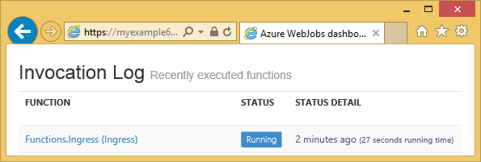

<properties 
    pageTitle="Como usar o armazenamento de tabela Azure com o SDK do WebJobs" 
    description="Aprenda a usar o armazenamento de tabela do Microsoft Azure com o SDK do WebJobs. Criar tabelas, adicione entidades a tabelas e ler tabelas existentes." 
    services="app-service\web, storage" 
    documentationCenter=".net" 
    authors="tdykstra" 
    manager="wpickett" 
    editor="jimbe"/>

<tags 
    ms.service="app-service-web" 
    ms.workload="web" 
    ms.tgt_pltfrm="na" 
    ms.devlang="dotnet" 
    ms.topic="article" 
    ms.date="06/01/2016" 
    ms.author="tdykstra"/>

# Como usar o armazenamento de tabela Azure com o SDK do WebJobs

## Visão geral

Este guia fornece c# exemplos de código que mostram como ler e gravar tabelas de armazenamento do Azure usando [WebJobs SDK](websites-dotnet-webjobs-sdk.md) versão 1. x.

Guia supõe que você sabe [como criar um projeto de WebJob no Visual Studio com cadeias de caracteres de conexão que apontam para sua conta de armazenamento](websites-dotnet-webjobs-sdk-get-started.md) ou a [várias contas de armazenamento](https://github.com/Azure/azure-webjobs-sdk/blob/master/test/Microsoft.Azure.WebJobs.Host.EndToEndTests/MultipleStorageAccountsEndToEndTests.cs).
        
Alguns da slides de trechos de código a `Table` atributo usado em funções que são [chamados manualmente](websites-dotnet-webjobs-sdk-storage-queues-how-to.md#manual), ou seja, não usando um dos atributos disparadores. 

## Como adicionar entidades a uma tabela

Para adicionar entidades a uma tabela, use o `Table` atributo com um `ICollector<T>` ou `IAsyncCollector<T>` parâmetro onde `T` Especifica o esquema das entidades que você deseja adicionar. O construtor de atributo utiliza um parâmetro de cadeia de caracteres que especifica o nome da tabela. 

O exemplo de código a seguir adiciona `Person` entidades a uma tabela chamada *ingresso*.

        [NoAutomaticTrigger]
        public static void IngressDemo(
            [Table("Ingress")] ICollector<Person> tableBinding)
        {
            for (int i = 0; i < 100000; i++)
            {
                tableBinding.Add(
                    new Person() { 
                        PartitionKey = "Test", 
                        RowKey = i.ToString(), 
                        Name = "Name" }
                    );
            }
        }

Geralmente o tipo que você usa com `ICollector` deriva `TableEntity` ou implementa `ITableEntity`, mas não necessariamente. Um dos seguintes `Person` classes trabalho com o código mostrado na anterior `Ingress` método.

        public class Person : TableEntity
        {
            public string Name { get; set; }
        }

        public class Person
        {
            public string PartitionKey { get; set; }
            public string RowKey { get; set; }
            public string Name { get; set; }
        }

Se você quiser trabalhar diretamente com o armazenamento do Azure API, você pode adicionar uma `CloudStorageAccount` parâmetro à assinatura do método.

## Monitoramento em tempo real

Porque funções de entrada de dados com frequência processam grandes volumes de dados, o painel de WebJobs SDK fornece monitoramento de dados em tempo real. A seção de **Log de Invocação** informa se a função ainda está sendo executado.

A página de **Detalhes de Invocação** relata o progresso da função (número de entidades escrito) enquanto ele está sendo executado e lhe dá a oportunidade para anular a ele. 

Quando a função for concluído, a página de **Detalhes de Invocação** informa o número de linhas gravadas.

## Como ler várias entidades de uma tabela

Para ler uma tabela, use o `Table` atributo com um `IQueryable<T>` parâmetro onde digitar `T` deriva `TableEntity` ou implementa `ITableEntity`.

O exemplo de código a seguir lê e logs de todas as linhas do `Ingress` tabela:
 
        public static void ReadTable(
            [Table("Ingress")] IQueryable<Person> tableBinding,
            TextWriter logger)
        {
            var query = from p in tableBinding select p;
            foreach (Person person in query)
            {
                logger.WriteLine("PK:{0}, RK:{1}, Name:{2}", 
                    person.PartitionKey, person.RowKey, person.Name);
            }
        }

### Como ler uma única entidade de uma tabela

Há um `Table` construtor de atributo com dois parâmetros adicionais que permitem especificar a chave de partição e de chave de linha, quando você quiser vincular a uma tabela única entidade.

O exemplo de código a seguir lê uma linha de tabela para uma `Person` entidade baseada em partição chave e linha valores chave recebidos em uma mensagem de fila:  

        public static void ReadTableEntity(
            [QueueTrigger("inputqueue")] Person personInQueue,
            [Table("persontable","{PartitionKey}", "{RowKey}")] Person personInTable,
            TextWriter logger)
        {
            if (personInTable == null)
            {
                logger.WriteLine("Person not found: PK:{0}, RK:{1}",
                        personInQueue.PartitionKey, personInQueue.RowKey);
            }
            else
            {
                logger.WriteLine("Person found: PK:{0}, RK:{1}, Name:{2}",
                        personInTable.PartitionKey, personInTable.RowKey, personInTable.Name);
            }
        }

O `Person` classe neste exemplo não precisa implementar `ITableEntity`.

## Como usar a API de armazenamento do .NET diretamente para trabalhar com uma tabela

Você também pode usar o `Table` atributo com um `CloudTable` objeto mais flexibilidade em trabalhando com uma tabela.

O seguinte código exemplo usa um `CloudTable` objeto para adicionar uma única entidade à tabela de *ingresso* . 
 
        public static void UseStorageAPI(
            [Table("Ingress")] CloudTable tableBinding,
            TextWriter logger)
        {
            var person = new Person()
                {
                    PartitionKey = "Test",
                    RowKey = "100",
                    Name = "Name"
                };
            TableOperation insertOperation = TableOperation.Insert(person);
            tableBinding.Execute(insertOperation);
        }

Para obter mais informações sobre como usar o `CloudTable` objeto, veja [como usar o armazenamento de tabela do .NET](../storage/storage-dotnet-how-to-use-tables.md). 

## Tópicos relacionados cobertos pelo artigo de instruções de filas

Para obter informações sobre como lidar com o processamento da tabela disparado por uma mensagem de fila ou para cenários de WebJobs SDK não específicos para processamento de tabela, consulte [como usar o armazenamento de fila Azure com o SDK do WebJobs](websites-dotnet-webjobs-sdk-storage-queues-how-to.md). 

Os tópicos abordados nesse artigo incluem o seguinte:

* Funções assíncronas
* Várias instâncias
* Desligamento
* Usar atributos de WebJobs SDK no corpo de uma função
* Definir as cadeias de caracteres de conexão do SDK no código
* Definir valores para WebJobs SDK parâmetros do construtor no código
* Disparar uma função manualmente
* Gravar logs

## Próximas etapas

Este guia forneceu exemplos de código que mostram como lidar com cenários comuns para trabalhar com tabelas do Azure. Para obter mais informações sobre como usar WebJobs do Azure e o SDK do WebJobs, consulte [Azure WebJobs recomendados recursos](http://go.microsoft.com/fwlink/?linkid=390226).
 
