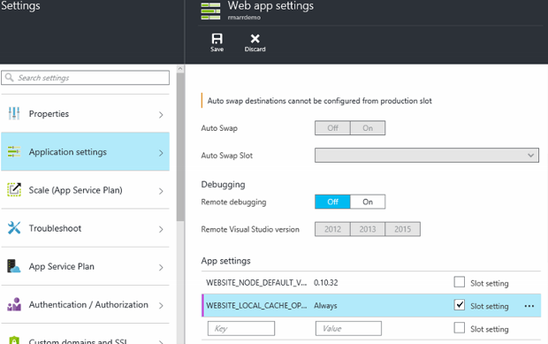

<properties
   pageTitle="Visão geral de Cache Local de serviço de aplicativo Azure | Microsoft Azure"
   description="Este artigo descreve como habilitar, redimensionar e consultar o status do recurso de Cache Local de serviço de aplicativo do Azure"
   services="app-service"
   documentationCenter="app-service"
   authors="SyntaxC4"
   manager="yochayk"
   editor=""
   tags="optional"
   keywords=""/>

<tags
   ms.service="app-service"
   ms.devlang="multiple"
   ms.topic="article"
   ms.tgt_pltfrm="na"
   ms.workload="na"
   ms.date="03/04/2016"
   ms.author="cfowler"/>

# <a name="azure-app-service-local-cache-overview"></a>Visão geral de Cache Local de serviço de aplicativo Azure

Conteúdo de aplicativo da web Azure está armazenado no armazenamento do Azure e expos backup de maneira durável como um compartilhamento de conteúdo. Este design destina-se para trabalhar com uma variedade de aplicativos e tem os seguintes atributos:  

* O conteúdo é compartilhado entre várias instâncias de máquina virtual (VM) do aplicativo web.
* O conteúdo é durável e pode ser modificado executando aplicativos web.
* Arquivos de log e arquivos de dados de diagnóstico estão disponíveis na mesma pasta conteúda compartilhada.
* Publicação de novo conteúdo diretamente atualiza a pasta de conteúdo. Você pode exibir imediatamente o mesmo conteúdo através do site SCM e o aplicativo da web em execução (normalmente algumas tecnologias como ASP.NET iniciar uma reinicialização de aplicativo da web em algumas alterações de arquivo para obter o conteúdo mais recente).

Embora muitos aplicativos web usam um ou todos esses recursos, alguns aplicativos web precisam apenas de uma loja de alto desempenho somente leitura de conteúdo que eles podem ser executados com alta disponibilidade. Esses aplicativos podem se beneficiar de uma instância de máquina virtual de um cache local específico.

O recurso de Cache Local de serviço de aplicativo do Azure fornece um modo de exibição de função web do seu conteúdo. Esse conteúdo é um cache de gravação de mas de descarte do seu conteúdo de armazenamento que é criado assíncrona na inicialização do site. Quando o cache estiver pronto, o site é alternado para executar o conteúdo em cache. Aplicativos da Web que são executadas em Cache Local tem os seguintes benefícios:

* Eles estão imunes ao latências que ocorrem ao acessar conteúdo de armazenamento do Azure.
* Eles estão imunes as atualizações planejadas ou inatividades planejadas e outras interrupções com o armazenamento do Azure que ocorrem em servidores que atendem o compartilhamento de conteúdo.
* Eles têm menos reiniciar aplicativo devido às alterações de compartilhamento de armazenamento.

## <a name="how-local-cache-changes-the-behavior-of-app-service"></a>Como o Cache Local altera o comportamento de serviço de aplicativo

* O cache local é uma cópia das pastas /site e /siteextensions do aplicativo web. Ele é criado na instância de máquina virtual do local na inicialização do aplicativo web. O tamanho do cache local por web app está limitado a 300 MB por padrão, mas você pode aumentar até 1 GB.
* O cache local é leitura / gravação. Entretanto, todas as modificações serão descartadas quando o aplicativo web move máquinas virtuais ou obtém reiniciado. Você não deve usar o Cache Local para os aplicativos que armazenam dados críticos no repositório de conteúdo.
* Aplicativos Web podem continuar a escrever arquivos de log e dados de diagnóstico como funcionam no momento. Arquivos de log e dados, no entanto, são armazenados localmente na máquina virtual. Em seguida, eles são copiados pela periodicamente para o repositório de conteúdo compartilhado. Copiar para o repositório de conteúdo compartilhado é um esforço melhor – gravação faz pode ser perdidas devido a uma falha súbita de uma instância de máquina virtual.
* Não há uma alteração na estrutura da pasta, as pastas de arquivos de log e dados para aplicativos web que usam o Cache Local. Agora há subpastas as pastas de arquivos de log e dados de armazenamento que seguem o padrão de nomenclatura de "identificador exclusivo" + carimbo de hora. Cada uma das subpastas corresponde a uma instância de máquina virtual onde o aplicativo da web está em execução ou foi executado.  
* Publicação de alterações para o aplicativo web por meio de qualquer um dos mecanismos de publicação publica no repositório de conteúdo compartilhado. Isso ocorre por design, porque queremos conteúdo publicado para durar. Para atualizar o cache local do web app, ele precisa ser reiniciado. Isso parecer uma etapa excessiva? Para tornar o ciclo de vida perfeita, consulte as informações neste artigo.
* D:\Home irá apontar para o cache local. D:\Local continuará apontando para o armazenamento temporário de específico de máquina virtual.
* A exibição de conteúdo padrão do site SCM continuarão do repositório de conteúdo compartilhado.

## <a name="enable-local-cache-in-app-service"></a>Habilitar o Cache Local no serviço de aplicativo

Configurar o Cache Local usando uma combinação das configurações de aplicativo reservadas. Você pode configurar essas configurações de aplicativo usando os seguintes métodos:

* [Portal do Azure](#Configure-Local-Cache-Portal)
* [Gerenciador de recursos do Azure](#Configure-Local-Cache-ARM)

### <a name="configure-local-cache-by-using-the-azure-portal"></a>Configurar o Cache Local usando o portal do Azure
<a name="Configure-Local-Cache-Portal"></a>

Habilitar o Cache Local em uma base por em aplicativo web usando esta configuração de aplicativo:`WEBSITE_LOCAL_CACHE_OPTION` = `Always`  



### <a name="configure-local-cache-by-using-azure-resource-manager"></a>Configurar o Cache Local usando o Gerenciador de recursos do Azure
<a name="Configure-Local-Cache-ARM"></a>

```
...

{
    "apiVersion": "2015-08-01",
    "type": "config",
    "name": "appsettings",
    "dependsOn": [
        "[resourceId('Microsoft.Web/sites/', variables('siteName'))]"
    ],
    "properties": {
        "WEBSITE_LOCAL_CACHE_OPTION": "Always",
        "WEBSITE_LOCAL_CACHE_SIZEINMB": "300"
    }
}

...
```

## <a name="change-the-size-setting-in-local-cache"></a>Alterar a configuração de tamanho em Cache Local

Por padrão, o tamanho de cache local é **300 MB**. Isso inclui o /site e pastas de /siteextensions que são copiadas do repositório de conteúdo, bem como quaisquer pastas de logs e dados localmente criadas. Para aumentar esse limite, use a configuração do aplicativo `WEBSITE_LOCAL_CACHE_SIZEINMB`. Você pode aumentar o tamanho até **1 GB** (1000 MB) por aplicativo web.

## <a name="best-practices-for-using-app-service-local-cache"></a>Práticas recomendadas para usar o Cache Local do aplicativo de serviço

Recomendamos que você use o Cache Local junto com o recurso de [Ambientes de teste](../app-service-web/web-sites-staged-publishing.md) .

* Adicione a configuração de aplicativo _conjunta_ `WEBSITE_LOCAL_CACHE_OPTION` com o valor `Always` seu slot de **produção** . Se você estiver usando `WEBSITE_LOCAL_CACHE_SIZEINMB`, também adicioná-lo como uma configuração de aderência para seu slot de produção.
* Criar um slot de **teste** e publique seu slot de teste. Normalmente, você não definir o slot preparação para usar o Cache Local para habilitar um ciclo de vida de compilação implantar-teste perfeito para preparar se você obtiver os benefícios do Cache Local do slot de produção.
*   Teste seu site contra seu slot de teste.  
*   Quando você estiver pronto, execute uma [operação de troca](../app-service-web/web-sites-staged-publishing.md#to-swap-deployment-slots) entre seus slots estágios e de produção.  
*   Configurações de aderência incluem nome e aderência para um slot. Portanto, quando o slot de teste obtém trocado em produção,-herdarão as configurações de aplicativo do Cache Local. O slot de produção recentemente trocado executarão em cache local após alguns minutos e será aquecido como parte do aquecimento slot após a troca. Portanto quando a troca de slot for concluída, seu slot de produção serão executados no cache local.

## <a name="frequently-asked-questions-faq"></a>Perguntas frequentes (FAQ)

### <a name="how-can-i-tell-if-local-cache-applies-to-my-web-app"></a>Como saber se o Cache Local aplica-se ao meu aplicativo web?

Se seu aplicativo web precisa de um repositório de conteúdo de alto desempenho e confiável, não usa o armazenamento de conteúdo para escrever dados críticos em tempo de execução e for menor que 1 GB de tamanho total, a resposta é "Sim"! Para obter o tamanho total das pastas /site e /siteextensions, você pode usar a extensão de site "Uso de disco do Azure Web Apps".  

### <a name="how-can-i-tell-if-my-site-has-switched-to-using-local-cache"></a>Como saber se meu site será alternado usando o Cache Local?

Se você estiver usando o recurso de Cache Local com ambientes de teste, a operação de troca não será concluída até que o Cache Local é aquecido. Para verificar se o seu site está sendo executado com Cache Local, você pode verificar a variável de ambiente do processo de trabalhador `WEBSITE_LOCALCACHE_READY`. Use as instruções na página de [variável de ambiente do processo de trabalho](https://github.com/projectkudu/kudu/wiki/Process-Threads-list-and-minidump-gcdump-diagsession#process-environment-variable) para acessar a variável de ambiente do processo de trabalho em várias instâncias.  

### <a name="i-just-published-new-changes-but-my-web-app-does-not-seem-to-have-them-why"></a>Acabou de publicar novas alterações, mas meu aplicativo web parece não tê-los. Por quê?

Se seu aplicativo web usa o Cache Local, você precisa reiniciar seu site para obter as alterações mais recentes. Não quer publicar alterações em um site de produção? Consulte as opções de slot na seção de práticas recomendada anterior.

### <a name="where-are-my-logs"></a>Onde estão meus registros?

Com o Cache Local, os logs e pastas de dados aparência um pouco diferentes. No entanto, a estrutura de suas subpastas permanece o mesmo, exceto que as subpastas são aninhadas em uma subpasta com o formato "máquina virtual identificador exclusivo" + carimbo de hora.

### <a name="i-have-local-cache-enabled-but-my-web-app-still-gets-restarted-why-is-that-i-thought-local-cache-helped-with-frequent-app-restarts"></a>Eu tenho o Cache Local habilitado, mas meu aplicativo web obtém reiniciado. Por que isso acontece? Eu pensava que cache Local ajudar com o aplicativo frequente reiniciar.

Cache local ajudar a impedir a reinicialização do aplicativo web relacionados ao armazenamento. No entanto, seu aplicativo web ainda pode sofrer reiniciar durante as atualizações de infraestrutura planejada da máquina virtual. O reiniciado geral do aplicativo que ocorrem com o Cache Local habilitado deve ser menos.
