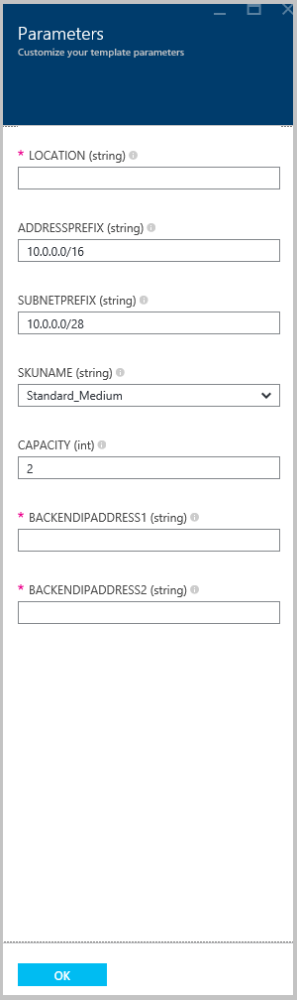

<properties
   pageTitle="Criar um gateway de aplicativo usando o Gerenciador de recursos do Azure modelos | Microsoft Azure"
   description="Esta página fornece instruções para criar um gateway de aplicativo do Azure usando o modelo do Gerenciador de recursos do Azure"
   documentationCenter="na"
   services="application-gateway"
   authors="georgewallace"
   manager="carmonm"
   editor="tysonn"/>
<tags
   ms.service="application-gateway"
   ms.devlang="na"
   ms.topic="article"
   ms.tgt_pltfrm="na"
   ms.workload="infrastructure-services"
   ms.date="10/25/2016"
   ms.author="gwallace"/>

# Criar um gateway de aplicativo usando o modelo do Gerenciador de recursos do Azure

> [AZURE.SELECTOR]
- [Portal do Azure](application-gateway-create-gateway-portal.md)
- [Azure PowerShell do Gerenciador de recursos](application-gateway-create-gateway-arm.md)
- [Azure PowerShell clássico](application-gateway-create-gateway.md)
- [Modelo do Gerenciador de recursos Azure](application-gateway-create-gateway-arm-template.md)
- [CLI Azure](application-gateway-create-gateway-cli.md)

Azure Application Gateway é um balanceador de carga de camada-7. Ele oferece failover, roteamento de desempenho solicitações HTTP entre diferentes servidores, independentemente de estarem na nuvem ou local. Gateway do aplicativo fornece vários recursos de controlador de entrega de aplicativo (ADC), incluindo balanceamento de carga de HTTP afinidade de sessão baseada em cookies, Secure Sockets Layer (SSL) descarregar, sondagens de integridade personalizados, suporte para vários locais e várias outras. Para localizar uma lista completa de recursos com suporte, visite [Visão geral de Gateway do aplicativo](application-gateway-introduction.md)

Saiba como baixar e modificar um modelo existente do Gerenciador de recursos do Azure do GitHub e implantar o modelo do GitHub, PowerShell e a CLI do Azure.

Se você estiver simplesmente implantando o modelo do Gerenciador de recursos do Azure diretamente do GitHub sem fazer alterações, vá para implantar um modelo do GitHub.

## Cenário

Neste cenário, você irá:

- Crie um gateway de aplicativo com duas instâncias.
- Crie uma rede virtual chamada VirtualNetwork1 com um bloco CIDR reservado de 10.0.0.0/16.
- Crie uma sub-rede chamada Appgatewaysubnet que usa 10.0.0.0/28 como seu bloco CIDR.
- Configurar dois configurado anteriormente IPs de back-end para os servidores web que você deseja carregar saldo o tráfego. Neste exemplo de modelo, o IPs de back-end são 10.0.1.10 e 10.0.1.11.

>[AZURE.NOTE] Essas configurações são os parâmetros para este modelo. Para personalizar o modelo, você pode alterar as regras, o ouvinte e o SSL que abre a azuredeploy.json.

## Baixar e entender o modelo do Gerenciador de recursos do Azure

Você pode baixar o modelo do Gerenciador de recursos do Azure existente para criar uma rede virtual e duas sub-redes do GitHub, faça as alterações podem desejada e reutilizá-la. Para fazer isso, use as seguintes etapas:

1. Navegue até [criar Gateway do aplicativo](https://github.com/Azure/azure-quickstart-templates/tree/master/101-application-gateway-create).
2. Clique em **azuredeploy.json**e clique em **MATÉRIA**.
3. Salve o arquivo em uma pasta local no seu computador.
4. Se você estiver familiarizado com modelos de Gerenciador de recursos do Azure, pule para a etapa 7.
5. Abra o arquivo que você salvou e examinar o conteúdo em **parâmetros** na linha 5. Parâmetros de modelo do Azure Gerenciador de recursos fornecem um espaço reservado para valores que podem ser preenchidos durante a implantação.

  	| Parâmetro | Descrição |
  	|---|---|
  	| **local** | Azure região onde o gateway de aplicativo é criado |
  	| **VirtualNetwork1** | Nome para a nova rede virtual |
  	| **addressPrefix** | Espaço de endereço da rede virtual, no formato CIDR |
  	| **ApplicationGatewaysubnet** | Nome para a sub-rede de gateway do aplicativo |
  	| **subnetPrefix** | Bloco CIDR para a sub-rede de gateway do aplicativo |
  	| **skuname** | Tamanho da instância SKU |
  	| **capacidade** | Número de instâncias |
  	| **backendaddress1** | Endereço IP do primeiro servidor web |
  	| **backendaddress2** | Endereço IP do segundo servidor web |

    >[AZURE.IMPORTANT] Azure modelos do Gerenciador de recursos mantidos no GitHub podem alterar ao longo do tempo. Certifique-se de que você verifique o modelo antes de utilizá-lo.

6. Verifique o conteúdo em **recursos** e observe o seguinte:

    - **tipo**. Tipo de recurso sendo criado pelo modelo. Nesse caso, o tipo é **Microsoft.Network/applicationGateways**, que representa um gateway de aplicativos.
    - **nome**. Nome do recurso. Observe o uso de **[parameters('applicationGatewayName')]**, que significa que o nome é fornecido como entrada por você ou por um arquivo de parâmetro durante a implantação.
    - **Propriedades**. Lista de propriedades para o recurso. Este modelo usa a rede virtual e o endereço IP público durante a criação de gateway do aplicativo.

7. Navegue até [https://github.com/Azure/azure-quickstart-templates/blob/master/101-application-gateway-create/](https://github.com/Azure/azure-quickstart-templates/blob/master/101-application-gateway-create).
8. Clique em **azuredeploy-paremeters.json**e clique em **MATÉRIA**.
9. Salve o arquivo em uma pasta local no seu computador.
10. Abra o arquivo que você salvou e edite os valores para os parâmetros. Use os seguintes valores para implantar o gateway de aplicativo descrito no nosso cenário.

        {
        "$schema": "http://schema.management.azure.com/schemas/2015-01-01/deploymentParameters.json#",
        {
        "location" : {
        "value" : "West US"
        },
        "addressPrefix": {
        "value": "10.0.0.0/16"
        },
        "subnetPrefix": {
        "value": "10.0.0.0/24"
        },
        "skuName": {
        "value": "Standard_Small"
        },
        "capacity": {
        "value": 2
        },
        "backendIpAddress1": {
        "value": "10.0.1.10"
        },
        "backendIpAddress2": {
        "value": "10.0.1.11"
        }
        }

11. Salve o arquivo. Você pode testar o modelo JSON e modelo de parâmetro usando ferramentas de validação de JSON online como [JSlint.com](http://www.jslint.com/).

## Implante o modelo do Gerenciador de recursos do Azure usando o PowerShell

Se você nunca usou o PowerShell do Azure, veja [como instalar e configurar o PowerShell do Azure](../powershell-install-configure.md) e siga as instruções para entrar no Azure e selecione sua assinatura.

### Etapa 1

    Login-AzureRmAccount

### Etapa 2

Verifique as assinaturas para a conta.

    Get-AzureRmSubscription

Você será solicitado a autenticar com suas credenciais.

### Etapa 3

Escolha quais das suas assinaturas Azure usar.

    Select-AzureRmSubscription -Subscriptionid "GUID of subscription"

### Etapa 4

Se necessário, crie um grupo de recursos usando o cmdlet **New-AzureResourceGroup** . No exemplo a seguir, você criar um grupo de recursos chamado AppgatewayRG no local do Leste EUA.

    New-AzureRmResourceGroup -Name AppgatewayRG -Location "East US"

Execute o cmdlet **New-AzureRmResourceGroupDeployment** para implantar a nova rede virtual usando o modelo anterior e arquivos de parâmetro que você baixou e modificada.

    New-AzureRmResourceGroupDeployment -Name TestAppgatewayDeployment -ResourceGroupName AppgatewayRG `
        -TemplateFile C:\ARM\azuredeploy.json -TemplateParameterFile C:\ARM\azuredeploy-parameters.json

## Implantar o modelo do Gerenciador de recursos do Azure usando a CLI do Azure

Para implantar o modelo do Gerenciador de recursos do Azure que você baixou usando Azure CLI, siga as etapas abaixo:

### Etapa 1

Se você nunca usou CLI do Azure, consulte [instalar e configurar o CLI Azure](../xplat-cli-install.md) e siga as instruções para cima até o ponto onde você selecionar sua conta do Azure e assinatura.

### Etapa 2

Execute o comando de **modo config azure** para alternar para modo de Gerenciador de recursos, conforme mostrado abaixo.

    azure config mode arm

Aqui está a saída esperada para o comando acima:

    info:   New mode is arm

### Etapa 3

Se necessário, execute o comando **Criar grupo azure** para criar um novo grupo de recursos, conforme mostrado abaixo. Observe que a saída do comando. A lista mostrada após a saída explica os parâmetros usados. Para obter mais informações sobre os grupos de recursos, visite [Visão geral do Gerenciador de recursos do Azure](../azure-resource-manager/resource-group-overview.md).

    azure group create -n appgatewayRG -l eastus

**-n (ou - nome)**. Nome do novo grupo de recursos. Para o nosso cenário, é *appgatewayRG*.

**-l (ou - local)**. Azure região onde o novo grupo de recursos é criado. Para o nosso cenário, é *eastus*.

### Etapa 4

Execute o cmdlet **criar de implantação do azure grupo** para implantar a nova rede virtual usando os arquivos de modelo e um parâmetro que você baixou e modificado acima. A lista mostrada após a saída explica os parâmetros usados.

    azure group deployment create -g appgatewayRG -n TestAppgatewayDeployment -f C:\ARM\azuredeploy.json -e C:\ARM\azuredeploy-parameters.json

## Implantar o modelo do Gerenciador de recursos do Azure usando o clique de implantar

Clique em implantar é outra maneira de usar os modelos do Gerenciador de recursos do Azure. É uma maneira fácil de usar modelos com o portal do Azure.

### Etapa 1

Vá para [criar um gateway de aplicativo com IP público](https://azure.microsoft.com/documentation/templates/101-application-gateway-public-ip/).

### Etapa 2

Clique em **implantar para o Azure**.

### Etapa 3

Preencha os parâmetros para o modelo de implantação do portal e clique em **Okey**.

### Etapa 4

Selecione **termos legais** e clique em **comprar**.

### Etapa 5

Na lâmina implantação personalizada, clique em **criar**.

## Próximas etapas

Se você quiser configurar descarregamento SSL, consulte [Configurar um gateway de aplicativo para SSL descarregar](application-gateway-ssl.md).

Se desejar configurar um gateway de aplicativo para usar com um balanceador de carga interno, consulte [criar um gateway de aplicativo com um balanceador de carga interno (ILB)](application-gateway-ilb.md).

Se você desejar obter mais informações sobre opções de balanceamento de carregar em geral, visite:

- [Balanceador de carga Azure](https://azure.microsoft.com/documentation/services/load-balancer/)
- [Gerenciador de tráfego Azure](https://azure.microsoft.com/documentation/services/traffic-manager/)
