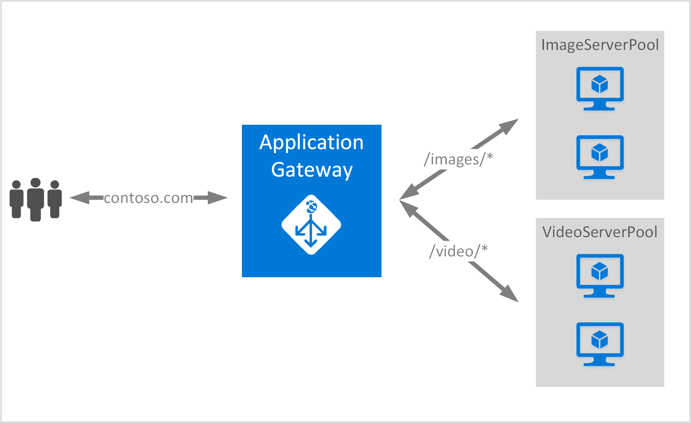

<properties
   pageTitle="Criar um gateway de aplicativo usando as regras de roteamento de URL | Microsoft Azure"
   description="Esta página fornece instruções para criar, configurar um gateway de aplicativo do Azure usando as regras de roteamento de URL"
   documentationCenter="na"
   services="application-gateway"
   authors="georgewallace"
   manager="jdial"
   editor="tysonn"/>
<tags
   ms.service="application-gateway"
   ms.devlang="na"
   ms.topic="article"
   ms.tgt_pltfrm="na"
   ms.workload="infrastructure-services"
   ms.date="10/25/2016"
   ms.author="gwallace"/>

# Criar um gateway de aplicativo usando o roteamento baseado em caminho 

> [AZURE.SELECTOR]
- [Portal do Azure](application-gateway-create-url-route-portal.md)
- [Azure PowerShell do Gerenciador de recursos](application-gateway-create-url-route-arm-ps.md)

Roteamento de baseado em caminho de URL permite que você associe rotas com base no caminho de URL da solicitação de Http. Verifica se houver uma rota para um pool de back-end configurado para nas listas de URL do Gateway de aplicativo e enviar o tráfego de rede para o pool de back-end definido. Um uso comum para roteamento baseado em URL é carregar solicitações de saldo para diferentes tipos de conteúdo para pools de servidor de back-end diferente.

Roteamento baseado em URL apresenta um novo tipo de regra ao gateway do aplicativo. Gateway de aplicativo tem dois tipos de regra: básico e PathBasedRouting. Tipo de regra básica fornece serviço alternada para pools de back-end enquanto PathBasedRouting além de distribuição de repetição alternada, também leva padrão de caminho de URL da solicitação em consideração ao escolher o pool de back-end.

>[AZURE.IMPORTANT] PathPattern: A lista de padrões de caminho para fazer a correspondência. Cada deve começar com / e o único lugar uma "\*" é permitido está no final. Exemplos válidos são /xyz, /xyz* ou /xyz/*. A cadeia de caracteres tio para o correspondente de caminho não incluir texto após a primeira "?" ou "#" e os caracteres não são permitidos. 

## Cenário
No exemplo a seguir, Application Gateway está servindo tráfego para contoso.com com dois grupos de servidor back-end: pool de servidor de vídeo e pool de servidor de imagem.

Solicitações de http://contoso.com/image* são roteados para o pool de servidor de imagem (pool1) e http://contoso.com/video* são roteadas para o pool de servidor de vídeo (pool2). Um pool de servidor padrão (pool1) está selecionado se nenhum dos padrões de caminho corresponder.

## Antes de começar

1. Instale a versão mais recente de cmdlets do PowerShell do Azure usando o Web Platform Installer. Você pode baixar e instalar a versão mais recente da seção **Do Windows PowerShell** da [página Downloads](https://azure.microsoft.com/downloads/).
2. Você cria uma rede virtual e sub-rede para Application Gateway. Certifique-se de que nenhuma máquinas virtuais ou implantações de nuvem estão usando a sub-rede. O gateway de aplicativo deve estar sozinha em uma sub-rede de rede virtual.
3. Os servidores adicionados ao pool de back-end para usar o gateway de aplicativo devem existir ou seus pontos de extremidade criou em rede virtual ou com um IP/VIP público atribuído.

## O que é necessário para criar um gateway de aplicativo?

- **Pool de servidor back-end:** A lista de endereços IP de servidores back-end. Os endereços IP listados ou devem pertencer à sub-rede da rede virtual ou devem ser um IP/VIP público.
- **Configurações de pool do servidor de back-end:** Cada pool tem as configurações como afinidade baseada em cookies, protocolo e porta. Essas configurações estão vinculadas a um pool e são aplicadas a todos os servidores dentro do pool.
- **Porta front-end:** Esta porta é a porta pública que é aberta no gateway do aplicativo. Tráfego visitas esta porta e, em seguida, é redirecionado para um dos servidores back-end.
- **Ouvinte:** O ouvinte tem uma porta de front-end, um protocolo (Http ou Https, estes são diferencia maiusculas de minúsculas) e o nome do certificado SSL (se configurar SSL descarregar).
- **Regra:** A regra associará o ouvinte, o pool de servidor back-end e define qual pool de servidor back-end o tráfego deve ser direcionado para quando ele atinge um determinado ouvinte.

## Criar um gateway de aplicativo

A diferença entre o uso clássico do Azure e Gerenciador de recursos do Azure é a ordem em que você criar o gateway de aplicativo e os itens que precisam ser configurados.

Com o Gerenciador de recursos, todos os itens que compõem um gateway de aplicativo estão configurados individualmente e coloque juntos para criar o recurso de gateway do aplicativo.

Aqui estão as etapas que são necessárias para criar um gateway de aplicativo:

1. Crie um grupo de recursos para o Gerenciador de recursos.
2. Crie uma rede virtual, sub-rede e IP público para o gateway de aplicativo.
3. Crie um objeto de configuração do gateway de aplicativo.
4. Crie um recurso de gateway do aplicativo.

## Criar um grupo de recursos para o Gerenciador de recursos

Certifique-se de que você está usando a versão mais recente do PowerShell do Azure. Mais informações estão disponíveis em [Usando o Windows PowerShell com o Gerenciador de recursos](../powershell-azure-resource-manager.md).

### Etapa 1

Faça logon no Azure

    Login-AzureRmAccount

Você será solicitado a autenticar com suas credenciais. 

### Etapa 2

Verifique as assinaturas para a conta.

    Get-AzureRmSubscription

### Etapa 3

Escolha quais das suas assinaturas Azure usar.  

    Select-AzureRmSubscription -Subscriptionid "GUID of subscription"

### Etapa 4

Crie um grupo de recursos (ignorar esta etapa se você estiver usando um grupo existente do recurso).

    New-AzureRmResourceGroup -Name appgw-RG -Location "West US"

Alternativamente você também pode criar marcas para um grupo de recursos para o gateway de aplicativo:
    
    $resourceGroup = New-AzureRmResourceGroup -Name appgw-RG -Location "West US" -Tags @{Name = "testtag"; Value = "Application Gateway URL routing"} 

Gerenciador de recursos de Azure requer que todos os grupos de recursos especificam um local. Isso é usado como o local padrão para os recursos desse grupo de recursos. Certifique-se de que todos os comandos para criar um gateway aplicativo usam o mesmo grupo de recursos.

No exemplo acima, criamos um grupo de recursos chamado "appgw-RG" e local "Oeste EUA".

>[AZURE.NOTE] Se você precisar configurar um teste personalizado para seu gateway de aplicativo, consulte [criar um gateway de aplicativo com testes personalizados usando o PowerShell](application-gateway-create-probe-ps.md). Confira [testes personalizados e monitoramento de integridade](application-gateway-probe-overview.md) para obter mais informações.

## Criar uma rede virtual e uma sub-rede para o gateway de aplicativo

O exemplo a seguir mostra como criar uma rede virtual usando o Gerenciador de recursos.

### Etapa 1

Atribua o endereço intervalo 10.0.0.0/24 variável de sub-rede a ser usado para criar uma rede virtual.

    $subnet = New-AzureRmVirtualNetworkSubnetConfig -Name subnet01 -AddressPrefix 10.0.0.0/24

### Etapa 2

Crie uma rede virtual denominada "appgwvnet" no recurso grupo "appgw-rg" para a região Oeste EUA usando o prefixo 10.0.0.0/16 com sub-rede 10.0.0.0/24.

    $vnet = New-AzureRmVirtualNetwork -Name appgwvnet -ResourceGroupName appgw-RG -Location "West US" -AddressPrefix 10.0.0.0/16 -Subnet $subnet

### Etapa 3

Atribua uma variável de sub-rede para as próximas etapas, que cria um gateway de aplicativos.

    $subnet=$vnet.Subnets[0]

## Criar um endereço IP público para a configuração de front-end

Crie um recurso IP público "publicIP01" no recurso grupo "appgw-rg" para a região Oeste EUA.

    $publicip = New-AzureRmPublicIpAddress -ResourceGroupName appgw-RG -name publicIP01 -location "West US" -AllocationMethod Dynamic

Um endereço IP é atribuído para o gateway de aplicativo quando o serviço é iniciado.

## Criar a configuração de gateway do aplicativo

Todos os itens de configuração devem ser configurar antes de criar o gateway do aplicativo. As etapas a seguir criam os itens de configuração que são necessários para um recurso de gateway do aplicativo.

### Etapa 1

Crie uma configuração de IP do gateway de aplicativo denominada "gatewayIP01". Quando o Gateway do aplicativo for iniciado, ele seleciona um endereço IP da sub-rede configurado e rotear o tráfego de rede para os endereços IP no pool de IP de back-end. Tenha em mente que cada instância tem um endereço IP.

    $gipconfig = New-AzureRmApplicationGatewayIPConfiguration -Name gatewayIP01 -Subnet $subnet

### Etapa 2

Configurar o pool de endereços IP de back-end denominada "pool01" e "pool2" com endereços IP "134.170.185.46, 134.170.188.221,134.170.185.50" para "pool1" e "134.170.186.46, 134.170.189.221,134.170.186.50" para "pool2".

    $pool1 = New-AzureRmApplicationGatewayBackendAddressPool -Name pool01 -BackendIPAddresses 134.170.185.46, 134.170.188.221,134.170.185.50

    $pool2 = New-AzureRmApplicationGatewayBackendAddressPool -Name pool02 -BackendIPAddresses 134.170.186.46, 134.170.189.221,134.170.186.50

Neste exemplo, há dois pools de back-end para rotear o tráfego de rede com base no caminho de URL. Um pool recebe tráfego de caminho de URL "/ vídeo" e outro pool receber tráfego de caminho "/ imagem". Substitua os endereços IP anteriores para adicionar seus próprios pontos de extremidade do endereço IP do aplicativo. 

### Etapa 3

Configure a configuração de gateway do aplicativo "poolsetting01" e "poolsetting02" para o tráfego de rede de balanceamento de carga no pool de back-end. Neste exemplo, você definir configurações de grupo de back-end diferente para os pools de back-end. Cada pool de back-end pode ter sua própria configuração de pool de back-end.

    $poolSetting01 = New-AzureRmApplicationGatewayBackendHttpSettings -Name "besetting01" -Port 80 -Protocol Http -CookieBasedAffinity Disabled -RequestTimeout 120

    $poolSetting02 = New-AzureRmApplicationGatewayBackendHttpSettings -Name "besetting02" -Port 80 -Protocol Http -CookieBasedAffinity Enabled -RequestTimeout 240

### Etapa 4

Configure o IP front-end com ponto de extremidade IP público.

    $fipconfig01 = New-AzureRmApplicationGatewayFrontendIPConfig -Name "frontend1" -PublicIPAddress $publicip

### Etapa 5 

Configure a porta front-end para um gateway de aplicativo.

    $fp01 = New-AzureRmApplicationGatewayFrontendPort -Name "fep01" -Port 80
### Etapa 6

Configure o ouvinte. Esta etapa configura o ouvinte para o endereço IP público e a porta usada para receber o tráfego de rede. 
 
    $listener = New-AzureRmApplicationGatewayHttpListener -Name "listener01" -Protocol Http -FrontendIPConfiguration $fipconfig01 -FrontendPort $fp01

### Etapa 7 

Configure caminhos de regra de URL para os pools de back-end. Esta etapa configura o caminho relativo usado pelo gateway de aplicativo para definir o mapeamento entre o caminho de URL e qual pool de back-end é atribuído para lidar com o tráfego de entrada.

O exemplo a seguir cria duas regras: uma para "/ imagem /" caminho rotear o tráfego para back-end "pool1" e outro para "/ vídeo /" caminho rotear o tráfego para back-end "pool2".
    
    $imagePathRule = New-AzureRmApplicationGatewayPathRuleConfig -Name "pathrule1" -Paths "/image/*" -BackendAddressPool $pool1 -BackendHttpSettings $poolSetting01

    $videoPathRule = New-AzureRmApplicationGatewayPathRuleConfig -Name "pathrule2" -Paths "/video/*" -BackendAddressPool $pool2 -BackendHttpSettings $poolSetting02

A configuração de mapa de caminho de regra também configura um pool de endereços de back-end padrão se o caminho não corresponder a qualquer uma das regras de caminho predefinidos. 

    $urlPathMap = New-AzureRmApplicationGatewayUrlPathMapConfig -Name "urlpathmap" -PathRules $videoPathRule, $imagePathRule -DefaultBackendAddressPool $pool1 -DefaultBackendHttpSettings $poolSetting02

### Etapa 8

Crie uma configuração de regra. Esta etapa configura o gateway de aplicativo para usar o roteamento de baseado em caminho de URL.

    $rule01 = New-AzureRmApplicationGatewayRequestRoutingRule -Name "rule1" -RuleType PathBasedRouting -HttpListener $listener -UrlPathMap $urlPathMap

### Etapa 9

Configure o número de instâncias e o tamanho para o gateway de aplicativo.

    $sku = New-AzureRmApplicationGatewaySku -Name "Standard_Small" -Tier Standard -Capacity 2

## Criar o Gateway de aplicativo

Crie um gateway de aplicativo com todos os objetos de configuração das etapas anteriores.

    $appgw = New-AzureRmApplicationGateway -Name appgwtest -ResourceGroupName appgw-RG -Location "West US" -BackendAddressPools $pool1,$pool2 -BackendHttpSettingsCollection $poolSetting01, $poolSetting02 -FrontendIpConfigurations $fipconfig01 -GatewayIpConfigurations $gipconfig -FrontendPorts $fp01 -HttpListeners $listener -UrlPathMaps $urlPathMap -RequestRoutingRules $rule01 -Sku $sku

## Obter o nome DNS de gateway do aplicativo

Depois que o gateway é criado, a próxima etapa é configurar o front-end para comunicação. Ao usar um público IP, o gateway de aplicativo requer um nome DNS atribuído dinamicamente, que não é compatível com. Pode ser usado para garantir que os usuários finais possam atingir o gateway de aplicativo um registro CNAME para apontar para o ponto de extremidade público do gateway aplicativo. [Configurando um nome de domínio personalizado para no Azure](../cloud-services/cloud-services-custom-domain-name-portal.md). Para fazer isso, recupere detalhes do gateway aplicativo e seu nome IP/DNS associado usando o elemento de PublicIPAddress anexado para o gateway de aplicativo. Nome DNS do gateway aplicativo deve ser usado para criar um registro CNAME, que aponta os aplicativos dois web para esse nome DNS. O uso de registros de não é recomendável porque o VIP pode ser alterados na reinicialização do gateway de aplicativo.
    
    Get-AzureRmPublicIpAddress -ResourceGroupName appgw-RG -Name publicIP01
        
    Name                     : publicIP01
    ResourceGroupName        : appgw-RG
    Location                 : westus
    Id                       : /subscriptions/<subscription_id>/resourceGroups/appgw-RG/providers/Microsoft.Network/publicIPAddresses/publicIP01
    Etag                     : W/"00000d5b-54ed-4907-bae8-99bd5766d0e5"
    ResourceGuid             : 00000000-0000-0000-0000-000000000000
    ProvisioningState        : Succeeded
    Tags                     : 
    PublicIpAllocationMethod : Dynamic
    IpAddress                : xx.xx.xxx.xx
    PublicIpAddressVersion   : IPv4
    IdleTimeoutInMinutes     : 4
    IpConfiguration          : {
                                 "Id": "/subscriptions/<subscription_id>/resourceGroups/appgw-RG/providers/Microsoft.Network/applicationGateways/appgwtest/frontendIP
                               Configurations/frontend1"
                               }
    DnsSettings              : {
                                 "Fqdn": "00000000-0000-xxxx-xxxx-xxxxxxxxxxxx.cloudapp.net"
                               }

## Próximas etapas

Se você quiser saber descarregamento Secure Sockets Layer (SSL), consulte [Configurar um gateway de aplicativo para SSL descarregar](application-gateway-ssl-arm.md).