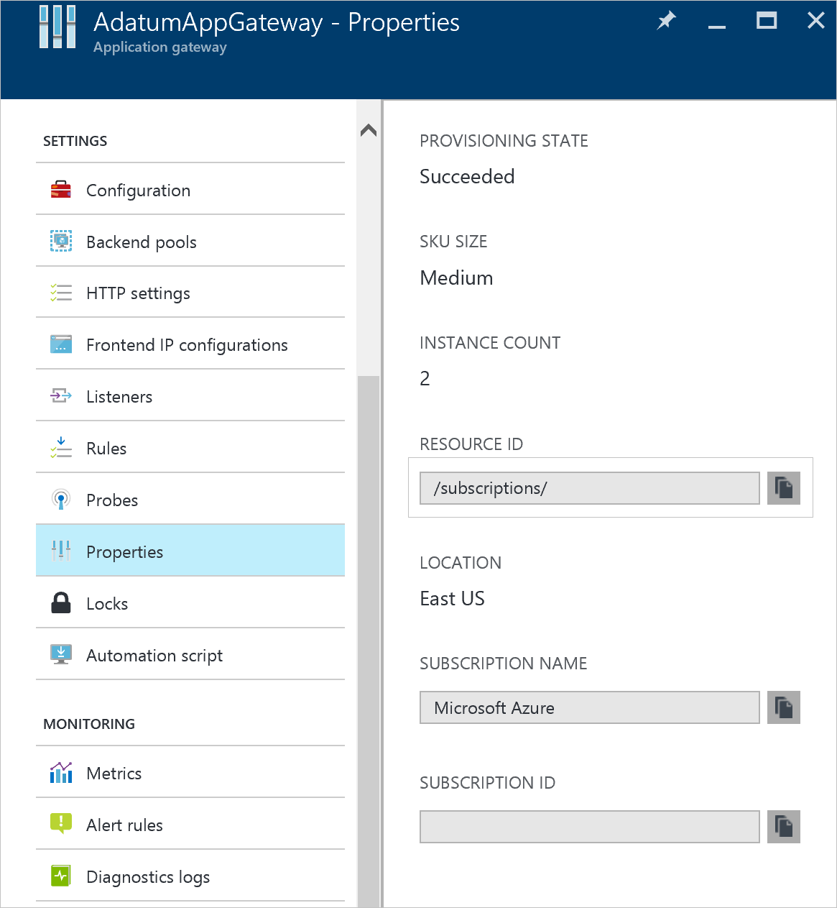

<properties 
   pageTitle="Monitorar os logs de acesso e desempenho e métricas de Gateway aplicativo | Microsoft Azure"
   description="Saiba como ativar e gerenciar os logs de acesso e desempenho para o Gateway de aplicativo"
   services="application-gateway"
   documentationCenter="na"
   authors="amitsriva"
   manager="rossort"
   editor="tysonn"
   tags="azure-resource-manager"
/>
<tags 
   ms.service="application-gateway"
   ms.devlang="na"
   ms.topic="article"
   ms.tgt_pltfrm="na"
   ms.workload="infrastructure-services"
   ms.date="09/26/2016"
   ms.author="amitsriva" />

# Log de diagnóstico e métricas para o Gateway de aplicativo

Azure fornece a capacidade de monitorar o recurso com registro em log e métricas

[**Registro em log**](#enable-logging-with-powershell) - log permite desempenho, acesso e outros logs a ser salvo ou consumidas de um recurso para fins de monitoramento.

[**Métricas**](#metrics) - gateway do aplicativo atualmente tem uma métrica. Esta métrica avalia a taxa de transferência do gateway aplicativo em Bytes por segundo.

Você pode usar tipos diferentes de logs no Azure para gerenciar e solucionar problemas de gateways de aplicativos. Alguns desses logs podem ser acessadas por meio do portal e todos os logs podem ser extraídos de um armazenamento de blob do Microsoft Azure e visualizou no ferramentas diferentes, como [A análise de Log](../log-analytics/log-analytics-azure-networking-analytics.md), Excel e PowerBI. Você pode aprender mais sobre os diferentes tipos de logs da lista a seguir:

- **Logs de auditoria:** Você pode usar [Logs de auditoria do Azure](../monitoring-and-diagnostics/insights-debugging-with-events.md) (conhecida anteriormente como Logs operacionais) para exibir todas as operações sendo enviadas a sua assinatura do Azure e seus status. Logs de auditoria são ativados por padrão e podem ser visualizados no portal do Azure preview.
- **Acessar logs:** Você pode usar esse log para exibir o padrão de acesso do gateway de aplicativo e analisar importantes informações incluindo IP do chamador, URL solicitada, latência de resposta, retornam código, bytes e reduzir. Log de acesso é coletada cada 300 segundos. Esse log contém um registro por instância do gateway de aplicativo. A instância de gateway do aplicativo pode ser identificada pela propriedade 'instanceId'.
- **Logs de desempenho:** Você pode usar esse log para exibir como instâncias de gateway do aplicativo são executados. Este registro captura informações de desempenho em base de per instância incluindo solicitação total served, produtividade em bytes, totais solicitações servidas, contagem de solicitação falha, contagem de com e sem integridade instância de back-end. Log de desempenho é coletado a cada 60 segundos.
- **Logs de firewall:** Você pode usar esse log para exibir as solicitações que são registradas por meio do modo de detecção ou prevenção de um gateway de aplicativo que está configurado com o firewall do aplicativo web.

>[AZURE.WARNING] Logs estão disponíveis apenas para os recursos implantados no modelo de implantação do Gerenciador de recursos. Você não pode usar logs para recursos do modelo de implantação clássico. Para melhor compreensão dos dois modelos, consulte o artigo de [implantação do Gerenciador de recursos de compreensão e implantação clássica](../resource-manager-deployment-model.md) .

## Habilitar o log com o PowerShell

Log de auditoria é automaticamente habilitado para cada recurso Gerenciador de recursos. Você deve habilitar o acesso e o registro em log para iniciar a coleta de dados disponíveis por meio desses logs de desempenho. Para habilitar o log, consulte as etapas a seguir: 

1. Observe a identificação do recurso da sua conta de armazenamento, onde os dados do log estão armazenados. Isso seria do formulário: /subscriptions/\<subscriptionId\>/resourceGroups/\<nome do grupo de recursos\>/providers/Microsoft.Storage/storageAccounts/\<nome da conta de armazenamento\>. Qualquer conta de armazenamento em sua assinatura pode ser usada. Você pode usar o portal de visualização para encontrar essas informações.

    

2. Observe a identificação do recurso do gateway seu aplicativo para o qual o log é sejam habilitadas. Isso seria do formulário: /subscriptions/\<subscriptionId\>/resourceGroups/\<nome do grupo de recursos\>/providers/Microsoft.Network/applicationGateways/\<nome do gateway de aplicativo\>. Você pode usar o portal de visualização para encontrar essas informações.

    

3. Habilite o log de diagnóstico usando o seguinte cmdlet do powershell:

        Set-AzureRmDiagnosticSetting  -ResourceId /subscriptions/<subscriptionId>/resourceGroups/<resource group name>/providers/Microsoft.Network/applicationGateways/<application gateway name> -StorageAccountId /subscriptions/<subscriptionId>/resourceGroups/<resource group name>/providers/Microsoft.Storage/storageAccounts/<storage account name> -Enabled $true  

>[AZURE.INFORMATION] logs de auditoria não exigem uma conta de armazenamento separada. O uso de armazenamento para acesso e o log de desempenho gera encargos de serviço.

## Habilitar o log com o portal do Azure

### Etapa 1

Navegue até o recurso no portal do Azure. Clique em **logs de diagnóstico**. Se esta for a primeira vez configurando o diagnóstico a lâmina é semelhante a imagem a seguir:

Para o gateway de aplicativo, 3 logs estão disponíveis.

- Log de acesso
- Log de desempenho
- Log de firewall

Clique em **Ativar diagnóstico** para iniciar a coleta de dados.

![blade de configuração de diagnóstico][1]

### Etapa 2

Na lâmina **as configurações do diagnóstico** , as configurações de como os logs de diagnóstico são definidos. Neste exemplo, a análise de Log é usada para armazenar os logs. Clique em **Configurar** em **Análise de Log** para configurar seu espaço de trabalho. Hubs de evento e uma conta de armazenamento podem ser usados para salvar os logs de diagnóstico também.

![blade de diagnóstico][2]

### Etapa 3

Escolha um espaço de trabalho do OMS existente ou crie um novo. Este exemplo é usada uma já existente.

![espaços de trabalho de OMS][3]

### Etapa 4

Ao concluir, confirme as configurações e clique em **Salvar** para salvar as configurações.

![Confirmar seleção][4]

## Log de auditoria

Esse log (anteriormente conhecido como o "log operacional") é gerada pelo Azure por padrão.  Os logs são preservados por 90 dias no repositório de Logs de eventos do Azure. Saiba mais sobre esses logs lendo o artigo [Exibir eventos e logs de auditoria](../monitoring-and-diagnostics/insights-debugging-with-events.md) .

## Log de acesso

Esse log é gerado apenas se você habilitou-a em um acordo Application Gateway conforme detalhado nas etapas anteriores. Os dados são armazenados na conta de armazenamento especificado quando você ativou o registro em log. Cada acesso do Gateway de aplicativo é registrado no formato JSON, conforme visto no exemplo a seguir:

    {
        "resourceId": "/SUBSCRIPTIONS/<subscription id>/RESOURCEGROUPS/<resource group name>/PROVIDERS/MICROSOFT.NETWORK/APPLICATIONGATEWAYS/<application gateway name>",
        "operationName": "ApplicationGatewayAccess",
        "time": "2016-04-11T04:24:37Z",
        "category": "ApplicationGatewayAccessLog",
        "properties": {
            "instanceId":"ApplicationGatewayRole_IN_0",
            "clientIP":"37.186.113.170",
            "clientPort":"12345",
            "httpMethod":"HEAD",
            "requestUri":"/xyz/portal",
            "requestQuery":"",
            "userAgent":"-",
            "httpStatus":"200",
            "httpVersion":"HTTP/1.0",
            "receivedBytes":"27",
            "sentBytes":"202",
            "timeTaken":"359",
            "sslEnabled":"off"
        }
    }

## Log de desempenho

Esse log é gerado apenas se você tiver habilitado em um acordo Application Gateway conforme detalhado nas etapas anteriores. Os dados são armazenados na conta de armazenamento especificado quando você ativou o registro em log. Os dados a seguir são registrados:

    {
        "resourceId": "/SUBSCRIPTIONS/<subscription id>/RESOURCEGROUPS/<resource group name>/PROVIDERS/MICROSOFT.NETWORK/APPLICATIONGATEWAYS/<application gateway name>",
        "operationName": "ApplicationGatewayPerformance",
        "time": "2016-04-09T00:00:00Z",
        "category": "ApplicationGatewayPerformanceLog",
        "properties": 
        {
            "instanceId":"ApplicationGatewayRole_IN_1",
            "healthyHostCount":"4",
            "unHealthyHostCount":"0",
            "requestCount":"185",
            "latency":"0",
            "failedRequestCount":"0",
            "throughput":"119427"
        }
    }

## Log de firewall

Esse log é gerado apenas se você tiver habilitado em um acordo aplicativo gateway conforme detalhado nas etapas anteriores. Esse log também exige firewall aplicativo web sejam configurados em um gateway de aplicativo. Os dados são armazenados na conta de armazenamento especificado quando você ativou o registro em log. Os dados a seguir são registrados:

    {
        "resourceId": "/SUBSCRIPTIONS/<subscriptionId>/RESOURCEGROUPS/<resourceGroupName>/PROVIDERS/MICROSOFT.NETWORK/APPLICATIONGATEWAYS/<applicationGatewayName>",
        "operationName": "ApplicationGatewayFirewall",
        "time": "2016-09-20T00:40:04.9138513Z",
        "category": "ApplicationGatewayFirewallLog",
        "properties":     {
            "instanceId":"ApplicationGatewayRole_IN_0",
            "clientIp":"108.41.16.164",
            "clientPort":1815,
            "requestUri":"/wavsep/active/RXSS-Detection-Evaluation-POST/",
            "ruleId":"OWASP_973336",
            "message":"XSS Filter - Category 1: Script Tag Vector",
            "action":"Logged",
            "site":"Global",
            "message":"XSS Filter - Category 1: Script Tag Vector",
            "details":{"message":" Warning. Pattern match "(?i)(<script","file":"/owasp_crs/base_rules/modsecurity_crs_41_xss_attacks.conf","line":"14"}}
    }

## Exibir e analisar o log de auditoria

Você pode exibir e analisar dados de log de auditoria usando qualquer um dos seguintes métodos:

- **Ferramentas azure:** Recupere informações de logs de auditoria por meio do PowerShell do Azure, a Interface de linha de comando (CLI) do Azure, a API REST Azure ou o portal de visualização Azure.  Instruções passo a passo para cada método são detalhadas no artigo [operações de auditoria com o Gerenciador de recursos](../resource-group-audit.md) .
- **Power BI:** Se você ainda não tiver uma conta do [Power BI](https://powerbi.microsoft.com/pricing) , você pode tentá-lo gratuitamente. Usando os [Logs de auditoria do Azure pack tribunal de conteúdo](https://powerbi.microsoft.com/en-us/documentation/powerbi-content-pack-azure-audit-logs/) você pode analisar seus dados com pré-configurado painéis que você pode usar como-é ou personalizar.

## Exibir e analisar o log de acesso, o desempenho e o firewall

[Análise de Log](../log-analytics/log-analytics-azure-networking-analytics.md) do Azure pode coletar o contador log de eventos arquivos e de sua conta de armazenamento de Blob e inclui recursos avançados de pesquisa para analisar os logs e visualizações.

Você também pode se conectar à sua conta de armazenamento e recuperar as entradas de log JSON para logs de acesso e o desempenho. Após baixar os arquivos JSON, você pode convertê-los em CSV e modo de exibição no Excel, PowerBI ou qualquer outra ferramenta de visualização de dados.

>[AZURE.TIP] Se você estiver familiarizado com Visual Studio e conceitos básicos da alteração de valores para constantes e variáveis em c#, você pode usar as [Ferramentas de conversor de log](https://github.com/Azure-Samples/networking-dotnet-log-converter) disponíveis do Github.

## Métricas

Métricas é um recurso para determinados recursos Azure onde você pode exibir contadores de desempenho no portal. Para Application Gateway, uma medida está disponível no momento da escrita deste artigo. Esta métrica é produtividade e pode ser vista no portal. Navegar para um gateway de aplicativo e clique em **métricas**.  Selecione produtividade na seção **métricas disponíveis** para exibir os valores. Na imagem a seguir, você pode ver um exemplo com os filtros que podem ser usados para exibir os dados em intervalos de tempo diferentes.

Para ver uma lista do atual métricas de suporte, visite [métricas compatíveis com o Monitor do Azure](../monitoring-and-diagnostics/monitoring-supported-metrics.md)

![modo de exibição de métrico][5]

## Regras de alerta

Regras de alerta podem ser iniciadas em de métricas em um recurso. Isso significa para o gateway de aplicativo, um alerta pode chamar uma webhook ou um administrador de email, se a taxa de transferência do gateway aplicativo for acima, abaixo ou em um limite para um período de tempo especificado.

O exemplo a seguir o orientará na criação de uma regra de alerta que envia um email para um administrador após um limite de produtividade violado.

### Etapa 1

Clique em **Adicionar alerta métrica** para iniciar. Este blade também pode ser contatado da lâmina métricas.

![blade de regras de alerta][6]

### Etapa 2

Na lâmina **Adicionar regra** , preencha o nome, condição e notificar seções e clique em **Okey** quando terminar.

O seletor de **condição** permite 4 valores, **maior que**, **maior que ou igual**, **menor que**ou **menor ou igual a**.

O seletor de **período** , permite a separação de um período de 5 minutos para 6 horas.

Selecionando **leitores, colaboradores e proprietários de Email** email pode ser dinâmico com base em usuários que têm acesso ao recurso. Caso contrário, uma lista separada por vírgulas de usuários pode ser fornecida na caixa de texto **adicionais do administrador email(s)** .

![Adicionar blade de regra][7]

Se o limite é violado, um email chega semelhante na imagem a seguir:

![email de limite violado][8]

Uma lista dos alertas é mostrada quando um alerta métrico foi criado e fornece uma visão geral de todas as regras de alerta.

![modo de exibição de regra de alerta][9]

Para saber mais sobre as notificações de alerta, visite [notificações de alerta de recebimento](../monitoring-and-diagnostics/insights-receive-alert-notifications.md)

Para compreender mais sobre webhooks e como você pode usá-los com alertas, visite [Configurar um webhook em um alerta de métrica Azure](../monitoring-and-diagnostics/insights-webhooks-alerts.md)

## Próximas etapas

- Visualizar contador e logs de eventos com [A análise de Log](../log-analytics/log-analytics-azure-networking-analytics.md) 
- Postagem de blog de [visualizar os Logs de auditoria Azure com o Power BI](http://blogs.msdn.com/b/powerbi/archive/2015/09/30/monitor-azure-audit-logs-with-power-bi.aspx) .
- [Exibir e analisar os Logs de auditoria do Azure no Power BI e muito mais](https://azure.microsoft.com/blog/analyze-azure-audit-logs-in-powerbi-more/) postagem de blog.

[1]: ./media/application-gateway-diagnostics/figure1.png
[2]: ./media/application-gateway-diagnostics/figure2.png
[3]: ./media/application-gateway-diagnostics/figure3.png
[4]: ./media/application-gateway-diagnostics/figure4.png
[5]: ./media/application-gateway-diagnostics/figure5.png
[6]: ./media/application-gateway-diagnostics/figure6.png
[7]: ./media/application-gateway-diagnostics/figure7.png
[8]: ./media/application-gateway-diagnostics/figure8.png
[9]: ./media/application-gateway-diagnostics/figure9.png