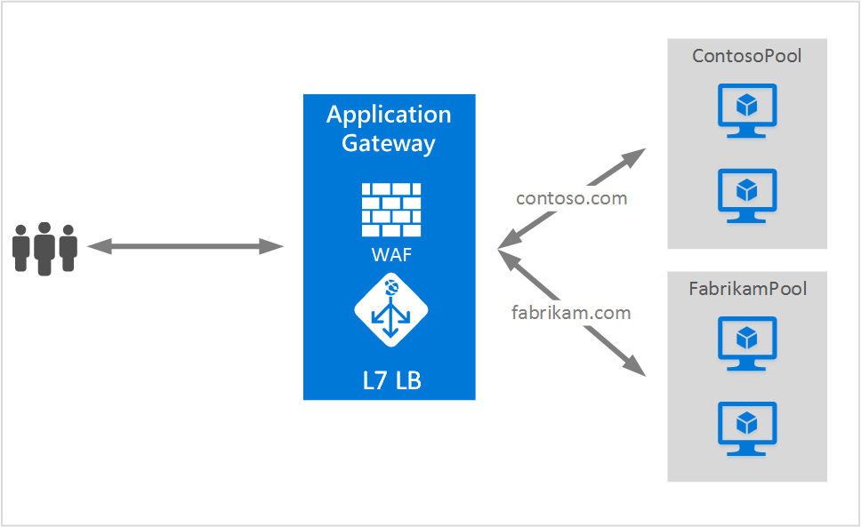

<properties
   pageTitle="Hospedando vários sites em Application Gateway | Microsoft Azure"
   description="Esta página fornece uma visão geral do suporte a vários local Application Gateway."
   documentationCenter="na"
   services="application-gateway"
   authors="amsriva"
   manager="rossort"
   editor="amsriva"/>
<tags
   ms.service="application-gateway"
   ms.devlang="na"
   ms.topic="hero-article"
   ms.tgt_pltfrm="na"
   ms.workload="infrastructure-services"
   ms.date="10/25/2016"
   ms.author="amsriva"/>

# Gateway de aplicativo várias opções de hospedagem de site

Várias opções de hospedagem de site permite que você configure mais de um aplicativo web na mesma instância do gateway aplicativo. Esse recurso permite que você configure uma topologia mais eficiente para as implantações adicionando sites até 20 ao gateway de um aplicativo. Cada site pode ser direcionado para seu próprio pool de back-end. No exemplo a seguir, o gateway de aplicativo está funcionando tráfego para contoso.com e fabrikam.com de dois pools de servidor back-end chamado ContosoServerPool e FabrikamServerPool.

Solicitações de http://contoso.com são roteadas para ContosoServerPool e http://fabrikam.com são roteados para FabrikamServerPool.

Da mesma forma dois subdomínios do mesmo domínio pai podem ser hospedados na mesma implantação de gateway do aplicativo. Exemplos do uso de subdomínios podem incluir http://blog.contoso.com e http://app.contoso.com hospedado em uma implantação de gateway único aplicativo.

## Cabeçalhos de host e indicação de nome de servidor (SNI)

Há três mecanismos comuns para habilitar vários de hospedagem de site na infraestrutura do mesma.

1. Hospede vários aplicativos da web cada em um endereço IP exclusivo.
2. Use o nome de host para hospedar vários aplicativos da web no mesmo endereço IP.
3. Use diferentes portas para hospedar vários aplicativos da web no mesmo endereço IP.

Atualmente um gateway aplicativo obtém um único endereço IP público no qual ele ouve o tráfego. Portanto, oferecer suporte a vários aplicativos, cada uma com seu próprio endereço IP, não é suportado atualmente. Aplicativo Gateway oferece suporte para vários aplicativos de hospedagem cada listening em portas diferentes, mas esse cenário requer os aplicativos para aceitar o tráfego em portas não padrão e geralmente não é uma configuração desejada. Gateway do aplicativo depende de cabeçalhos de host HTTP 1.1 para hospedar mais de um site no mesmo endereço IP público e a porta. Os sites hospedados no aplicativo gateway também podem suporte SSL descarregamento com extensão de nome de servidor indicação (SNI) TLS. Este cenário significa que o cliente navegador e back-end web farm deve oferecer suporte HTTP/1.1 e extensão TLS conforme definido na RFC 6066.

## Elemento de configuração de ouvinte

Elemento de configuração de HTTPListener existente é aprimorado para dar suporte ao host nome e servidor nome indicação elementos, que é usado pelo gateway de aplicativo para rotear o tráfego ao pool de back-end apropriado. O exemplo de código a seguir é o trecho do elemento HttpListeners do arquivo de modelo.

    "httpListeners": [
                {
                    "name": "appGatewayHttpsListener1",
                    "properties": {
                        "FrontendIPConfiguration": {
                            "Id": "/subscriptions/<subid>/resourceGroups/<rgName>/providers/Microsoft.Network/applicationGateways/applicationGateway1/frontendIPConfigurations/DefaultFrontendPublicIP"
                        },
                        "FrontendPort": {
                            "Id": "/subscriptions/<subid>/resourceGroups/<rgName>/providers/Microsoft.Network/applicationGateways/applicationGateway1/frontendPorts/appGatewayFrontendPort443'"
                        },
                        "Protocol": "Https",
                        "SslCertificate": {
                            "Id": "/subscriptions/<subid>/resourceGroups/<rgName>/providers/Microsoft.Network/applicationGateways/applicationGateway1/sslCertificates/appGatewaySslCert1'"
                        },
                        "HostName": "contoso.com",
                        "RequireServerNameIndication": "true"
                    }
                },
                {
                    "name": "appGatewayHttpListener2",
                    "properties": {
                        "FrontendIPConfiguration": {
                            "Id": "/subscriptions/<subid>/resourceGroups/<rgName>/providers/Microsoft.Network/applicationGateways/applicationGateway1/frontendIPConfigurations/appGatewayFrontendIP'"
                        },
                        "FrontendPort": {
                            "Id": "/subscriptions/<subid>/resourceGroups/<rgName>/providers/Microsoft.Network/applicationGateways/applicationGateway1/frontendPorts/appGatewayFrontendPort80'"
                        },
                        "Protocol": "Http",
                        "HostName": "fabrikam.com",
                        "RequireServerNameIndication": "false"
                    }
                }
            ],

Você pode visitar o [modelo de Gerenciador de recursos usando várias opções de hospedagem de site](https://github.com/Azure/azure-quickstart-templates/blob/master/201-application-gateway-multihosting) para uma implantação de ponta a ponta com base em modelo.

## Regra de roteamento

Não há nenhuma alteração necessária na regra de roteamento. A regra de roteamento 'Básica' deve continuar a ser escolhido para vincular o ouvinte de sites apropriado para o pool de endereços de back-end correspondente.

    "requestRoutingRules": [
    {
        "name": "<ruleName1>",
        "properties": {
            "RuleType": "Basic",
            "httpListener": {
                "id": "/subscriptions/<subid>/resourceGroups/<rgName>/providers/Microsoft.Network/applicationGateways/applicationGateway1/httpListeners/appGatewayHttpsListener1')]"
            },
            "backendAddressPool": {
                "id": "/subscriptions/<subid>/resourceGroups/<rgName>/providers/Microsoft.Network/applicationGateways/applicationGateway1/backendAddressPools/ContosoServerPool')]"
            },
            "backendHttpSettings": {
                "id": "/subscriptions/<subid>/resourceGroups/<rgName>/providers/Microsoft.Network/applicationGateways/applicationGateway1/backendHttpSettingsCollection/appGatewayBackendHttpSettings')]"
            }
        }

    },
    {
        "name": "<ruleName2>",
        "properties": {
            "RuleType": "Basic",
            "httpListener": {
                "id": "/subscriptions/<subid>/resourceGroups/<rgName>/providers/Microsoft.Network/applicationGateways/applicationGateway1/httpListeners/appGatewayHttpListener2')]"
            },
            "backendAddressPool": {
                "id": "/subscriptions/<subid>/resourceGroups/<rgName>/providers/Microsoft.Network/applicationGateways/applicationGateway1/backendAddressPools/FabrikamServerPool')]"
            },
            "backendHttpSettings": {
                "id": "/subscriptions/<subid>/resourceGroups/<rgName>/providers/Microsoft.Network/applicationGateways/applicationGateway1/backendHttpSettingsCollection/appGatewayBackendHttpSettings')]"
            }
        }

    }
    ]

## Próximas etapas

Depois de conhecer várias opções de hospedagem de site, vá para [criar um gateway de aplicativo usando várias opções de hospedagem de site](application-gateway-create-multisite-azureresourcemanager-powershell.md) para criar um gateway de aplicativo com capacidade para dar suporte a mais de um aplicativo web.
