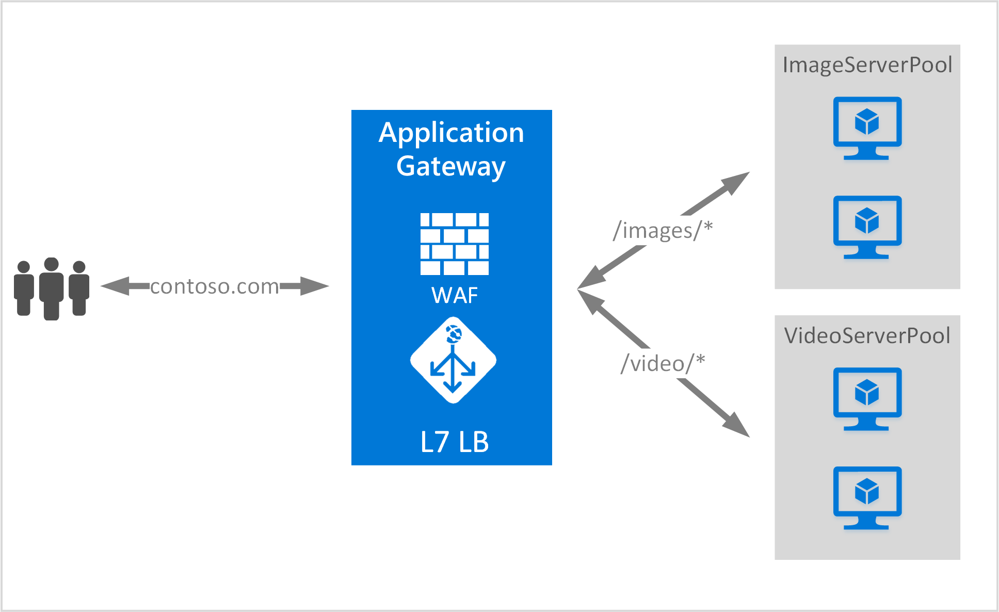

<properties
   pageTitle="Baseado em URL roteamento visão geral do conteúdo | Microsoft Azure"
   description="Esta página fornece uma visão geral do roteamento conteúdo baseado em URL de Gateway do aplicativo, configuração de UrlPathMap e PathBasedRouting regra."
   documentationCenter="na"
   services="application-gateway"
   authors="georgewallace"
   manager="carmonm"
   editor="tysonn"/>
<tags
   ms.service="application-gateway"
   ms.devlang="na"
   ms.topic="hero-article"
   ms.tgt_pltfrm="na"
   ms.workload="infrastructure-services"
   ms.date="10/25/2016"
   ms.author="gwallace"/>

# Visão geral da URL com base em roteamento de caminho

URL com base em roteamento de caminho permite rotear o tráfego para pools de servidor back-end com base em caminhos de URL da solicitação. Um dos cenários é rotear solicitações para diferentes tipos de conteúdo para pools de servidor de back-end diferente.
No exemplo a seguir, Application Gateway está servindo tráfego para contoso.com de três pools de servidor back-end por exemplo: VideoServerPool, ImageServerPool e DefaultServerPool.

Solicitações de http://contoso.com/video* são roteados para VideoServerPool e http://contoso.com/images* são roteadas para ImageServerPool. DefaultServerPool está selecionado se nenhum dos padrões de caminho corresponder.

## Elemento de configuração de UrlPathMap

Elemento de UrlPathMap é usado para especificar padrões de caminho para os mapeamentos de pool do servidor back-end. O exemplo de código a seguir é o trecho do elemento urlPathMap do arquivo de modelo.

    "urlPathMaps": [
    {
    "name": "<urlPathMapName>",
    "id": "/subscriptions/<subscriptionId>/../microsoft.network/applicationGateways/<gatewayName>/ urlPathMaps/<urlPathMapName>",
    "properties": {
        "defaultBackendAddressPool": {
            "id": "/subscriptions/<subscriptionId>/../microsoft.network/applicationGateways/<gatewayName>/backendAddressPools/<poolName>"
        },
        "defaultBackendHttpSettings": {
            "id": "/subscriptions/<subscriptionId>/../microsoft.network/applicationGateways/<gatewayName>/backendHttpSettingsList/<settingsName>"
        },
        "pathRules": [
            {
                "paths": [
                    <pathPattern>
                ],
                "backendAddressPool": {
                    "id": "/subscriptions/<subscriptionId>/../microsoft.network/applicationGateways/<gatewayName>/backendAddressPools/<poolName2>"
                },
                "backendHttpsettings": {
                    "id": "/subscriptions/<subscriptionId>/../microsoft.network/applicationGateways/<gatewayName>/backendHttpsettingsList/<settingsName2>"
                },

            },

        ],

    }
    }
    

>[AZURE.NOTE] PathPattern: Essa configuração é uma lista de padrões de caminho para fazer a correspondência. Cada deve começar com / e o único lugar um "*" é permitido é no seguinte final uma "/". A cadeia de caracteres tio para correspondente o caminho não inclui qualquer texto após o primeiro? ou # e os caracteres não são permitidos aqui. 

Você pode check-out de um [modelo de Gerenciador de recursos usando o roteamento baseado em URL](https://azure.microsoft.com/documentation/templates/201-application-gateway-url-path-based-routing) para obter mais informações.

## Regra de PathBasedRouting

RequestRoutingRule do tipo PathBasedRouting é usado para associar um ouvinte a um urlPathMap. Todas as solicitações que são recebidas para este ouvinte são roteadas com base na política especificada em urlPathMap.
Trecho de regra de PathBasedRouting:

    "requestRoutingRules": [
    {

    "name": "<ruleName>",
    "id": "/subscriptions/<subscriptionId>/../microsoft.network/applicationGateways/<gatewayName>/requestRoutingRules/<ruleName>",
    "properties": {
        "ruleType": "PathBasedRouting",
        "httpListener": {
            "id": "/subscriptions/<subscriptionId>/../microsoft.network/applicationGateways/<gatewayName>/httpListeners/<listenerName>"
        },
        "urlPathMap": {
            "id": "/subscriptions/<subscriptionId>/../microsoft.network/applicationGateways/<gatewayName>/ urlPathMaps/<urlPathMapName>"
        },

    }
    
## Próximas etapas

Depois de conhecer roteamento conteúdo baseado em URL, vá para [criar um gateway de aplicativo usando o roteamento baseado em URL](application-gateway-create-url-route-portal.md) para criar um gateway de aplicativo com regras de roteamento de URL.
