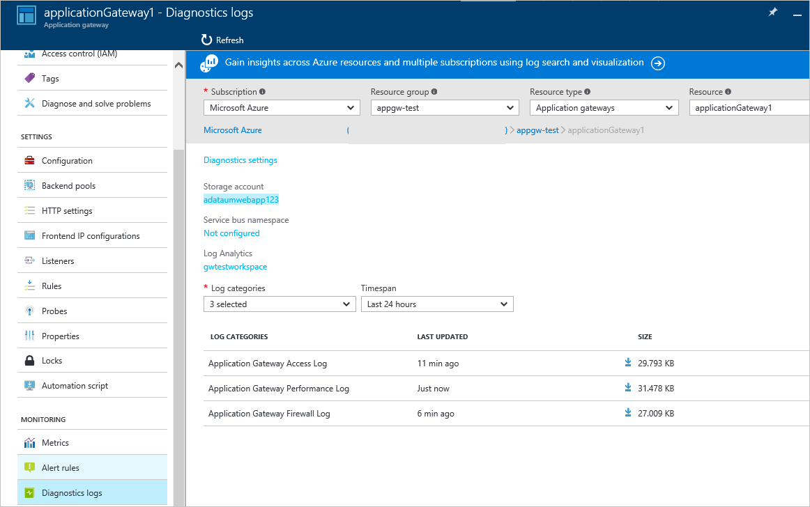

<properties
   pageTitle="Introdução ao Firewall do aplicativo da Web (WAF) para o Gateway de aplicativo | Microsoft Azure"
   description="Esta página fornece uma visão geral do Firewall de aplicativo da Web (WAF) para o Gateway de aplicativo "
   documentationCenter="na"
   services="application-gateway"
   authors="amsriva"
   manager="rossort"
   editor="amsriva"/>
<tags
   ms.service="application-gateway"
   ms.devlang="na"
   ms.topic="hero-article"
   ms.tgt_pltfrm="na"
   ms.workload="infrastructure-services"
   ms.date="10/25/2016"
   ms.author="amsriva"/>

# Firewall do aplicativo Web do aplicativo Gateway (prévia)

Firewall de aplicativo da Web (WAF) é um recurso do gateway de aplicativo do azure que oferece proteção para aplicativos web que utilizam o gateway de aplicativo para funções de controle de entrega de aplicativo (ADC) padrão. Firewall de aplicativo Web faz isso protegendo-os em relação a maioria das OWASP superiores 10 comuns da web vulnerabilidades. Aplicativos da Web estão cada vez mais destinos de ataques mal-intencionados que explorar vulnerabilidades conhecidas comuns. Comuns entre essas explorações são ataques de inclusão de SQL, script entre sites ataques para citar alguns. Evitando desses ataques no código do aplicativo pode ser desafiador e podem exigir rigorosa manutenção, patches e monitoramento em várias camadas da topologia do aplicativo. Um firewall de aplicativo web centralizado para proteger contra ataques de web torna o gerenciamento de segurança muito mais simples e fornece melhor garantia ao aplicativo contra as ameaças de intrusões. Uma solução de WAF também pode reagir a uma ameaças de segurança mais rápida por patches uma vulnerabilidade conhecida em um local central versus protegendo cada um dos aplicativos web individuais. Os gateways de aplicativos existente podem ser convertidos para um gateway de aplicativo com o firewall do aplicativo web com facilidade.

Gateway de aplicativo opera como controlador de entrega de aplicativo e oferece encerramento de SSL, afinidade de sessão baseada em cookies, carga round-robin distribuição, conteúda com base em roteamento, capacidade de hospedar vários aprimoramentos de segurança e de sites. Aprimoramentos de segurança oferecidos pelo Gateway de aplicativo incluem gerenciamento de política SSL, suporte a ponta a ponta SSL. Nós são reforçar os recursos de segurança de aplicativo do nosso serviço introduzindo WAF (firewall do aplicativo web) diretamente integrado ao ADC oferta. Isso permite uma fácil de configurar o local central para gerenciar e proteger seus aplicativos web contra vulnerabilidades comuns de web.

Configurar WAF gateway de aplicativo fornece os seguintes benefícios para você:

- Proteja seu aplicativo da web de vulnerabilidades web e ataques sem modificação do código de back-end.
- Protege vários aplicativos web ao mesmo tempo atrás de um gateway de aplicativos. Gateway de aplicativo suporta até 20 sites atrás de um único gateway que poderia ser protegido contra ataques de web de hospedagem.
- Monitore seu aplicativo web contra ataques usando o relatório em tempo real gerado pelo aplicativo gateway WAF logs.
- Certos controles de conformidade exigem todos internet opostas pontos de extremidade devem ser protegidos por uma solução de WAF. Usando o gateway de aplicativo com WAF ativado, você pode atender a esses requisitos de conformidade.

## Visão geral

Aplicativo Gateway WAF é oferecida em uma nova SKU (WAF SKU) e vem pré-configurado com ModSecurity e conjunto de regras de núcleo de OWASP para oferecer proteção de linha de base contra a maioria das OWASP superiores 10 comuns da web vulnerabilidades.

- Proteção de inclusão de SQL
- Cross proteção de script do site
- Web ataques proteção Common como inclusão de comando, solicitações HTTP indesejadas, divisão de resposta HTTP e ataque de inclusão de arquivo remoto
- Proteção contra violações de protocolo HTTP
- Proteção contra problemas de protocolo HTTP como ausentes hospedar agente de usuário e aceitar cabeçalhos
- Proteção DoS HTTP, incluindo HTTP saturação e prevenção de HTTP DoS lenta
- Prevenção contra robôs, rastreadores e mecanismos de varredura
- Detecção de incorretas de aplicativo (ou seja, Apache, IIS, etc.)

## Modos de WAF

Aplicativo Gateway WAF pode ser configurado para executar nos dois modos a seguintes:

- **Modo de detecção** – quando configurado para ser executado no modo de detecção, aplicativo Gateway WAF monitora e registra todos os alertas de ameaças em um arquivo de log. Você precisa garantir que o log de diagnóstico para aplicativo Gateway está ativado usando a seção diagnóstico. Você também precisa garantir que o log de WAF está selecionado e ativado.
- **Modo de prevenção** – quando configurado para ser executado no modo de prevenção, Application Gateway ativamente bloqueia invasões e ataques detectados por suas regras. O invasor recebe uma exceção 403 acesso não autorizado e a conexão é encerrada. Modo de prevenção continua a registrar tais ataques em logs de WAF.

## Relatórios de WAF de Gateway do aplicativo

Aplicativo Gateway WAF fornece relatórios detalhados de cada ameaças detecta. Registro em log é integrado ao Logs de diagnóstico do Azure e alertas são registradas em um formato json.

    {
        "resourceId": "/SUBSCRIPTIONS/<subscriptionId>/RESOURCEGROUPS/<resourceGroupName>/PROVIDERS/MICROSOFT.NETWORK/APPLICATIONGATEWAYS/<applicationGatewayName>",
        "operationName": "ApplicationGatewayFirewall",
        "time": "2016-09-20T00:40:04.9138513Z",
        "category": "ApplicationGatewayFirewallLog",
        "properties":     {
            "instanceId":"ApplicationGatewayRole_IN_0",
            "clientIp":"108.41.16.164",
            "clientPort":1815,
            "requestUri":"/wavsep/active/RXSS-Detection-Evaluation-POST/",
            "ruleId":"OWASP_973336",
            "message":"XSS Filter - Category 1: Script Tag Vector",
            "action":"Logged",
            "site":"Global",
            "message":"XSS Filter - Category 1: Script Tag Vector",
            "details":{"message":" Warning. Pattern match "(?i)(<script","file":"/owasp_crs/base_rules/modsecurity_crs_41_xss_attacks.conf","line":"14"}}
    }

## Preços de Gateway WAF SKU do aplicativo

Durante a visualização, não há nenhum cobranças adicionais para uso do aplicativo Gateway WAF. Você continuar a ser cobrada de acordo com os encargos SKU básico existentes. Podemos comunicará os encargos SKU WAF momento GA. Os clientes que escolheu para implantar o Gateway de aplicativo no SKU WAF comece acúmulo SKU WAF preços somente após o lançamento de GA.

## Próximas etapas

Depois de aprender mais sobre os recursos do WAF, visite [como configurar Firewall do aplicativo da Web no aplicativo do Gateway](application-gateway-web-application-firewall-portal.md).
