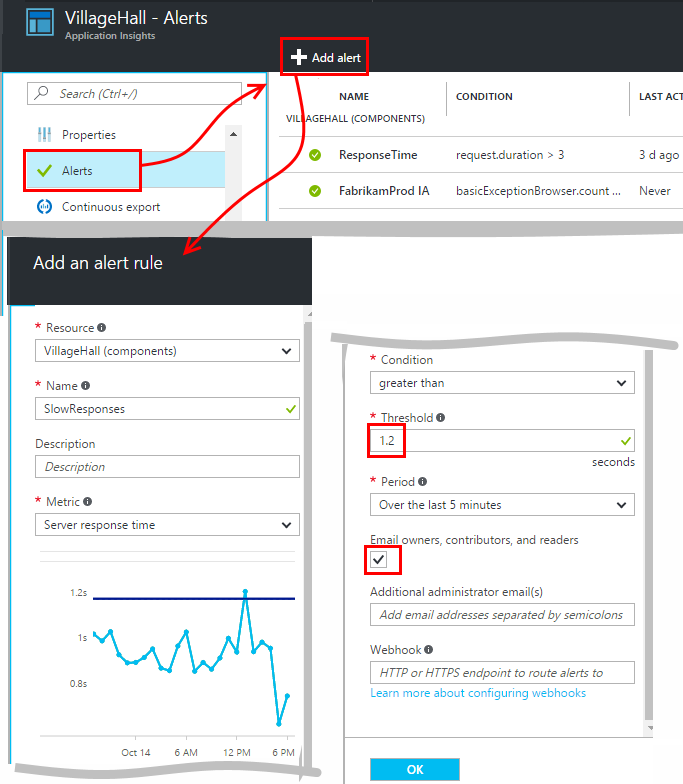
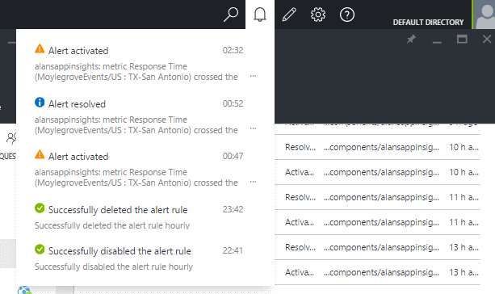
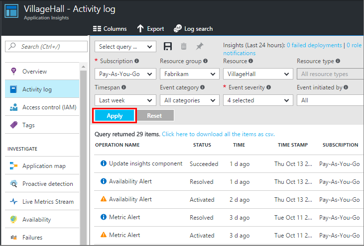

<properties 
    pageTitle="Definir alertas em ideias de aplicativo | Microsoft Azure" 
    description="Ser notificado sobre tempos de resposta lenta, exceções e outras desempenho ou alterações de uso em seu aplicativo web." 
    services="application-insights" 
    documentationCenter=""
    authors="alancameronwills" 
    manager="douge"/>

<tags 
    ms.service="application-insights" 
    ms.workload="tbd" 
    ms.tgt_pltfrm="ibiza" 
    ms.devlang="na" 
    ms.topic="article" 
    ms.date="10/14/2016" 
    ms.author="awills"/>
 
# Definir alertas em ideias de aplicativo

[Obtenção de informações do Visual Studio aplicativo] [ start] pode alertá-lo para alterações em métricas de desempenho ou uso em seu aplicativo web. 

Obtenção de informações de aplicativo monitora seu aplicativo ao vivo em uma [ampla variedade de plataformas] [ platforms] para ajudá-lo a diagnosticar problemas de desempenho e entender os padrões de uso.

Há três tipos de alertas:

* **Métricas alertas** informam quando qualquer métrica cruza um valor limite para alguns período - como tempos de resposta, contagens de exceção, o uso da CPU ou modos de exibição de página. 
* [**Testes de Web** ] [ availability] dirá quando seu site está disponível na internet ou está respondendo lentamente. [Saiba mais][availability].
* [**Diagnóstico proativo**](app-insights-proactive-diagnostics.md) são configurados automaticamente para notificá-lo sobre padrões incomuns de desempenho.

Podemos focalizar métricas alertas neste artigo.

## Definir uma alerta métrica

Abra a lâmina de regras de alerta e, em seguida, use o botão Adicionar. 

* Defina o recurso antes de outras propriedades. **Escolher o recurso de "(componentes)"** se você quiser definir alertas em métricas de desempenho ou uso.
* O nome que você fornecer para o alerta deve ser exclusivo dentro do grupo de recursos (não apenas seu aplicativo).
* Tenha cuidado para observar as unidades em que você for solicitado a inserir o valor de limite.
* Se você marcar a caixa "… proprietários de Email", alertas serão enviadas por email para qualquer pessoa que tenha acesso ao grupo de recursos. Para expandir esse conjunto de pessoas, adicioná-los à [assinatura ou grupo de recursos](app-insights-resources-roles-access-control.md) (não o recurso).
* Se você especificar "Emails adicionais", alertas serão enviados para aqueles indivíduos ou grupos (ou não que você marcou a caixa "… proprietários de email"). 
* Defina um [endereço de webhook](../monitoring-and-diagnostics/insights-webhooks-alerts.md) se você tiver configurado um aplicativo web que responde a alertas. Ele será chamado quando o alerta está ativado (isto é, acionada) e quando ele é resolvido. (Mas observe que no momento, parâmetros de consulta não são passados como propriedades webhook.)
* Você pode desabilitar ou habilitar o alerta: ver os botões na parte superior da lâmina.

*Não vejo o botão Adicionar alerta.* 

- Você está usando uma conta organizacional? Se você tiver o proprietário ou colaborador acessar a esse recurso do aplicativo, você pode definir alertas. Dê uma olhada a lâmina de controle de acesso. [Saiba mais sobre o controle de acesso][roles].

> [AZURE.NOTE] Na lâmina alertas, você verá que já existe um conjunto de alerta para cima: [Diagnóstico proativo](app-insights-proactive-failure-diagnostics.md). Este é um alerta automático que monitora uma determinada métrica, solicitação falha taxa. A menos que você decida desativar o alerta proativo, não é necessário configurar seu próprio alerta em taxa de falhas de solicitação. 

## Ver seus alertas

Você recebe um email quando um estado de alerta de alterações entre inativa e ativa. 

O estado atual de cada alerta é mostrado na lâmina regras de alerta.

Há um resumo de atividades recentes na alertas suspensa:

O histórico de alterações de estado é no registro de atividade:

## Como funcionam os alertas

* Um alerta tem três estados: "Nunca ativado", "Ativado" e "Resolvido". Significa ativada a condição especificada estava true, quando ele foi avaliado pela última vez.

* Uma notificação é gerada quando um alerta altera o estado. (Se a condição de alerta já foi true quando você criou o alerta, você pode não receber uma notificação até que a condição vai false.)

* Cada notificação gera um email se você marcou a caixa de emails ou fornecidos endereços de email. Você também pode examinar a lista suspensa de notificações.

* Um alerta é avaliado toda vez que chega de uma métrica, mas não caso contrário.

* A avaliação agrega a métrica ao longo do período anterior e se compara ao limite para determinar o novo estado.

* O período que você escolher Especifica o intervalo que métricas são agregadas. Ele não afeta com que frequência o alerta é avaliado: que depende da frequência de chegada de métricas.

* Se nenhum dado chega de uma determinada métrica por algum tempo, o espaço tem efeitos diferentes no alerta de avaliação e dos gráficos no Explorador de métrica. No Explorador de métrica, se nenhum dado for visto por mais de um intervalo de amostragem do gráfico, o gráfico mostra um valor de 0. Mas um alerta com base na mesma métrica não ser avaliada novamente e estado do alerta permanece inalterado. 

    Quando dados eventualmente chegam, o gráfico saltos de volta para um valor diferente de zero. Avalia o alerta baseado nos dados disponíveis para o período especificado. Se o novo ponto de dados é o único disponível no período, a agregação é baseada apenas em ponto de dados.

* Um alerta pode piscar frequentemente entre os estados de alerta e íntegros, mesmo se você definir um longo período. Isso pode acontecer se o valor de métrica focalizado em torno do limite. Não há nenhum Histerese no limite: a transição para o alerta acontece com o mesmo valor como a transição para íntegra.

## O que são alertas boas definir?

Isso depende de seu aplicativo. Começar, é melhor não definir métricas demais. Dedicar algum tempo olhando para seus gráficos métricos enquanto seu aplicativo é executado, para obter uma aparência como ele se comporta normalmente. Isso ajuda você a encontrar maneiras de melhorar seu desempenho. Em seguida, configure alertas para informar a você quando as métricas vá fora da zona normal. 

Alertas populares incluem:

* [Métricas de navegador][client], especialmente navegador **tempos de carregamento de página**, são bons para aplicativos web. Se a sua página tiver muitas scripts, você desejará atenção para **exceções de navegador**. Para obter essas métricas e alertas, você precisa configurar [monitoramento de página da web][client].
* **Tempo de resposta do servidor** para o lado do servidor de aplicativos web. Além de configurar alertas, atento a essa métrica para ver se ele varia de forma desproporcional com taxas de solicitação de alta: que pode indicar que seu aplicativo está ficando sem recursos. 
* **Exceções do servidor** - vê-los, você precisa fazer alguma [configuração adicional](app-insights-asp-net-exceptions.md).

Não se esqueça que [Diagnóstico de taxa de falha proativo](app-insights-proactive-failure-diagnostics.md) automaticamente monitorar a taxa em que seu aplicativo responde às solicitações com códigos de falha. 

## Automação

* [Usar o PowerShell para automatizar a configuração de alertas](app-insights-powershell-alerts.md)
* [Usar webhooks para automatizar respondendo a alertas](../monitoring-and-diagnostics/insights-webhooks-alerts.md)

## Consulte também

* [Testes de web de disponibilidade](app-insights-monitor-web-app-availability.md)
* [Automatizar o processo de configuração de alertas](app-insights-powershell-alerts.md)
* [Diagnóstico proativo](app-insights-proactive-diagnostics.md) 

<!--Link references-->

[availability]: app-insights-monitor-web-app-availability.md
[client]: app-insights-javascript.md
[platforms]: app-insights-platforms.md
[roles]: app-insights-resources-roles-access-control.md
[start]: app-insights-overview.md

 