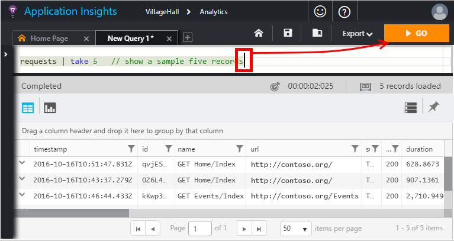
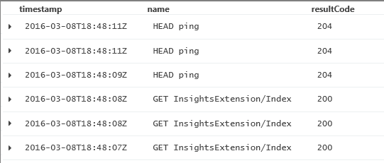
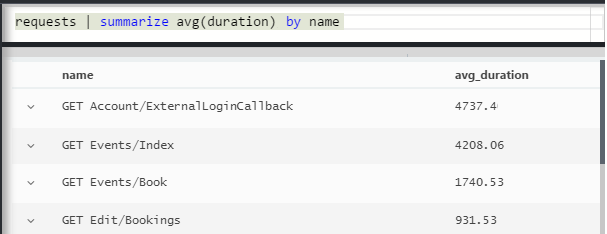
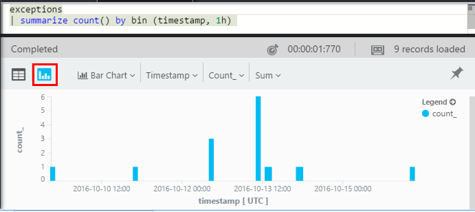
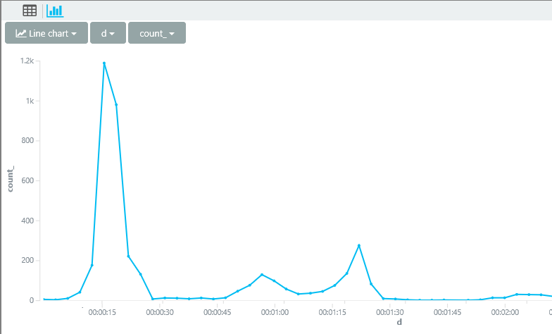
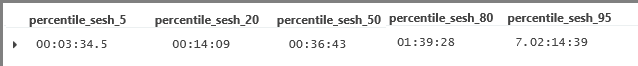
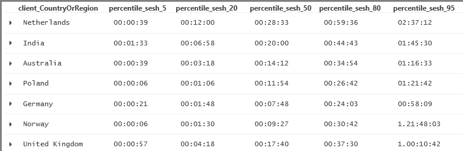
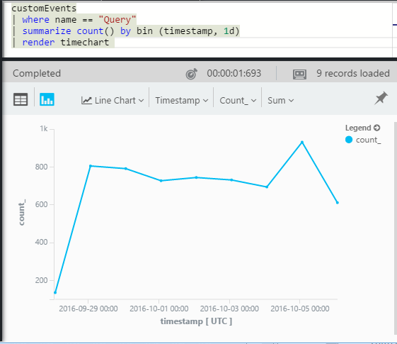
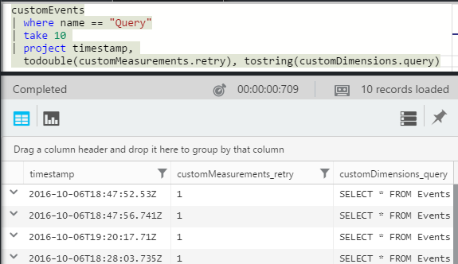

<properties 
    pageTitle="Um tour pelo Analytics no aplicativo ideias | Microsoft Azure" 
    description="Curtas amostras de todas as consultas principais em análise, a ferramenta de pesquisa avançada de obtenção de informações do aplicativo." 
    services="application-insights" 
    documentationCenter=""
    authors="alancameronwills" 
    manager="douge"/>

<tags 
    ms.service="application-insights" 
    ms.workload="tbd" 
    ms.tgt_pltfrm="ibiza" 
    ms.devlang="na" 
    ms.topic="article" 
    ms.date="10/15/2016" 
    ms.author="awills"/>


 
# <a name="a-tour-of-analytics-in-application-insights"></a>Um tour do Analytics na obtenção de informações de aplicativo


[Análise](app-insights-analytics.md) é o recurso de pesquisa avançada de [Obtenção de informações do aplicativo](app-insights-overview.md). Estas páginas descrevem a lanquage de consulta de análise.


* **[Assista ao vídeo introdutório](https://applicationanalytics-media.azureedge.net/home_page_video.mp4)**.
* **[Unidade de teste Analytics em nossos dados simulados](https://analytics.applicationinsights.io/demo)** se seu aplicativo não estiver enviando dados de obtenção de informações do aplicativo ainda.


Vamos percorrer algumas consultas básicas para você começar.

## <a name="connect-to-your-application-insights-data"></a>Conectar aos dados ideias de aplicativo

Abra a análise da [lâmina de visão geral](app-insights-dashboards.md) do seu aplicativo em ideias de aplicativo:


    
## <a name="takeapp-insights-analytics-referencemdtake-operator-show-me-n-rows"></a>[Levar](app-insights-analytics-reference.md#take-operator): Mostrar linhas n

Pontos de dados que o log de operações de usuário (normalmente solicitações HTTP recebidas pelo seu aplicativo web) são armazenados em uma tabela chamada `requests`. Cada linha é um ponto de dados de telemetria recebido de SDK de obtenção de informações do aplicativo em seu aplicativo.

Vamos começar examinando algumas linhas de amostra da tabela:



> [AZURE.NOTE] Coloque o cursor em algum lugar na instrução antes de clicar em Ir. Você pode dividir uma instrução sobre mais de uma linha, mas não insira linhas em branco em uma instrução. Linhas em branco são uma maneira conveniente de manter várias consultas separadas na janela.


Escolher colunas, arraste-os, agrupar por colunas e a filtragem: 


Expanda qualquer item para ver os detalhes:
 


> [AZURE.NOTE] Clique no chefe de uma coluna para reordenar os resultados disponíveis no navegador da web. Mas lembre-se de que, para um conjunto de resultado muito grande, o número de linhas baixadas para o navegador é limitado. Classificação dessa maneira não sempre mostra os itens mais altos ou mais baixos reais. Para classificar itens confiável, use a `top` ou `sort` operador. 

## <a name="topapp-insights-analytics-referencemdtop-operator-and-sortapp-insights-analytics-referencemdsort-operator"></a>[Superior](app-insights-analytics-reference.md#top-operator) e [classificação](app-insights-analytics-reference.md#sort-operator)

`take`é útil para obter um exemplo rápido de um resultado, mas mostra linhas da tabela em nenhuma ordem específica. Para obter uma exibição ordenada, use `top` (para obter um exemplo) ou `sort` (sobre a tabela inteira).

Mostre as primeiras n linhas, ordenadas por uma determinada coluna:

```AIQL

    requests | top 10 by timestamp desc 
```

* *Sintaxe:* A maioria dos operadores têm parâmetros de palavra-chave como `by`.
* `desc`= ordem decrescente, `asc` = crescente.


`top...`é uma maneira de alto desempenho mais de dizer `sort ... | take...`. Podemos poderia ter escrito:

```AIQL

    requests | sort by timestamp desc | take 10
```

O resultado seria o mesmo, mas ele será executado um pouco mais lentamente. (Você também pode escrever `order`, que é um alias de `sort`.)

Os cabeçalhos de coluna no modo de exibição tabela também podem ser usados para classificar os resultados na tela. Mas claro, se você usou o `take` ou `top` para recuperar apenas parte de uma tabela, você vai somente reordenar os registros que você já recuperados.


## <a name="projectapp-insights-analytics-referencemdproject-operator-select-rename-and-compute-columns"></a>[Projeto](app-insights-analytics-reference.md#project-operator): selecionar, renomear e calcular colunas

Use [`project`](app-insights-analytics-reference.md#project-operator) para escolher apenas as colunas que você deseja:

```AIQL

    requests | top 10 by timestamp desc
             | project timestamp, name, resultCode
```




Você também pode renomear colunas e definir novos:

```AIQL

    requests 
  	| top 10 by timestamp desc 
  	| project  
            name, 
            response = resultCode,
            timestamp, 
            ['time of day'] = floor(timestamp % 1d, 1s)
```


* [Nomes de coluna](app-insights-analytics-reference.md#names) podem incluir espaços ou símbolos se eles estão entre colchetes semelhante a esta: `['...']` ou`["..."]`
* `%`é o operador de módulo usual. 
* `1d`(que é um dígito, em seguida, um tinha ') é um período de tempo literal indicando um dia. Aqui estão alguns mais literais de período de tempo: `12h`, `30m`, `10s`, `0.01s`.
* `floor`(alias `bin`) Arredonda um valor para baixo até o múltiplo mais próximo do valor base que você fornecer. Portanto `floor(aTime, 1s)` Arredonda um horário para baixo até o segundo mais próximo.

[Expressões](app-insights-analytics-reference.md#scalars) podem incluir todos os operadores usuais (`+`, `-`,...), e há uma variedade de funções úteis.

    

## <a name="extendapp-insights-analytics-referencemdextend-operator-compute-columns"></a>[Estender](app-insights-analytics-reference.md#extend-operator): calcular colunas

Se você quiser apenas adicionar colunas aos existentes, use [`extend`](app-insights-analytics-reference.md#extend-operator):

```AIQL

    requests 
  	| top 10 by timestamp desc
  	| extend timeOfDay = floor(timestamp % 1d, 1s)
```

Usando [`extend`](app-insights-analytics-reference.md#extend-operator) é menos detalhado que [`project`](app-insights-analytics-reference.md#project-operator) se você quiser manter todas as colunas existentes.


## <a name="summarizeapp-insights-analytics-referencemdsummarize-operator-aggregate-groups-of-rows"></a>[Resumir](app-insights-analytics-reference.md#summarize-operator): agregar grupos de linhas

`Summarize`aplica uma *função de agregação* de especificada sobre grupos de linhas. 

Por exemplo, o tempo seu aplicativo web leva para responder a uma solicitação é informado no campo `duration`. Vamos ver o tempo de resposta médio a todas as solicitações:


Ou podemos poderia separar o resultado em solicitações de nomes diferentes:




`Summarize`coleta os pontos de dados no fluxo em grupos para os quais o `by` cláusula avalia igualmente. Cada valor na `by` expressão - cada nome de operação no exemplo acima - resulta em uma linha na tabela de resultados. 

Ou podemos pode agrupar os resultados por hora do dia:


Observe como estamos usando o `bin` função (também conhecidos como `floor`). Se apenas usamos `by timestamp`, cada linha de entrada deve terminar em seu próprio grupo pouco. Para qualquer escalar contínuo como horas ou números, temos que dividir o intervalo contínuo em um número gerenciável de valores distintos, e `bin` -que é realmente apenas na familiar arredondamento suspensa `floor` funcionar, é a maneira mais fácil de fazer isso.

Podemos usar a mesma técnica para reduzir intervalos de cadeias de caracteres:


Observe que você pode usar `name=` para definir o nome de uma coluna de resultado, nas expressões de agregação ou por-cláusula.

## <a name="counting-sampled-data"></a>Contagem de dados de amostra

`sum(itemCount)`é a agregação recomendada para contar eventos. Em muitos casos, itemCount = = 1, para que a função simplesmente conta o número de linhas no grupo. Mas quando [amostragem](app-insights-sampling.md) estiver em operação, apenas uma fração dos eventos originais será mantida como pontos de dados no aplicativo ideias, para que cada ponto de dados que você vê, existem `itemCount` eventos. 

Por exemplo, se amostragem descarta 75% da eventos originais e itemCount = = 4 nos registros retidos - ou seja, para cada registro retido, havia quatro registros originais. 

Amostragem adaptativa causa itemCount ser maior durante períodos quando seu aplicativo está sendo muito usado.

Portanto resumindo itemCount dá uma boa estimativa do número original de eventos.


Também há um `count()` agregação (e uma operação de contagem), para casos em que você realmente deseja contar o número de linhas em um grupo.


Há uma variedade de [funções de agregação](app-insights-analytics-reference.md#aggregations).


## <a name="charting-the-results"></a>Os resultados de gráficos


```AIQL

    exceptions 
       | summarize count()  
         by bin(timestamp, 1d)
```

Por padrão, os resultados são exibidos como uma tabela:


Podemos fazer melhor do que o modo de exibição de tabela. Vamos examinar os resultados no modo de exibição gráfico com vertical barra opção:



Observe que, embora nós não classificar os resultados por hora (como você pode ver na tabela são exibidas), a exibição de gráfico mostra sempre datetimes na ordem correta.


## <a name="whereapp-insights-analytics-referencemdwhere-operator-filtering-on-a-condition"></a>[Onde](app-insights-analytics-reference.md#where-operator): filtragem em uma condição

Se você configurar o monitoramento de obtenção de informações do aplicativo para o [cliente](app-insights-javascript.md) e o servidor lados do aplicativo, alguns da telemetria no banco de dados é proveniente de navegadores.

Vamos ver apenas exceções relatadas de navegadores:

```AIQL

    exceptions 
  	| where client_Type == "Browser" 
  	|  summarize count() 
       by client_Browser, outerMessage 
```


O `where` operador usa uma expressão booliana. Aqui estão alguns pontos importantes sobre eles:

 * `and`, `or`: Operadores booleanos
 * `==`, `<>` : iguais e não são iguais
 * `=~`, `!=` : cadeia de maiusculas e minúsculas igual e não é igual. Há muitos mais operadores de comparação de cadeia de caracteres.

Leia tudo sobre [expressões escalares](app-insights-analytics-reference.md#scalars).

### <a name="filtering-events"></a>Filtrando eventos

Localize as solicitações de êxito:

```AIQL

    requests 
  	| where isnotempty(resultCode) and toint(resultCode) >= 400
```

`responseCode`tem o tipo de cadeia de caracteres, por isso devemos [convertê-la](app-insights-analytics-reference.md#casts) para uma comparação numérica.

Resuma as respostas diferentes:

```AIQL

    requests
  	| where isnotempty(resultCode) and toint(resultCode) >= 400
  	| summarize count() 
      by resultCode
```

## <a name="timecharts"></a>Timecharts

Mostrar quantos eventos lá está cada dia:

```AIQL

    requests
      | summarize event_count=count()
        by bin(timestamp, 1d)
```

Selecione a opção de exibição de gráfico:


## <a name="multiple-series"></a>Várias séries 

Várias expressões na `summarize` cria várias colunas.

Várias expressões na `by` cláusula cria várias linhas, uma para cada combinação de valores.


```AIQL

    requests
  	| summarize count(), avg(duration) 
      by bin(timestamp, 1d), client_StateOrProvince, client_City 
  	| order by timestamp asc, client_StateOrProvince, client_City
```


### <a name="segment-a-chart-by-dimensions"></a>Um gráfico de segmento por dimensões

Se você criar um gráfico uma tabela que tem uma coluna de cadeia de caracteres e uma coluna numérica, a cadeia de caracteres pode ser usada para dividir os dados numéricos em separado série de pontos. Se houver mais de uma coluna de cadeia de caracteres, você pode escolher qual coluna para usar como o discriminador. 


### <a name="display-multiple-metrics"></a>Exibir várias métricas

Se você criar um gráfico uma tabela que mais de uma coluna numérica, além do carimbo de hora, você pode exibir qualquer combinação deles.


Você deve selecionar não dividido antes de selecionar várias colunas de numéricas que não é possível dividir uma coluna de cadeia de caracteres ao mesmo tempo como exibir mais de uma coluna numérica. 


## <a name="daily-average-cycle"></a>Ciclo médio diário

Como uso variar ao longo do dia médio?

Solicitações de contagem pelo tempo módulo um dia, binned em horas:

```AIQL

    requests
  	| extend hour = floor(timestamp % 1d , 1h) 
          + datetime("2016-01-01")
  	| summarize event_count=count() by hour
```


>[AZURE.NOTE] Observe que temos atualmente converter durações de tempo para datetimes para exibir na um gráfico.


## <a name="compare-multiple-daily-series"></a>Comparar várias séries de diários

Como uso variar ao longo do tempo do dia em países diferentes?

```AIQL

 requests  | where tostring(operation_SyntheticSource)
     | extend hour= floor( timestamp % 1d , 1h)
           + datetime("2001-01-01")
     | summarize event_count=count() 
       by hour, client_CountryOrRegion 
     | render timechart
```


## <a name="plot-a-distribution"></a>Plotar uma distribuição

Há quantas sessões de diferentes comprimentos?

```AIQL

    requests 
  	| where isnotnull(session_Id) and isnotempty(session_Id) 
  	| summarize min(timestamp), max(timestamp) 
      by session_Id 
  	| extend sessionDuration = max_timestamp - min_timestamp 
  	| where sessionDuration > 1s and sessionDuration < 3m 
  	| summarize count() by floor(sessionDuration, 3s) 
  	| project d = sessionDuration + datetime("2016-01-01"), count_
```

A última linha é necessária para converter em datetime. No momento do eixo x de um gráfico é exibido como um escalar somente se ele for um datetime.

O `where` cláusula exclui sessões única (sessionDuration = = 0) e define o comprimento do eixo x.





## <a name="percentilesapp-insights-analytics-referencemdpercentiles"></a>[Percentuais](app-insights-analytics-reference.md#percentiles)

Quais intervalos de durações cobrir diferentes porcentagens de sessões?

Usar a consulta acima, mas substitua a última linha:

```AIQL

    requests 
  	| where isnotnull(session_Id) and isnotempty(session_Id) 
  	| summarize min(timestamp), max(timestamp) 
      by session_Id 
  	| extend sesh = max_timestamp - min_timestamp 
  	| where sesh > 1s
  	| summarize count() by floor(sesh, 3s) 
  	| summarize percentiles(sesh, 5, 20, 50, 80, 95)
```

Também removemos o limite superior na lista onde cláusula, para obter números corretos, incluindo todas as sessões com mais de uma solicitação:



Do qual podemos ver que:

* 5% de sessões têm uma duração de menos de 3 minutos 34s; 
* 50% de sessões último minnutes menos de 36;
* 5% de sessões últimos mais de 7 dias

Para obter uma divisão separada para cada país, podemos apenas trazer a coluna client_CountryOrRegion separadamente através de ambos resumir operadores:

```AIQL

    requests 
  	| where isnotnull(session_Id) and isnotempty(session_Id) 
  	| summarize min(timestamp), max(timestamp) 
      by session_Id, client_CountryOrRegion
  	| extend sesh = max_timestamp - min_timestamp 
  	| where sesh > 1s
  	| summarize count() by floor(sesh, 3s), client_CountryOrRegion
  	| summarize percentiles(sesh, 5, 20, 50, 80, 95)
      by client_CountryOrRegion
```




## <a name="joinapp-insights-analytics-referencemdjoin"></a>[Junção](app-insights-analytics-reference.md#join)

Temos acesso a várias tabelas, incluindo as solicitações e exceções.

Para localizar as exceções relacionadas a uma solicitação que retornou uma resposta de falha, podemos pode participar as tabelas em `session_Id`:

```AIQL

    requests 
  	| where toint(responseCode) >= 500 
  	| join (exceptions) on operation_Id 
  	| take 30
```


É recomendável usar `project` para selecionar apenas as colunas que precisamos antes de executar a associação.
Nas mesmas cláusulas, podemos renomeie a coluna de carimbo de hora.


## <a name="letapp-insights-analytics-referencemdlet-clause-assign-a-result-to-a-variable"></a>[Deixar](app-insights-analytics-reference.md#let-clause): atribuir um resultado a uma variável

Use [permitem](./app-insights-analytics-reference.md#let-statements) separar as partes da expressão anterior. Os resultados são inalterados:

```AIQL

    let bad_requests = 
      requests
        | where  toint(resultCode) >= 500  ;
    bad_requests
  	| join (exceptions) on session_Id 
  	| take 30
```

> Dica: No cliente de análise, não coloca linhas em branco entre as partes isso. Certifique-se de executar tudo isso.


## <a name="accessing-nested-objects"></a>Acessando objetos aninhados

Objetos aninhados podem ser acessados com facilidade. Por exemplo, no fluxo de exceções, você verá objetos estruturados assim:


Você pode nivelar-escolhendo as propriedades de que seu interesse:

```AIQL

    exceptions | take 10
  	| extend method1 = tostring(details[0].parsedStack[1].method)
```

Observe que você precisa usar um [cast](app-insights-analytics-reference.md#casts) para o tipo apropriado.

## <a name="custom-properties-and-measurements"></a>Medidas e propriedades personalizadas

Se seu aplicativo anexa [dimensões personalizadas (Propriedades) e medidas personalizadas](app-insights-api-custom-events-metrics.md#properties) a eventos, você verá que eles no `customDimensions` e `customMeasurements` objetos.


Por exemplo, se seu aplicativo inclui:

```C#

    var dimensions = new Dictionary<string, string> 
                     {{"p1", "v1"},{"p2", "v2"}};
    var measurements = new Dictionary<string, double>
                     {{"m1", 42.0}, {"m2", 43.2}};
    telemetryClient.TrackEvent("myEvent", dimensions, measurements);
```

Para extrair esses valores na análise:

```AIQL

    customEvents
  	| extend p1 = customDimensions.p1, 
      m1 = todouble(customMeasurements.m1) // cast to expected type

``` 

## <a name="tables"></a>Tabelas

O fluxo de telemetria recebido de seu aplicativo é acessado por meio de várias tabelas. O esquema de propriedades disponíveis para cada tabela é visível no canto esquerdo da janela.

### <a name="requests-table"></a>Tabela de solicitações

Solicitações de HTTP de contagem para seu aplicativo web e o segmento por nome de página:


Localize as solicitações que falham na maioria:


### <a name="custom-events-table"></a>Tabela de eventos personalizados

Se você usar [TrackEvent()](app-insights-api-custom-events-metrics.md#track-event) para enviar seus próprios eventos, você pode lê-los desta tabela. 

Vamos ver um exemplo onde o código do seu aplicativo contém essas linhas:

```C#

    telemetry.TrackEvent("Query", 
       new Dictionary<string,string> {{"query", sqlCmd}},
       new Dictionary<string,double> {
           {"retry", retryCount},
           {"querytime", totalTime}})
```

Exiba a frequência desses eventos:
 


Extrai dimensões e medidas dos eventos:



### <a name="custom-metrics-table"></a>Tabela de métricas personalizado

Se você estiver usando [TrackMetric()](app-insights-api-custom-events-metrics.md#track-metric) para enviar seus próprios valores métricas, você encontrará seus resultados no fluxo de **customMetrics** . Por exemplo:  


> [AZURE.NOTE] No [Explorador de métricas](app-insights-metrics-explorer.md), todas as medidas personalizadas anexadas a qualquer tipo de telemetria juntas na lâmina métricas juntamente com métricas enviadas usando `TrackMetric()`. Mas em análise, medidas personalizadas ainda são anexadas a qualquer tipo de telemetria foram realizados em - eventos ou solicitações e assim por diante - enquanto métricas enviadas por TrackMetric aparecem no seu próprio fluxo.

### <a name="performance-counters-table"></a>Tabela de contadores de desempenho

[Contadores de desempenho](app-insights-performance-counters.md) mostram métricas de sistema básico para o aplicativo, como CPU, memória e utilização da rede. Você pode configurar o SDK para enviar contadores adicionais, incluindo seus próprios contadores personalizados.

O esquema de **performanceCounters** expõe a `category`, `counter` nome, e `instance` nome de cada contador de desempenho. Os nomes de instância do contador só são aplicáveis a alguns contadores de desempenho e normalmente indicam o nome do processo ao qual se relaciona a contagem. A telemetria para cada aplicativo, você verá apenas os contadores para o aplicativo. Por exemplo, para ver quais contadores estão disponíveis: 


Para obter um gráfico de memória disponível ao longo do período recente: 


Como outra telemetria, **performanceCounters** também tem uma coluna `cloud_RoleInstance` que indica a identidade da máquina host no qual seu aplicativo está em execução. Por exemplo, para comparar o desempenho do seu aplicativo nas máquinas diferentes: 


### <a name="exceptions-table"></a>Tabela de exceções

[Exceções relatado pelo seu aplicativo](app-insights-asp-net-exceptions.md) estão disponíveis nesta tabela. 

Para localizar a solicitação HTTP que seu aplicativo estava tratando quando a exceção era gerada, ingresse no operation_Id:


### <a name="browser-timings-table"></a>Tabela de intervalos de navegador

`browserTimings`mostra os dados de carregamento de página coletada em navegadores dos usuários.

[Configurar o seu aplicativo de telemetria do lado do cliente](app-insights-javascript.md) para ver essas métricas. 

O esquema inclui [métricas indicando os comprimentos de diferentes estágios de página do processo de carregamento](app-insights-javascript.md#page-load-performance). (Eles não indicam o período de tempo que os usuários ler uma página.)  

Mostrar os popularities de páginas diferentes e carregar horas para cada página:


### <a name="availbility-results-table"></a>Tabela de resultados de disponibilidade

`availabilityResults`mostra os resultados dos [testes da web](app-insights-monitor-web-app-availability.md). Cada execução dos testes de cada local de teste é relatada separadamente. 


### <a name="dependencies-table"></a>Tabela de dependências

Contém resultados de chamadas que seu aplicativo faz para bancos de dados e APIs REST e outras chamadas para TrackDependency().

### <a name="traces-table"></a>Tabela de rastreamentos

Contém a telemetria enviada por seu aplicativo usando TrackTrace() ou [outras estruturas de log](app-insights-asp-net-trace-logs.md).

## <a name="dashboards"></a>Painéis

Você pode fixar seus resultados a um painel para reunir todos os seus gráficos e tabelas mais importantes.

* [Azure dashboard compartilhada](app-insights-dashboards.md#share-dashboards): clique no ícone de pino. Antes de fazer isso, você deve ter um painel compartilhado. No portal do Azure, abrir ou criar um painel e clique em compartilhar.
* [Painel do Power BI](app-insights-export-power-bi.md): Power BI Query, clique em Exportar. Uma vantagem desta alternativa é que você pode exibir sua consulta junto com uma outros resultados de uma enorme variedade de fontes.


## <a name="next-steps"></a>Próximas etapas

* [Referência de linguagem de análise](app-insights-analytics-reference.md)

[AZURE.INCLUDE [app-insights-analytics-footer](../../includes/app-insights-analytics-footer.md)]


