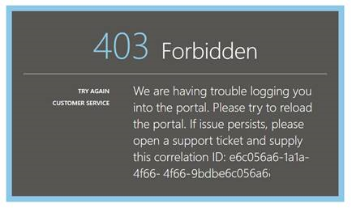

<properties 
    pageTitle="Solução de problemas de análise - a ferramenta de pesquisa avançada de obtenção de informações de aplicativo | Microsoft Azure" 
    description="Problemas com a análise de obtenção de informações do aplicativo? Comece aqui. " 
    services="application-insights" 
    documentationCenter=""
    authors="alancameronwills" 
    manager="douge"/>

<tags 
    ms.service="application-insights" 
    ms.workload="tbd" 
    ms.tgt_pltfrm="ibiza" 
    ms.devlang="na" 
    ms.topic="article" 
    ms.date="07/11/2016" 
    ms.author="awills"/>

# Solucionar problemas de análise na obtenção de informações de aplicativo

Problemas com [a análise de ideias aplicativo](app-insights-analytics.md)? Comece aqui. Análise é a ferramenta de pesquisa avançada de ideias de aplicativo do Visual Studio.

## Limites

* No momento, os resultados da consulta limitam-se apenas uma semana dos últimos dados.
* Navegadores testamos em: edições mais recentes do Chrome, borda e Internet Explorer.

## Extensões do navegador incompatíveis conhecidos

* Ghostery

Desative a extensão ou use um navegador diferente.

##"Erro inesperado"

Ocorreu um erro interno durante a execução de portal – exceção não tratada.

* Limpe o cache do navegador. 

## 403 … Tente recarregar

Uma autenticação relacionadas erro (durante a autenticação ou durante a geração de token de acesso). O portal não pode ter nenhuma maneira de recuperar sem alterar as configurações do navegador.

* Verifique se [os cookies de terceiros estão ativados](#cookies) no navegador. 

## 403 … verificar a zona de segurança

Uma autenticação relacionadas erro (durante a autenticação ou durante a geração de token de acesso). O portal não pode ter nenhuma maneira de recuperar sem alterar as configurações do navegador.

1. Verifique se [os cookies de terceiros estão ativados](#cookies) no navegador. 

2. Você usou um favorito, o indicador ou o link salvo para abrir o portal de análise? Você está conectado com credenciais diferentes você usou quando você salvou o link?

2. Tente usar uma janela do navegador em particular/anônima (após todas as janelas desse tipo de fechamento). Você precisará fornecer suas credenciais. 

2. Abra outra janela do navegador (comum) e vá para o [Azure](https://portal.azure.com). Sai. Abra o link e entre com as credenciais corretas.

2. Usuários de borda e o Internet Explorer também podem chegar a esse erro quando as configurações de zona confiável não têm suporte.

    Verifique se tanto o [portal de análise](https://analytics.applicationinsights.io) e o [portal do Azure Active Directory](https://portal.azure.com) estão na mesma zona de segurança:

 * No Internet Explorer, abra **Opções da Internet**, **segurança**, **sites confiáveis**, **Sites**:

    

    Na lista de sites, se qualquer uma das seguintes URLs são incluídos, certifique-se de que as outras pessoas estão incluídas também:

    https://Analytics.applicationinsights.IO 
   https://login.microsoftonline.com 
   https://login.Windows.NET

## 404... Recurso não encontrado

Recurso de aplicativo foi excluído do aplicativo ideias e não está disponível mais. Isso pode acontecer se você salvou a URL para a página de análise.

## 403... Nenhuma autorização

Você não tem permissão para abrir este aplicativo Analytics.

* Você adquiriu o link de outra pessoa? Peça para certificar-se de que você está no [leitores ou colaboradores para esse grupo de recursos](app-insights-resources-roles-access-control.md).
* Você salvou o link usando credenciais diferentes? Abra o [portal do Azure](https://portal.azure.com), saia e, em seguida, experimente este link novamente, fornecendo as credenciais corretas.

## 403... Armazenamento de HTML5

Nosso portal usa sessionStorage e localStorage HTML5.

* Chrome: Configurações de privacidade, configurações de conteúdo.
* Internet Explorer: Opções da Internet, guia Avançado, segurança, habilitar armazenamento DOM

## 404... Assinatura não encontrada

A URL é inválida. 

* Abra o recurso de aplicativo no [portal de obtenção de informações do aplicativo](https://portal.azure.com). Em seguida, use o botão de análise.

## 404 … página não existe

A URL é inválida.

* Abra o recurso de aplicativo no [portal de obtenção de informações do aplicativo](https://portal.azure.com). Em seguida, use o botão de análise.

## Habilitar cookies de terceiros

  Veja [como desativar cookies de terceiros](http://www.digitalcitizen.life/how-disable-third-party-cookies-all-major-browsers), mas observe que precisamos para **Habilitar** delas.

## Se tudo mais falhar    

[Fale conosco](app-insights-get-dev-support.md).
 
[AZURE.INCLUDE [app-insights-analytics-footer](../../includes/app-insights-analytics-footer.md)]

