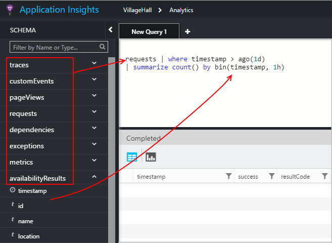
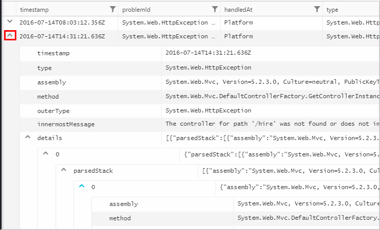
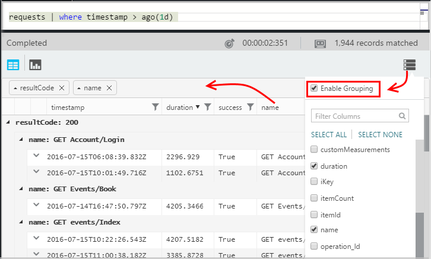

<properties 
    pageTitle="Usando a análise - a ferramenta de pesquisa avançada de obtenção de informações de aplicativo | Microsoft Azure" 
    description="Usando a análise, a ferramenta de pesquisa de diagnóstico poderosos de obtenção de informações do aplicativo. " 
    services="application-insights" 
    documentationCenter=""
    authors="danhadari" 
    manager="douge"/>

<tags 
    ms.service="application-insights" 
    ms.workload="tbd" 
    ms.tgt_pltfrm="ibiza" 
    ms.devlang="na" 
    ms.topic="article" 
    ms.date="10/21/2016" 
    ms.author="awills"/>

# Usando a análise no aplicativo ideias

[Análise](app-insights-analytics.md) é o recurso de pesquisa avançada de [Obtenção de informações do aplicativo](app-insights-overview.md). Estas páginas descrevem a linguagem de consulta de análise.

* **[Assista ao vídeo introdutório](https://applicationanalytics-media.azureedge.net/home_page_video.mp4)**.
* **[Unidade de teste Analytics em nossos dados simulados](https://analytics.applicationinsights.io/demo)** se seu aplicativo não estiver enviando dados de obtenção de informações do aplicativo ainda.

## Análise de abrir

Do recurso de inicial do seu aplicativo na obtenção de informações do aplicativo, clique em análise.

O tutorial embutida fornece algumas ideias sobre o que você pode fazer.

Não há um [tour mais ampla aqui](app-insights-analytics-tour.md).

## Consultar seu Telemetria

### Escrever uma consulta

Comece com os nomes de qualquer uma das tabelas listadas na esquerda (ou os operadores de [intervalo](app-insights-analytics-reference.md#range-operator) ou [união](app-insights-analytics-reference.md#union-operator) ). Use `|` para criar um pipeline de [operadores](app-insights-analytics-reference.md#queries-and-operators). IntelliSense solicitará que você com os operadores e alguns dos elementos de expressão que você pode usar.

Consulte a [referência de idioma](app-insights-analytics-reference.md)e a [Visão geral de linguagem de análise](app-insights-analytics-tour.md) .

### Executar uma consulta

1. Você pode usar quebras de linha simples em uma consulta.
2. Coloque o cursor dentro ou no final da consulta que você deseja executar.
3. Clique em Ir para executar a consulta.
4. Não coloca linhas em branco na sua consulta. Você pode manter várias consultas separadas em uma guia de consulta separando-os com linhas em branco. Apenas aquele com o cursor é executado.

### Salvar uma consulta

1. Salve o arquivo de consulta atual.
2. Abra um arquivo de consulta salva.
3. Crie um novo arquivo de consulta.

## Ver os detalhes

Expanda qualquer linha nos resultados para ver sua lista completa das propriedades. Você pode expandir ainda mais qualquer propriedade que é um valor estruturado - por exemplo, dimensões personalizadas ou pilha listando em uma exceção.

 

## Organizar os resultados

Você pode classificar, filtrar, pagina e agrupar os resultados retornados de sua consulta.

> [AZURE.NOTE] Classificação, agrupamento e filtragem no navegador não executam novamente a sua consulta. Eles apenas reorganizar os resultados retornados pela sua última consulta. 
> 
> Para realizar estas tarefas no servidor antes que os resultados são retornados, escreva sua consulta com os operadores de [Classificar](app-insights-analytics-reference.md#sort-operator), [Resumir](app-insights-analytics-reference.md#summarize-operator) e [onde](app-insights-analytics-reference.md#where-operator) .

Selecione as colunas que você gostaria de ver, arraste os cabeçalhos de coluna para reorganizá-los e redimensionar colunas arrastando suas bordas.

### Classificar e filtrar itens

Classificar seus resultados clicando no início de uma coluna. Clique novamente para classificar a outra forma e clique em uma terceira vez para reverter para a ordenação original retornados pela sua consulta.

Use o ícone de filtro para restringir sua pesquisa.

### Agrupar itens

Para classificar por mais de uma coluna, use o agrupamento. Primeiro habilitá-lo e, em seguida, arraste cabeçalhos de coluna para o espaço acima da tabela.

### Faltando alguns resultados?

Há um limite de 10 linhas de k nos resultados retornados a partir do portal. Um aviso mostra se você vá excedem o limite. Se isso acontecer, classificação a seus resultados na tabela não sempre mostram todos os reais primeiro ou últimos resultados. 

É recomendável evitar atingir o limite. Use operadores, como:

* [onde carimbo de hora > ago(3d)](app-insights-analytics-reference.md#where-operator)
* [100 primeiras por data/hora](app-insights-analytics-reference.md#top-operator) 
* [levar 100](app-insights-analytics-reference.md#take-operator)
* [Resumir](app-insights-analytics-reference.md#summarize-operator) 

## Diagramas

Selecione o tipo de diagrama que você gostaria de:

Se você tiver várias colunas de tipos corretos, você pode escolher o x e y eixos e uma coluna de dimensões para dividir os resultados por.

Por padrão, os resultados são exibidos inicialmente como uma tabela e você selecionar o diagrama manualmente. Mas você pode usar a [renderizar diretiva](app-insights-analytics-reference.md#render-directive) no final de uma consulta para selecionar um diagrama.

## Fixar o painel

Você pode fixar um diagrama ou tabela para um dos seus [painéis compartilhados](app-insights-dashboards.md) - apenas clique o pin. (Talvez seja necessário para [atualização de que seu aplicativo do preços pacote](app-insights-pricing.md) ativar esse recurso.) 

Isso significa que, quando você juntar um painel para ajudá-lo a monitorar o desempenho ou uso dos seus serviços web, você pode incluir análise bastante complexa junto com as outras métricas. 

Você pode fixar uma tabela no painel, se ele tiver colunas quatro ou menos. Apenas os primeiros sete linhas são exibidas.

#### Atualização do Dashboard

O gráfico fixado no painel é atualizado automaticamente reexecutando a consulta aproximadamente a cada meia hora.

#### Simplificações automáticas

Em alguns casos, certas simplificações são aplicadas a um gráfico quando você fixa-lo a um painel.

Quando você fixar um gráfico que exibe muitas discretos compartimentos (normalmente um gráfico de barras), os compartimentos menos preenchidos automaticamente são agrupadas em um único "outros" compartimento. Por exemplo, esta consulta:

    requests | summarize count_search = count() by client_CountryOrRegion

esta aparência na análise:

mas quando você fixa-lo a um painel, ele esta aparência:

## Exportar para o Excel

Depois de executar uma consulta, você pode baixar um arquivo. csv. Clique em **Exportar para o Excel**.

## Exportar para o Power BI

Coloque o cursor em uma consulta e escolha **Exportar para o Power BI**.

Você executa a consulta no Power BI. Você pode configurá-lo para atualizar uma agenda.

Com o Power BI, você pode criar painéis que reúnem dados de uma ampla variedade de fontes.

[Saiba mais sobre como exportar para o Power BI](app-insights-export-power-bi.md)

[AZURE.INCLUDE [app-insights-analytics-footer](../../includes/app-insights-analytics-footer.md)]

