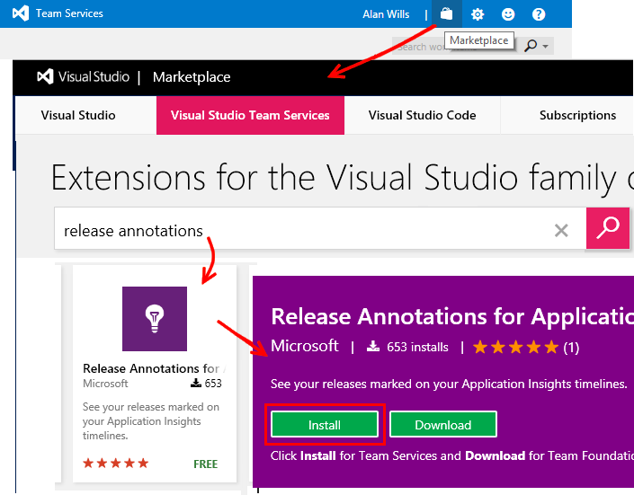

<properties
    pageTitle="Libere anotações para obtenção de informações de aplicativo | Microsoft Azure"
    description="Adicionar implantação ou criar marcadores para seus gráficos de explorer métricas no aplicativo ideias."
    services="application-insights"
    documentationCenter=".net"
    authors="alancameronwills"
    manager="douge"/>

<tags
    ms.service="application-insights"
    ms.workload="tbd"
    ms.tgt_pltfrm="ibiza"
    ms.devlang="na"
    ms.topic="article"
    ms.date="06/28/2016"
    ms.author="awills"/>

# Anotações de lançamento no aplicativo ideias

Solte as anotações no [Explorador de métricas](app-insights-metrics-explorer.md) gráficos mostram onde você implantado uma nova compilação. Eles facilitam ver se suas alterações tinham nenhum efeito sobre o desempenho do aplicativo. Eles podem ser criados automaticamente pelo [sistema de compilação do Visual Studio Team Services](https://www.visualstudio.com/en-us/get-started/build/build-your-app-vs)e você também pode [criá-los do PowerShell](#create-annotations-from-powershell).

Anotações de lançamento são um recurso da compilação baseado em nuvem e solte o serviço do Visual Studio Team Services. 

## Instalar a extensão de anotações (uma vez)

Para poder criar anotações de lançamento, você precisará instalar uma das muitas extensões de serviço da equipe disponíveis no Visual Studio Marketplace.

1. Entrar no seu projeto do [Visual Studio Team Services](https://www.visualstudio.com/en-us/get-started/setup/sign-up-for-visual-studio-online) .
2. No Visual Marketplace Studio, [Obtenha a extensão de anotações de lançamento](https://marketplace.visualstudio.com/items/ms-appinsights.appinsightsreleaseannotations)e adicioná-la à sua conta de serviços de equipe.

Você só precisa fazer isso vez para a sua conta de serviços de equipe do Visual Studio. Anotações de lançamento agora podem ser configuradas para qualquer projeto em sua conta. 

## Obter uma chave API de obtenção de informações de aplicativo

Você precisa fazer isso para cada modelo de versão que você deseja criar anotações de lançamento.

1. Entre no [Portal do Microsoft Azure](https://portal.azure.com) e abra o recurso de obtenção de informações de aplicativo que monitora seu aplicativo. (Ou [Crie um agora](app-insights-overview.md), se você ainda não tiver feito isso.)
2. Abra o **API Access**e faça uma cópia da **Id de aplicativo de obtenção de informações**.

    

2. Em uma janela separada do navegador, abrir (ou criar) o modelo de lançamento que gerencia as implantações de serviços de equipe do Visual Studio. 

    Adicionar uma tarefa e selecione a tarefa de anotação de lançamento do aplicativo ideias no menu.

    Cole a **Id do aplicativo** que você copiou de lâmina acesso API.

    

3. Defina o campo **APIKey** como uma variável `$(ApiKey)`.

4. Volte a lâmina de acesso API, criar uma nova chave de API e faça uma cópia dele.

    

4. Abra a guia de configuração do modelo de lançamento.

    Criar uma definição de variável para `ApiKey`.

    Cole sua chave de API para a definição de variável ApiKey.

    

5. Finalmente, **Salve** a definição de lançamento.

## Criar anotações do PowerShell

Você também pode criar anotações a partir de qualquer processo que você gostar (sem usar VS Team System). 

Obtenha o [script do Powershell do GitHub](https://github.com/Microsoft/ApplicationInsights-Home/blob/master/API/CreateReleaseAnnotation.ps1).

Use-o como esta:

    .\CreateReleaseAnnotation.ps1 `
      -applicationId "<applicationId>" `
      -apiKey "<apiKey>" `
      -releaseName "<myReleaseName>" `
      -releaseProperties @{
          "ReleaseDescription"="a description";
          "TriggerBy"="My Name" }

Obtenha o `applicationId` e um `apiKey` de seu recurso de obtenção de informações do aplicativo: Abrir configurações, acesso de API e copie a ID do aplicativo. Em seguida, clique em criar chave API e copie a chave. 

## Anotações de lançamento

Agora, sempre que você usa o modelo de lançamento para implantar uma nova versão, uma anotação será enviada para a obtenção de informações do aplicativo. As anotações aparecerão em gráficos no Explorador de métricas.

Clique em qualquer marcador de anotação para abrir detalhes sobre o lançamento, incluindo solicitador, ramificação de controle de origem, solte a definição, ambiente e muito mais.

