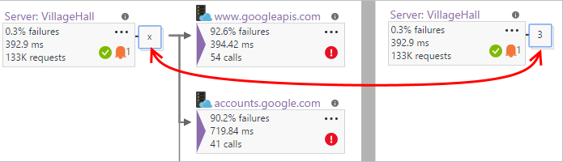

<properties 
    pageTitle="Mapa de aplicativo no aplicativo ideias | Microsoft Azure" 
    description="Uma apresentação visual das dependências entre componentes de aplicativo, rotuladas com KPIs e alertas." 
    services="application-insights" 
    documentationCenter=""
    authors="SoubhagyaDash" 
    manager="douge"/>

<tags 
    ms.service="application-insights" 
    ms.workload="tbd" 
    ms.tgt_pltfrm="ibiza" 
    ms.devlang="na" 
    ms.topic="article" 
    ms.date="06/15/2016" 
    ms.author="awills"/>
 
# Mapa de aplicativo na obtenção de informações de aplicativo

Em [Ideias de aplicativo do Visual Studio](app-insights-overview.md), o mapa de aplicativo é um layout visual as relações de dependência de seus componentes de aplicativo. Cada componente mostra KPIs como carga, desempenho, falhas e alertas, para ajudá-lo a descobrir qualquer componente causando uma falha ou um problema de desempenho. Você pode clicar em por meio de qualquer componente diagnóstico mais detalhadas, recebidos de obtenção de informações do aplicativo, e - se seu aplicativo usa o Azure services - diagnóstico do Azure, como as recomendações Supervisor de banco de dados do SQL.

Como outros gráficos, você pode fixar um mapa de aplicativo ao painel Azure, onde ele é totalmente funcional. 

## Abra o mapa de aplicativo

Abra o mapa da lâmina visão geral do aplicativo:

O mapa mostra:

* Testes de disponibilidade
* Componente do lado do cliente (monitorado com o SDK do JavaScript)
* Componente do lado do servidor
* Dependências dos componentes cliente e servidor

Você pode expandir e recolher os grupos do link de dependência:

 
Se você tiver um grande número de dependências de um tipo (SQL, HTTP etc.), eles podem aparecer agrupados. 

 
 
## Problemas especiais

Cada nó tem indicadores de desempenho relevantes, como as taxas de carga, desempenho e falha desse componente. 

Ícones de aviso realçam possíveis problemas. Um aviso de laranja significa que há falhas na solicitações, modos de exibição de página ou chamadas de dependência. Vermelho significa uma taxa de falha acima de 5%.

 
Ativo também alertas de slides para cima: 

 
Se você usar o SQL Azure, há um ícone que mostra quando há recomendações sobre como você pode melhorar o desempenho. 

Clique em qualquer ícone para obter mais detalhes:

 
 
## Clique em diagnóstico

Cada um de nós no mapa oferece alvo cliques para diagnósticos. As opções variam dependendo do tipo do nó.

 
Para componentes que são hospedados no Azure, as opções incluem links diretos a elas.

## Intervalo de tempo e filtros

Por padrão, o mapa resume todos os dados disponíveis para o intervalo de tempo escolhido. Mas você pode filtrá-lo para incluir apenas os nomes de operação específica ou dependências.

* Nome da operação: Isso inclui modos de exibição de página e tipos de solicitação de lado do servidor. Com essa opção, o mapa mostra o KPI no nó do lado cliente do servidor para as operações selecionadas somente. Mostra as dependências chamadas no contexto dessas operações específicas.
* Nome de base de dependência: inclui o AJAX navegador lado dependências e servidor lado. Se você relatar telemetria dependência personalizada com a API TrackDependency, eles também mostrará aqui. Você pode selecionar as dependências para mostrar no mapa. Observe que no momento, isso não filtre solicitações de lado do servidor ou os modos de exibição de página de lado do cliente.

 
 
## Salvar filtros

Para salvar os filtros que você aplicou, fixe o modo de exibição filtrado em um [painel](app-insights-dashboards.md).

 

## Comentários

Por favor [fornecer comentários por meio da opção de portal comentários](app-insights-get-dev-support.md).

