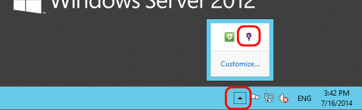

<properties 
    pageTitle="Dependência de rastreamento de obtenção de informações de aplicativo" 
    description="Analise uso, disponibilidade e desempenho de seu local ou um aplicativo web do Microsoft Azure com ideias de aplicativo." 
    services="application-insights" 
    documentationCenter=".net"
    authors="alancameronwills" 
    manager="douge"/>

<tags 
    ms.service="application-insights" 
    ms.workload="tbd" 
    ms.tgt_pltfrm="ibiza" 
    ms.devlang="na" 
    ms.topic="article" 
    ms.date="10/24/2016" 
    ms.author="awills"/>


# <a name="set-up-application-insights-dependency-tracking"></a>Configurar o aplicativo ideias: controle de dependência


[AZURE.INCLUDE [app-insights-selector-get-started-dotnet](../../includes/app-insights-selector-get-started-dotnet.md)]


Uma *dependência* é um componente externo que é chamado pelo seu aplicativo. Normalmente é um serviço chamado usando HTTP, ou um banco de dados ou um sistema de arquivos. Obtenção de informações de aplicativo de Studio Visual, você pode facilmente ver quanto tempo o aplicativo aguarda dependências e quantas vezes uma chamada de dependência falha.


O monitor de dependência de-de-prontos atualmente relatórios chamadas para esses tipos de dependências:

* ASP.NET
 * Bancos de dados SQL
 * Da web do ASP.NET e serviços WCF que usam ligações baseado em HTTP
 * Chamadas HTTP locais ou remotas
 * Azure DocumentDb, tabela, armazenamento de blob e fila
* Java
 * Chamadas para um banco de dados por meio de um driver [JDBC](http://docs.oracle.com/javase/7/docs/technotes/guides/jdbc/) , como MySQL, SQL Server, PostgreSQL ou SQLite.
* JavaScript em páginas da web - a [página da web SDK](app-insights-javascript.md) efetua automaticamente chamadas Ajax como dependências.

Você pode escrever seus próprio chamadas SDK para monitorar outras dependências usando a [API TrackDependency](app-insights-api-custom-events-metrics.md#track-dependency).


## <a name="to-set-up-dependency-monitoring"></a>Configurar o monitoramento de dependência

Você precisa de uma assinatura do [Microsoft Azure](http://azure.com) .

### <a name="if-your-app-runs-on-your-iis-server"></a>Se seu aplicativo é executado no servidor IIS

Se seu aplicativo web é executado no .NET 4.6 ou posterior, você pode ambos [instalar o SDK de obtenção de informações do aplicativo](app-insights-asp-net.md) em seu aplicativo, ou instalar o Monitor de Status de obtenção de informações do aplicativo. Você não precisa ambos.

Caso contrário, instale o Monitor de Status de ideias de aplicativo no servidor:

1. Em seu servidor de web IIS, faça logon com credenciais de administrador.
2. Baixe e execute o [instalador do Monitor de Status](http://go.microsoft.com/fwlink/?LinkId=506648).
4. No Assistente de instalação, entrar no Microsoft Azure.

    

    *Erros de Conexão? Consulte [solução de problemas](#troubleshooting).*

5. Escolha o aplicativo web instalados ou o site que você deseja monitorar e depois configurar o recurso na qual você deseja ver os resultados no portal de obtenção de informações do aplicativo.

    

    Normalmente, você optar por configurar um novo recurso e o [grupo de recursos][roles].

    Caso contrário, use um recurso existente se você já configurou [web testa] [ availability] para seu site ou [monitoramento de clientes do web][client].

6. Reinicie o IIS.

    

    Seu serviço da web será interrompido por um período curto.

6. Observe que ApplicationInsights.config foi inserido em aplicativos da web que você deseja monitorar.

    

   Também existem algumas alterações para Web. config.

#### <a name="want-to-reconfigure-later"></a>Deseja (re) configurar mais tarde?

Depois de concluir o assistente, você pode configurar novamente o agente sempre que desejar. Você também pode usar esta opção se você tiver instalado o agente, mas houve alguns problemas com a configuração inicial.




### <a name="if-your-app-runs-as-an-azure-web-app"></a>Se seu aplicativo é executado como um aplicativo Web do Azure

No painel de controle do seu aplicativo Web do Azure, adicione a extensão de obtenção de informações do aplicativo.


### <a name="if-its-an-azure-cloud-services-project"></a>Se for um projeto de serviços de nuvem do Azure

[Adicionar scripts às funções de trabalho e da web](app-insights-cloudservices.md#dependencies). Ou [instalar .NET framework 4.6 ou posterior](../cloud-services/cloud-services-dotnet-install-dotnet.md).

## <a name="diagnosis"></a>Diagnosticar problemas de desempenho de dependência

Para avaliar o desempenho de solicitações no seu servidor, abra a lâmina de desempenho e role para baixo para examinar a grade de solicitações:


Aquele superior está demorando muito. Vamos ver se podemos pode descobrir onde o tempo gasto.

Clique em linha para ver os eventos de solicitação individuais:


Clique em qualquer instância de execução longa para inspecioná-lo ainda mais.

Role para baixo até as chamadas de dependência remoto relacionadas a essa solicitação:


Ele se parece com a maioria da essa solicitação gasto em uma chamada para um serviço local de manutenção de tempo. 


Selecione a linha para obter mais informações:


Os detalhes incluem informações suficientes para diagnosticar o problema.


Em um caso diferente, nenhuma chamada de dependência é longa, mas alternando para o modo de exibição de linha do tempo, podemos ver onde o atraso ocorreu no nosso processamento interno:


## <a name="failures"></a>Falhas

Se houver solicitações com falha, clique no gráfico.


Clique em um tipo de solicitação e a instância de solicitação, para encontrar uma falha de chamada para uma dependência remota.


## <a name="custom-dependency-tracking"></a>Dependência personalizada de rastreamento

O módulo de acompanhamento de dependência padrão detecta automaticamente dependências externas como bancos de dados e APIs REST. Mas, você pode querer alguns componentes adicionais sejam tratadas da mesma maneira. 

Você pode escrever código que envia informações de dependência, usando a mesma [API TrackDependency](app-insights-api-custom-events-metrics.md#track-dependency) que é usada pelos módulos padrão.

Por exemplo, se você criar seu código com um assembly que você não tenha escrito por conta própria, você poderia tempo todas as chamadas a ele, para descobrir quais contribuição faz sua tempos de resposta. Para fazer estes dados exibidos nos gráficos de dependência no aplicativo ideias, envie-o usando `TrackDependency`.

```C#

            var startTime = DateTime.UtcNow;
            var timer = System.Diagnostics.Stopwatch.StartNew();
            try
            {
                success = dependency.Call();
            }
            finally
            {
                timer.Stop();
                telemetry.TrackDependency("myDependency", "myCall", startTime, timer.Elapsed, success);
            }
```

Se desejar desativar o módulo de acompanhamento de dependência padrão, remova a referência à DependencyTrackingTelemetryModule em [ApplicationInsights.config](app-insights-configuration-with-applicationinsights-config.md).

## <a name="troubleshooting"></a>Solução de problemas

*Sucesso de dependência sempre sinalizador mostra true ou false.*

* Atualizar para a versão mais recente do SDK. Se sua versão de .NET for menor que 4.6, instale o [monitor de Status](app-insights-monitor-performance-live-website-now.md).

## <a name="next-steps"></a>Próximas etapas

- [Exceções](app-insights-asp-net-exceptions.md)
- [Dados de usuário & página][client]
- [Disponibilidade](app-insights-monitor-web-app-availability.md)


<!--Link references-->

[api]: app-insights-api-custom-events-metrics.md
[apikey]: app-insights-api-custom-events-metrics.md#ikey
[availability]: app-insights-monitor-web-app-availability.md
[azure]: ../insights-perf-analytics.md
[client]: app-insights-javascript.md
[diagnostic]: app-insights-diagnostic-search.md
[metrics]: app-insights-metrics-explorer.md
[netlogs]: app-insights-asp-net-trace-logs.md
[portal]: http://portal.azure.com/
[qna]: app-insights-troubleshoot-faq.md
[redfield]: app-insights-asp-net-dependencies.md
[roles]: app-insights-resources-roles-access-control.md

 
