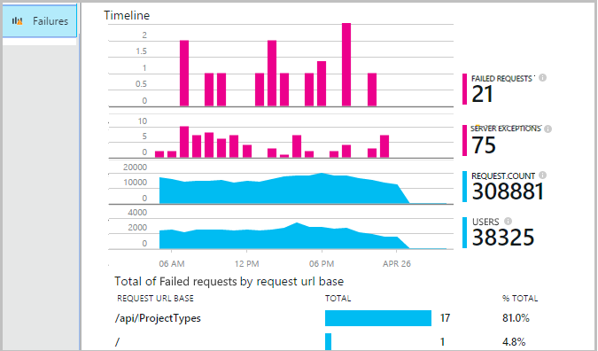
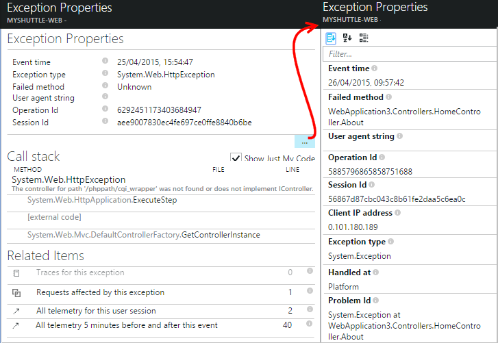
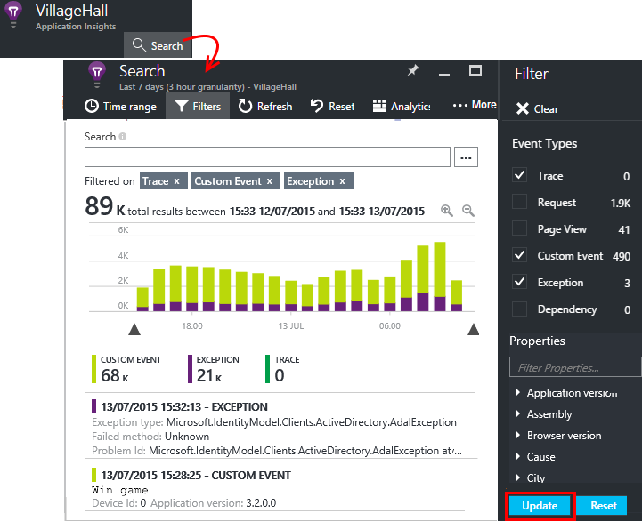

<properties 
    pageTitle="Diagnosticar falhas e exceções em aplicativos do ASP.NET com ideias de aplicativo" 
    description="Capture exceções de aplicativos do ASP.NET juntamente com Telemetria da solicitação." 
    services="application-insights" 
    documentationCenter=".net"
    authors="alancameronwills" 
    manager="douge"/>

<tags 
    ms.service="application-insights" 
    ms.workload="tbd" 
    ms.tgt_pltfrm="ibiza" 
    ms.devlang="na" 
    ms.topic="article" 
    ms.date="10/27/2016" 
    ms.author="awills"/>


# <a name="set-up-application-insights-diagnose-exceptions"></a>Configurar o aplicativo ideias: diagnosticar exceções

[AZURE.INCLUDE [app-insights-selector-get-started-dotnet](../../includes/app-insights-selector-get-started-dotnet.md)]


Monitorando seu aplicativo com [Ideias de aplicativo do Visual Studio][start], você pode correlação solicitações com falha com exceções e outros eventos no cliente e servidor, para que você pode diagnosticar rapidamente as causas.

Para monitorar um aplicativo do ASP.NET, você precisa [Adicionar Application ideias SDK] [ greenbrown] em seu aplicativo, ou [instalar o Monitor de Status no servidor IIS][redfield], ou, se seu aplicativo for um aplicativo Web do Azure, adicione a [Extensão de obtenção de informações do aplicativo](app-insights-azure-web-apps.md).

## <a name="diagnosing-exceptions-using-visual-studio"></a>Diagnosticar exceções usando o Visual Studio

Abra a solução de aplicativo no Visual Studio para ajudá-lo com depuração.

Execute o aplicativo, em seu servidor ou em sua máquina de desenvolvimento usando F5.

Abra a janela pesquisa de ideias de aplicativo no Visual Studio e defini-lo para exibir eventos de seu aplicativo. Durante a depuração, você pode fazer isso apenas clicando no botão de obtenção de informações do aplicativo.


Observe que você pode filtrar o relatório para mostrar apenas exceções. 

*Sem exceções mostrando? Consulte [capturar exceções](#exceptions).*

Clique em um relatório de exceções para mostrar o rastreamento de pilha.


Clique em uma referência de linha no rastreamento da pilha, para abrir o arquivo relevante.  

## <a name="diagnosing-failures-using-the-azure-portal"></a>Diagnosticar falhas usando o portal do Azure

Da visão geral de obtenção de informações de aplicativo do aplicativo, o bloco de falhas mostra gráficos de exceções e falha solicitações HTTP, juntamente com uma lista de solicitação de URLs que causa falhas de mais frequentes.



Clique em um dos tipos de solicitação falha na lista para chegar ao ocorrências individuais da falha. A partir daí, clique para as exceções ou quaisquer dados de rastreamento associados a ela:


**Como alternativa,** você pode iniciar na lista de exceções que que você encontrará mais abaixo a lâmina de falhas. Manter clicando em até você finalmente chegar às exceções individuais.


*Sem exceções mostrando? Consulte [capturar exceções](#exceptions).*

A partir daí, você pode examinar o rastreamento de pilha e propriedades detalhadas de cada exceção e localizar rastreamento de log relacionados ou outros eventos.




[Saiba mais sobre o diagnóstico de pesquisa][diagnostic].


## <a name="dependency-failures"></a>Falhas de dependência

Uma *dependência* é um serviço que seu aplicativo chama, normalmente por meio de uma conexão de banco de dados ou API REST. [Monitor de Status de obtenção de informações do aplicativo] [ redfield] monitora automaticamente uma variedade de tipos de chamada de dependência, medir a duração da chamada e sucesso ou falha. 

Para obter dados de dependência, você precisa [instalar o Monitor de Status] [ redfield] no servidor IIS, ou se seu aplicativo for um aplicativo Web do Azure, use a [Extensão de obtenção de informações do aplicativo](app-insights-azure-web-apps.md). 

Falhas de chamadas dependências são listadas na lâmina falhas, e você também pode encontrá-los em itens relacionados a detalhes da solicitação e os detalhes de exceção.

*Sem falhas de dependência? Isso é bom. Mas, para confirmar que você está obtendo dados de dependência, abra a lâmina de desempenho e examine o gráfico de dependência duração.*

 

## <a name="custom-tracing-and-log-data"></a>Rastreamento personalizadas e dados de log

Para obter dados de diagnóstico específico para o seu aplicativo, você pode inserir código para enviar seus próprios dados de telemetria. Isso exibidas na pesquisa diagnóstico junto com a solicitação, modo de exibição de página e outros dados coletados automaticamente. 

Você tem várias opções:

* [TrackEvent()](app-insights-api-custom-events-metrics.md#track-event) normalmente é usado para monitoramento padrões de uso, mas os dados que ele envia também aparecem em eventos personalizados na pesquisa de diagnóstico. Eventos são nomeados e podem conter propriedades de cadeia de caracteres e métricas numéricas no qual você pode [filtrar as pesquisas diagnósticos][diagnostic].
* [TrackTrace()](app-insights-api-custom-events-metrics.md#track-trace) permite que você enviar mais dados como informações de POSTAGEM.
* [TrackException()](#exceptions) envia rastreamentos de pilha. [Saiba mais sobre exceções](#exceptions).
* Se você já usar uma estrutura de log como Log4Net ou NLog, você pode [capturar esses logs] [ netlogs] e vê-los na pesquisa diagnóstico junto com os dados de solicitação e exceção.

Para ver esses eventos, abrir [pesquisa][diagnostic]abrir filtro e escolha exceção, rastreamento ou evento personalizado.





> [AZURE.NOTE] Se seu aplicativo gera muitas telemetria, o módulo de amostragem adaptativa reduzir automaticamente o volume que é enviado para o portal enviando apenas uma fração representante de eventos. Eventos que fazem parte da mesma operação vai ser selecionados ou desmarcados como um grupo, para que você possa navegar entre eventos relacionados. [Saiba mais sobre amostragem.](app-insights-sampling.md)

### <a name="how-to-see-request-post-data"></a>Como ver os dados de POSTAGEM de solicitação

Detalhes da solicitação não incluam os dados enviados para seu aplicativo em uma chamada de POSTAGEM. Tenha estes dados relatado:

* [Instalar o SDK] [ greenbrown] em seu projeto de aplicativo.
* Inserir código em seu aplicativo para chamar [Microsoft.ApplicationInsights.TrackTrace()][api]. Envie os dados de POSTAGEM no parâmetro da mensagem. Há um limite para o tamanho permitido, portanto você deve tentar enviar apenas os dados essenciais.
* Quando você investigar uma solicitação com falha, encontre os rastreamentos associados.  


## <a name="exceptions"></a>Capturar exceções e dados relacionados de diagnósticos

Primeiro, você não verá no portal de todas as exceções que causam falhas em seu aplicativo. Você verá as exceções do navegador (se você estiver usando o [SDK do JavaScript] [ client] nas páginas da web). Mas a maioria das exceções de servidor são detectados pelo IIS e você precisa escrever um pouco de código para vê-los.

É possível:

* **Registrar exceções explicitamente** , inserindo código em manipuladores de exceção para relatar as exceções.
* **Capturar exceções automaticamente** configurando sua estrutura ASP.NET. As inclusões necessárias são diferentes para diferentes tipos de framework.

## <a name="reporting-exceptions-explicitly"></a>Relatar exceções explicitamente

A maneira mais simples é inserir uma chamada para TrackException() em um manipulador de exceção.

JavaScript

    try 
    { ...
    }
    catch (ex)
    {
      appInsights.trackException(ex, "handler loc",
        {Game: currentGame.Name, 
         State: currentGame.State.ToString()});
    }

C#

    var telemetry = new TelemetryClient();
    ...
    try 
    { ...
    }
    catch (Exception ex)
    {
       // Set up some properties:
       var properties = new Dictionary <string, string> 
         {{"Game", currentGame.Name}};

       var measurements = new Dictionary <string, double>
         {{"Users", currentGame.Users.Count}};

       // Send the exception telemetry:
       telemetry.TrackException(ex, properties, measurements);
    }

VB

    Dim telemetry = New TelemetryClient
    ...
    Try
      ...
    Catch ex as Exception
      ' Set up some properties:
      Dim properties = New Dictionary (Of String, String)
      properties.Add("Game", currentGame.Name)

      Dim measurements = New Dictionary (Of String, Double)
      measurements.Add("Users", currentGame.Users.Count)
  
      ' Send the exception telemetry:
      telemetry.TrackException(ex, properties, measurements)
    End Try

Os parâmetros de propriedades e as medidas são opcionais, mas são úteis para [filtragem e adicionando] [ diagnostic] informações adicionais. Por exemplo, se você tiver um aplicativo que pode executar diversos jogos, você pode encontrar todos os relatórios de exceção relacionados a um determinado jogo. Você pode adicionar quantos itens você gostaria de cada dicionário.

## <a name="browser-exceptions"></a>Exceções do navegador

A maioria das exceções de navegador são relatados.

Se sua página da web inclui arquivos de script de redes de fornecimento de conteúdo ou outros domínios, verifique a sua marca de script possui o atributo ```crossorigin="anonymous"```, e que o servidor envia [cabeçalhos CORS](http://enable-cors.org/). Isso permitirá que você obter um rastreamento de pilha e detalhes para exceções não tratadas de JavaScript desses recursos.

## <a name="web-forms"></a>Formulários da Web

Para formulários da web, o módulo HTTP poderão colete as exceções quando não há nenhuma redirecionamentos configurados com CustomErrors.

Mas se você tiver redirecionamentos ativos, adicione as seguintes linhas para a função Application_Error em Global.asax.cs. (Adicionar um arquivo asax se ainda não tiver uma).

*C#*

    void Application_Error(object sender, EventArgs e)
    {
      if (HttpContext.Current.IsCustomErrorEnabled && Server.GetLastError  () != null)
      {
         var ai = new TelemetryClient(); // or re-use an existing instance

         ai.TrackException(Server.GetLastError());
      }
    }


## <a name="mvc"></a>MVC

Se a configuração de [CustomErrors](https://msdn.microsoft.com/library/h0hfz6fc.aspx) for `Off`, e em seguida, exceções estarão disponíveis para o [Módulo HTTP](https://msdn.microsoft.com/library/ms178468.aspx) coletar. No entanto, se for `RemoteOnly` (padrão), ou `On`, e em seguida, a exceção será desmarcada e não está disponível para obtenção de informações de aplicativo coletar automaticamente. Você pode corrigir que substituindo a [classe de System.Web.Mvc.HandleErrorAttribute](http://msdn.microsoft.com/library/system.web.mvc.handleerrorattribute.aspx)e, em seguida, aplicando a classe substituída conforme mostrado para as diferentes versões MVC abaixo ([github fonte](https://github.com/AppInsightsSamples/Mvc2UnhandledExceptions/blob/master/MVC2App/Controllers/AiHandleErrorAttribute.cs)):

    using System;
    using System.Web.Mvc;
    using Microsoft.ApplicationInsights;

    namespace MVC2App.Controllers
    {
      [AttributeUsage(AttributeTargets.Class | AttributeTargets.Method, Inherited = true, AllowMultiple = true)] 
      public class AiHandleErrorAttribute : HandleErrorAttribute
      {
        public override void OnException(ExceptionContext filterContext)
        {
            if (filterContext != null && filterContext.HttpContext != null && filterContext.Exception != null)
            {
                //If customError is Off, then AI HTTPModule will report the exception
                if (filterContext.HttpContext.IsCustomErrorEnabled)
                {   //or reuse instance (recommended!). see note above  
                    var ai = new TelemetryClient();
                    ai.TrackException(filterContext.Exception);
                } 
            }
            base.OnException(filterContext);
        }
      }
    }

#### <a name="mvc-2"></a>MVC 2

Substitua o atributo HandleError com seu novo atributo em seus controladores.

    namespace MVC2App.Controllers
    {
       [AiHandleError]
       public class HomeController : Controller
       {
    ...

[Exemplo](https://github.com/AppInsightsSamples/Mvc2UnhandledExceptions)

#### <a name="mvc-3"></a>MVC 3

Registrar `AiHandleErrorAttribute` como um filtro global em Global.asax.cs:

    public class MyMvcApplication : System.Web.HttpApplication
    {
      public static void RegisterGlobalFilters(GlobalFilterCollection filters)
      {
         filters.Add(new AiHandleErrorAttribute());
      }
     ...

[Exemplo](https://github.com/AppInsightsSamples/Mvc3UnhandledExceptionTelemetry)


#### <a name="mvc-4-mvc5"></a>MVC 4, MVC5

Registre AiHandleErrorAttribute como um filtro global no FilterConfig.cs:

    public class FilterConfig
    {
      public static void RegisterGlobalFilters(GlobalFilterCollection filters)
      {
        // Default replaced with the override to track unhandled exceptions
        filters.Add(new AiHandleErrorAttribute());
      }
    }

[Exemplo](https://github.com/AppInsightsSamples/Mvc5UnhandledExceptionTelemetry)

## <a name="web-api-1x"></a>API de Web 1. x


Substitua System.Web.Http.Filters.ExceptionFilterAttribute:

    using System.Web.Http.Filters;
    using Microsoft.ApplicationInsights;

    namespace WebAPI.App_Start
    {
      public class AiExceptionFilterAttribute : ExceptionFilterAttribute
      {
        public override void OnException(HttpActionExecutedContext actionExecutedContext)
        {
            if (actionExecutedContext != null && actionExecutedContext.Exception != null)
            {  //or reuse instance (recommended!). see note above 
                var ai = new TelemetryClient();
                ai.TrackException(actionExecutedContext.Exception);    
            }
            base.OnException(actionExecutedContext);
        }
      }
    }

Você pode adicionar esse atributo substituído para controladores específico ou adicioná-lo para a configuração de filtro global na classe WebApiConfig: 

    using System.Web.Http;
    using WebApi1.x.App_Start;

    namespace WebApi1.x
    {
      public static class WebApiConfig
      {
        public static void Register(HttpConfiguration config)
        {
            config.Routes.MapHttpRoute(name: "DefaultApi", routeTemplate: "api/{controller}/{id}",
                defaults: new { id = RouteParameter.Optional });
            ...
            config.EnableSystemDiagnosticsTracing();

            // Capture exceptions for Application Insights:
            config.Filters.Add(new AiExceptionFilterAttribute());
        }
      }
    }

[Exemplo](https://github.com/AppInsightsSamples/WebApi_1.x_UnhandledExceptions)

Há um número de ocorrências que não é possível manipular os filtros de exceção. Por exemplo:

* Exceções geradas por construtores de controlador. 
* Exceções geradas por manipuladores de mensagens. 
* Exceções geradas durante o roteamento. 
* Exceções geradas durante serialização de conteúdo de resposta. 

## <a name="web-api-2x"></a>API de Web 2. x

Adicione uma implementação de IExceptionLogger:

    using System.Web.Http.ExceptionHandling;
    using Microsoft.ApplicationInsights;

    namespace ProductsAppPureWebAPI.App_Start
    {
      public class AiExceptionLogger : ExceptionLogger
      {
        public override void Log(ExceptionLoggerContext context)
        {
            if (context !=null && context.Exception != null)
            {//or reuse instance (recommended!). see note above 
                var ai = new TelemetryClient();
                ai.TrackException(context.Exception);
            }
            base.Log(context);
        }
      }
    }

Adicione isto aos serviços em WebApiConfig:

    using System.Web.Http;
    using System.Web.Http.ExceptionHandling;
    using ProductsAppPureWebAPI.App_Start;

    namespace WebApi2WithMVC
    {
      public static class WebApiConfig
      {
        public static void Register(HttpConfiguration config)
        {
            // Web API configuration and services

            // Web API routes
            config.MapHttpAttributeRoutes();

            config.Routes.MapHttpRoute(
                name: "DefaultApi",
                routeTemplate: "api/{controller}/{id}",
                defaults: new { id = RouteParameter.Optional }
            );
            config.Services.Add(typeof(IExceptionLogger), new AiExceptionLogger()); 
        }
      }
  }

[Exemplo](https://github.com/AppInsightsSamples/WebApi_2.x_UnhandledExceptions)

Como alternativas, você pode:

2. Substitua o ExceptionHandler apenas uma implementação personalizada de IExceptionHandler. Isso é chamado somente quando o framework é ainda podem escolher qual mensagem de resposta para enviar (não quando a conexão for anulada por exemplo) 
3. Filtros de exceção (conforme descrito na seção controladores de 1. x API Web acima) - não chamados em todos os casos.


## <a name="wcf"></a>WCF

Adicione uma classe que estende o atributo e implementa IErrorHandler e IServiceBehavior.

    using System;
    using System.Collections.Generic;
    using System.Linq;
    using System.ServiceModel.Description;
    using System.ServiceModel.Dispatcher;
    using System.Web;
    using Microsoft.ApplicationInsights;

    namespace WcfService4.ErrorHandling
    {
      public class AiLogExceptionAttribute : Attribute, IErrorHandler, IServiceBehavior
      {
        public void AddBindingParameters(ServiceDescription serviceDescription,
            System.ServiceModel.ServiceHostBase serviceHostBase,
            System.Collections.ObjectModel.Collection<ServiceEndpoint> endpoints,
            System.ServiceModel.Channels.BindingParameterCollection bindingParameters)
        {
        }

        public void ApplyDispatchBehavior(ServiceDescription serviceDescription, 
            System.ServiceModel.ServiceHostBase serviceHostBase)
        {
            foreach (ChannelDispatcher disp in serviceHostBase.ChannelDispatchers)
            {
                disp.ErrorHandlers.Add(this);
            }
        }

        public void Validate(ServiceDescription serviceDescription, 
            System.ServiceModel.ServiceHostBase serviceHostBase)
        {
        }

        bool IErrorHandler.HandleError(Exception error)
        {//or reuse instance (recommended!). see note above 
            var ai = new TelemetryClient();

            ai.TrackException(error);
            return false;
        }

        void IErrorHandler.ProvideFault(Exception error, 
            System.ServiceModel.Channels.MessageVersion version, 
            ref System.ServiceModel.Channels.Message fault)
        {
        }
      }
    }

Adicione o atributo para as implementações de serviço:

    namespace WcfService4
    {
        [AiLogException]
        public class Service1 : IService1 
        { 
         ...

[Exemplo](https://github.com/AppInsightsSamples/WCFUnhandledExceptions)

## <a name="exception-performance-counters"></a>Contadores de desempenho de exceção

Se você tiver [instalado o Monitor de Status] [ redfield] no seu servidor, você pode obter um gráfico da taxa de exceções, medido pelo .NET. Isso inclui exceções de .NET manipuladas e não tratadas.

Abrir um blade métrica Explorer, adicionar um novo gráfico e selecione a **taxa de exceção**, listado em contadores de desempenho. 

O .NET framework calcula a taxa, contando o número de exceções em um intervalo e dividindo pelo comprimento do intervalo. 

Observe que será diferente da contagem 'Exceções' calculada pelo portal de obtenção de informações do aplicativo, contando TrackException relatórios. Os intervalos de amostragem são diferentes e o SDK não envia relatórios de TrackException para todos tratados e exceções não tratadas.

<!--Link references-->

[api]: app-insights-api-custom-events-metrics.md
[client]: app-insights-javascript.md
[diagnostic]: app-insights-diagnostic-search.md
[greenbrown]: app-insights-asp-net.md
[netlogs]: app-insights-asp-net-trace-logs.md
[redfield]: app-insights-monitor-performance-live-website-now.md
[start]: app-insights-overview.md

 
