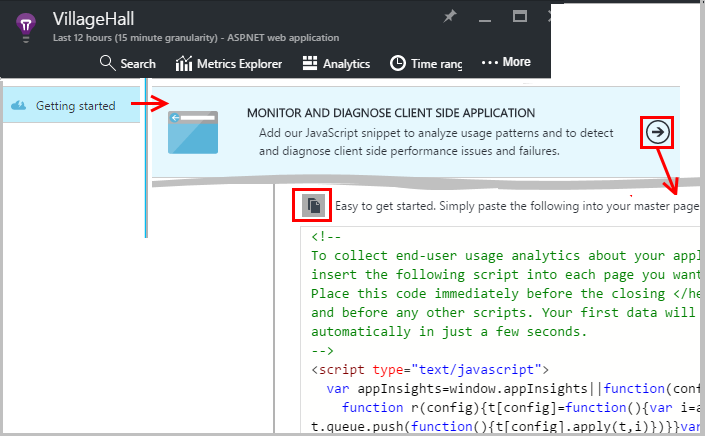
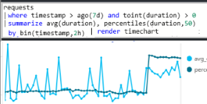

<properties 
    pageTitle="Aproveitar ao máximo a obtenção de informações de aplicativo | Microsoft Azure" 
    description="Após começando a usar o aplicativo ideias, aqui está um resumo dos recursos que você pode explorar." 
    services="application-insights" 
    documentationCenter=".net"
    authors="alancameronwills" 
    manager="douge"/>

<tags 
    ms.service="application-insights" 
    ms.workload="tbd" 
    ms.tgt_pltfrm="ibiza" 
    ms.devlang="na" 
    ms.topic="article" 
    ms.date="10/27/2016" 
    ms.author="awills"/>

# <a name="more-telemetry-from-application-insights"></a>Telemetria mais de obtenção de informações de aplicativo

Depois de ter [adicionado a obtenção de informações de aplicativo para seu código ASP.NET](app-insights-asp-net.md), existem algumas coisas que você pode fazer para obter telemetria ainda mais. 

## <a name="if-your-app-runs-on-your-iis-server-"></a>Se seu aplicativo é executado no servidor IIS...

Se seu aplicativo estiver hospedado em servidores IIS em seu controle, instale o Monitor de Status de obtenção de informações do aplicativo nos servidores. Se ele já estiver instalado, você não precisa fazer mais nada.

1. Em cada servidor de web IIS, entre com credenciais de administrador.
2. Baixe e execute o [instalador do Monitor de Status](http://go.microsoft.com/fwlink/?LinkId=506648).
3. No Assistente de instalação, entrar no Microsoft Azure.

Você não precisa fazer mais nada, mas você pode confirmar que o monitoramento está habilitada para seu aplicativo.


(Você também pode usar o Monitor de Status para [Habilitar o monitoramento em tempo de execução](app-insights-monitor-performance-live-website-now.md), mesmo se você não instrumentar seus aplicativos no Visual Studio.)

### <a name="what-do-you-get"></a>O que você faz?

Se o Monitor de Status é instalado em seus computadores do servidor, você obterá alguns telemetria adicional:

* Telemetria de dependência (chamadas SQL e chamadas REST feitas pelo seu aplicativo) para os aplicativos de 4,5 .NET. (Para versões posteriores do .NET, Monitor de Status não é necessário para telemetria dependência.) 
* Rastreamentos de pilha de exceção mostram mais detalhes.
* Contadores de desempenho. No aplicativo ideias, esses contadores aparecem na lâmina servidores. 


Para ver mais ou menos contadores, [Edite os gráficos](app-insights-metrics-explorer.md). Se o contador de desempenho desejado não estiver no conjunto de disponível, você pode [adicioná-lo ao conjunto coletado pelo módulo de contador de desempenho](app-insights-performance-counters.md).

## <a name="if-its-an-azure-web-app-"></a>Se for um aplicativo web Azure...

Se seu aplicativo é executado como um aplicativo web Azure, vá para o painel de controle do Azure para o aplicativo ou máquina virtual e abra a lâmina de obtenção de informações do aplicativo. 

### <a name="what-do-you-get"></a>O que você faz?

* Rastreamentos de pilha de exceção mostram mais detalhes.
* Telemetria de dependência (chamadas SQL e chamadas REST feitas pelo seu aplicativo) para os aplicativos de 4,5 .NET. (Para versões posteriores do .NET, a extensão não é necessária para telemetria dependência.) 


(Você também pode usar esse método para [Habilitar o monitoramento em tempo de execução de desempenho](app-insights-monitor-performance-live-website-now.md), mesmo se você não instrumentar seu aplicativo no Visual Studio.)

## <a name="client-side-monitoring"></a>Monitoramento do lado do cliente

Você instalou o SDK que envia dados de telemetria do servidor (back-end) do seu aplicativo. Agora você pode adicionar monitoramento do lado do cliente. Isso fornece os dados em usuários, sessões, modos de exibição de página e qualquer exceções ou falhas que ocorrem no navegador. Você também poderá escrever seu próprio código para controlar como os usuários trabalham com seu aplicativo, à direita para baixo até o nível detalhado de cliques e pressionamentos de teclas.

Adicione o trecho de código JavaScript de obtenção de informações do aplicativo a cada página da web, obtenha telemetria de navegadores de cliente.

1. No Azure, abra o recurso de obtenção de informações do aplicativo para o aplicativo.
2. Abra a guia de Introdução, Monitor do lado do cliente e copie o trecho.
3. Colá-lo para que ele apareça no topo de cada página da web - normalmente que você pode fazer isso, colando na página de layout mestre.



Observe que o código contém a chave de instrumentação que identifica o recurso de aplicativo.

### <a name="what-do-you-get"></a>O que você faz?

* Você pode escrever JavaScript para enviar [telemetria personalizada de suas páginas da web](app-insights-api-custom-events-metrics.md), por exemplo, para controlar cliques do botão.
* Em [análise](app-insights-analytics.md), dados em `pageViews` e dados de AJAX em `dependencies`. 
* [Dados de uso e desempenho do cliente](app-insights-javascript.md) na lâmina navegadores.


[Saiba mais sobre o controle de página da web.](app-insights-web-track-usage.md)


## <a name="track-application-version"></a>Versão do aplicativo de controle

Verifique se `buildinfo.config` é gerada pelo seu processo MSBuild. No seu arquivo. csproj, adicione:  

```XML

    <PropertyGroup>
      <GenerateBuildInfoConfigFile>true</GenerateBuildInfoConfigFile>    <IncludeServerNameInBuildInfo>true</IncludeServerNameInBuildInfo>
    </PropertyGroup> 
```

Quando tiver as informações de compilação, módulo ideias de aplicativo web adiciona automaticamente **versão do aplicativo** como uma propriedade para cada item de telemetria. Permite a você filtrar por versão quando executando [pesquisas de diagnósticos](app-insights-diagnostic-search.md) ou [Explorando métricas](app-insights-metrics-explorer.md). 

No entanto, observe que o número de versão de compilação é gerado apenas por MS Build, não pela compilação de desenvolvedor no Visual Studio.


## <a name="availability-web-tests"></a>Testes de web de disponibilidade

Envie seu aplicativo web solicitações HTTP em intervalos regulares de todo o mundo. Podemos alerta se a resposta estiver lenta ou não confiável.

No recurso de obtenção de informações do aplicativo para o aplicativo, clique no bloco de disponibilidade para adicionar, editar e exibir testes da web.

Você pode adicionar vários testes executando em vários locais.


[Saiba Mais](app-insights-monitor-web-app-availability.md)

## <a name="custom-telemetry-and-logging"></a>Registro em log e telemetria personalizada

Os pacotes de obtenção de informações do aplicativo que você adicionou ao seu código fornecem uma API que você pode chamar a partir de seu aplicativo.

* [Gerar suas próprias métricas e eventos](app-insights-api-custom-events-metrics.md), por exemplo, para contar eventos de negócios ou monitorar o desempenho.
* [Rastreamentos de log de captura](app-insights-asp-net-trace-logs.md) Log4Net, NLog ou System.Diagnostics.Trace.
* [Filtro, modificar, ou aumentar](app-insights-api-filtering-sampling.md) a telemetria padrão enviada de seu aplicativo escrevendo processadores de telemetria. 


## <a name="powerful-analysis-and-presentation"></a>Apresentação e análise avançada

Há várias maneiras de explorar dados. Se você recentemente iniciou com ideias de aplicativo, consulte estes artigos:

||
|---|---
|[**Pesquisa de diagnóstico para dados da instância**](app-insights-visual-studio.md)<br/>Eventos de pesquisa e filtro como solicitações, exceções, chamadas de dependência, rastreamentos de log e modos de exibição de página. No Visual Studio, vá para o código de rastreamentos de pilha.|
|[**Métricas Explorer para dados agregados**](app-insights-metrics-explorer.md)<br/>Explorar, filtrar e segmento agregado dados como taxas de solicitações, falhas e exceções; tempos de resposta, tempos de carregamento de página.|
|[**Painéis**](app-insights-dashboards.md#dashboards)<br/>Combinar dados de vários recursos e compartilhar com outras pessoas. Excelente para aplicativos de vários componentes e exibição contínuo na sala da equipe.  |
|[**Fluxo de métricas ao vivo**](app-insights-metrics-explorer.md#live-metrics-stream)<br/>Quando você implanta uma nova compilação, assista desses indicadores de desempenho de quase em tempo real para garantir que tudo funciona como esperado.|
|[**Análise**](app-insights-analytics.md)<br/>Responda perguntas difíceis sobre desempenho e o uso de seu aplicativo usando essa poderosa linguagem de consulta.|
|[**Alertas automáticas e manuais**](app-insights-alerts.md)<br/>Alertas automáticos adaptar-se a padrões de normal do seu aplicativo de telemetria e disparador quando há algo fora do padrão costume. Você também pode definir alertas nos níveis específicos de métricas padrão ou personalizadas.|

## <a name="data-management"></a>Gerenciamento de dados

|||
|---|---|
|[**Exportar contínuo**](app-insights-export-telemetry.md)<br/>Copie todos os seu telemetria para armazenamento para que você pode analisá-lo em sua própria maneira.|
|**API de acesso a dados**<br/>Em breve.|
|[**Amostragem**](app-insights-sampling.md)<br/>Reduz a taxa de dados e ajuda você a ficar dentro do limite de sua camada de preços.|