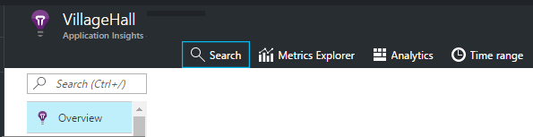

<properties 
    pageTitle="Explore os logs de rastreamento de .NET na obtenção de informações de aplicativo" 
    description="Pesquisar logs gerados com rastreamento, NLog ou Log4Net." 
    services="application-insights" 
    documentationCenter=".net"
    authors="alancameronwills" 
    manager="douge"/>

<tags 
    ms.service="application-insights" 
    ms.workload="tbd" 
    ms.tgt_pltfrm="ibiza" 
    ms.devlang="na" 
    ms.topic="article" 
    ms.date="07/21/2016" 
    ms.author="awills"/>
 
# <a name="explore-net-trace-logs-in-application-insights"></a>Explore os logs de rastreamento de .NET na obtenção de informações de aplicativo  

Se você usar NLog, log4Net ou System.Diagnostics.Trace para rastreamento de diagnóstico em seu aplicativo ASP.NET, você pode ter os logs enviados para a [Obtenção de informações do Visual Studio aplicativo][start], onde você pode explorar e pesquisá-las. Os logs serão mesclados com a outra telemetria vêm do seu aplicativo, para que você possa identificar os rastreamentos associados atendendo a cada solicitação de usuário e correlação-los com outros eventos e relatórios de exceção.


> [AZURE.NOTE] Você precisa do módulo de captura de log? É um adaptador útil para registradores de terceiros 3º, mas se você não estiver usando NLog, log4Net ou System.Diagnostics.Trace, considere a possibilidade de apenas chamar diretamente [TrackTrace() de obtenção de informações do aplicativo](app-insights-api-custom-events-metrics.md#track-trace) .


## <a name="install-logging-on-your-app"></a>Instalar o login no seu aplicativo

Instale sua estrutura de log escolhido em seu projeto. Isso deve resultar em uma entrada no App. config ou Web. config.

Se você estiver usando System.Diagnostics.Trace, você precisa adicionar uma entrada à Web. config:

```XML

    <configuration>
     <system.diagnostics>
       <trace autoflush="false" indentsize="4">
         <listeners>
           <add name="myListener" 
             type="System.Diagnostics.TextWriterTraceListener" 
             initializeData="TextWriterOutput.log" />
           <remove name="Default" />
         </listeners>
       </trace>
     </system.diagnostics>
   </configuration>
```

## <a name="configure-application-insights-to-collect-logs"></a>Configurar a obtenção de informações de aplicativo para coletar logs

**[Adicionar o aplicativo ideias ao seu projeto](app-insights-asp-net.md)** se você ainda não tiver feito isso. Você verá uma opção para incluir o coletor de log.

Ou **Configurar ideias de aplicativo** clicando com o seu projeto no Solution Explorer. Selecione a opção à **coleção de rastreamento de configurar**.

*Obtenção de informações de aplicativo menu ou log coletor opção sem?* Tente a [solução de problemas](#troubleshooting).


## <a name="manual-installation"></a>Instalação manual

Use esse método se o tipo de projeto não é compatível com o instalador de obtenção de informações do aplicativo (por exemplo um projeto para desktops Windows). 

1. Se você planeja usar log4Net ou NLog, instale-o no seu projeto. 
2. No Solution Explorer, clique com botão direito seu projeto e escolha **Gerenciar pacotes do NuGet**.
3. Procurar por "Obtenção de informações de aplicativo"

    

4. Selecione o pacote apropriado - um destes:
  + Microsoft.ApplicationInsights.TraceListener (para capturar System.Diagnostics.Trace chamadas)
  + Microsoft.ApplicationInsights.NLogTarget
  + Microsoft.ApplicationInsights.Log4NetAppender

O pacote NuGet instala os módulos necessários e também modifica Web. config ou App.

## <a name="insert-diagnostic-log-calls"></a>Inserir chamadas de log de diagnóstico

Se você usar System.Diagnostics.Trace, uma chamada típica seria:

    System.Diagnostics.Trace.TraceWarning("Slow response - database01");

Se você preferir log4net ou NLog:

    logger.Warn("Slow response - database01");


## <a name="using-the-trace-api-directly"></a>Usando o rastreamento de API diretamente

Você pode chamar o rastreamento de obtenção de informações de aplicativo API diretamente. Os adaptadores de log de usam essa API. 

Por exemplo:

    var telemetry = new Microsoft.ApplicationInsights.TelemetryClient();
    telemetry.TrackTrace("Slow response - database01");

Uma vantagem de TrackTrace é que você pode colocar dados relativamente longos na mensagem. Por exemplo, você pode codificar dados de POSTAGEM lá. 

Além disso, você pode adicionar um nível de gravidade à sua mensagem. E, como outra telemetria, você poderá adicionar valores de propriedade que você pode usar para ajudar a filtrar ou pesquisar para diferentes conjuntos de rastreamentos. Por exemplo:


    var telemetry = new Microsoft.ApplicationInsights.TelemetryClient();
    telemetry.TrackTrace("Slow database response",
                   SeverityLevel.Warning,
                   new Dictionary<string,string> { {"database", db.ID} });

Isso permita que você, na [pesquisa][diagnostic], para filtrar facilmente todas as mensagens de um nível de gravidade determinado relacionados a um determinado banco de dados.

## <a name="explore-your-logs"></a>Explore os logs

Execute o aplicativo, no modo de depuração ou implantá-lo ao vivo.

Em lâmina de visão geral do seu aplicativo no [portal de obtenção de informações de aplicativo][portal], escolha [Pesquisar][diagnostic].




Você pode, por exemplo:

* Filtrar rastreamentos de log, ou em itens com propriedades específicas
* Inspecione um item específico em detalhes.
* Localizar outra telemetria relacionados à mesma solicitação de usuário (ou seja, com o mesmo OperationId) 
* Salvar a configuração desta página como um favorito

> [AZURE.NOTE] **Amostragem.** Se seu aplicativo envia muitos dados e você estiver usando o SDK do aplicativo ideias para ASP.NET versão 2.0.0-beta3 ou posterior, o recurso de amostragem adaptativa pode operar e enviar apenas uma porcentagem do seu telemetria. [Saiba mais sobre amostragem.](app-insights-sampling.md)

## <a name="next-steps"></a>Próximas etapas

[Diagnosticar falhas e exceções em ASP.NET][exceptions]

[Saiba mais sobre pesquisa][diagnostic].


## <a name="troubleshooting"></a>Solução de problemas

### <a name="how-do-i-do-this-for-java"></a>Como fazer isso para Java?

Use os [adaptadores de log de Java](app-insights-java-trace-logs.md).

### <a name="theres-no-application-insights-option-on-the-project-context-menu"></a>Há nenhuma opção de obtenção de informações do aplicativo no menu de contexto do projeto

* Ferramentas de verificação de obtenção de informações de aplicativo está instalado nesta máquina de desenvolvimento. No menu Ferramentas do Visual Studio, extensões e atualizações, procure ferramentas de obtenção de informações do aplicativo. Se ele não estiver na aba instalado, abra a guia Online e instalá-lo.
* Isso pode ser um tipo de projeto não suportado pelas ferramentas de obtenção de informações do aplicativo. Use a [instalação manual](#manual-installation).

### <a name="no-log-adapter-option-in-the-configuration-tool"></a>Opção sem adaptador log na ferramenta de configuração

* Você precisa instalar a estrutura de log primeiro.
* Se você estiver usando System.Diagnostics.Trace, certifique-se de que você [configurado em `web.config` ](https://msdn.microsoft.com/library/system.diagnostics.eventlogtracelistener.aspx).
* Você tem a versão mais recente das ferramentas de obtenção de informações do aplicativo? No menu de **Ferramentas** do Visual Studio, escolha **extensões e atualizações**e abra a guia **atualizações** . Se as ferramentas de obtenção de informações do aplicativo estiver lá, clique para atualizá-lo.


### <a name="emptykey"></a>Eu recebo um erro "chave de instrumentação não pode ser vazio"

Parece que você instalou o pacote de Nuget de adaptador de registro em log sem instalar o aplicativo ideias.

No Solution Explorer, clique com botão direito `ApplicationInsights.config` e escolha a **Obtenção de informações de aplicativo de atualização**. Você receberá uma caixa de diálogo convidando para entrar no Azure e crie um recurso de obtenção de informações do aplicativo, ou reutilize um existente. Que deve corrigi-lo.

### <a name="i-can-see-traces-in-diagnostic-search-but-not-the-other-events"></a>Posso ver rastreamentos em pesquisa de diagnóstico, mas não os outros eventos

Às vezes, pode levar alguns instantes para todos os eventos e as solicitações para obter pelo pipeline de.

### <a name="limits"></a>A quantidade de dados é mantido?

Até 500 eventos por segundo de cada aplicativo. Eventos são mantidos por sete dias.

### <a name="im-not-seeing-some-of-the-log-entries-that-i-expect"></a>Não estou vendo algumas das entradas de log que esperar

Se seu aplicativo envia muitos dados e você estiver usando o SDK do aplicativo ideias para ASP.NET versão 2.0.0-beta3 ou posterior, o recurso de amostragem adaptativa pode operar e enviar apenas uma porcentagem do seu telemetria. [Saiba mais sobre amostragem.](app-insights-sampling.md)

## <a name="add"></a>Próximas etapas

* [Configurar a disponibilidade e testes de capacidade de resposta][availability]
* [Solução de problemas][qna]


<!--Link references-->

[availability]: app-insights-monitor-web-app-availability.md
[diagnostic]: app-insights-diagnostic-search.md
[exceptions]: app-insights-asp-net-exceptions.md
[portal]: https://portal.azure.com/
[qna]: app-insights-troubleshoot-faq.md
[start]: app-insights-overview.md

 
