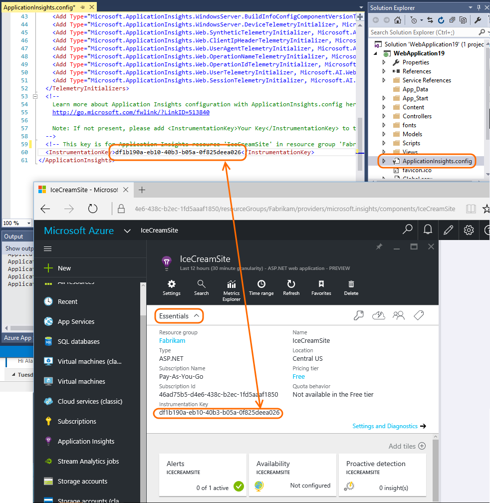

<properties 
    pageTitle="Nenhum dado - ideias de aplicativo para .NET de solução de problemas" 
    description="Não vendo dados em ideias de aplicativo do Visual Studio? Tente aqui." 
    services="application-insights" 
    documentationCenter=".net"
    authors="alancameronwills" 
    manager="douge"/>

<tags 
    ms.service="application-insights" 
    ms.workload="mobile" 
    ms.tgt_pltfrm="ibiza" 
    ms.devlang="na" 
    ms.topic="article" 
    ms.date="10/24/2016" 
    ms.author="awills"/>
 
# Nenhum dado - ideias de aplicativo para .NET de solução de problemas

## Alguns dos meu telemetria está ausente

*No aplicativo ideias, vejo somente uma fração dos eventos que estão sendo gerados pelo meu aplicativo.*

* Se você estiver vendo consistentemente a mesma fração, provavelmente será devido a adaptativa [amostragem](app-insights-sampling.md). Para confirmar isso, abrir pesquisa (da lâmina visão geral) e examinar uma instância de uma solicitação ou outro evento. Na parte inferior da seção Propriedades, clique em "..." para obter detalhes de propriedade completo. Se solicitar contagem > 1, em seguida, amostragem estiver em operação. 
* Caso contrário, é possível que você está atingir um [limite de taxa de dados](app-insights-pricing.md#limits-summary) para seu plano de preços. Esses limites são aplicados por minuto.

## Nenhum dado do meu servidor

*Instalei o meu aplicativo no meu servidor da web e agora não consigo ver qualquer telemetria dele. Funcionou Okey na minha máquina de desenvolvimento.*

* Provavelmente é um problema de firewall. [Definir exceções de firewall para obtenção de informações de aplicativo enviar dados](app-insights-ip-addresses.md).

*Posso [instalou o Monitor de Status](app-insights-monitor-performance-live-website-now.md) no meu servidor de web para monitorar aplicativos existentes. Não vejo todos os resultados.*

* Consulte [Monitor de Status de solução de problemas](app-insights-monitor-performance-live-website-now.md#troubleshooting). 

## Opção sem 'Adicionar o aplicativo ideias' no Visual Studio

*Ao criar um novo projeto no Visual Studio, ou quando eu um projeto existente no Explorador de solução de atalho, não vejo as opções de obtenção de informações do aplicativo.*

+ Nem todos os tipos de projeto .NET são suportados pelas ferramentas. Projetos da Web e WCF são suportados. Para outros tipos de projeto como aplicativos de área de trabalho ou de serviço, você ainda pode [Adicionar um SDK de ideias de aplicativo ao seu projeto manualmente](app-insights-windows-desktop.md).
+ Verifique se que você tem a [atualização do Visual Studio 2013 3 ou posterior](http://go.microsoft.com/fwlink/?LinkId=397827). Ele vem pré-instalado com ferramentas de obtenção de informações de aplicativos.
+ Selecione **Ferramentas**, **extensões e atualizações** e verifique se **As ferramentas de obtenção de informações de aplicativos** é instalado e ativado. Em caso afirmativo, clique em **atualizações** para ver se há uma atualização disponível.
+ Abra a caixa de diálogo Novo projeto e escolha o aplicativo Web do ASP.NET. Se você vir a opção de obtenção de informações de aplicativo lá, as ferramentas são instaladas. Caso contrário, tente desinstalar e, em seguida, reinstalar as ferramentas de obtenção de informações do aplicativo.

## Falha ao adicionar a obtenção de informações de aplicativo

*Ao criar um novo projeto web ou ao tentar adicionar ideias de aplicativo a um projeto existente, vejo uma mensagem de erro.*

Causas prováveis:

* Falha de comunicação com o portal de obtenção de informações de aplicativo; ou
* Há algum problema com sua conta do Azure;
* Você só têm [acesso de leitura para a assinatura ou o grupo em que você estava tentando criar o novo recurso](app-insights-resources-roles-access-control.md).

Correção:

+ Verifique se você forneceu credenciais de entrada para a direita Azure conta. 
+ No seu navegador, verifique se você tem acesso ao [portal do Azure](https://portal.azure.com). Abra configurações e ver se há qualquer restrição.
+ [Adicionar o aplicativo ideias para seu projeto existente](app-insights-asp-net.md): no Solution Explorer, clique com botão direito seu projeto e escolha "Adicionar ideias de aplicativo".
+ Se ainda não estiver funcionando, siga o [procedimento manual](app-insights-windows-services.md) para adicionar um recurso no portal e adicione o SDK ao seu projeto. 

## Eu recebo um erro "chave de instrumentação não pode ser vazio"

Parece que algo está errado enquanto estava instalando ideias de aplicativo ou talvez um adaptador de log.

No Solution Explorer, clique com botão direito `ApplicationInsights.config` e escolha **Configurar ideias de aplicativo**. Você receberá uma caixa de diálogo convidando para entrar no Azure e crie um recurso de obtenção de informações do aplicativo, ou reutilize um existente.

##"Pacote NuGet está faltando" no meu servidor de compilação

*Tudo compila Okey quando eu estou depuração em minha máquina de desenvolvimento, mas ocorre um erro de NuGet no servidor de compilação.*

Consulte [NuGet pacote restaurar](http://docs.nuget.org/Consume/Package-Restore) e [A restauração automática de pacote](http://docs.nuget.org/Consume/package-restore/migrating-to-automatic-package-restore).

## Comando de menu ausentes para abrir a obtenção de informações de aplicativo do Visual Studio

*Quando eu atalho meu projeto Solution Explorer, não vejo comandos de obtenção de informações do aplicativo ou não vejo um comando de obtenção de informações de aplicativo aberto.*

Causas prováveis:

* Se você criou o recurso de obtenção de informações de aplicativo manualmente, ou se o projeto é de um tipo que não é compatível com as ferramentas de obtenção de informações do aplicativo.
* As ferramentas de obtenção de informações de aplicativo estão desabilitadas no Visual Studio.
* O Visual Studio é anterior à atualização de 2013 3.

Correção:

* Verifique se que sua versão do Visual Studio é a atualização de 2013 3 ou posterior.
* Selecione **Ferramentas**, **extensões e atualizações** e verifique se **As ferramentas de obtenção de informações de aplicativos** é instalado e ativado. Em caso afirmativo, clique em **atualizações** para ver se há uma atualização disponível.
* Clique com botão direito seu projeto no Solution Explorer. Se você vir o comando **Configurar aplicativo ideias**, usá-lo para conectar o seu projeto para o recurso no serviço de obtenção de informações do aplicativo.

Caso contrário, o seu tipo de projeto não é compatíveis diretamente pelas ferramentas de obtenção de informações do aplicativo. Para ver seu telemetria, entre [portal do Azure](https://portal.azure.com), escolha ideias de aplicativo na barra de navegação à esquerda e selecione o seu aplicativo.

## 'Acesso negado' de abertura de obtenção de informações de aplicativo do Visual Studio

*O comando de menu 'Abrir aplicativo ideias' leva-me para o portal do Azure, mas eu recebo um erro de 'acesso negado'.*

A entrada da Microsoft que você usou última no seu navegador padrão não tem acesso ao [recurso que foi criado quando o aplicativo ideias foi adicionada para este aplicativo](app-insights-asp-net.md). Há dois motivos provavelmente: 

* Você tem mais de uma conta da Microsoft, talvez um trabalho e uma conta da Microsoft? A entrada do último usado no seu navegador padrão foi para uma conta diferente daquela tem acesso ao [Adicionar ideias de aplicativo ao projeto](app-insights-asp-net.md). 

 * Correção: Clique no seu nome na parte superior direita da janela do navegador e sair. Em seguida, entre com a conta que tenha acesso. Em seguida, na barra de navegação à esquerda, clique em aplicativo ideias e selecione seu aplicativo.

* Alguém adicionou ideias de aplicativo ao projeto, e elas esquecer dar a você [acesso ao grupo de recursos](app-insights-resources-roles-access-control.md) no qual ele foi criado. 

 * Correção: Se ela usado uma conta organizacional, eles podem adicionar você à equipe; ou eles podem lhe conceder acesso individuais ao grupo de recursos.

## 'Ativo não encontrado' de abertura de obtenção de informações de aplicativo do Visual Studio

*O comando de menu 'Abrir aplicativo ideias' leva-me para o portal do Azure, mas eu recebo um erro 'ativo não encontrado'.*

Causas prováveis:

* O recurso de obtenção de informações do aplicativo para o seu aplicativo foi excluído; ou
* A chave de instrumentação foi definida ou modificada no ApplicationInsights.config editando-a diretamente, sem atualizar o arquivo de projeto. 

A chave de instrumentação em controles de ApplicationInsights.config onde a telemetria é enviada. Uma linha no arquivo de projeto controla o recurso que é aberto quando você usa o comando no Visual Studio. 

Correção:

* No Solution Explorer, clique com botão direito do projeto e escolha a obtenção de informações do aplicativo, Configure ideias de aplicativo. Na caixa de diálogo, você pode optar por enviar telemetria a um recurso existente ou crie um novo. Ou:
* Abra o recurso diretamente. Entrar no [portal do Azure](https://portal.azure.com), clique em ideias de aplicativo na barra de navegação à esquerda e selecione seu aplicativo.

## Onde posso encontrar minha Telemetria?

*Posso entrar [portal do Microsoft Azure](https://portal.azure.com)e estou examinando o Azure dashboard inicial. Então onde posso encontrar meus dados de obtenção de informações do aplicativo?*

* Na barra de navegação à esquerda, clique em ideias de aplicativo, em seguida, o nome do aplicativo. Se você não tiver quaisquer projetos lá, você precisa [Adicionar ou configurar ideias de aplicativo no seu projeto web](app-insights-asp-net.md).

    Lá, você verá alguns gráficos de resumo. Você pode clicar nelas para ver mais detalhes.

* No Visual Studio, enquanto você estiver depuração seu aplicativo, clique no botão de obtenção de informações do aplicativo.

## Nenhum dado de servidor (ou nenhum dado todos)

*Eu tiver executado meu aplicativo e aberto, em seguida, o serviço de obtenção de informações do aplicativo no Microsoft Azure, mas todos os gráficos mostram 'Saiba como coletar …' ou 'Não configurado'.* Ou, *somente modo de exibição de página e dados do usuário, mas nenhum dado do servidor.*

+ Execute o aplicativo no modo de depuração no Visual Studio (F5). Use o aplicativo para gerar algumas telemetria. Verifique se você pode ver os eventos registrados na janela de saída do Visual Studio. 

    

+ No portal de obtenção de informações do aplicativo, abra [Diagnóstico de pesquisa](app-insights-diagnostic-search.md). Dados geralmente aparecem aqui primeiro.
+ Clique no botão Atualizar. A lâmina atualiza próprio periodicamente, mas você também pode fazê-lo manualmente. O intervalo de atualização é maior para intervalos de tempo maiores.
+ Verifique as chaves de instrumentação correspondem. Na lâmina principal para o aplicativo no portal de obtenção de informações do aplicativo, no menu suspenso **Essentials** , examine a **chave de instrumentação**. Em seguida, em seu projeto no Visual Studio, abra ApplicationInsights.config e localize o `<instrumentationkey>`. Verifique se as duas chaves são iguais. Se não:
 + No portal do, clique em ideias de aplicativo e procure o recurso de aplicativo com a tecla direita; ou
 + No Visual Studio Solution Explorer, clique com botão direito do projeto e escolha a obtenção de informações do aplicativo, Configure. Redefina o aplicativo para enviar telemetria ao recurso à direita.
 + Se você não encontrar as teclas correspondentes, verifique que você está usando as mesmas credenciais de entrada no Visual Studio como no portal.

    
    
+ No [painel inicial do Microsoft Azure](https://portal.azure.com), examine o mapa de integridade do serviço. Se houver algumas indicações alertas, aguarde até que elas tem retornado para Okey e, em seguida, feche e abra novamente o seu blade de aplicativo de obtenção de informações do aplicativo.
+ Verifique também [nosso blog de status](http://blogs.msdn.com/b/applicationinsights-status/).
+ Você fez escrever qualquer código para o [SDK do lado do servidor](app-insights-api-custom-events-metrics.md) que podem mudar a chave de instrumentação no `TelemetryClient` instâncias ou no `TelemetryContext`? Ou você tenha escrito uma [configuração de filtro ou amostragem](app-insights-api-filtering-sampling.md) que podem ser filtrando out muito?
+ Se você editou ApplicationInsights.config, cuidadosamente verifique a configuração de [TelemetryInitializers e TelemetryProcessors](app-insights-api-filtering-sampling.md). Um tipo chamado incorretamente ou o parâmetro pode causar o SDK não enviar nenhum dado.

## Sem dados sobre o uso de modos de exibição de página, navegadores,

*Vejo dados em gráficos de tempo de resposta do servidor e as solicitações de servidor, mas sem dados em tempo de carregamento do modo de exibição de página, ou em lâminas navegador ou uso.*

Os dados oriundos de scripts em páginas da web. 

+ Se você adicionou ideias de aplicativo a um projeto existente da web, [que você precisa adicionar os scripts manualmente](app-insights-javascript.md).
+ Verifique se o que Internet Explorer não estiver exibindo seu site no modo de compatibilidade.
+ Use o recurso de depuração do navegador (F12 em alguns navegadores, em seguida, escolha rede) para verificar que os dados estão sendo enviados para `dc.services.visualstudio.com`.

## Nenhum dado de dependência ou exceção

Consulte [telemetria de dependência](app-insights-asp-net-dependencies.md) e [telemetria de exceção](app-insights-asp-net-exceptions.md).

## Nenhum dado de desempenho

Dados de desempenho (CPU, taxa es e assim por diante) está disponível para [os serviços web Java](app-insights-java-collectd.md), [aplicativos de desktop do Windows](app-insights-windows-desktop.md), [aplicativos e serviços se você instalar o monitor de status de web IIS](app-insights-monitor-performance-live-website-now.md)e [Serviços de nuvem do Azure](app-insights-azure.md). Você encontrará-lo em configurações, servidores.

Ele não está disponível para sites Azure.

## Nenhum dado (servidor), desde que eu publicados o aplicativo no meu servidor

+ Verificar que você copiou realmente todos da Microsoft. DLLs de ApplicationInsights no servidor, junto com Microsoft.Diagnostics.Instrumentation.Extensions.Intercept.dll
+ Em seu firewall, talvez seja necessário [Abrir algumas portas TCP](app-insights-ip-addresses.md#data-access-api).
+ Se você precisar usar um proxy para enviar fora de sua rede corporativa, definir [defaultProxy](https://msdn.microsoft.com/library/aa903360.aspx) na Web. config
+ Windows Server 2008: Verifique se você instalou as seguintes atualizações: [KB2468871](https://support.microsoft.com/kb/2468871), [KB2533523](https://support.microsoft.com/kb/2533523), [KB2600217](https://support.microsoft.com/kb/2600217).

## Posso usado para ver os dados, mas ele parou

* Verificar o [status blog](http://blogs.msdn.com/b/applicationinsights-status/).
* Você tiver atingido sua cota mensal de pontos de dados? Abra configurações/cota e preços para descobrir. Nesse caso, você pode atualizar seu plano ou pagar por capacidade adicional. Consulte os [preços esquema](https://azure.microsoft.com/pricing/details/application-insights/).

## Não vejo todos os dados que eu estou esperando

Se seu aplicativo envia muitos dados e você estiver usando o SDK do aplicativo ideias para ASP.NET versão 2.0.0-beta3 ou posterior, o recurso de [amostragem adaptativa](app-insights-sampling.md) pode operar e enviar apenas uma porcentagem do seu telemetria. 

Você pode desabilitá-lo, mas isso não é recomendado. Amostragem foi projetada para que telemetria relacionada corretamente é transmitida, para fins de diagnóstico. 

## Errado dados geográficos telemetria do usuário

A cidade, região e país dimensões são derivadas de endereços IP e nem sempre são precisas.

## Exceção "método não encontrado" em execução nos serviços de nuvem do Azure

Você criar para .NET 4.6? 4.6 automaticamente não é suportado em funções de serviços de nuvem do Azure. [Instalar 4.6 em cada função](../cloud-services/cloud-services-dotnet-install-dotnet.md) antes de executar o aplicativo.

## Ainda não estiver funcionando...

* [Fórum do aplicativo de ideias](https://social.msdn.microsoft.com/Forums/vstudio/en-US/home?forum=ApplicationInsights)

