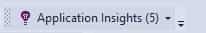
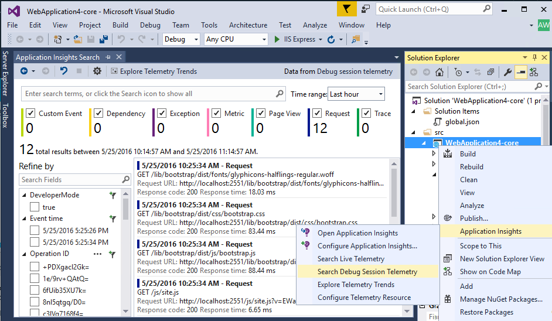

<properties 
    pageTitle="Configurar a análise de aplicativo web do ASP.NET com ideias de aplicativo | Microsoft Azure" 
    description="Configurar o desempenho, a disponibilidade e a análise de uso para seu site do ASP.NET, hospedado no local ou no Azure." 
    services="application-insights" 
    documentationCenter=".net"
    authors="NumberByColors" 
    manager="douge"/>

<tags 
    ms.service="application-insights" 
    ms.workload="tbd" 
    ms.tgt_pltfrm="ibiza" 
    ms.devlang="na" 
    ms.topic="get-started-article" 
    ms.date="10/13/2016" 
    ms.author="awills"/>


# <a name="set-up-application-insights-for-aspnet"></a>Configurar o aplicativo ideias para ASP.NET

[Obtenção de informações do Visual Studio aplicativo](app-insights-overview.md) monitora seu aplicativo ao vivo para ajudá-lo a [detectar e diagnosticar problemas de desempenho e exceções](app-insights-detect-triage-diagnose.md)e [Descubra como o seu aplicativo é usado](app-insights-overview-usage.md).  Ele funciona para os aplicativos que são hospedados em seus próprios servidores IIS local ou em nuvem VMs, bem como aplicativos web Azure.


## <a name="before-you-start"></a>Antes de começar

Você precisa:

* Atualização do 2013 Studio Visual 3 ou posterior. Posteriormente, é melhor.
* Uma assinatura do [Microsoft Azure](http://azure.com). Se a sua equipe ou organização tiver uma assinatura do Azure, o proprietário pode adicioná-lo a ele, usando sua [conta da Microsoft](http://live.com). 

Há artigos alternativos para ver se você estiver interessado em:

* [Instrumentação um aplicativo web em tempo de execução](app-insights-monitor-performance-live-website-now.md)
* [Serviços de nuvem do Azure](app-insights-cloudservices.md)

## <a name="ide"></a>1. Adicionar aplicativo ideias SDK


### <a name="if-its-a-new-project"></a>Se for um novo projeto...

Certifique-se de que obtenção de informações de aplicativo está selecionada quando você cria um novo projeto no Visual Studio. 


### <a name="-or-if-its-an-existing-project"></a>… ou se é um projeto existente

Clique com botão direito do projeto no Solution Explorer e escolha **Adicionar o aplicativo ideias telemetria** ou **Configurar ideias de aplicativo**.


* Projeto do ASP.NET Core? - [Siga estas instruções para corrigir algumas linhas de código](https://github.com/Microsoft/ApplicationInsights-aspnetcore/wiki/Getting-Started#add-application-insights-instrumentation-code-to-startupcs). 


## <a name="run"></a>2. executar seu aplicativo

Executar o aplicativo com F5 e testá-la: abrir páginas diferentes para gerar algumas telemetria.

No Visual Studio, você vê uma contagem dos eventos que fez. 



## <a name="3-see-your-telemetry"></a>3. Consulte sua telemetria...

### <a name="-in-visual-studio"></a>… no Visual Studio

Abrir a janela de obtenção de informações de aplicativo no Visual Studio: clique no botão de obtenção de informações do aplicativo ou clique com botão direito seu projeto no Solution Explorer:



Este modo de exibição mostra telemetria gerada no lado do servidor do aplicativo. Experimentar com os filtros e clique em qualquer evento para ver mais detalhes.

[Saiba mais sobre as ferramentas de obtenção de informações de aplicativo no Visual Studio](app-insights-visual-studio.md).

<a name="monitor"></a> 
### <a name="-in-the-portal"></a>… no portal

A menos que você escolheu *Instalar o SDK somente,* você também pode ver a telemetria no portal ideias de aplicativo web. 

O portal tem mais gráficos, ferramentas analíticas e painéis do Visual Studio. 


Abra o recurso de obtenção de informações de aplicativo no [portal do Azure](https://portal.azure.com/).


O portal é aberto em um modo de exibição da telemetria de seu aplicativo:

* A primeira telemetria aparece no [fluxo de métricas ao vivo](app-insights-metrics-explorer.md#live-metrics-stream).
* Eventos individuais exibidas na **pesquisa** (1). Dados podem levar alguns minutos para aparecer. Clique em qualquer evento para ver suas propriedades. 
* Métricas agregadas aparecem nos gráficos (2). Poderá demorar um ou dois minutos para dados aparecer aqui. Clique em qualquer gráfico para abrir uma lâmina com mais detalhes.

[Saiba mais sobre como usar o aplicativo ideias no portal do Azure](app-insights-dashboards.md).

## <a name="4-publish-your-app"></a>4. publicar seu aplicativo

Publica seu aplicativo para seu servidor IIS ou Azure. Assista [ao vivo fluxo de métricas](app-insights-metrics-explorer.md#live-metrics-stream) para garantir que tudo está funcionando normalmente.

Você verá sua telemetria criando no portal de obtenção de informações do aplicativo, onde você pode monitorar métricas, pesquise seu telemetria e configurar [painéis](app-insights-dashboards.md). Você também pode usar a [linguagem de consulta de análise](app-insights-analytics.md) de poderosos para analisar dados de uso e desempenho ou encontrar eventos específicos. 

Você também pode continuar a analisar seu telemetria no [Visual Studio](app-insights-visual-studio.md) com ferramentas tais como pesquisa de diagnóstico e [tendências](app-insights-visual-studio-trends.md).

> [AZURE.NOTE] Se seu aplicativo envia suficiente telemetria abordar o [otimização limites](app-insights-pricing.md#limits-summary), automática [amostragem](app-insights-sampling.md) mudará. Amostragem reduz a quantidade de telemetria enviada a partir do seu aplicativo, preservando dados correlacionados para fins de diagnóstico.


##<a name="land"></a>O que fez 'Adicionar o aplicativo percepções'?

Obtenção de informações de aplicativo envia telemetria de seu aplicativo para o portal de obtenção de informações de aplicativo (que está hospedado no Microsoft Azure):


O comando fazia três coisas:

1. Adicione o pacote de aplicativo ideias Web SDK NuGet ao seu projeto. Para vê-la no Visual Studio, clique com botão direito seu projeto e escolha gerenciar pacotes do NuGet.
2. Crie um recurso de obtenção de informações de aplicativo no [portal do Azure](https://portal.azure.com/). Isso é onde você verá seus dados. Recupera a *chave de instrumentação,* que identifica o recurso.
3. Insere a chave de instrumentação no `ApplicationInsights.config`, para que o SDK possa enviar telemetria portal.

Se desejar, você pode fazer essas etapas manualmente para [ASP.NET 4](app-insights-windows-services.md) ou [ASP.NET Core](https://github.com/Microsoft/ApplicationInsights-aspnetcore/wiki/Getting-Started).

### <a name="to-upgrade-to-future-sdk-versions"></a>Atualizar para futuras versões SDK

Para atualizar para uma [nova versão do SDK](https://github.com/Microsoft/ApplicationInsights-dotnet-server/releases), abra o Gerenciador de pacotes do NuGet novamente e filtrar pacotes instalados. Selecione Microsoft.ApplicationInsights.Web e escolha atualizar.

Se você fez todas as personalizações ApplicationInsights.config, salve uma cópia dele antes de atualizar e depois mesclar as alterações a nova versão.

## <a name="add-more-telemetry"></a>Adicionar mais de telemetria

### <a name="web-pages-and-single-page-apps"></a>Páginas da Web e aplicativos de página única

1. [Adicionar o trecho de código JavaScript](app-insights-javascript.md) às páginas da web para destacar as lâminas de navegador e o uso com dados sobre modos de exibição de página, tempos de carregamento, exceções do navegador, desempenho de chamada AJAX, contagens de usuário e sessão.
2. [Eventos personalizados de código](app-insights-api-custom-events-metrics.md) para contagem, hora ou medida ações do usuário.

### <a name="dependencies-exceptions-and-performance-counters"></a>Dependências, exceções e contadores de desempenho

[Instalar o Monitor de Status](app-insights-monitor-performance-live-website-now.md) em cada uma das suas máquinas de servidor, obter telemetria adicional sobre seu aplicativo. Este é o que você obtém:

* [Contadores de desempenho](app-insights-performance-counters.md) - 
CPU, memória, disco e outros contadores de desempenho relacionados à seu aplicativo. 
* [Exceções](app-insights-asp-net-exceptions.md) - telemetria mais detalhada para algumas exceções.
* [Dependências](app-insights-asp-net-dependencies.md) - chamadas para serviços de API REST ou SQL. Descubra se respostas lentas pelo componentes externos estão causando problemas de desempenho em seu aplicativo. (Se o aplicativo é executado no .NET 4.6, não será necessário Monitor de Status para obter este telemetria.)

### <a name="diagnostic-code"></a>Código de diagnóstico

Há um problema? Se você quiser inserir código em seu aplicativo para ajudar a diagnosticá-lo, você tem várias opções:

* [Rastreamentos de log de captura](app-insights-asp-net-trace-logs.md): se você estiver já usando Log4N, NLog ou System.Diagnostics.Trace para registrar eventos de rastreamento, e em seguida, a saída pode ser enviada de obtenção de informações do aplicativo para que você possa correlação com solicitações, pesquisar por ela e analisá-lo. 
* [Métricas e eventos personalizados](app-insights-api-custom-events-metrics.md): Use TrackEvent() e TrackMetric() no servidor ou código de página da web.
* [Marca de telemetria com propriedades adicionais](app-insights-api-filtering-sampling.md#add-properties)

Use a [pesquisa](app-insights-diagnostic-search.md) para localizar e correlação de eventos específicos e [a análise](app-insights-analytics.md) para executar consultas mais eficazes.

## <a name="alerts"></a>Alertas

Seja o primeiro saber se o seu aplicativo tem problemas. (Não aguardar até que seus usuários informá-lo!) 

* [Criar testes de web](app-insights-monitor-web-app-availability.md) para certificar-se de que seu site está visível na web.
* [Diagnóstico proativo](app-insights-proactive-diagnostics.md) executar automaticamente (se o seu aplicativo tem uma determinada quantidade mínima de tráfego). Você não precisa fazer algo para configurá-los. Eles informam se seu aplicativo tem uma taxa de incomum de solicitações com falha.
* [Definir alertas métricas](app-insights-alerts.md) para avisá-lo a se uma métrica exceder um limite. Você pode defini-los em métricas personalizadas que você codificar em seu aplicativo.

Por padrão, as notificações de alerta são enviadas para o proprietário da assinatura do Azure. 


## <a name="version-and-release-tracking"></a>Versão e controle de versão

### <a name="track-application-version"></a>Versão do aplicativo de controle

Verifique se `buildinfo.config` é gerada pelo seu processo MSBuild. No seu arquivo. csproj, adicione:  

```XML

    <PropertyGroup>
      <GenerateBuildInfoConfigFile>true</GenerateBuildInfoConfigFile>    <IncludeServerNameInBuildInfo>true</IncludeServerNameInBuildInfo>
    </PropertyGroup> 
```

Quando tiver as informações de compilação, módulo ideias de aplicativo web adiciona automaticamente **versão do aplicativo** como uma propriedade para cada item de telemetria. Permite a você filtrar por versão quando executando [pesquisas de diagnósticos](app-insights-diagnostic-search.md) ou [Explorando métricas](app-insights-metrics-explorer.md). 

No entanto, observe que o número de versão de compilação é gerado apenas por MS Build, não pela compilação de desenvolvedor no Visual Studio.

### <a name="release-annotations"></a>Anotações de lançamento

Se você usar os serviços de equipe do Visual Studio, você pode [obter um marcador de anotação](app-insights-annotations.md) adicionado aos seus gráficos sempre que uma nova versão de lançamento.


## <a name="next-steps"></a>Próximas etapas

| | 
|---|---
|**[Trabalhando com ideias de aplicativo no Visual Studio](app-insights-visual-studio.md)**<br/>Depuração com telemetria, diagnóstico pesquisar e consulta drill-through código.|
|**[Trabalhando com o portal de obtenção de informações de aplicativo](app-insights-dashboards.md)**<br/>Painéis, poderosas ferramentas de diagnóstico e analíticas, alertas, um mapa de dependência ao vivo de seu aplicativo e telemetria exportar. |
|**[Adicionar mais dados](app-insights-asp-net-more.md)**<br/>Monitorar uso, disponibilidade, dependências, exceções. Integre rastreamentos de estruturas de log. Escreva telemetria personalizada. | 


