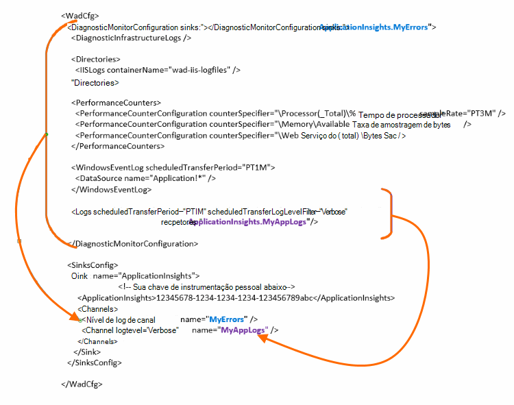

<properties
    pageTitle="Enviar logs de diagnóstico do Azure para obtenção de informações de aplicativo"
    description="Configure os detalhes dos logs de diagnóstico de serviços de nuvem do Azure que são enviados para o portal de obtenção de informações do aplicativo."
    services="application-insights"
    documentationCenter=".net"
    authors="sbtron"
    manager="douge"/>

<tags
    ms.service="application-insights"
    ms.workload="tbd"
    ms.tgt_pltfrm="ibiza"
    ms.devlang="na"
    ms.topic="article"
    ms.date="11/17/2015"
    ms.author="awills"/>

# <a name="configure-azure-diagnostic-logging-to-application-insights"></a>Configurar log de diagnóstico do Azure de obtenção de informações de aplicativo

Quando você configurar um projeto de serviços de nuvem ou uma máquina Virtual no Microsoft Azure, [Azure pode gerar um log de diagnóstico](../vs-azure-tools-diagnostics-for-cloud-services-and-virtual-machines.md). Você pode fazer isso enviados a obtenção de informações de aplicativo para que você possa analisá-lo junto com o diagnóstico e o uso da telemetria enviada de dentro do aplicativo pelo SDK de obtenção de informações do aplicativo. Log do Azure inclui eventos no gerenciamento do aplicativo como iniciar, parar, falhas, bem como contadores de desempenho. O log também inclui chamadas no aplicativo para System.Diagnostics.Trace.

Este artigo descreve a configuração da captura diagnóstico em detalhes.

Você precisa Azure SDK 2,8 instalado no Visual Studio.

## <a name="get-an-application-insights-resource"></a>Obter um recurso de obtenção de informações de aplicativo

Para a melhor experiência, [Adicione o SDK de ideias de aplicativo para cada função de seu aplicativo de serviços de nuvem](app-insights-cloudservices.md)ou [qualquer aplicativo será executado em sua máquina virtual](app-insights-overview.md). Você poderá enviar os dados de diagnóstico para ser analisado e exibido o mesmo recurso de obtenção de informações do aplicativo.

Como alternativa, se você não quiser usar o SDK - por exemplo, se o aplicativo já estiver vivo - você pode apenas [criar um novo recurso de obtenção de informações de aplicativo](app-insights-create-new-resource.md) no portal do Azure. Escolha o **Diagnóstico do Azure** como o tipo de aplicativo.


## <a name="send-azure-diagnostics-to-application-insights"></a>Enviar diagnóstico do Azure para obtenção de informações de aplicativo

Se você é capaz de atualizar seu projeto de aplicativo, em seguida, no Visual Studio selecionar cada função, escolha suas propriedades e na guia Configuração, selecione **enviar diagnósticos de obtenção de informações do aplicativo**.

Se seu aplicativo já estiver ativo, use o Visual Studio Server Explorer ou explorer de serviços de nuvem para abrir as propriedades do aplicativo. Selecione **enviar diagnósticos de obtenção de informações do aplicativo**.

Em cada caso você será solicitado para obter os detalhes do recurso ideias de aplicativo que você criou.

[Saiba mais sobre como configurar a obtenção de informações de aplicativo para um aplicativo de serviços de nuvem](app-insights-cloudservices.md).

## <a name="configuring-the-azure-diagnostics-adapter"></a>Configurando o adaptador de diagnóstico do Azure

Em somente leitura se você deseja selecionar as partes do log que você enviar de obtenção de informações do aplicativo. Por padrão, tudo o que é enviado, incluindo: eventos do Microsoft Azure; contadores de desempenho; rastrear chamadas do aplicativo para System.Diagnostics.Trace.

Diagnóstico do Azure armazena dados às tabelas de armazenamento do Azure. No entanto, você também pode barra vertical todos ou um subconjunto dos dados de obtenção de informações de aplicativo configurando "recpetores" e "canais" em sua configuração usando a extensão de diagnóstico do Azure 1.5 ou posterior.

### <a name="configure-application-insights-as-a-sink"></a>Configurar o aplicativo ideias como um receptor

Quando você usa as propriedades de função para definir "Enviar dados de obtenção de informações de aplicativo", o SDK do Azure (2,8 ou posterior) adiciona uma `<SinksConfig>` elemento para o [arquivo de configuração de diagnóstico do Azure](https://msdn.microsoft.com/library/azure/dn782207.aspx) pública da função.

`<SinksConfig>`Define o receptor adicional onde os dados de diagnóstico do Azure podem ser enviados.  Um exemplo `SinksConfig` tem esta aparência:

```xml

    <SinksConfig>
     <Sink name="ApplicationInsights">
      <ApplicationInsights>{Insert InstrumentationKey}</ApplicationInsights>
      <Channels>
        <Channel logLevel="Error" name="MyTopDiagData"  />
        <Channel logLevel="Verbose" name="MyLogData"  />
      </Channels>
     </Sink>
    </SinksConfig>

```

O `ApplicationInsights` elemento Especifica a chave de instrumentação que identifica o recurso de obtenção de informações do aplicativo para o qual os dados de diagnóstico do Azure serão enviados. Quando você seleciona o recurso, ele é preenchido automaticamente com base na `APPINSIGHTS_INSTRUMENTATIONKEY` configuração do serviço. (Se você quiser defini-lo manualmente, obtenha a chave do Essentials suspensa do recurso.)

`Channels`Defina os dados que serão enviados para o receptor. O canal funciona como um filtro. O `loglevel` atributo permite especificar o nível de log que enviará o canal. Os valores disponíveis são: `{Verbose, Information, Warning, Error, Critical}`.

### <a name="send-data-to-the-sink"></a>Enviar dados para o receptor

Envie dados para a obtenção de informações de aplicativo PIA, adicionando o atributo receptores sob o nó DiagnosticMonitorConfiguration. Adicionar o elemento de receptores para cada nó Especifica que você deseja dados coletados de nó e qualquer nó sejam enviadas para o receptor especificado.

Por exemplo, o padrão criado pelo SDK do Azure é enviar todos os dados de diagnósticos Azure:

```xml

    <DiagnosticMonitorConfiguration overallQuotaInMB="4096" sinks="ApplicationInsights">
```

Mas se você quiser enviar apenas os logs de erro, qualificar o nome de receptor com um nome de canal:

```xml

    <DiagnosticMonitorConfiguration overallQuotaInMB="4096" sinks="ApplicationInsights.MyTopDiagdata">
```

Observe que estamos usando o nome do receptor que definimos, junto com o nome de um canal que definimos acima.

Se você queria apenas enviar logs de aplicativo detalhado de obtenção de informações do aplicativo e em seguida, adicione o atributo receptores para o `Logs` nó.

```xml

    <Logs scheduledTransferPeriod="PT1M" scheduledTransferLogLevelFilter="Verbose" sinks="ApplicationInsights.MyLogData"/>
```

Você também pode incluir vários receptores na configuração em diferentes níveis da hierarquia. Nesse caso, o receptor especificado no nível superior da hierarquia atua como uma configuração global e especificada no elemento individual elemento atuar como uma substituição para essa configuração global.

Aqui está um exemplo completo do arquivo de configuração pública que envia todos os erros de obtenção de informações de aplicativo (especificado na `DiagnosticMonitorConfiguration` nó) e logs de nível de detalhe além para os Logs de aplicativo (especificado na `Logs` nó).

```xml

    <WadCfg>
     <DiagnosticMonitorConfiguration overallQuotaInMB="4096"
       sinks="ApplicationInsights.MyTopDiagData"> <!-- All info below sent to this channel -->
      <DiagnosticInfrastructureLogs />
      <PerformanceCounters>
        <PerformanceCounterConfiguration counterSpecifier="\Processor(_Total)\% Processor Time" sampleRate="PT3M" sinks="ApplicationInsights.MyLogData/>
        <PerformanceCounterConfiguration counterSpecifier="\Memory\Available MBytes" sampleRate="PT3M" />
        <PerformanceCounterConfiguration counterSpecifier="\Web Service(_Total)\Bytes Total/Sec" sampleRate="PT3M" />
      </PerformanceCounters>
      <WindowsEventLog scheduledTransferPeriod="PT1M">
        <DataSource name="Application!*" />
      </WindowsEventLog>
      <Logs scheduledTransferPeriod="PT1M" scheduledTransferLogLevelFilter="Verbose"
            sinks="ApplicationInsights.MyLogData"/>
       <!-- This specific info sent to this channel -->
     </DiagnosticMonitorConfiguration>

     <SinksConfig>
      <Sink name="ApplicationInsights">
        <ApplicationInsights>{Insert InstrumentationKey}</ApplicationInsights>
        <Channels>
          <Channel logLevel="Error" name="MyTopDiagData"  />
          <Channel logLevel="Verbose" name="MyLogData"  />
        </Channels>
      </Sink>
     </SinksConfig>
    </WadCfg>
```



Existem algumas limitações a serem consideradas com essa funcionalidade:

* Canais destinam-se apenas para trabalhar com o tipo de log e não contadores de desempenho. Se você especificar um canal com um elemento de contador de desempenho que ele será ignorado.
* O nível de log de um canal não pode exceder o nível de log para o que está sendo coletado pelo diagnóstico do Azure. Por exemplo: você não pode coletar erros do Log de aplicativo no elemento Logs e tente enviar detalhado logs para a sincronização de uma visão de aplicativo. O atributo scheduledTransferLogLevelFilter sempre deve coletar igual ou mais logs do que os logs que você está tentando enviar para um receptor.
* Você não consegue enviar quaisquer dados blob coletadas pelo extensão de diagnóstico do Azure de obtenção de informações do aplicativo. Por exemplo, nada especificado sob o nó de diretórios. Para falha descarta o despejo real ainda será enviado ao armazenamento de blob e somente uma notificação de que o despejo gerado será enviada para a obtenção de informações do aplicativo.

## <a name="related-topics"></a>Tópicos relacionados

* [Monitoramento de serviços de nuvem Azure com ideias de aplicativo](app-insights-cloudservices.md)
* [Usando o PowerShell para enviar o diagnóstico do Azure para obtenção de informações de aplicativo](app-insights-powershell-azure-diagnostics.md)
* [Arquivo de configuração de diagnóstico do Azure](https://msdn.microsoft.com/library/azure/dn782207.aspx)
