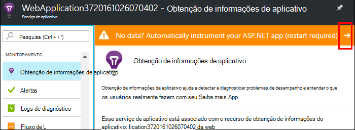

<properties
    pageTitle="Monitorar o desempenho do aplicativo web Azure | Microsoft Azure"
    description="Aplicativo monitorar o desempenho de aplicativos web Azure. Gráfico de carga e tempo de resposta, informações de dependência e definir alertas no desempenho."
    services="application-insights"
    documentationCenter=".net"
    authors="alancameronwills"
    manager="douge"/>

<tags
    ms.service="azure-portal"
    ms.workload="na"
    ms.tgt_pltfrm="na"
    ms.devlang="na"
    ms.topic="article"
    ms.date="10/24/2016"
    ms.author="awills"/>

# Monitorar o desempenho do aplicativo web do Azure

No [Portal do Azure](https://portal.azure.com) , você pode configurar o monitoramento do desempenho do aplicativo para seus [aplicativos web Azure](../app-service-web/app-service-web-overview.md). [Obtenção de informações do Visual Studio aplicativo](app-insights-overview.md) trata seu aplicativo para enviar telemetria sobre suas atividades para o serviço de obtenção de informações do aplicativo, onde ele é armazenado e analisado. Lá, métricos gráficos e ferramentas de pesquisa podem ser usadas para ajudar a diagnosticar problemas, melhorar o desempenho e avaliar uso.

## Tempo de execução ou tempo de compilação

Você pode configurar o monitoramento por instrumentação o aplicativo de duas maneiras:

* **Tempo de execução** - você pode selecionar um extensão de monitoramento quando seu aplicativo web já está ao vivo de desempenho. Não é necessário recriar ou instalar o aplicativo novamente. Você obtém um conjunto padrão de pacotes que monitorar tempos de resposta, taxas de sucesso, exceções, dependências e assim por diante. 
 
* **Criar horário** - você pode instalar um pacote em seu aplicativo em desenvolvimento. Essa opção é mais versátil. Além os mesmos pacotes padrão, você pode escrever código para personalizar a Telemetria ou para enviar sua própria telemetria. Você pode efetuar atividades específicas ou eventos de registro de acordo com a semântica do seu domínio de aplicativo. 

## Executar instrumentação de tempo com ideias de aplicativo

Se você já estiver executando um aplicativo web no Azure, você já obter alguns monitoramento: solicitação e taxas de erro. Adicionar ideias de aplicativo para obter mais, como tempos de resposta, monitoramento chamadas para as dependências, detecção inteligente e a análise poderosa idioma de consulta. 

1. **Selecione ideias de aplicativo** no painel de controle Azure para o aplicativo web.

    

 * Escolha para criar um novo recurso, a menos que você configurou um recurso de obtenção de informações do aplicativo para este aplicativo por outro roteiro.

2. **Instrumentos seu aplicativo web** após a instalação do aplicativo ideias. 

    

3. **Monitore o aplicativo**.  [Expore os dados](#explore-the-data).

Posteriormente, você pode criar e reimplantar o aplicativo com ideias de aplicativo se desejar.

*Como remover o aplicativo ideias, ou alternar para envio a outro recurso?*

* No Azure, abra a lâmina de controle do aplicativo da web e em ferramentas de desenvolvimento, abra **extensões**. Exclua a extensão de obtenção de informações do aplicativo. Em seguida, em Monitoring, escolha ideias de aplicativo e criar ou selecione o recurso que você deseja.

## Criar o aplicativo com ideias de aplicativo

Obtenção de informações de aplicativo pode fornecer mais detalhadas de telemetria instalando um SDK no seu aplicativo. Em particular, você pode coletar logs de rastreamento, [escrever telemetria personalizada](../application-insights/app-insights-api-custom-events-metrics.md)e obter relatórios de exceção mais detalhados.

1. **No Visual Studio** (atualização de 2013 2 ou posterior), adicione o SDK de obtenção de informações do aplicativo ao seu projeto.

    

    Se for solicitado a entrar, use as credenciais para sua conta do Azure.

    A operação tem dois efeitos:

 1. Cria um recurso de obtenção de informações de aplicativo no Azure, onde telemetria é armazenada, analisada e exibida.
 2. Adiciona o pacote de aplicativo ideias NuGet ao seu código e configura para enviar telemetria para o recurso Azure.

2. **Teste a telemetria** executando o aplicativo em sua máquina de desenvolvimento (F5).

3. **Publicar o aplicativo do** Azure em como de costume. 

*Como alternar para enviar para um recurso de obtenção de informações de aplicativo diferente?*

* No Visual Studio, clique com botão direito do projeto, escolha **ideias de aplicativo > Configurar** e escolha o recurso desejado. Você recebe a opção para criar um novo recurso. Recriar e reimplantar.

## Explorar os dados

1. Na lâmina ideias de aplicativo do seu painel de controle do aplicativo da web, você vê métricas Live, que mostra as solicitações e falhas em um segundo ou duas delas ocorrendo. É exibição muito útil quando você estiver republicar seu aplicativo - você pode ver todos os problemas imediatamente.

2. Clique para um recurso de obtenção de informações de aplicativo completo.

    
    

    Você também pode ir lá seja diretamente de navegação do recurso Azure.

2. Clique em por meio de qualquer gráfico para obter mais detalhes:

    

    Você pode [Personalizar blades métricas](../application-insights/app-insights-metrics-explorer.md).

3. Clique nos mais para Consulte eventos individuais e suas propriedades:

    

    Observe o "..." vincular para abrir todas as propriedades.

    Você pode [Personalizar as pesquisas](../application-insights/app-insights-diagnostic-search.md).

Para pesquisas mais eficazes sobre sua telemetria, use a [linguagem de consulta de análise](../application-insights/app-insights-analytics-tour.md).

## Próximas etapas

* [Diagnóstico do Azure habilitar](app-insights-azure-diagnostics.md) sejam enviadas para a obtenção de informações do aplicativo.
* [Métricas de integridade do serviço de monitor](../monitoring-and-diagnostics/insights-how-to-customize-monitoring.md) para garantir que seu serviço está disponível e responde.
* [Notificações de alerta de recebimento](../monitoring-and-diagnostics/insights-receive-alert-notifications.md) sempre que ocorrerem eventos operacionais ou métricas cross um limite.
* Use [Ideias de aplicativo JavaScript aplicativos e páginas da web](app-insights-web-track-usage.md) para obter telemetria do cliente de navegadores que visitar uma página da web.
* [Configurar testes de web de disponibilidade](app-insights-monitor-web-app-availability.md) para ser alertado se seu site for pressionada.
