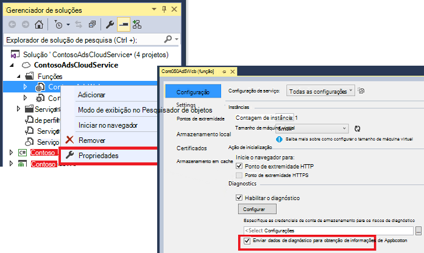

<properties
   pageTitle="Obtenção de informações de aplicativo de serviços de nuvem Azure"
   description="Monitore suas funções da web e trabalhador efetivamente com ideias de aplicativo"
   services="application-insights"
   documentationCenter=""
   authors="soubhagyadash"
   manager="douge"
   editor="alancameronwills"/>

<tags
   ms.service="application-insights"
   ms.devlang="na"
   ms.tgt_pltfrm="ibiza"
   ms.topic="article"
   ms.workload="tbd"
   ms.date="03/02/2016"
   ms.author="sdash"/>

# <a name="application-insights-for-azure-cloud-services"></a>Obtenção de informações de aplicativo de serviços de nuvem Azure


*Obtenção de informações de aplicativo está no modo de visualização*

[Aplicativos de serviço de nuvem da Microsoft Azure](https://azure.microsoft.com/services/cloud-services/) possível monitorar por [Ideias de aplicativo do Visual Studio] [ start] de disponibilidade, desempenho, falhas e uso. Com os comentários que você obtenha sobre o desempenho e a eficiência do seu aplicativo por aí, você pode fazer escolhas informadas sobre a direção do design em cada ciclo de vida de desenvolvimento.


Você precisará de uma assinatura com o [Microsoft Azure](http://azure.com). Entrar com uma conta da Microsoft, que você pode ter para Windows, XBox Live ou outros serviços de nuvem da Microsoft. 


#### <a name="sample-application-instrumented-with-application-insights"></a>Aplicativo de amostra instrumentado ideias de aplicativo

Dê uma olhada este [aplicativo de exemplo](https://github.com/Microsoft/ApplicationInsights-Home/tree/master/Samples/AzureEmailService) no qual aplicativo ideias é adicionada a um serviço de nuvem com duas funções de trabalhador hospedadas no Azure. 

O que se segue que ensina como adaptar seu próprio projeto de serviço de nuvem da mesma maneira.

## <a name="create-an-application-insights-resource-for-each-role"></a>Criar um recurso de obtenção de informações do aplicativo para cada função

Um recurso de obtenção de informações de aplicativo é onde seus dados de telemetria serão analisados e exibidos.  

1.  No [portal do Azure][portal], criar um novo recurso de obtenção de informações do aplicativo. Para tipo de aplicativo, escolha o aplicativo do ASP.NET. 

    

2.  Faça uma cópia da chave de instrumentação. Você precisará isso em breve, para configurar o SDK.

    


Geralmente é [melhor criar um recurso separado para os dados de cada função de trabalho e da web](app-insights-separate-resources.md). 

Como alternativa, você pode enviar dados de todas as funções para um recurso, mas definir uma [propriedade padrão] [ apidefaults] para que você pode filtrar ou agrupar os resultados de cada função.

## <a name="sdk"></a>Instalar o SDK em cada projeto


1. No Visual Studio, edite os pacotes NuGet do seu projeto de aplicativo de nuvem.

    


2. Para funções da web, adicione o pacote do NuGet de [Obtenção de informações de aplicativo para Web](http://www.nuget.org/packages/Microsoft.ApplicationInsights.Web) . Esta versão do SDK inclui módulos que adicionar contexto de servidor como as informações de função. Para funções de trabalho, use o [Aplicativo ideias para servidores do Windows](https://www.nuget.org/packages/Microsoft.ApplicationInsights.WindowsServer/).

    


3. Configure o SDK para enviar dados para o recurso de obtenção de informações do aplicativo.

    Defina a chave de instrumentação como uma configuração no arquivo `ServiceConfiguration.Cloud.cscfg`. ([Código de exemplo](https://github.com/Microsoft/ApplicationInsights-Home/blob/master/Samples/AzureEmailService/AzureEmailService/ServiceConfiguration.Cloud.cscfg)).
 
    ```XML
     <Role name="WorkerRoleA"> 
      <Setting name="APPINSIGHTS_INSTRUMENTATIONKEY" value="YOUR IKEY" /> 
     </Role>
    ```
 
    Em uma função de inicialização adequado, defina a chave de instrumentação da configuração configuração:

    ```C#
     TelemetryConfiguration.Active.InstrumentationKey = RoleEnvironment.GetConfigurationSettingValue("APPINSIGHTS_INSTRUMENTATIONKEY");
    ```

    Observação, o mesmo nome `APPINSIGHTS_INSTRUMENTATIONKEY` da configuração configuração será usada pelo relatório de diagnóstico do Azure. 


    Faça isso para cada função em seu aplicativo. Veja os exemplos:
 
 * [Função da Web](https://github.com/Microsoft/ApplicationInsights-Home/blob/master/Samples/AzureEmailService/MvcWebRole/Global.asax.cs#L27)
 * [Função de trabalho](https://github.com/Microsoft/ApplicationInsights-Home/blob/master/Samples/AzureEmailService/WorkerRoleA/WorkerRoleA.cs#L232)
 * [Para páginas da web](https://github.com/Microsoft/ApplicationInsights-Home/blob/master/Samples/AzureEmailService/MvcWebRole/Views/Shared/_Layout.cshtml#L13)   

4. Defina o arquivo de ApplicationInsights.config a ser copiado sempre ao diretório de saída. 

    (No arquivo. config, você verá mensagens pedindo para colocar a tecla instrumentação lá. No entanto, para aplicativos em nuvem é melhor para defini-la a partir do arquivo .cscfg. Isso garante que a função esteja corretamente identificada no portal do).


#### <a name="run-and-publish-the-app"></a>Executar e publicar o aplicativo

Executar o aplicativo e entrar no Azure. Abra os recursos de obtenção de informações do aplicativo que você criou e você verá pontos de dados individuais que aparecem em [pesquisa](app-insights-diagnostic-search.md)e dados no [Explorador de métrica](app-insights-metrics-explorer.md)agregados. 

Adicionar mais telemetria - consulte as seções abaixo - e publique seu aplicativo para obter comentários ao vivo de diagnóstico e uso. 


#### <a name="no-data"></a>Nenhum dado?

* Abrir a [pesquisa] [ diagnostic] bloco, para ver os eventos individuais.
* Use o aplicativo, abrindo páginas diferentes para que ele gera alguns telemetria.
* Aguarde alguns segundos e clique em Atualizar.
* Consulte [solução de problemas][qna].


## <a name="more-telemetry"></a>Mais de telemetria

As seções a seguir mostram como obter telemetria adicional de diferentes aspectos de seu aplicativo.


## <a name="track-requests-from-worker-roles"></a>Acompanhe as solicitações de funções de trabalho

Funções da web, o módulo solicitações automaticamente coleta dados sobre solicitações HTTP. Consulte o [exemplo MVCWebRole](https://github.com/Microsoft/ApplicationInsights-Home/tree/master/Samples/AzureEmailService/MvcWebRole) para obter exemplos de como você pode substituir o comportamento de conjunto padrão. 

Você pode capturar o desempenho de chamadas para funções de trabalho controlando-los da mesma maneira como solicitações HTTP. No aplicativo ideias, o tipo de telemetria solicitação avalia uma unidade de trabalho de lado do servidor nomeado que pode ser sincronizou e pode independentemente êxito ou falha. Enquanto as solicitações HTTP são capturadas automaticamente pelo SDK, você pode inserir seu próprio código para controlar as solicitações para funções de trabalho.

Consulte as duas funções de trabalho de amostra ligadas à solicitações de relatório: [WorkerRoleA](https://github.com/Microsoft/ApplicationInsights-Home/tree/master/Samples/AzureEmailService/WorkerRoleA) e [WorkerRoleB](https://github.com/Microsoft/ApplicationInsights-Home/tree/master/Samples/AzureEmailService/WorkerRoleB)

## <a name="azure-diagnostics"></a>Diagnóstico do Azure

Dados de [Diagnóstico do Azure](../vs-azure-tools-diagnostics-for-cloud-services-and-virtual-machines.md) incluem eventos de gerenciamento de função, contadores de desempenho e logs de aplicativos. Você pode ter estes enviados de obtenção de informações do aplicativo para que você possa vê-los junto com o restante do seu telemetria, facilitando a diagnosticar problemas.

Diagnóstico do Azure é particularmente úteis se uma função falha inesperadamente ou Falha ao iniciar.

1. A função (e não o projeto!) para abrir suas propriedades de atalho e, em seguida, selecione **Habilitar o diagnóstico**, **enviar diagnósticos de obtenção de informações do aplicativo**.

    

    **Ou, se seu aplicativo já publicados e em execução**, abrir Server Explorer ou nuvem Explorer, clique com botão direito seu aplicativo e selecione a opção mesma.

3.  Selecione o mesmo recurso de obtenção de informações de aplicativo como seu outra telemetria.

    Se desejar, você pode definir um recurso diferente em configurações de serviço diferente (nuvem, Local) para ajudar a manter os dados de desenvolvimento separada dos dados ao vivo.

3. Opcionalmente, [excluir algumas o diagnóstico do Azure](app-insights-azure-diagnostics.md) desejado seja encaminhado para obtenção de informações do aplicativo. O padrão é tudo.

### <a name="view-azure-diagnostic-events"></a>Exibir eventos de diagnóstico Azure

Onde encontrar o diagnóstico:

* Contadores de desempenho são exibidos como métricas personalizadas. 
* Logs de eventos do Windows são mostrados como rastreamentos e eventos personalizados.
* Logs de aplicativo, logs ETW e qualquer logs de infraestrutura de diagnóstico aparecem como rastreamentos.

Para exibir contadores de desempenho e contagens de eventos, abra o [Explorador de métricas](app-insights-metrics-explorer.md) e adicionar um novo gráfico:


Use a [pesquisa](app-insights-diagnostic-search.md) para procurar entre os vários logs de rastreamento enviados por diagnóstico do Azure. Por exemplo, se você tinha uma exceção unhanded em uma função que causou a função falhar e Lixeira, que informações aparecerão no aplicativo canal de Log do Windows evento. Você pode usar a funcionalidade de pesquisa para examinar o erro de Log de eventos do Windows e obter o rastreamento de pilha completo para a exceção permitindo que você encontrar a causa do problema.


## <a name="app-diagnostics"></a>Diagnóstico do aplicativo

Diagnóstico do Azure inclui automaticamente entradas de log que seu aplicativo gera usando System.Diagnostics.Trace. 

Mas se você já usar as estruturas de Log4N ou NLog, você também pode [capturar seus rastreamentos de log][netlogs].

[Controlar eventos personalizados e métricas] [ api] no cliente server ou ambas, para saber mais sobre o desempenho e o uso do aplicativo.

## <a name="dependencies"></a>Dependências

Aplicativo ideias SDK pode relatar chamadas que seu aplicativo faz para dependências externas como apis REST e servidores SQL. Isso permite que você veja se uma determinada dependência está causando respostas lentas ou falhas.

Se seu aplicativo usa .NET framework 4.6 ou posterior, você não precisa fazer mais nada. 

Caso contrário, configure a função web/trabalhador com o [Agente de ideias de aplicativo](app-insights-monitor-performance-live-website-now.md) também conhecido como "Monitor de Status".

Para usar o agente de obtenção de informações do aplicativo com suas funções da web/trabalhador:

* Adicione a pasta [AppInsightsAgent](https://github.com/Microsoft/ApplicationInsights-Home/tree/master/Samples/AzureEmailService/WorkerRoleA/AppInsightsAgent) e os dois arquivos para seus projetos de função web/trabalhador. Certifique-se de configurar suas propriedades de compilação para que eles sempre são copiados para o diretório de saída. Esses arquivos instalam o agente.
* Adicione o tarefa de inicialização para o arquivo CSDEF como mostrado [aqui](https://github.com/Microsoft/ApplicationInsights-Home/tree/master/Samples/AzureEmailService/AzureEmailService/ServiceDefinition.csdef#L18).
* Observação: *Funções de trabalho* requerem três variáveis de ambiente como mostrado [aqui](https://github.com/Microsoft/ApplicationInsights-Home/tree/master/Samples/AzureEmailService/AzureEmailService/ServiceDefinition.csdef#L44). Isso não é necessário para funções da web.

### <a name="dependency-reports"></a>Relatórios de dependência

Aqui está um exemplo do que você vê no portal ideias de aplicativo:

* Diagnósticos sofisticados com correlacionadas automaticamente solicitações e dependências:

    

* Desempenho da função da web, com as informações de dependência:

    

* Aqui está uma captura de tela sobre as solicitações e informações de dependência para uma função de trabalho:

    

## <a name="exceptions"></a>Exceções

Consulte [Monitoramento exceções no aplicativo ideias](app-insights-asp-net-exceptions.md) para obter informações sobre como você pode coletar exceções sem tratamento de tipos de aplicativos web diferente.

A função de web de amostra tem controladores MVC5 e Web API 2. As exceções sem tratamento de 2 são capturadas com o seguinte:

* [AiHandleErrorAttribute](https://github.com/Microsoft/ApplicationInsights-Home/blob/master/Samples/AzureEmailService/MvcWebRole/Telemetry/AiHandleErrorAttribute.cs) configurar [aqui](https://github.com/Microsoft/ApplicationInsights-Home/blob/master/Samples/AzureEmailService/MvcWebRole/App_Start/FilterConfig.cs#L12) para controladores de MVC5
* [AiWebApiExceptionLogger](https://github.com/Microsoft/ApplicationInsights-Home/blob/master/Samples/AzureEmailService/MvcWebRole/Telemetry/AiWebApiExceptionLogger.cs) configurar [aqui](https://github.com/Microsoft/ApplicationInsights-Home/blob/master/Samples/AzureEmailService/MvcWebRole/App_Start/WebApiConfig.cs#L25) para controladores de Web API 2

Para funções de trabalho, há duas maneiras de controlar exceções.

* TrackException(ex)
* Se você tiver adicionado o pacote de NuGet de ouvinte de rastreamento de obtenção de informações do aplicativo, você pode usar System.Diagnostics.Trace registrar exceções. [Exemplo de código.](https://github.com/Microsoft/ApplicationInsights-Home/blob/master/Samples/AzureEmailService/WorkerRoleA/WorkerRoleA.cs#L107)

## <a name="performance-counters"></a>Contadores de desempenho

Os seguintes contadores são coletados por padrão:

    * \Process(??APP_WIN32_PROC??)\% tempo de processador
    * \Memory\Available bytes
    * \.Líquido CLR Exceptions(??APP_CLR_PROC??)\# de exceções iniciadas / s
    * \Processo (??. APP_WIN32_PROC??) \Private bytes
    * \Processo (??. APP_WIN32_PROC??) Dados \IO Bytes/seg
    * \Processor(_Total)\% tempo de processador

Além disso, o seguinte também é coletado para funções da web:

    * \ASP.NET aplicativos (??. APP_W3SVC_PROC??) \Requests/SEC    
    * \ASP.NET aplicativos (??. APP_W3SVC_PROC??) Tempo de execução de \Request
    * \ASP.NET aplicativos (??. APP_W3SVC_PROC??) \Requests na fila de aplicativos

Você pode especificar personalizados adicionais ou outros contadores de desempenho do windows como mostrado [aqui](https://github.com/Microsoft/ApplicationInsights-Home/blob/master/Samples/AzureEmailService/WorkerRoleA/ApplicationInsights.config#L14)

  

## <a name="correlated-telemetry-for-worker-roles"></a>Telemetria correlacionada para funções de trabalho

É uma experiência avançada de diagnóstico, quando você pode ver o que levou a uma solicitação de falha ou alta latência. Com as funções da web, o SDK do configura automaticamente a correlação entre telemetria relacionada. Para funções de trabalho, você pode usar um inicializador de telemetria personalizados para definir um atributo de contexto Operation.Id comum para todos o telemetria conseguir isso. Isso permitirá que você veja se o problema de latência/falha foi causado devido a uma dependência ou seu código, num relance! 

Veja como:

* Defina a Id de correlação em um CallContext como mostrado [aqui](https://github.com/Microsoft/ApplicationInsights-Home/blob/master/Samples/AzureEmailService/WorkerRoleA/WorkerRoleA.cs#L36). Nesse caso, estamos usando a identificação de solicitação como a id de correlação
* Adicione uma implementação de TelemetryInitializer personalizada, que definirá o Operation.Id como correlationId definido acima. Mostrado aqui: [ItemCorrelationTelemetryInitializer](https://github.com/Microsoft/ApplicationInsights-Home/blob/master/Samples/AzureEmailService/WorkerRoleA/Telemetry/ItemCorrelationTelemetryInitializer.cs#L13)
* Adicione o inicializador de telemetria personalizado. Você pode fazer isso no arquivo ApplicationInsights.config, ou no código como mostrado [aqui](https://github.com/Microsoft/ApplicationInsights-Home/blob/master/Samples/AzureEmailService/WorkerRoleA/WorkerRoleA.cs#L233)

Pronto! Experiência do portal já está conectada para ajudá-lo a ver todos os respectivos telemetria num relance:


## <a name="client-telemetry"></a>Telemetria do cliente

[Adicionar o SDK do JavaScript às páginas da web] [ client] para obter baseadas em navegador telemetria como contagens de modo de exibição de página, tempos de carregamento de página, exceções de script e permitem que você escreva telemetria personalizada em seus scripts de página.

## <a name="availability-tests"></a>Testes de disponibilidade

[Configurar testes web] [ availability] para garantir que seu aplicativo permaneça ao vivo e ágil.


## <a name="example"></a>Exemplo

[O exemplo](https://github.com/Microsoft/ApplicationInsights-Home/tree/master/Samples/AzureEmailService) monitora um serviço que tem uma função web e duas funções de trabalho.

## <a name="exception-method-not-found-on-running-in-azure-cloud-services"></a>Exceção "método não encontrado" em execução nos serviços de nuvem do Azure

Você criar para .NET 4.6? 4.6 automaticamente não é suportado em funções de serviços de nuvem do Azure. [Instalar 4.6 em cada função](../cloud-services/cloud-services-dotnet-install-dotnet.md) antes de executar o aplicativo.

## <a name="related-topics"></a>Tópicos relacionados

* [Configurar o envio de diagnóstico do Azure para obtenção de informações de aplicativo](app-insights-azure-diagnostics.md)
* [Usando o PowerShell para enviar o diagnóstico do Azure para obtenção de informações de aplicativo](app-insights-powershell-azure-diagnostics.md)


[api]: app-insights-api-custom-events-metrics.md
[apidefaults]: app-insights-api-custom-events-metrics.md#default-properties
[apidynamicikey]: app-insights-separate-resources.md#dynamic-ikey
[availability]: app-insights-monitor-web-app-availability.md
[azure]: app-insights-azure.md
[client]: app-insights-javascript.md
[diagnostic]: app-insights-diagnostic-search.md
[netlogs]: app-insights-asp-net-trace-logs.md
[portal]: http://portal.azure.com/
[qna]: app-insights-troubleshoot-faq.md
[redfield]: app-insights-monitor-performance-live-website-now.md
[start]: app-insights-overview.md 
