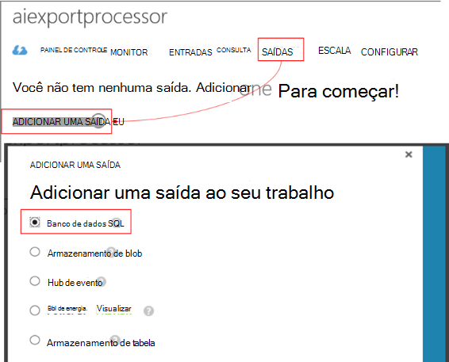

<properties 
    pageTitle="Passo a passo: exportar telemetria banco de dados SQL de obtenção de informações de aplicativo" 
    description="Continuamente exporte dados de obtenção de informações do aplicativo para SQL usando a análise de fluxo." 
    services="application-insights" 
    documentationCenter=""
    authors="noamben" 
    manager="douge"/>

<tags 
    ms.service="application-insights" 
    ms.workload="tbd" 
    ms.tgt_pltfrm="ibiza" 
    ms.devlang="na" 
    ms.topic="article" 
    ms.date="03/06/2015" 
    ms.author="awills"/>
 
# <a name="walkthrough-export-to-sql-from-application-insights-using-stream-analytics"></a>Passo a passo: Exportar para SQL de obtenção de informações de aplicativo usando a análise de fluxo

Este artigo mostra como mover seus dados de telemetria de [Ideias de aplicativo do Visual Studio] [ start] em um banco de dados do SQL Azure usando [Exportar contínuo] [ export] e [A análise de fluxo Azure](https://azure.microsoft.com/services/stream-analytics/). 

Exportar contínuo move seus dados de telemetria para armazenamento do Azure no formato JSON. Vamos analisar os objetos JSON usando a análise de fluxo do Azure e criar linhas em uma tabela de banco de dados.

(Mais geralmente, exportar contínuo é a maneira de fazer sua própria análise da telemetria enviar seus aplicativos de obtenção de informações do aplicativo. Você pode adaptar este exemplo de código para fazer outras coisas com a telemetria exportada, como agregação de dados.)

Vamos começar com a suposição de que você já tem o aplicativo que você deseja monitorar.


Neste exemplo, vamos usar os dados de exibição de página, mas o mesmo padrão pode ser facilmente estendido para outros tipos de dados como exceções e eventos personalizados. 


## <a name="add-application-insights-to-your-application"></a>Adicionar o aplicativo ideias para seu aplicativo


Introdução:

1. [Configurar o aplicativo ideias para suas páginas da web](app-insights-javascript.md). 

    (Neste exemplo, nos concentraremos na processamento de dados de modo de exibição de página dos navegadores cliente, mas você também pode configurar ideias de aplicativo do lado do servidor do seu aplicativo [Java](app-insights-java-get-started.md) ou [ASP.NET](app-insights-asp-net.md) e solicitação de processo, dependência e outra telemetria do servidor.)


5. Publicar seu aplicativo e assistir dados de telemetria que aparecem no seu recurso de obtenção de informações do aplicativo.


## <a name="create-storage-in-azure"></a>Criar um armazenamento no Azure

Exportar contínuo sempre saídas dados para uma conta de armazenamento do Azure, então você precisa criar o armazenamento primeiro.

1. Criar uma conta de armazenamento em sua assinatura no [portal do Azure][portal].

    

2. Criar um contêiner

    

3. Copiar a chave de acesso de armazenamento

    Você precisará breve para configurar a entrada para o serviço de análise do fluxo.

    

## <a name="start-continuous-export-to-azure-storage"></a>Iniciar exportação contínua para armazenamento do Azure

1. No portal do Azure, navegue até o recurso de obtenção de informações do aplicativo que você criou para seu aplicativo.

    

2. Crie uma exportação contínua.

    


    Selecione a conta de armazenamento que você criou anteriormente:

    
    
    Defina os tipos de eventos que você deseja ver:

    


3. Permitir que alguns dados acumular. A apresentação e permitir que as pessoas usam seu aplicativo por um tempo. Telemetria chegarão e você verá gráficos estatísticos no [Explorador de métricas](app-insights-metrics-explorer.md) e eventos individuais na [pesquisa de diagnóstico](app-insights-diagnostic-search.md). 

    E também, os dados serão exportar para o seu armazenamento. 

4. Inspecione a exportado dados, tanto no portal - escolha **Procurar**, selecione sua conta de armazenamento e **contêineres** - ou no Visual Studio. No Visual Studio, escolha **Exibir / nuvem Explorer**e abra o Azure / armazenamento. (Se você não tiver essa opção de menu, você precisa instalar o SDK do Azure: Abra a caixa de diálogo Novo projeto e Visual c# / nuvem / obter Microsoft Azure SDK do .NET.)

    

    Tome nota da parte comuns do nome do caminho, que é derivado da chave de nome e instrumentação do aplicativo. 

Os eventos são gravados blob arquivos no formato JSON. Cada arquivo pode conter um ou mais eventos. Portanto, podemos gostaria de ler os dados de evento e filtrar os campos que queremos. Existem em todos os tipos de coisas que podemos fazer com os dados, mas nosso plano hoje é usar a análise de fluxo para mover os dados para um banco de dados do SQL. Que será mais fácil executar muitas consultas interessantes.

## <a name="create-an-azure-sql-database"></a>Criar um banco de dados do SQL Azure

Novamente, iniciando da sua assinatura no [portal Azure][portal], criar o banco de dados (e um novo servidor, a menos que você já tem um) para o qual você vai escrever os dados.


Certifique-se de que o servidor de banco de dados permite acesso aos serviços Azure:


## <a name="create-a-table-in-azure-sql-db"></a>Criar uma tabela no banco de dados do Azure SQL

Conecte ao banco de dados criado na seção anterior, com a ferramenta de gerenciamento preferida. Nesta explicação, vamos usar [Ferramentas de gerenciamento do SQL Server](https://msdn.microsoft.com/ms174173.aspx) (SSMS).


Criar uma nova consulta e execute o seguinte T SQL:

```SQL

CREATE TABLE [dbo].[PageViewsTable](
    [pageName] [nvarchar](max) NOT NULL,
    [viewCount] [int] NOT NULL,
    [url] [nvarchar](max) NULL,
    [urlDataPort] [int] NULL,
    [urlDataprotocol] [nvarchar](50) NULL,
    [urlDataHost] [nvarchar](50) NULL,
    [urlDataBase] [nvarchar](50) NULL,
    [urlDataHashTag] [nvarchar](max) NULL,
    [eventTime] [datetime] NOT NULL,
    [isSynthetic] [nvarchar](50) NULL,
    [deviceId] [nvarchar](50) NULL,
    [deviceType] [nvarchar](50) NULL,
    [os] [nvarchar](50) NULL,
    [osVersion] [nvarchar](50) NULL,
    [locale] [nvarchar](50) NULL,
    [userAgent] [nvarchar](max) NULL,
    [browser] [nvarchar](50) NULL,
    [browserVersion] [nvarchar](50) NULL,
    [screenResolution] [nvarchar](50) NULL,
    [sessionId] [nvarchar](max) NULL,
    [sessionIsFirst] [nvarchar](50) NULL,
    [clientIp] [nvarchar](50) NULL,
    [continent] [nvarchar](50) NULL,
    [country] [nvarchar](50) NULL,
    [province] [nvarchar](50) NULL,
    [city] [nvarchar](50) NULL
)

CREATE CLUSTERED INDEX [pvTblIdx] ON [dbo].[PageViewsTable]
(
    [eventTime] ASC
)WITH (PAD_INDEX = OFF, STATISTICS_NORECOMPUTE = OFF, SORT_IN_TEMPDB = OFF, DROP_EXISTING = OFF, ONLINE = OFF, ALLOW_ROW_LOCKS = ON, ALLOW_PAGE_LOCKS = ON)

```


Neste exemplo, estamos usando dados dos modos de exibição de página. Para ver os outros dados disponíveis, inspecionar a saída JSON e ver a [Exportar modelo de dados](app-insights-export-data-model.md).

## <a name="create-an-azure-stream-analytics-instance"></a>Criar uma instância de análise de fluxo do Azure

No [Portal do Azure clássico](https://manage.windowsazure.com/), selecione o serviço de análise de fluxo do Azure e criar uma nova a análise de fluxo de trabalho:


Quando o novo trabalho for criado, expanda seus detalhes:


#### <a name="set-blob-location"></a>Definir local do blob

Defina a entrada do seu blob exportar contínua:


Agora você precisará a chave primária de acesso da sua conta de armazenamento, que você anotou anteriormente. Defina isso como a chave da conta de armazenamento.


#### <a name="set-path-prefix-pattern"></a>Conjunto padrão de prefixo de caminho 


Certifique-se de definir o formato de data **AAAA-MM-DD** (com **traços**).

O caminho prefixo padrão especifica como a análise de fluxo localiza arquivos de entrada no armazenamento. Você precisa defini-la para corresponder ao como exportar contínuo armazena os dados. Defina-o como esta:

    webapplication27_12345678123412341234123456789abcdef0/PageViews/{date}/{time}

Neste exemplo:

* `webapplication27`é o nome do recurso obtenção de informações do aplicativo, **todas em letras minúsculas**. 
* `1234...`é a chave de instrumentação da obtenção de informações do aplicativo de recursos **com traços removidos**. 
* `PageViews`é o tipo de dados que podemos deseja analisar. Os tipos disponíveis dependem do filtro que você definir no exportar contínuo. Examine os dados exportados para ver os outros tipos de disponíveis e ver a [Exportar modelo de dados](app-insights-export-data-model.md).
* `/{date}/{time}`um padrão é escrito literalmente.

Para obter o nome e iKey de seu recurso de obtenção de informações do aplicativo, abra Essentials na sua página de visão geral ou abra configurações.

#### <a name="finish-initial-setup"></a>Concluir a configuração inicial

Confirme o formato de serialização:


Fechar o assistente e aguarde a instalação seja concluída.

>[AZURE.TIP] Use a função de exemplo para verificar que você definiu o caminho de entrada corretamente. Se ele falhar: Verifique se há dados no armazenamento para o intervalo de tempo de amostra que você escolheu. Editar a definição de entrada e marque definido da conta de armazenamento, o prefixo do caminho e formato de data corretamente.

## <a name="set-query"></a>Conjunto de consulta

Abra a seção consulta:


Substitua a consulta padrão com:

```SQL

    SELECT flat.ArrayValue.name as pageName
    , flat.ArrayValue.count as viewCount
    , flat.ArrayValue.url as url
    , flat.ArrayValue.urlData.port as urlDataPort
    , flat.ArrayValue.urlData.protocol as urlDataprotocol
    , flat.ArrayValue.urlData.host as urlDataHost
    , flat.ArrayValue.urlData.base as urlDataBase
    , flat.ArrayValue.urlData.hashTag as urlDataHashTag
      ,A.context.data.eventTime as eventTime
      ,A.context.data.isSynthetic as isSynthetic
      ,A.context.device.id as deviceId
      ,A.context.device.type as deviceType
      ,A.context.device.os as os
      ,A.context.device.osVersion as osVersion
      ,A.context.device.locale as locale
      ,A.context.device.userAgent as userAgent
      ,A.context.device.browser as browser
      ,A.context.device.browserVersion as browserVersion
      ,A.context.device.screenResolution.value as screenResolution
      ,A.context.session.id as sessionId
      ,A.context.session.isFirst as sessionIsFirst
      ,A.context.location.clientip as clientIp
      ,A.context.location.continent as continent
      ,A.context.location.country as country
      ,A.context.location.province as province
      ,A.context.location.city as city
    INTO
      AIOutput
    FROM AIinput A
    CROSS APPLY GetElements(A.[view]) as flat


```

Observe que a primeira algumas propriedades são específicas para exibir os dados da página. Exportações de outros tipos de telemetria terá propriedades diferentes. Consulte o [detalhadas referência do modelo de dados para os tipos de propriedade e valores.](app-insights-export-data-model.md)

## <a name="set-up-output-to-database"></a>Configurar a saída ao banco de dados

Selecione SQL como a saída.



Especifique o banco de dados do SQL.


Fechar o assistente e espere uma notificação de que a saída tiver sido configurada.

## <a name="start-processing"></a>Iniciar o processamento

Inicie o trabalho da barra de ação:


Você pode optar por Iniciar processamento os dados a partir de agora, ou dados a iniciar com anterior. O último é útil se você teve exportar contínuo esteja em execução por um tempo.


Após alguns minutos, vá para ferramentas de gerenciamento do SQL Server e assistir os fluxo de dados. Por exemplo, use uma consulta como esta:

    SELECT TOP 100 *
    FROM [dbo].[PageViewsTable]


## <a name="related-articles"></a>Artigos relacionados

* [Exportar para o SQL usando uma função de trabalho](app-insights-code-sample-export-telemetry-sql-database.md)
* [Exportar para PowerBI usando a análise de fluxo](app-insights-export-power-bi.md)
* [Referência para os tipos de propriedade e valores de modelo de dados detalhados.](app-insights-export-data-model.md)
* [Exportar contínuo na obtenção de informações de aplicativo](app-insights-export-telemetry.md)
* [Obtenção de informações de aplicativo](https://azure.microsoft.com/services/application-insights/)

<!--Link references-->

[diagnostic]: app-insights-diagnostic-search.md
[export]: app-insights-export-telemetry.md
[metrics]: app-insights-metrics-explorer.md
[portal]: http://portal.azure.com/
[start]: app-insights-overview.md

 