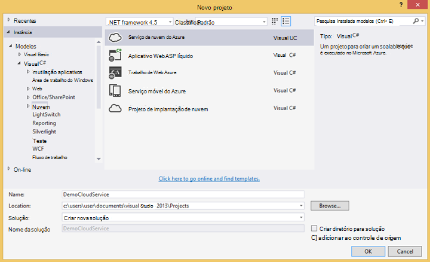

<properties 
    pageTitle="Amostra de código: analisar dados exportados de obtenção de informações de aplicativo" 
    description="O código de sua própria análise de telemetria em ideias de aplicativo usando o recurso de exportação contínuo. Salve dados SQL." 
    services="application-insights" 
    documentationCenter=""
    authors="mazharmicrosoft" 
    manager="douge"/>

<tags 
    ms.service="application-insights" 
    ms.workload="tbd" 
    ms.tgt_pltfrm="ibiza" 
    ms.devlang="na" 
    ms.topic="article" 
    ms.date="01/05/2016" 
    ms.author="awills"/>
 
# Amostra de código: analisar dados exportados de obtenção de informações de aplicativo

Este artigo mostra como processar dados JSON exportados de obtenção de informações do aplicativo. Como exemplo, vamos escrever código para mover os dados de telemetria do [Ideias de aplicativo do Visual Studio] [ start] em um banco de dados do SQL Azure usando [Exportar contínuo][export]. (Você também pode obter este [usando a análise de fluxo](app-insights-code-sample-export-sql-stream-analytics.md), mas veja nosso objetivo é mostrar algum código.) 

Exportar contínuo passa sua telemetria ao armazenamento do Azure no formato JSON, portanto vamos escrever algum código para analisar os objetos JSON e criar linhas em uma tabela de banco de dados.

Mais geralmente, exportar contínuo é a maneira de fazer sua própria análise da telemetria enviar seus aplicativos de obtenção de informações do aplicativo. Você pode adaptar este exemplo de código para fazer outras coisas com a telemetria exportada.

Vamos começar com a suposição de que você já tem o aplicativo que você deseja monitorar.

## Adicionar o aplicativo ideias SDK

Monitorar seu aplicativo, você [Adicionar um SDK de obtenção de informações do aplicativo] [ start] ao seu aplicativo. Há diferentes SDKs e auxiliar ferramentas para diferentes plataformas, IDEs e idiomas. Você pode monitorar páginas da web, Java ou ASP.NET servidores web e dispositivos móveis de vários tipos. Todos os SDK do envia telemetria para o [portal de obtenção de informações de aplicativo][portal], onde você pode usar nossa análise avançada e ferramentas de diagnóstico e exporte os dados para armazenamento.

Introdução:

1. Obter uma [conta do Microsoft Azure](https://azure.microsoft.com/pricing/).
2. No [portal do Azure][portal], adicionar um novo recurso de obtenção de informações do aplicativo para o aplicativo:

    

    (O tipo de aplicativo e de assinatura podem ser diferentes.)
3. Abra o início rápido para saber como configurar o SDK do seu tipo de aplicativo.

    

    Se o tipo de aplicativo não estiver listado, dê uma olhada na [Introdução] [ start] página.

4. Neste exemplo, estamos monitorando um aplicativo web, portanto, podemos usar as ferramentas Azure no Visual Studio para instalar o SDK. Contamos a ela o nome do nosso recurso de obtenção de informações do aplicativo:

    

## Criar um armazenamento no Azure

Dados de obtenção de informações de aplicativo sempre são exportados para uma conta de armazenamento do Azure no formato JSON. É a partir desse armazenamento que seu código lerá os dados.

1. Criar uma conta de armazenamento "clássico" em sua assinatura no [portal do Azure][portal].

    

2. Criar um contêiner

    

## Iniciar exportação contínua para armazenamento do Azure

1. No portal do Azure, navegue até o recurso de obtenção de informações do aplicativo que você criou para seu aplicativo.

    

2. Crie uma exportação contínua.

    

    Selecione a conta de armazenamento que você criou anteriormente:

    
    
    Defina os tipos de eventos que você deseja ver:

    

3. Permitir que alguns dados acumular. A apresentação e permitir que as pessoas usam seu aplicativo por um tempo. Telemetria chegarão e você verá gráficos estatísticos no [Explorador de métricas](app-insights-metrics-explorer.md) e eventos individuais na [pesquisa de diagnóstico](app-insights-diagnostic-search.md). 

    E também, os dados serão exportar para o seu armazenamento. 

4. Inspecione os dados exportados. No Visual Studio, escolha **Exibir / nuvem Explorer**e abra o Azure / armazenamento. (Se você não tiver essa opção de menu, você precisa instalar o SDK do Azure: Abra a caixa de diálogo Novo projeto e Visual c# / nuvem / obter Microsoft Azure SDK do .NET.)

    

    Tome nota da parte comuns do nome do caminho, que é derivado da chave de nome e instrumentação do aplicativo. 

Os eventos são gravados blob arquivos no formato JSON. Cada arquivo pode conter um ou mais eventos. Portanto, podemos gostaria de ler os dados de evento e filtrar os campos que queremos. Existem em todos os tipos de coisas que podemos fazer com os dados, mas nosso plano hoje é escrever um código para mover os dados para um banco de dados do SQL. Que será mais fácil executar muitas consultas interessantes.

## Criar um banco de dados do SQL Azure

Neste exemplo, vamos escrever código para enviar os dados em um banco de dados.

Novamente, iniciando da sua assinatura no [portal Azure][portal], criar o banco de dados (e um novo servidor, a menos que você já tem um) para o qual você vai escrever os dados.

Certifique-se de que o servidor de banco de dados permite acesso aos serviços Azure:

## Criar uma função de trabalho 

Agora finalmente podemos escrever [algum código](https://sesitai.codeplex.com/) para analisar o JSON nas bolhas exportados e criar registros do banco de dados. Como o armazenamento de exportação e o banco de dados forem no Azure, vamos executar o código em uma função de trabalho Azure.

Este código extrai automaticamente quaisquer propriedades estão presentes no JSON. Para obter descrições das propriedades, consulte [Exportar modelo de dados](app-insights-export-data-model.md).

#### Criar projeto de função de trabalho

No Visual Studio, crie um novo projeto para a função de trabalho:

#### Conectar-se para a conta de armazenamento

No Azure, obtenha a cadeia de conexão da sua conta de armazenamento:

No Visual Studio, defina as configurações de função de trabalho com a cadeia de conexão de conta de armazenamento:

#### Pacotes

No Solution Explorer, clique com botão direito seu projeto de função de trabalho e escolha gerenciar pacotes do NuGet.
Pesquise e instale esses pacotes: 

 * EntityFramework 6.1.2 ou posterior - usaremos isso para gerar o esquema de tabela DB dinamicamente, com base no conteúdo do JSON no blob.
 * JsonFx - usaremos isso para o nivelamento o JSON propriedades de classe c#.

Use esta ferramenta para gerar classe c# reduzir nosso documento JSON único. Requer pequenas alterações como o nivelamento matrizes JSON em única c# propriedade em Ativar única coluna na tabela do banco de dados (ex. urlData_port) 

 * [Gerador de classe JSON c#](http://jsonclassgenerator.codeplex.com/)

## Código 

Você pode colocar este código em `WorkerRole.cs`.

#### Importa

    using Microsoft.WindowsAzure.Storage;

    using Microsoft.WindowsAzure.Storage.Blob;

#### Recuperar a cadeia de conexão de armazenamento

    private static string GetConnectionString()
    {
      return Microsoft.WindowsAzure.CloudConfigurationManager.GetSetting("StorageConnectionString");
    }

#### Executar o trabalhador em intervalos regulares

Substituir o método de execução existente e, em seguida, escolha o intervalo que você preferir. Ele deve ser pelo menos uma hora, porque o recurso de exportação conclui um objeto JSON em uma hora.

    public override void Run()
    {
      Trace.TraceInformation("WorkerRole1 is running");

      while (true)
      {
        Trace.WriteLine("Sleeping", "Information");

        Thread.Sleep(86400000); //86400000=24 hours //1 hour=3600000
                
        Trace.WriteLine("Awake", "Information");

        ImportBlobtoDB();
      }
    }

#### Inserir cada objeto JSON como uma linha da tabela

    public void ImportBlobtoDB()
    {
      try
      {
        CloudStorageAccount account = CloudStorageAccount.Parse(GetConnectionString());

        var blobClient = account.CreateCloudBlobClient();
        var container = blobClient.GetContainerReference(FilterContainer);

        foreach (CloudBlobDirectory directory in container.ListBlobs())//Parent directory
        {
          foreach (CloudBlobDirectory subDirectory in directory.ListBlobs())//PageViewPerformance
          {
            foreach (CloudBlobDirectory dir in subDirectory.ListBlobs())//2015-01-31
            {
              foreach (CloudBlobDirectory subdir in dir.ListBlobs())//22
              {
                foreach (IListBlobItem item in subdir.ListBlobs())//3IAwm6u3-0.blob
                {
                  itemname = item.Uri.ToString();
                  ParseEachBlob(container, item);
                  AuditBlob(container, directory, subDirectory, dir, subdir, item);
                } //item loop
              } //subdir loop
            } //dir loop
          } //subDirectory loop
        } //directory loop
      }
      catch (Exception ex)
      {
        //handle exception
      }
    }

#### Analisar cada blob

    private void ParseEachBlob(CloudBlobContainer container, IListBlobItem item)
    {
      try
      {
        var blob = container.GetBlockBlobReference(item.Parent.Prefix + item.Uri.Segments.Last());
    
        string json;
    
        using (var memoryStream = new MemoryStream())
        {
          blob.DownloadToStream(memoryStream);
          json = System.Text.Encoding.UTF8.GetString(memoryStream.ToArray());
    
          IEnumerable<string> entities = json.Split('\n').Where(s => !string.IsNullOrWhiteSpace(s));
    
          recCount = entities.Count();
          failureCount = 0; //resetting failure count
    
          foreach (var entity in entities)
          {
            var reader = new JsonFx.Json.JsonReader();
            dynamic output = reader.Read(entity);
    
            Dictionary<string, object> dict = new Dictionary<string, object>();
    
            GenerateDictionary((System.Dynamic.ExpandoObject)output, dict, "");
    
            switch (FilterType)
            {
              case "PageViewPerformance":
    
              if (dict.ContainsKey("clientPerformance"))
                {
                  GenerateDictionary(((System.Dynamic.ExpandoObject[])dict["clientPerformance"])[0], dict, "");
                }
    
              if (dict.ContainsKey("context_custom_dimensions"))
              {
                if (dict["context_custom_dimensions"].GetType() == typeof(System.Dynamic.ExpandoObject[]))
                {
                  GenerateDictionary(((System.Dynamic.ExpandoObject[])dict["context_custom_dimensions"])[0], dict, "");
                }
              }
    
            PageViewPerformance objPageViewPerformance = (PageViewPerformance)GetObject(dict);
    
            try
            {
              using (var db = new TelemetryContext())
              {
                db.PageViewPerformanceContext.Add(objPageViewPerformance);
                db.SaveChanges();
              }
            }
            catch (Exception ex)
            {
              failureCount++;
            }
            break;
    
            default:
            break;
          }
        }
      }
    }
    catch (Exception ex)
    {
      //handle exception 
    }
    }

#### Preparar um dicionário para cada documento JSON

    private void GenerateDictionary(System.Dynamic.ExpandoObject output, Dictionary<string, object> dict, string parent)
        {
            try
            {
                foreach (var v in output)
                {
                    string key = parent + v.Key;
                    object o = v.Value;

                    if (o.GetType() == typeof(System.Dynamic.ExpandoObject))
                    {
                        GenerateDictionary((System.Dynamic.ExpandoObject)o, dict, key + "_");
                    }
                    else
                    {
                        if (!dict.ContainsKey(key))
                        {
                            dict.Add(key, o);
                        }
                    }
                }
            }
            catch (Exception ex)
            {
            //handle exception 
            }
        }

#### Converter o documento JSON em c# classe telemetria propriedades do objeto

     public object GetObject(IDictionary<string, object> d)
        {
            PropertyInfo[] props = null;
            object res = null;

            try
            {
                switch (FilterType)
                {
                    case "PageViewPerformance":

                        props = typeof(PageViewPerformance).GetProperties();
                        res = Activator.CreateInstance<PageViewPerformance>();
                        break;

                    default:
                        break;
                }

                for (int i = 0; i < props.Length; i++)
                {
                    if (props[i].CanWrite && d.ContainsKey(props[i].Name))
                    {
                        props[i].SetValue(res, d[props[i].Name], null);
                    }
                }
            }
            catch (Exception ex)
            {
            //handle exception 
            }

            return res;
        }

#### Arquivo de classe PageViewPerformance gerado reduzir documento JSON

    public class PageViewPerformance
    {
        [DatabaseGenerated(DatabaseGeneratedOption.Identity)]
        public Guid Id { get; set; }

        public string url { get; set; }

        public int urlData_port { get; set; }

        public string urlData_protocol { get; set; }

        public string urlData_host { get; set; }

        public string urlData_base { get; set; }

        public string urlData_hashTag { get; set; }

        public double total_value { get; set; }

        public double networkConnection_value { get; set; }

        public double sendRequest_value { get; set; }

        public double receiveRequest_value { get; set; }

        public double clientProcess_value { get; set; }

        public string name { get; set; }

        public string internal_data_id { get; set; }

        public string internal_data_documentVersion { get; set; }

        public DateTime? context_data_eventTime { get; set; }

        public string context_device_id { get; set; }

        public string context_device_type { get; set; }

        public string context_device_os { get; set; }

        public string context_device_osVersion { get; set; }

        public string context_device_locale { get; set; }

        public string context_device_userAgent { get; set; }

        public string context_device_browser { get; set; }

        public string context_device_browserVersion { get; set; }

        public string context_device_screenResolution_value { get; set; }

        public string context_user_anonId { get; set; }

        public string context_user_anonAcquisitionDate { get; set; }

        public string context_user_authAcquisitionDate { get; set; }

        public string context_user_accountAcquisitionDate { get; set; }

        public string context_session_id { get; set; }

        public bool context_session_isFirst { get; set; }

        public string context_operation_id { get; set; }

        public double context_location_point_lat { get; set; }

        public double context_location_point_lon { get; set; }

        public string context_location_clientip { get; set; }

        public string context_location_continent { get; set; }

        public string context_location_country { get; set; }

        public string context_location_province { get; set; }

        public string context_location_city { get; set; }
    }

#### DBcontext para interação de SQL pela estrutura de entidades

    public class TelemetryContext : DbContext
    {
        public DbSet<PageViewPerformance> PageViewPerformanceContext { get; set; }
        public TelemetryContext()
            : base("name=TelemetryContext")
        {
        }
    }

Adicionar a cadeia de caracteres de conexão de banco de dados com o nome `TelemetryContext` em `app.config`.

## Esquema (somente informações)

Este é o esquema para a tabela que será gerado para a página.

> [AZURE.NOTE] Você não precisa executar esse script. Os atributos no JSON determinam as colunas na tabela.

    CREATE TABLE [dbo].[PageViewPerformances](
    [Id] [uniqueidentifier] NOT NULL,
    [url] [nvarchar](max) NULL,
    [urlData_port] [int] NOT NULL,
    [urlData_protocol] [nvarchar](max) NULL,
    [urlData_host] [nvarchar](max) NULL,
    [urlData_base] [nvarchar](max) NULL,
    [urlData_hashTag] [nvarchar](max) NULL,
    [total_value] [float] NOT NULL,
    [networkConnection_value] [float] NOT NULL,
    [sendRequest_value] [float] NOT NULL,
    [receiveRequest_value] [float] NOT NULL,
    [clientProcess_value] [float] NOT NULL,
    [name] [nvarchar](max) NULL,
    [User] [nvarchar](max) NULL,
    [internal_data_id] [nvarchar](max) NULL,
    [internal_data_documentVersion] [nvarchar](max) NULL,
    [context_data_eventTime] [datetime] NULL,
    [context_device_id] [nvarchar](max) NULL,
    [context_device_type] [nvarchar](max) NULL,
    [context_device_os] [nvarchar](max) NULL,
    [context_device_osVersion] [nvarchar](max) NULL,
    [context_device_locale] [nvarchar](max) NULL,
    [context_device_userAgent] [nvarchar](max) NULL,
    [context_device_browser] [nvarchar](max) NULL,
    [context_device_browserVersion] [nvarchar](max) NULL,
    [context_device_screenResolution_value] [nvarchar](max) NULL,
    [context_user_anonId] [nvarchar](max) NULL,
    [context_user_anonAcquisitionDate] [nvarchar](max) NULL,
    [context_user_authAcquisitionDate] [nvarchar](max) NULL,
    [context_user_accountAcquisitionDate] [nvarchar](max) NULL,
    [context_session_id] [nvarchar](max) NULL,
    [context_session_isFirst] [bit] NOT NULL,
    [context_operation_id] [nvarchar](max) NULL,
    [context_location_point_lat] [float] NOT NULL,
    [context_location_point_lon] [float] NOT NULL,
    [context_location_clientip] [nvarchar](max) NULL,
    [context_location_continent] [nvarchar](max) NULL,
    [context_location_country] [nvarchar](max) NULL,
    [context_location_province] [nvarchar](max) NULL,
    [context_location_city] [nvarchar](max) NULL,
    CONSTRAINT [PK_dbo.PageViewPerformances] PRIMARY KEY CLUSTERED 
    (
     [Id] ASC
    )WITH (PAD_INDEX = OFF, STATISTICS_NORECOMPUTE = OFF, IGNORE_DUP_KEY = OFF, ALLOW_ROW_LOCKS = ON, ALLOW_PAGE_LOCKS = ON) ON [PRIMARY]
    ) ON [PRIMARY] TEXTIMAGE_ON [PRIMARY]

    GO

    ALTER TABLE [dbo].[PageViewPerformances] ADD  DEFAULT (newsequentialid()) FOR [Id]
    GO

Para ver este exemplo em ação, [Baixe](https://sesitai.codeplex.com/) o código de trabalho completo, altere o `app.config` configurações e publicar a função de trabalho no Azure.

## Artigos relacionados

* [Exportar para o SQL usando uma função de trabalho](app-insights-code-sample-export-telemetry-sql-database.md)
* [Exportar contínuo na obtenção de informações de aplicativo](app-insights-export-telemetry.md)
* [Obtenção de informações de aplicativo](https://azure.microsoft.com/services/application-insights/)
* [Exportar modelo de dados](app-insights-export-data-model.md)
* [Mais exemplos e instruções passo a passo](app-insights-code-samples.md)

<!--Link references-->

[diagnostic]: app-insights-diagnostic-search.md
[export]: app-insights-export-telemetry.md
[metrics]: app-insights-metrics-explorer.md
[portal]: http://portal.azure.com/
[start]: app-insights-overview.md

 
