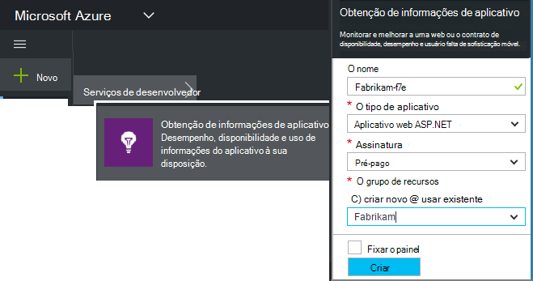
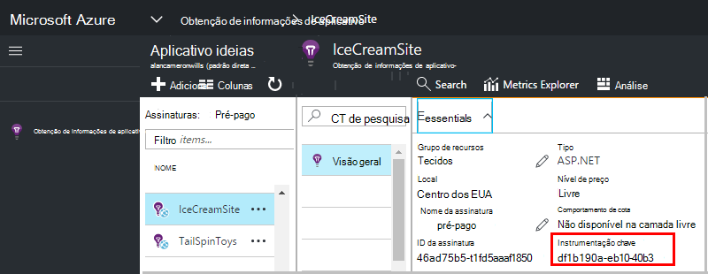

<properties 
    pageTitle="Criar um novo recurso de obtenção de informações de aplicativo | Microsoft Azure" 
    description="Configure o monitoramento de obtenção de informações do aplicativo para um novo aplicativo ao vivo. Abordagem baseada na Web." 
    services="application-insights" 
    documentationCenter=""
    authors="alancameronwills" 
    manager="douge"/>

<tags 
    ms.service="application-insights" 
    ms.workload="tbd" 
    ms.tgt_pltfrm="ibiza" 
    ms.devlang="na" 
    ms.topic="article" 
    ms.date="08/26/2016" 
    ms.author="awills"/>

# Criar um recurso de obtenção de informações de aplicativo

Obtenção de informações do Visual Studio aplicativo exibe dados sobre seu aplicativo em um *recurso*do Microsoft Azure. Criando um novo recurso, portanto, faz parte de [configuração do aplicativo ideias para monitorar a um novo aplicativo][start]. Em muitos casos, isso pode ser feito automaticamente pelo IDE e que é a maneira recomendada onde ele está disponível. Mas em alguns casos, você criar um recurso manualmente.

Após ter criado o recurso, você obtenha sua chave de instrumentação e usá-lo para configurar o SDK no aplicativo. Envia a telemetria ao recurso.

## Inscrever-se ao Microsoft Azure

Se você ainda não tem uma conta da [Microsoft conta, obtenha um agora](http://live.com). (Se você usar os serviços, como Outlook.com, OneDrive, Windows Phone ou XBox Live, você já tem uma conta da Microsoft.)

Você também precisará uma assinatura do [Microsoft Azure](http://azure.com). Se a sua equipe ou organização tiver uma assinatura do Azure, o proprietário pode adicioná-lo a ele, usando seu Windows Live ID.

Ou você pode criar uma nova assinatura. A conta gratuita permite que você experimente tudo no Azure. Após o período de avaliação expira, pode achar a assinatura flexível apropriado, como você não cobrado gratuitamente serviços. 

Quando você tem acesso a uma assinatura, login de obtenção de informações do aplicativo em [http://portal.azure.com](https://portal.azure.com)e usa o Live ID para efetuar login.

## Criar um recurso de obtenção de informações de aplicativo
  

No [portal.azure.com](https://portal.azure.com), adicione um recurso de obtenção de informações do aplicativo:

* **Tipo de aplicativo** afeta o que você vê na lâmina de visão geral e as propriedades disponíveis no [Explorador de métrica][metrics]. Se você não vir seu tipo de aplicativo, escolha ASP.NET.
* **Grupo de recursos** é uma conveniência para gerenciar propriedades de controle de acesso, como. Se você já tiver criado outros recursos Azure, você pode optar por colocar esse novo recurso no mesmo grupo.
* **Assinatura** é a sua conta de pagamento no Azure.
* **Local** é onde podemos manter os dados. Atualmente ele não pode ser alterado.
* **Adicionar à startboard** coloca um bloco de acesso rápido para o recurso em sua página inicial do Azure. Recomendado.

Quando seu aplicativo tiver sido criado, abre uma nova lâmina. Isso é onde você verá dados de uso e desempenho sobre seu aplicativo. 

Para obter voltar a ele na próxima vez que você fazer login no Azure, procure para o bloco de início rápido do seu aplicativo no quadro de início (tela inicial). Ou clique em Procurar para localizá-lo.

## Copiar a chave de instrumentação

A chave de instrumentação identifica o recurso que você criou. Você precisará delas para dar o SDK.

## Instalar o SDK em seu aplicativo

Instale as aplicativo ideias SDK em seu aplicativo. Esta etapa depende muito do tipo de seu aplicativo. 

Use a tecla de instrumentação para configurar [o SDK instalados em seu aplicativo][start].

O SDK inclui módulos padrão que envia telemetria sem precisar escrever nenhum código. Para acompanhar ações do usuário ou diagnosticar problemas de forma mais detalhada, [usar a API] [ api] para enviar sua própria telemetria.

## Consulte dados de telemetria

Feche a lâmina de início rápido para retornar à sua blade de aplicativo no portal do Azure.

Clique no bloco de pesquisa para ver o [Diagnóstico de pesquisa][diagnostic], onde os primeiros eventos serão exibida. 

Se você está esperando mais dados, clique em atualizar após alguns segundos.

## Criação automática de um recurso

Você pode escrever um [script do PowerShell](app-insights-powershell-script-create-resource.md) para criar um recurso automaticamente.

## Próximas etapas

* [Criar um painel](app-insights-dashboards.md)
* [Pesquisa de diagnóstico](app-insights-diagnostic-search.md)
* [Explorar métricas](app-insights-metrics-explorer.md)
* [Escrever consultas de análise](app-insights-analytics.md)

<!--Link references-->

[api]: app-insights-api-custom-events-metrics.md
[diagnostic]: app-insights-diagnostic-search.md
[metrics]: app-insights-metrics-explorer.md
[start]: app-insights-overview.md

 