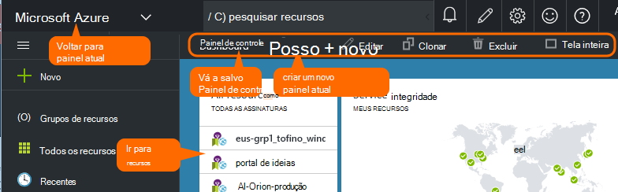
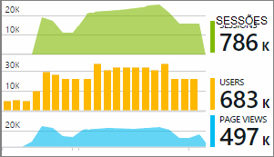

<properties
    pageTitle="Painéis e navegação no portal do aplicativo ideias | Microsoft Azure"
    description="Crie modos de exibição de sua chaves gráficos APM e consultas."
    services="application-insights"
    documentationCenter=""
    authors="alancameronwills"
    manager="douge"/>

<tags
    ms.service="application-insights"
    ms.workload="tbd"
    ms.tgt_pltfrm="ibiza"
    ms.devlang="multiple"
    ms.topic="article" 
    ms.date="10/18/2016"
    ms.author="awills"/>

# Navegação e painéis no portal de obtenção de informações de aplicativo

Depois que você tiver [configurado a obtenção de informações de aplicativo em seu projeto](app-insights-overview.md), dados de telemetria sobre desempenho e o uso de seu aplicativo serão exibido no recurso de obtenção de informações de aplicativo do seu projeto no [portal do Azure](https://portal.azure.com).

## Localizar seu Telemetria

Entre [portal do Azure](https://portal.azure.com) e navegue para o recurso de obtenção de informações do aplicativo que você criou para seu aplicativo.

A lâmina de visão geral (página) para o aplicativo mostra um resumo das principais métricas diagnósticos do aplicativo e é um gateway para os outros recursos do portal.

Você pode personalizar qualquer um dos outros gráficos e fixá-los a um painel. Dessa forma, você pode reunir os gráficos de chave de diferentes aplicativos.

## Painéis

A primeira coisa que você vê depois de entrar no [portal do Microsoft Azure](https://portal.azure.com) é um painel. Aqui você pode reunir os gráficos que são mais importantes para você em todos os seus recursos Azure, incluindo telemetria de [Ideias de aplicativo do Visual Studio](app-insights-overview.md).
 

1. **Navegar para recursos específicos** , como o seu aplicativo no aplicativo ideias: usar a barra à esquerda.
2. **Retorne ao painel atual**ou alternar para outros modos de exibição recentes: Use o menu suspenso no canto superior esquerdo.
3. **Painéis de mudança**: Use o menu suspenso no título do painel
4. **Criar, editar e compartilhar painéis** na barra de painel.
5. **Editar painel**: passe o mouse sobre um bloco e use sua barra superior para mover, personalizar ou removê-lo.

## Adicionar a um painel

Quando você estiver olhando uma lâmina ou conjunto de gráficos que é particularmente interessante, você pode fixar uma cópia no painel. Você verá próxima vez que você retorne lá.

1. Gráfico de pino ao painel. Uma cópia do gráfico aparece no painel.
2. Fixar a lâmina inteira ao painel - aparece no painel como um bloco que pode ser clicadas.
3. Clique no canto superior esquerdo para retornar ao painel de dados atual. Em seguida, você pode usar o menu suspenso para retornar ao modo de exibição atual.

Observe que os gráficos são agrupados em blocos: um bloco pode conter mais de um gráfico. Fixar o bloco inteiro ao painel.

### Fixar qualquer consulta do Analytics

Você também pode [Fixar Analytics](app-insights-analytics-using.md#pin-to-dashboard) gráficos a um painel [compartilhado](#share-dashboards-with-your-team) . Isso permite que você adicione gráficos de qualquer consulta aleatório junto com as métricas padrão. (Há um custo para este recurso.)

## Ajustar um bloco no painel

Depois de um bloco no painel, você pode ajustá-lo.

1. Adicione um gráfico para a peça. 
2. Defina métrica, agrupar por dimensão e estilo (tabela, gráfico) de um gráfico.
3. Arraste o diagrama para ampliar; Clique no botão Desfazer para redefinir o período de tempo; definir propriedades de filtro para os gráficos no bloco.
4. Definir o título de peças.

Blocos fixados de blades explorer métrica tem mais opções de edição que blocos fixos de uma lâmina de visão geral.

O bloco original que você fixados não é afetado pela suas edições.

## Alternar entre painéis

Você pode salvar mais de um painel e alternar entre eles. Quando você fixa um gráfico ou blade, são adicionados ao painel de dados atual.

Por exemplo, você pode ter um painel de controle para exibir em tela inteira na sala de equipe e outra para desenvolvimento geral.

No painel um blade aparece como um bloco: clicar nele para acessar lâmina. Um gráfico replica o gráfico em seu local original.

## Compartilhar painéis

Quando você tiver criado um painel, você pode compartilhá-la com outros usuários.

Saiba mais sobre [funções e controle de acesso](app-insights-resources-roles-access-control.md).

## Navegação de aplicativo

A lâmina de visão geral é o gateway para obter mais informações sobre o aplicativo.

* **Qualquer gráfico ou bloco** - clique em qualquer lado a lado ou do gráfico para ver mais detalhes sobre o que é exibido.

### Botões de blade de visão geral

* [**Métricas Explorer**](app-insights-metrics-explorer.md) - criar seus próprios gráficos de desempenho e uso.
* [**Pesquisa**](app-insights-diagnostic-search.md) - investigar instâncias específicas de eventos como solicitações, exceções, ou rastreamentos de log.
* [**Análise**](app-insights-analytics.md) - consultas avançadas sobre sua telemetria.
* **Intervalo de tempo** - ajustar o intervalo exibido por todos os gráficos na lâmina.
* **Excluir** - excluir o recurso de obtenção de informações do aplicativo para este aplicativo. Você deve também remova os pacotes de obtenção de informações de aplicativo do seu código de aplicativo, ou edite a [chave de instrumentação](app-insights-create-new-resource.md#copy-the-instrumentation-key) em seu aplicativo para direcionar telemetria para um recurso de obtenção de informações de aplicativo diferente.

### Guia de Essentials

* [Chave de instrumentação](app-insights-create-new-resource.md#copy-the-instrumentation-key) - identifica este recurso do aplicativo. 
* Preços - tornar recursos caps de volume disponíveis e definir.

### Barra de navegação do aplicativo

* **Visão geral** - retornar para a lâmina de visão geral do aplicativo.
* **Log de atividade** - alertas e eventos administrativos Azure.
* [**Controle de acesso**](app-insights-resources-roles-access-control.md) - fornecer acesso aos membros da equipe e outras pessoas.
* [**Marcas**](../resource-group-using-tags.md) - usar marcas para agrupar seu aplicativo com outras pessoas.

INVESTIGAR

* [**Mapa de aplicativo**](app-insights-app-map.md) - Active mapa mostrando os componentes de seu aplicativo, deriva as informações de dependência.
* [**Diagnóstico proativo**](app-insights-proactive-diagnostics.md) - alertas de desempenho recentes de revisão.
* [**Fluxo ao vivo**](app-insights-metrics-explorer.md#live-stream) - um conjunto de métricas de quase instantânea, útil ao implantar uma nova compilação de fixo ou depuração.
* [**Disponibilidade / testes de Web**](app-insights-monitor-web-app-availability.md) -enviar solicitações de normais para seu aplicativo web em torno do world.* 
* [**Falhas, desempenho**](app-insights-web-monitor-performance.md) - exceções, taxas de falha e tempos de resposta para solicitações para o seu aplicativo e para solicitações de seu aplicativo para [dependências](app-insights-asp-net-dependencies.md).
* [**Desempenho**](app-insights-web-monitor-performance.md) - tempo de resposta, tempos de resposta de dependência. 
* [Servidores](app-insights-web-monitor-performance.md) - contadores de desempenho. Disponível se você [instalar o Monitor de Status](app-insights-monitor-performance-live-website-now.md).

* **Navegador** - modo de exibição de página e desempenho de AJAX. Disponível se você [instrumentar suas páginas da web](app-insights-javascript.md).
* **Uso** - modo de exibição de página, usuário e sessão de conta. Disponível se você [instrumentar suas páginas da web](app-insights-javascript.md).

CONFIGURAR

* **Introdução** - tutorial embutida.
* **Propriedades** - chave de instrumentação, assinatura e identificação do recurso.
* [Alertas](app-insights-alerts.md) - configuração de alerta métrica.
* [Exportar contínuo](app-insights-export-telemetry.md) - configurar a exportação de telemetria para armazenamento do Azure.
* [Teste de desempenho](app-insights-monitor-web-app-availability.md#performance-tests) - configure uma carga sintética em seu site.
* [Cota de preços](app-insights-pricing.md) e [amostragem de inclusão](app-insights-sampling.md).
* **Acesso de API** - criar [anotações de lançamento](app-insights-annotations.md) e para a API de acesso de dados.
* [**Itens de trabalho**](app-insights-diagnostic-search.md#create-work-item) - conectar a um sistema de controle para que você possa criar bugs ao inspecionar telemetria de trabalho.

Configurações

* [**Bloqueia**](..\resource-group-lock-resources.md) - bloquear recursos do Azure
* [**Script de automação**](app-insights-powershell.md) - exportar uma definição do recurso Azure para que você possa usá-lo como um modelo para criar novos recursos.

SUPORTE

* **Solicitação de suporte** - exige uma assinatura paga. Consulte também [Obtendo ajuda](app-insights-get-dev-support.md).

## O que vem a seguir?

||
|---|---
|[Explorador de métricas](app-insights-metrics-explorer.md) Métricas de filtro e segmento|
|[Pesquisa de diagnóstico](app-insights-diagnostic-search.md) Localizar e inspecionar eventos, eventos relacionados e criar bugs |
|[Análise](app-insights-analytics.md) Linguagem de consulta avançada| 

