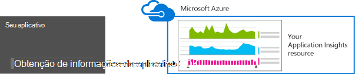

<properties 
    pageTitle="Retenção de dados e armazenamento em ideias de aplicativo" 
    description="Declaração da política de retenção e privacidade" 
    services="application-insights" 
    documentationCenter=""
    authors="alancameronwills" 
    manager="douge"/>

<tags 
    ms.service="application-insights" 
    ms.workload="tbd" 
    ms.tgt_pltfrm="ibiza" 
    ms.devlang="na" 
    ms.topic="article" 
    ms.date="05/17/2016" 
    ms.author="awills"/>

# Coleta de dados, retenção e armazenamento em ideias de aplicativo 

*Obtenção de informações de aplicativo está no modo de visualização.*

Quando você instala [Ideias de aplicativo do Visual Studio] [ start] SDK em seu aplicativo, ele envia telemetria sobre seu aplicativo para a nuvem. Naturalmente, os desenvolvedores responsáveis querem saber exatamente quais dados são enviados, o que acontece com os dados e como eles podem manter controle dela. Em particular, dados confidenciais podem ser enviados, onde ele está armazenado e o nível de segurança é? 

Primeiro, a resposta curta:

* Os módulos de telemetria padrão que ficar "sem a caixa" são provavelmente não enviar dados confidenciais ao serviço. A telemetria trata carga, métricas de desempenho e uso, relatórios de exceção e outros dados de diagnóstico. Os dados de usuário principal visíveis nos relatórios de diagnóstico são URLs; mas seu aplicativo em qualquer caso não deve colocar dados confidenciais em texto sem formatação em uma URL.
* Você pode escrever código que envia telemetria personalizada adicional para ajudá-lo com diagnósticos e o uso de monitoramento. (Essa extensão é um ótimo recurso do aplicativo ideias.) Seria possível, por engano, escrever este código para que inclua pessoais e outros dados confidenciais. Se seu aplicativo funciona com esses dados, você deve aplicar processos de revisão forte a todo o código que você escreve.
* Ao desenvolver e testar seu aplicativo, é fácil inspecionar o que está sendo enviado pelo SDK. Os dados aparecem na janela de saída depuração do IDE e o navegador. 
* Os dados são mantidos em servidores do [Microsoft Azure](http://azure.com) nos EUA. (Mas seu aplicativo pode executar em qualquer lugar.) Azure tem [segurança forte processa e atende a uma ampla variedade de padrões de conformidade](https://azure.microsoft.com/support/trust-center/). Somente você e sua equipe designada tem acesso aos seus dados. Equipe da Microsoft pode têm acesso restrito-lo somente sob determinadas circunstâncias limitadas com o seu conhecimento. Ele está criptografado em trânsito, apesar de não nos servidores.

O restante deste artigo mais totalmente elabora essas respostas. Ele foi projetado para ser independente, para que você pode mostrá-lo aos colegas que não fazem parte de sua equipe imediata.

## O que é a obtenção de informações de aplicativo?

[Obtenção de informações do Visual Studio aplicativo] [ start] é um serviço fornecido pela Microsoft que ajuda a melhorar o desempenho e usabilidade do aplicativo ao vivo. Ele monitora seu aplicativo sempre está funcionando durante o teste e depois publicado ou implantá-lo. Obtenção de informações de aplicativo cria gráficos e tabelas que mostram, por exemplo, que horas do dia que você recebe a maioria dos usuários, responde como o aplicativo é e como ele é atendido por qualquer serviços externos qual ela depende. Se houver falhas, falhas ou problemas de desempenho, você pode pesquisar através dos dados de telemetria em detalhes para diagnosticar a causa. E o serviço lhe enviará emails se houver quaisquer alterações na disponibilidade e o desempenho do aplicativo.

Para acessar essa funcionalidade, você instala um SDK de obtenção de informações do aplicativo em seu aplicativo, que torna-se parte do seu código. Quando seu aplicativo é executado, o SDK monitora sua operação e envia telemetria para o serviço de obtenção de informações do aplicativo. Este é um serviço de nuvem hospedado pelo [Microsoft Azure](http://azure.com). (Mas ideias de aplicativo funciona para aplicativos, não apenas aqueles que são hospedados no Azure).

O serviço de obtenção de informações de aplicativo armazena e analisa a telemetria. Para ver a análise ou a pesquisa por meio da telemetria armazenada, você entrar em sua conta do Azure e abra o recurso de obtenção de informações do aplicativo para o seu aplicativo. Você também pode compartilhar o acesso aos dados com outros membros da equipe ou com os assinantes do Azure especificados.

Você pode ter dados exportados do serviço de obtenção de informações do aplicativo, por exemplo, para um banco de dados ou para ferramentas externas. Você fornecer cada ferramenta com uma chave especial que você obtém do serviço. A chave pode ser revogada se necessário. 

SDKs de ideias de aplicativo estão disponíveis para um intervalo de tipos de aplicativos: serviços hospedados em seus próprios servidores J2EE ou ASP.NET, ou em Azure; da web Web clientes - ou seja, o código em execução em uma página da web; aplicativos de desktop e serviços; aplicativos de dispositivo como Windows Phone, iOS e Android. Todos eles enviarem telemetria para o mesmo serviço.

## Quais dados ele coletar?

### É como os dados é coletados?

Há três fontes de dados:

* O SDK, que você integrar com seu aplicativo [em desenvolvimento](app-insights-asp-net.md) ou [tempo de execução](app-insights-monitor-performance-live-website-now.md). Há SDKs diferentes para diferentes tipos de aplicativos. Também há um [SDK para páginas da web](app-insights-javascript.md), que carrega no navegador do usuário final juntamente com a página.

 * Cada SDK tem um número de [módulos](app-insights-configuration-with-applicationinsights-config.md), que usar técnicas diferentes para coletar diferentes tipos de telemetria.
 * Se você instalar o SDK no desenvolvimento, você pode usar sua API para enviar sua própria telemetria, além de módulos padrão. Este telemetria personalizada pode incluir qualquer dado que você deseja enviar.
* Em alguns servidores web, também existem agentes que executar junto com o aplicativo e enviar telemetria sobre CPU e memória ocupação de rede. Por exemplo, VMs do Azure, Docker hosts e [servidores J2EE](app-insights-java-agent.md) podem ter tais agentes.
* [Testes de disponibilidade](app-insights-monitor-web-app-availability.md) são processos executados pela Microsoft que enviar solicitações para seu aplicativo web em intervalos regulares. Os resultados são enviados para o serviço de obtenção de informações do aplicativo.

### Que tipos de dados são coletados?

As principais categorias são:

* [Telemetria de servidor de web](app-insights-asp-net.md) - solicitações HTTP.  URI, tempo necessário para processar a solicitação, o código de resposta, o endereço IP do cliente. Id da sessão.
* [Páginas da Web](app-insights-javascript.md) - página, contagens de usuário e sessão. Tempos de carregamento de página. Exceções. Chamadas de AJAX.
* Desempenho contadores - memória, CPU, IO, ocupação de rede.
* Cliente e servidor contexto - SO, localidade, tipo de dispositivo, navegador, resolução de tela.
* [Exceções](app-insights-asp-net-exceptions.md) e travamentos - **pilha descarta**, criar id, tipo de CPU. 
* [Dependências](app-insights-asp-net-dependencies.md) - chamadas para serviços externos, como restante, SQL, AJAX. Cadeia de caracteres de URI ou conexão, duração, sucesso, comando.
* [Testes de disponibilidade](app-insights-monitor-web-app-availability.md) - duração de teste e etapas, as respostas.
* [Logs de rastreamento](app-insights-search-diagnostic-logs.md) e [telemetria personalizada](app-insights-api-custom-events-metrics.md) - **nada código nas logs ou telemetria**.

[Mais detalhes](#data-sent-by-application-insights).

## Como verificar o que está sendo coletado?

Se você está desenvolvendo o aplicativo usando o Visual Studio, execute o aplicativo no modo de depuração (F5). A telemetria é exibida na janela de saída. A partir daí, você poderá copiá-lo e formatá-lo como JSON para fácil inspeção. 

Também há um modo de exibição mais legível na janela de diagnóstico.

Páginas da web, abra a janela de depuração do seu navegador.

### Posso escrever código para filtrar a telemetria antes de ser enviado?

Isso seria possível escrevendo uma [telemetria processador plug-in](app-insights-api-filtering-sampling.md).

## Quanto tempo os dados mantidos? 

Pontos de dados bruto (ou seja, itens que você pode inspecionar na pesquisa diagnóstico) são mantidos por 7 dias. Se você precisar manter dados maiores que, você pode usar [exportação contínua](app-insights-export-telemetry.md) copiá-lo para uma conta de armazenamento.

Dados agregados (ou seja, contagens, médias e outros dados estatísticos que você vê no Explorador de métrica) são mantidos em um detalhamento de um minuto por 30 dias, e 1 hora ou 1 dia (dependendo do tipo) pelo menos de 90 dias.

## Quem pode acessar os dados?

Os dados são visíveis para você e, se você tiver uma conta de organização, os membros da equipe. 

Pode ser exportado por você e os membros da equipe e pode ser copiada para outros locais e passado para outras pessoas.

#### O que a Microsoft fazer com as informações do que meu aplicativo envia de obtenção de informações do aplicativo?

A Microsoft usa os dados apenas para fornecer o serviço para você.

## Onde os dados são mantidos? 

* Nos EUA. 

#### Pode ela ser armazenada em outro, por exemplo na Europa? 

* Não no momento. 

#### Isso significa que meu aplicativo deve ser hospedado nos EUA?

* Não. Seu aplicativo pode ser executado em qualquer lugar, em suas própria hosts local ou na nuvem.

## Quão seguros são meus dados?  

Obtenção de informações de aplicativo é um serviço de Azure na visualização. Enquanto na visualização estamos trabalhando em direção protegendo seus dados pelas políticas descritas no [whitepaper Azure segurança, privacidade e conformidade](http://go.microsoft.com/fwlink/?linkid=392408).

Os dados são armazenados em servidores do Microsoft Azure. Para contas no Portal do Azure, restrições de conta são descritas no [documento Azure segurança, privacidade e conformidade](http://go.microsoft.com/fwlink/?linkid=392408). Para contas no Portal de serviços Visual Studio equipe, o documento de [Proteção de dados dos serviços do Visual Studio equipe](http://download.microsoft.com/download/8/E/E/8EE6A61C-44C2-4F81-B870-A267F1DF978C/MicrosoftVisualStudioOnlineDataProtection.pdf) se aplica. 

Acesso aos seus dados por pessoal da Microsoft é restrito. Podemos acessar seus dados apenas com a sua permissão e se é necessário oferecer suporte o uso de obtenção de informações do aplicativo. 

Dados em agregar em todos os aplicativos de todos os nossos clientes (como taxas de dados e tamanho médio dos rastreamentos) são usados para melhorar a obtenção de informações do aplicativo.

#### Telemetria de outra pessoa poderia interferir com meus dados de obtenção de informações do aplicativo?

Elas podem enviar telemetria adicional à sua conta usando a tecla instrumentação, que pode ser encontrada no código de suas páginas da web. Com o suficiente dados adicionais, suas métricas não seriam corretamente representam desempenho e o uso de seu aplicativo.

Se você compartilhar código com outros projetos, lembre-se de remover a chave de instrumentação.

## Os dados são criptografados? 

Não dentro de servidores no momento.

Todos os dados são criptografados como ele se move entre data centers.

#### Os dados são criptografados em trânsito de meu aplicativo para os servidores de obtenção de informações do aplicativo?

Sim, podemos usar https para enviar dados para o portal de quase todos os SDKs, incluindo servidores web, dispositivos e páginas da web HTTPS. A única exceção é enviados de páginas da web HTTP simples de dados. 

## Informações de identificação pessoal

#### Informações pessoalmente identificáveis (IIP) pode ser enviado de obtenção de informações do aplicativo? 

Sim, é possível. 

Como orientação geral:

* Telemetria mais padrão (ou seja, telemetria enviada sem você escrever qualquer código) não inclui IIP explícita. No entanto, talvez seja possível identificar pessoas por interferência de uma coleção de eventos.
* Exceção e rastreamento de mensagens podem conter IIP
* Telemetria personalizada - ou seja, chamadas como TrackEvent que você escreve no código usando os rastreamentos API ou log - pode conter qualquer dado que você escolher.

A tabela no final deste documento contém descrições mais detalhadas sobre os dados coletados.

#### Sou responsável pela conformidade com leis e regulamentos sobre IIP?

Sim. É sua responsabilidade assegurar que a coleta e uso dos dados está em conformidade com leis e regulamentos e com os termos do Microsoft Online Services.

Você deve informar seus clientes adequadamente os dados de que coleta de seu aplicativo e como os dados são usados.

#### Meus usuários podem desativar a obtenção de informações de aplicativo?

Não diretamente. Não fornecemos uma opção que os usuários podem operar para desativar a obtenção de informações do aplicativo.

No entanto, você pode implementar esse um recurso em seu aplicativo. Todos os SDK do incluir uma configuração de API que desativa a coleção de telemetria. 

#### Meu aplicativo acidentalmente está coletando informações confidenciais. Obtenção de informações de aplicativo pode movimente esses dados para que ele não é mantido?

Obtenção de informações de aplicativo não filtrar ou excluir seus dados. Você deve gerenciar os dados adequadamente e evitar o envio desses dados de obtenção de informações do aplicativo.

## Dados enviados por obtenção de informações de aplicativo

SDK do variam entre plataformas e há são vários componentes que você pode instalar. (Se referir a [obtenção de informações de aplicativo - Introdução][start].) Cada componente envia dados diferentes.

#### Classes de dados enviados em cenários diferentes

Sua ação  | Classes de dados coletadas (consulte a próxima tabela)
---|---
[Adicionar SDK do aplicativo ideias para um projeto de web .NET][greenbrown] | ServerContext Inferida Contadores de desempenho Solicitações **Exceções** Sessão usuários
[Instalar o Monitor de Status no IIS][redfield]|Dependências ServerContext Inferida Contadores de desempenho
[Adicionar SDK de obtenção de informações do aplicativo a um aplicativo da web de Java][java]|ServerContext Inferida Solicitação Sessão usuários
[Adicionar JavaScript SDK a página da web][client]|ClientContext  Inferida Página ClientPerf AJAX
[Definir propriedades padrão][apiproperties]|**Propriedades** em todos os eventos padrão e personalizados
[TrackMetric de chamada][api]|Valores numéricos **Propriedades**
[Controle de chamada *][api]|Nome do evento **Propriedades**
[TrackException de chamada][api]|**Exceções** Despejo de pilha **Propriedades**
SDK não consegue coletar dados. Por exemplo:   -não é possível acessar contadores de desempenho  -exceção no inicializador de telemetria | Diagnóstico do SDK
 

Para [SDKs para outras plataformas][platforms], consulte seus documentos.

#### As classes de dados coletados

Os dados coletados classe | Inclui (não uma lista completa) 
---|---
**Propriedades**|**Qualquer dado - determinado pelo seu código**
DeviceContext |Identificação, IP, localidade, modelo do dispositivo, rede, tipo de rede, nome do OEM, resolução de tela, instância de função, o nome de função, o tipo de dispositivo
ClientContext |Sistema operacional, localidade, idioma, rede, resolução da janela
Sessão | id da sessão
ServerContext |Nome da máquina, localidade do sistema operacional, dispositivo, sessão de usuário, contexto de usuário, operação 
Inferida |localização geográfica do endereço IP, carimbo de hora, sistema operacional, navegador
Métricas | Valor e nome métrica
Eventos | Valor e o nome do evento
PageViews | Nome de URL e de página ou tela
Desempenho do cliente | Nome de URL/página, o tempo de carregamento do navegador
AJAX | Chamadas HTTP de página da web para o servidor
Solicitações |URL, duração, código de resposta
Dependências|Tipo (SQL, HTTP,...), a cadeia de conexão ou URI, sincronização/assíncrono, duração, sucesso, instrução SQL (com o Monitor de Status)
**Exceções** | Tipo, **mensagem**, pilhas de chamada, número de linhas e arquivo de origem, id de thread
Trava | Id do processo, a id do processo pai, a id de thread de falha; patch do aplicativo, a id e a compilação;  tipo de exceção, endereço, motivo; símbolos de ofuscadas e registradores, endereços de início e término binários, nome binário e caminho, tipo de cpu
Rastreamento | Nível de gravidade e **mensagem**
Contadores de desempenho | Tempo de processador, memória disponível, taxa de solicitação, taxa de exceção, bytes particulares do processo, taxa es, duração da solicitação, comprimento da fila
Disponibilidade | Código de resposta de teste da Web, a duração de cada etapa de teste, teste nome, carimbo de hora, sucesso, tempo de resposta, local de teste
Diagnóstico do SDK | Mensagem de rastreamento ou exceção 

Você pode [desativar alguns dos dados por ApplicationInsights.config edição][config]

## Créditos

Este produto inclui dados de GeoLite2 criados por MaxMind, disponível em [http://www.maxmind.com](http://www.maxmind.com).

## Vídeos

#### Introdução

> [AZURE.VIDEO application-insights-introduction]

#### Introdução

> [AZURE.VIDEO getting-started-with-application-insights]

<!--Link references-->

[api]: app-insights-api-custom-events-metrics.md
[apiproperties]: app-insights-api-custom-events-metrics.md#properties
[client]: app-insights-javascript.md
[config]: app-insights-configuration-with-applicationinsights-config.md
[greenbrown]: app-insights-asp-net.md
[java]: app-insights-java-get-started.md
[platforms]: app-insights-platforms.md
[pricing]: http://azure.microsoft.com/pricing/details/application-insights/
[redfield]: app-insights-monitor-performance-live-website-now.md
[start]: app-insights-overview.md

 