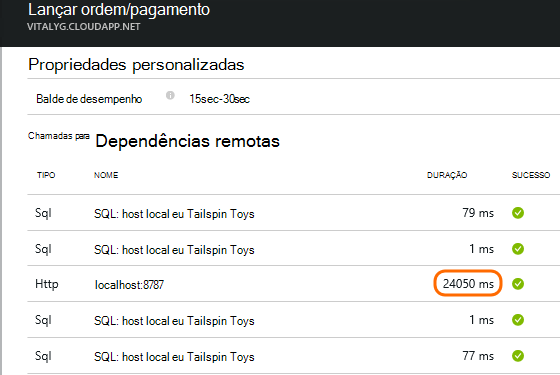

<properties 
    pageTitle="Diagnosticar problemas com dependências ideias de aplicativo" 
    description="Localizar falhas e desempenho lento causados por dependências" 
    services="application-insights" 
    documentationCenter=""
    authors="alancameronwills" 
    manager="douge"/>

<tags 
    ms.service="application-insights" 
    ms.workload="tbd" 
    ms.tgt_pltfrm="ibiza" 
    ms.devlang="na" 
    ms.topic="article" 
    ms.date="05/12/2016" 
    ms.author="awills"/>
 
# <a name="diagnosing-issues-with-dependencies-in-application-insights"></a>Diagnosticar problemas com dependências ideias de aplicativo


Uma *dependência* é um componente externo que é chamado pelo seu aplicativo. Normalmente é um serviço chamado usando HTTP, ou um banco de dados ou um sistema de arquivos. Ou em seu script de página da web, pode ser uma chamada AJAX volta para o servidor. Obtenção de informações de aplicativo de Studio Visual, você pode facilmente ver quanto tempo o aplicativo aguarda dependências e quantas vezes uma chamada de dependência falha.

## <a name="where-you-can-use-it"></a>Onde você pode usá-lo

Prontos para monitoramento de dependência está disponível atualmente para:

* Aplicativos web do ASP.NET e serviços em execução em um servidor IIS ou no Azure
* [Aplicativos da web de Java](app-insights-java-agent.md)
* [Páginas da Web](https://azure.microsoft.com/blog/ajax-collection-in-application-insights/)

Para outros tipos, como os aplicativos do dispositivo, você pode escrever seu próprio monitor usando a [API TrackDependency](app-insights-api-custom-events-metrics.md#track-dependency).

O monitor de dependência de-de-prontos atualmente relatórios chamadas para esses tipos de dependências:

* ASP.NET
 * Bancos de dados SQL
 * Da web do ASP.NET e serviços WCF que usam ligações baseado em HTTP
 * Chamadas HTTP locais ou remotas
 * Azure DocumentDb, tabela, armazenamento de blob e fila
* Java
 * Chamadas para um banco de dados por meio de um driver [JDBC](http://docs.oracle.com/javase/7/docs/technotes/guides/jdbc/) , como MySQL, SQL Server, PostgreSQL ou SQLite.
* Páginas da Web
 * [Chamadas AJAX](app-insights-javascript.md)

Novamente, você pode escrever seus próprio chamadas SDK para monitorar outras dependências.

## <a name="to-set-up-dependency-monitoring"></a>Configurar o monitoramento de dependência

Instale o agente apropriado para o servidor de host.

Plataforma | Instalar
---|---
Servidor IIS | [Instale o Monitor de Status no seu servidor](app-insights-monitor-performance-live-website-now.md) ou [atualizar o aplicativo para .NET framework 4.6 ou posterior](http://go.microsoft.com/fwlink/?LinkId=528259) e instalar o [SDK de obtenção de informações do aplicativo](app-insights-asp-net.md) em seu aplicativo.
Azure Web App | [Extensão de obtenção de informações de aplicativo](app-insights-azure-web-apps.md)
Servidor web Java | [Aplicativos da web de Java](app-insights-java-agent.md)
Páginas da Web | [Monitor de JavaScript](app-insights-javascript.md) (Nenhuma configuração adicional além do monitoramento de página da web)
Serviço de nuvem do Azure |  [Tarefas de inicialização de usar](app-insights-cloudservices.md#dependencies) ou [instalar o .NET framework 4.6 +](../cloud-services/cloud-services-dotnet-install-dotnet.md)  

O Monitor de Status para os servidores IIS não precisa reconstruir seu projeto de origem com o SDK de obtenção de informações do aplicativo. 

## <a name="application-map"></a>Mapa de aplicativo

Mapa de aplicativo atua como um auxílio visual para descobrindo dependências entre os componentes do seu aplicativo. 


De caixas, você pode navegar para dependência relevante e outros elementos gráficos.

Clique na pequena [x] para recolher uma subárvore.

Fixe o mapa para o [Painel de controle](app-insights-dashboards.md), onde ele será totalmente funcional.

[Saiba mais](app-insights-app-map.md).

## <a name="diagnosis"></a>Diagnosticar problemas de desempenho de dependência no servidor web

Para avaliar o desempenho de solicitações no seu servidor:


Role para baixo para examinar a grade de solicitações:


Aquele superior está demorando muito. Vamos ver se podemos pode descobrir onde o tempo gasto.

Clique em linha para ver os eventos de solicitação individuais:


Clique em qualquer instância de execução longa para inspecioná-lo ainda mais.

> [AZURE.NOTE] Role para baixo um pouco para escolher uma instância. Latência no pipeline significa que os dados para as instâncias superiores estão incompletos.

Role para baixo até as chamadas de dependência remoto relacionadas a essa solicitação:



Ele se parece com a maioria da essa solicitação gasto em uma chamada para um serviço local de manutenção de tempo. 

Selecione a linha para obter mais informações:


Os detalhes incluem informações suficientes para diagnosticar o problema.


## <a name="failures"></a>Falhas

Se houver solicitações com falha, clique no gráfico.


Clique em um tipo de solicitação e a instância de solicitação, para encontrar uma falha de chamada para uma dependência remota.


## <a name="custom-dependency-tracking"></a>Dependência personalizada de rastreamento

O módulo de acompanhamento de dependência padrão detecta automaticamente dependências externas como bancos de dados e APIs REST. Mas, você pode querer alguns componentes adicionais sejam tratadas da mesma maneira. 

Você pode escrever código que envia informações de dependência, usando a mesma [API TrackDependency](app-insights-api-custom-events-metrics.md#track-dependency) que é usada pelos módulos padrão.

Por exemplo, se você criar seu código com um assembly que você não tenha escrito por conta própria, você poderia tempo todas as chamadas a ele, para descobrir quais contribuição faz sua tempos de resposta. Para fazer estes dados exibidos nos gráficos de dependência no aplicativo ideias, envie-o usando `TrackDependency`.

```C#

            var success = false;
            var startTime = DateTime.UtcNow;
            var timer = System.Diagnostics.Stopwatch.StartNew();
            try
            {
                success = dependency.Call();
            }
            finally
            {
                timer.Stop();
                telemetry.TrackDependency("myDependency", "myCall", startTime, timer.Elapsed, success);
            }
```

Se desejar desativar o módulo de acompanhamento de dependência padrão, remova a referência à DependencyTrackingTelemetryModule em [ApplicationInsights.config](app-insights-configuration-with-applicationinsights-config.md).


## <a name="ajax"></a>AJAX

Consulte [páginas da Web](app-insights-javascript.md).


 