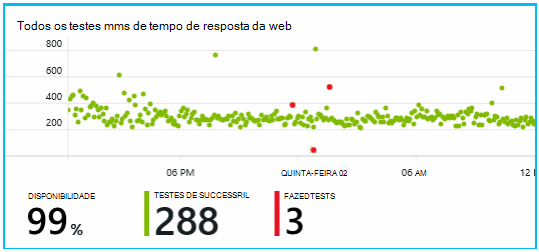

<properties
    pageTitle="Detectar, triagem, diagnosticar"
    description="Analisar falhas e detectar e diagnosticar problemas de desempenho em seus aplicativos"
    authors="alancameronwills"
    services="application-insights"
    documentationCenter=""
    manager="douge"/>

<tags
    ms.service="application-insights"
    ms.workload="tbd"
    ms.tgt_pltfrm="ibiza"
    ms.devlang="na"
    ms.topic="article" 
    ms.date="11/06/2015"
    ms.author="awills"/>

# Detectar, triagem e diagnosticar com ideias de aplicativo

*Obtenção de informações de aplicativo está no modo de visualização.*

Ajuda do aplicativo ideias descobrir como é o desempenho do seu aplicativo e sendo usado quando é ao vivo. E se houver um problema, ele permite que você conhece, ajuda a avaliar o impacto e ajuda a determinar a causa.

Aqui está uma conta a partir de uma equipe que desenvolve aplicativos da web:

* *"Alguns dias atrás, podemos implantado um hotfix 'secundário'. Podemos não executar um teste ampla, mas infelizmente alguma alteração inesperada adquiriu mesclada a carga, causando incompatibilidade entre a frente e back-ends. Imediatamente, exceções de servidor surged, nossa alerta acionado e podemos foram feitos cientes da situação. Alguns cliques ausente no portal de obtenção de informações do aplicativo, obtivemos informações suficientes de exceção callstacks para restringir o problema. Podemos revertida imediatamente e limitado os danos. Obtenção de informações de aplicativo fez essa parte do devops circular muito fácil e acionáveis."*

Vamos ver como uma equipe de desenvolvimento de web típica usa ideias de aplicativo para monitorar o desempenho. Podemos seguirá a equipe no bancária Fabrikam que desenvolve o sistema bancário online (OBS).

A equipe trabalha em um ciclo assim:

Requisitos do feed em seus registros de acumulados de desenvolvimento (lista de tarefas). Em resumo, eles funcionarão sprints, que geralmente oferecem software de trabalho - geralmente na forma de aprimoramentos e extensões para o aplicativo existente. O aplicativo ao vivo com frequência é atualizado com novos recursos. Embora ao vivo, a equipe monitora-lo para uso com a Ajuda de obtenção de informações de aplicativo e o desempenho. Essa análise feeds volta para seus registros de acumulados de desenvolvimento.

A equipe usa ideias de aplicativo para monitorar o aplicativo web ao vivo estreitamente para:
* Desempenho. Eles queiram entender como os tempos de resposta variam com contagem de solicitação; quanto CPU, rede, disco e outros recursos estão sendo usados; e onde estão os gargalos.
* Falhas. Se houver exceções ou falha solicitações, ou se um contador de desempenho ficar fora de seu intervalo confortável, a equipe precisa conhecer rapidamente, para que eles podem agir.
* Uso. Sempre que um novo recurso é lançado, a equipe deseja saber até que ponto ele é usado, e se os usuários têm alguma dificuldade com ele.

Vamos enfocar a parte de comentários do ciclo:

## Detectar baixa disponibilidade

Marcela Markova é desenvolvedor sênior na equipe OBS e leva o cliente potencial sobre o monitoramento do desempenho online. Ela configura vários [testes da web][availability]:

* Um teste único-URL para a página inicial principal para o aplicativo, http://fabrikambank.com/onlinebanking/. Ela define critérios de código HTTP 200 e texto 'Bem-vindo!'. Se esse teste falhar, há algo sério errado com a rede ou os servidores ou talvez um problema de implantação. (Ou alguém alterou bem-vindo! mensagem na página sem deixar sua sabem.)

* Um teste de várias etapa mais profundo, que conecta e obtém uma conta atual listando, alguns detalhes importantes em cada página de verificação. Este teste verifica se o link para o banco de dados de contas está funcionando. Ela usa uma id de cliente fictício: algumas delas são mantidas para fins de teste.

Com esses testes de configurar, Marcela está confiante de que a equipe rapidamente saberá sobre qualquer interrupção.  

Falhas aparecem como pontos vermelhos no gráfico de teste de web:

Mas, mais importante, um alerta sobre qualquer falha será ser enviado à equipe de desenvolvimento. Dessa maneira, elas sabem antes de quase todos os clientes.

## Métricas de desempenho do monitor

Na página Visão geral na obtenção de informações do aplicativo, há um gráfico que mostra uma variedade de [métricas de chave][perf].

Tempo de carregamento de página do navegador é derivado de telemetria enviada diretamente de páginas da web. Tempo de resposta do servidor, contagem de solicitação de servidor e solicitação falha são todos medidos no servidor web e enviadas para a obtenção de informações de aplicativo de lá.

Marcela é um pouco preocupado com no gráfico de resposta do servidor, que mostra o tempo médio entre quando o servidor recebe uma solicitação HTTP no navegador de um usuário e quando ele retorna a resposta. Não é incomum ver uma variação neste gráfico, como varia de carga no sistema. Mas, nesse caso, parece haver que uma correlação entre aumenta pequenas na contagem de solicitações e grande sobe no tempo de resposta. Que pode indicar que o sistema está operando apenas seus limites. 

Ela abre os gráficos de servidores:

Parece ser sem sinal de limitação de recursos, talvez que os impactos os gráficos de resposta do servidor são apenas uma coincidência.

## Alertas

No entanto, ela gostaria de fique atento os tempos de resposta. Se elas forem muito altas, ela quer saber sobre ele imediatamente.

Para que ela define um [alertas][metrics], tempos de resposta maior do que um limite típico. Assim que sua confiança que ela saberá sobre ele se tempos de resposta estiver lentos.

Alertas podem ser definidas em uma ampla variedade de outras métricas. Por exemplo, você pode receber emails se a contagem de exceção fica alta ou a memória disponível vai baixa, ou se houver um pico em solicitações de cliente.

## Alertas de diagnósticos proativos

Próximo dia, um alerta de email chega de obtenção de informações do aplicativo. Mas quando ela abri-la, localiza she não o alerta de tempo de resposta que ela definido. Em vez disso, ele informa ela houve um aumento súbito no solicitações com falha - ou seja, solicitações que retornaram códigos de falha de 500 ou mais.

Solicitações com falha são onde os usuários já viu um erro - geral após uma exceção lançada no código. Talvez elas vir uma mensagem dizendo "Podemos não foi possível atualizar os detalhes agora Desculpe" ou, em absoluto envergonhar pior, um despejo de pilha na tela do usuário, cortesia o servidor da web.

Este alerta é uma surpresa, porque a última vez em que ela observou, a contagem de solicitação falha era Felizmente baixa. Um pequeno número de falhas é esperado em um servidor ocupado. 

Também não era um pouco de uma surpresa para ela porque ela não precisa configurar esse alerta. Na verdade, diagnóstico proativo acompanha automaticamente ideias de aplicativo. Ele automaticamente ajustado para seu aplicativo padrão de falha usual e falhas "é usado para" em uma página específica ou em alta carga ou vinculadas a outras métricas. Ele gera o alarme somente se houver um aumento acima o que se trata de esperar.

Este é um email muito útil. Ele não apenas gerar um alarme; ela faz muitas a triagem e o trabalho de diagnóstico, também.

Ela mostra quantos clientes são afetados e quais páginas da web ou operações. Marcela pode decidir se ela precisa obter toda a equipe trabalhando nisso como um drill fire, ou se ele pode ser ignorado até a próxima semana.

O email também mostra que uma determinada exceção ocorreu e - ainda mais interessante - se a falha está associada a falhas chamadas para um determinado banco de dados. Isso explica por que a falha aparecia inesperadamente apesar de equipe do Marcela não implantou alguma atualização recentemente. 

Ela faz o ping o líder da equipe do banco de dados. Sim, eles lançaram uma correção ativa na última hora meia; e EPA, talvez pode ter havido uma alteração de esquema secundárias...

Portanto, o problema é sobre a maneira de fixo, até mesmo antes de investigar logs e dentro dele decorrente de 15 minutos. No entanto, Marcela clica no link para abrir a obtenção de informações do aplicativo. Ele abre diretamente em uma solicitação com falha, e ela pode ver o banco de dados com falha de chamadas na lista de chamadas de dependência associada. 

## Detectar exceções

Com um pouco de configuração, [exceções](app-insights-asp-net-exceptions.md) são relatados de obtenção de informações do aplicativo automaticamente. Eles também podem ser capturados explicitamente, inserindo chamadas para [TrackException()](app-insights-api-custom-events-metrics.md#track-exception) o código:  

    var telemetry = new TelemetryClient();
    ...
    try
    { ...
    }
    catch (Exception ex)
    {
       // Set up some properties:
       var properties = new Dictionary <string, string>
         {{"Game", currentGame.Name}};

       var measurements = new Dictionary <string, double>
         {{"Users", currentGame.Users.Count}};

       // Send the exception telemetry:
       telemetry.TrackException(ex, properties, measurements);
    }

A equipe de Fabrikam bancária deixou a prática de sempre enviando telemetria em uma exceção, a menos que haja uma recuperação óbvia.  

Na verdade, é ainda mais ampla do que a sua estratégia: enviarem telemetria em todos os casos onde o cliente está frustrado no qual elas queriam fazer, se ele corresponde a uma exceção no código ou não. Por exemplo, se o sistema de transferência bancária entre externa retornará uma mensagem "não é possível concluir esta transação" por algum motivo operacional (nenhuma falha do cliente) eles rastreiam desse evento.

    var successCode = AttemptTransfer(transferAmount, ...);
    if (successCode < 0)
    {
       var properties = new Dictionary <string, string>
            {{ "Code", returnCode, ... }};
       var measurements = new Dictionary <string, double>
         {{"Value", transferAmount}};
       telemetry.TrackEvent("transfer failed", properties, measurements);
    }

TrackException é usado para relatar exceções porque ele envia uma cópia da pilha; TrackEvent é usado para relatar outros eventos. Você pode anexar quaisquer propriedades que podem ser úteis no diagnóstico.

Exceções e eventos aparecem no [Diagnóstico de pesquisa] [ diagnostic] blade. Você pode analisar neles para ver as propriedades adicionais e rastreamento de pilha.

## Monitorar a atividade de usuário

Quando o tempo de resposta é bom consistentemente e há algumas exceções, a equipe de desenvolvimento pode pensar sobre como melhorar a experiência dos usuários e como incentivar mais usuários a atingir metas desejadas.

Por exemplo, uma jornada de usuário típico através do site tem um 'funil' Limpar: muitos clientes examinar as taxas de diferentes tipos de empréstimo; algumas delas preencham o formulário de cotação; e de quem obter uma cotação, algumas ir adiante e tire o empréstimo.

Considerando onde os números maiores de clientes Descartar check-out, a empresa pode trabalhar como chegar mais usuários à parte inferior do funil. Em alguns casos pode haver uma falha de experiência (UX) do usuário - por exemplo, o botão 'Próximo' é difícil encontrar ou as instruções não são óbvias. Provavelmente, há mais significativos razões de negócios para soltar desvantagens: talvez as taxas de empréstimo são muito altas.

Qualquer as razões, os dados ajuda a equipe descobrir o que os usuários estão fazendo. Mais controle chamadas podem ser inseridas para trabalhar mais detalhadas. TrackEvent() pode ser usado para contar quaisquer ações do usuário, dos detalhes finos de cliques do botão individual para realizações significativas como pagar um empréstimo.

A equipe é obtendo usado para ter informações sobre atividades do usuário. Atualmente, sempre que ele criam um novo recurso, trabalham como eles obterá comentários sobre seu uso. Eles design chamadas de acompanhamento para o recurso desde o início. Eles usam os comentários para melhorar o recurso em cada ciclo de desenvolvimento.

## Monitoramento proativo  

Marcela apenas não fica sentado esperando para alertas. Logo após cada nova implantação, ela leva uma olhada [tempos de resposta] [ perf] -a Figura geral e a tabela de solicitações de mais lentas, bem como contagens de exceção.  

Ela pode avaliar o efeito no desempenho de cada implantação, normalmente comparando cada semana com o último. Se houver um worsening súbita, ela gera que com os desenvolvedores relevantes.

## Triagem

Triagem - avaliando a gravidade e a extensão de um problema - é a primeira etapa após a detecção. Devo chamamos check-out a equipe à meia-noite? Ou pode ser deixada até o próximo espaço conveniente no registro acumulado? Há algumas perguntas na triagem.

Quanto está acontecendo? Os gráficos no blade visão geral dar alguns perspectiva de um problema. Por exemplo, o aplicativo de Fabrikam gerou quatro alertas de teste de web uma noite. Observando o gráfico de manhã, a equipe pode ver que havia realmente alguns pontos vermelhos, embora ainda na maioria dos testes foram verde. Fazer buscas detalhadas no gráfico de disponibilidade, estava claro que todos esses problemas intermitentes eram do local de um teste. Isso obviamente foi um problema de rede que afetam somente uma rota e provavelmente desmarque em si.  

Por outro lado, um aumento dramático e estável no gráfico de vezes de resposta ou contagens de exceção óbvios é algo pane sobre.

Uma tática triagem útil é tente você mesmo. Se você tiver o mesmo problema, você sabe que é real.

Que fração dos usuários são afetados? Para obter uma resposta aproximada, divida a taxa de falha com a contagem de sessão.

No caso de resposta lenta, compare a tabela de solicitações de responder mais lento com a frequência de uso de cada página.

Qual é a importância o cenário bloqueado? Se esse for um problema funcional bloqueando uma história de usuário específico, ele importa muito? Se os clientes não pagam suas contas, essa é a séria; Se eles não é possível alterar suas preferências de cor de tela, talvez ele pode esperar. Os detalhes do evento ou exceção, ou a identidade da página lenta, informa onde os clientes estão tendo problemas.

## Diagnóstico

Diagnóstico não é bastante iguais a depuração. Antes de iniciar o rastreamento através do código, você deve ter uma ideia aproximada do motivo, onde e quando o problema está ocorrendo.

**Quando isso acontece?** O modo de exibição histórico fornecido pelos gráficos de evento e métrica facilita a correlação efeitos com as possíveis causas. Se houver picos intermitentes em taxas de hora ou exceção de resposta, examine a contagem de solicitação: se ele picos ao mesmo tempo, se parece com um problema de recurso. Você precisa atribuir mais CPU ou memória? Ou uma dependência que não é possível gerenciar a carga?

**É conosco?**  Se você tiver uma queda súbita no desempenho de um tipo específico de solicitação - por exemplo quando o cliente deseja uma instrução de conta - há uma possibilidade pode ser um subsistema externo em vez de seu aplicativo web. No Explorador de métricas, selecione a taxa de falha de dependência e taxas de duração de dependência e comparar seus históricos sobre o passadas algumas horas ou dias com o problema que é detectado. Se houver são correlação alterações, um subsistema externo pode ser culpado.  

Alguns problemas de dependência lenta são problemas de localização geográfica. Fabrikam bancária usa Azure máquinas virtuais e descobriu que eles inadvertidamente tinham localizados seu servidor web e o servidor de conta em países diferentes. Uma melhora significativa foi colocada migrando um deles.

**O que fizemos?** Se o problema não parece estar em uma dependência e se ele não era sempre lá, ele é provavelmente causado por uma alteração recente. A perspectiva histórica fornecida pelos gráficos métrica e evento facilita a correlação quaisquer alterações súbitas com implantações. Que restringe a pesquisa para o problema.

**O que está acontecendo?** Alguns problemas ocorrem apenas raramente e podem ser difícil rastrear testando offline. Tudo o que podemos fazer é tentar capturar o erro quando ele ocorre ao vivo. Você pode inspecionar os despejos de pilha em relatórios de exceção. Além disso, você pode escrever chamadas de rastreamento, com sua estrutura de log favorito ou com TrackTrace() ou TrackEvent().  

Fabrikam tinha um problema intermitente com transferências entre contas, mas apenas com determinados tipos de conta. Para compreender melhor o que estava acontecendo, eles inseridos TrackTrace() chamadas nos pontos principais no código, como anexar o tipo de conta como uma propriedade para cada chamada. Que tornou mais fácil filtrar apenas os rastreamentos na pesquisa de diagnóstico. Eles também anexado valores de parâmetros como propriedades e medidas para as chamadas de rastreamento.

## Lidando com ele

Depois que você diagnosticou o problema, você pode tornar um plano para corrigi-lo. Talvez você precise reverter uma alteração recente ou talvez basta ir adiante e corrigi-lo. Quando a correção estiver concluída, obtenção de informações de aplicativo informará se você obteve êxito.  

Equipe de desenvolvimento do banco Fabrikam levar uma abordagem mais estruturada para medição de desempenho mais antes usados ideias de aplicativo.

* Eles definir metas de desempenho em termos de medidas específicas na página de visão geral de obtenção de informações do aplicativo.

* Eles projetam medidas de desempenho no aplicativo desde o início, como as métricas medem o progresso do usuário por meio de 'funnels'.  

## Uso

Obtenção de informações de aplicativo também pode ser usadas para saber o que os usuários fazem com um aplicativo. Depois que ele é executado sem problemas, a equipe gostaria de saber quais recursos são os mais populares, o que os usuários, como ou tem dificuldades com e com que frequência eles voltar. Que ajudará a priorizar o seu trabalho futuro. E eles podem planejar medir o sucesso de cada recurso como parte do ciclo de desenvolvimento. [Leia mais][usage].

## Seus aplicativos

Portanto, que é o uso de equipe como uma obtenção de informações de aplicativo não apenas para corrigir problemas individuais, mas para melhorar seu ciclo de vida de desenvolvimento. Espero que ele lhe concedeu algumas ideias sobre como a obtenção de informações de aplicativo pode ajudá-lo a melhorar o desempenho de seus aplicativos.

## Vídeo

[AZURE.VIDEO performance-monitoring-application-insights]

<!--Link references-->

[api]: app-insights-api-custom-events-metrics.md
[availability]: app-insights-monitor-web-app-availability.md
[diagnostic]: app-insights-diagnostic-search.md
[metrics]: app-insights-metrics-explorer.md
[perf]: app-insights-web-monitor-performance.md
[usage]: app-insights-web-track-usage.md
 
