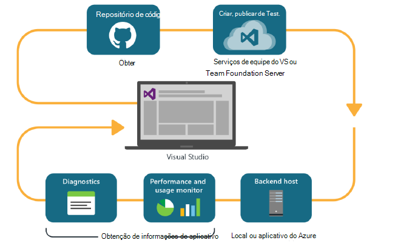
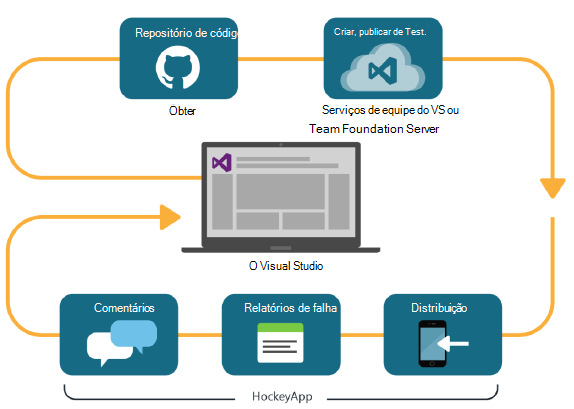

<properties
    pageTitle="Análise de desenvolvedor"
    description="DevOps com Visual Studio, obtenção de informações de aplicativo e HockeyApp"
    authors="alancameronwills"
    services="application-insights"
    documentationCenter=""
    manager="douge"/>

<tags
    ms.service="application-insights"
    ms.workload="tbd"
    ms.tgt_pltfrm="ibiza"
    ms.devlang="na"
    ms.topic="article" 
    ms.date="05/18/2016"
    ms.author="awills"/>

# Análise de desenvolvedor com ideias de aplicativo e HockeyApp

*Obtenção de informações de aplicativo está no modo de visualização.*

Vários projetos operam um ciclo de [DevOps](https://en.wikipedia.org/wiki/DevOps) rápido. Eles construir e distribuir seus aplicativos, obter comentários sobre como ele se comporta e o que os usuários fazem com ele e, em seguida, usam esse conhecimento para planejar futuros ciclos de desenvolvimento. 

Para monitorar o uso e o desempenho, é importante ter telemetria do aplicativo ao vivo, bem como comentários de próprios usuários. 

Muitos sistemas são criados a partir de vários componentes: um serviço web, processadores de back-end ou armazenamentos de dados e software cliente em execução no navegador do usuário ou como um aplicativo em um celular ou outro dispositivo. A telemetria desses componentes diferentes deve ser juntos.

Algumas versões restringiu distribuição para testadores designados; Temos também organizada flighting (testes de novos recursos com audiências restritos) e A | B teste (testes paralelos da interface de usuário alternativo).

Gerenciando distribuições e integração de monitoramento sobre vários componentes de cliente e servidor não não uma tarefa simples. Esse processo é uma parte essencial da arquitetura do aplicativo: não é possível criar um sistema de nesse tipo sem um ciclo de desenvolvimento iterativo e boa de ferramentas de monitoramento.

Neste artigo, veremos como os aspectos de monitoramento do ciclo devOps ajustá-la com as outras partes do processo. 

Se você gostaria de examinar um exemplo específico, há [um estudo de caso interessante](http://aka.ms/mydrivingdocs) que tem vários componentes de cliente e servidor.

## Um ciclo de DevOps

Ferramentas do Visual Studio e a análise de desenvolvedor oferecem uma experiência de devOps bem integrada. Por exemplo, aqui está um ciclo típico para um aplicativo web (que poderia ser Java, Node ou ASP.NET):

* Um desenvolvedor faz check-in para o repositório de código ou mescla a ramificação principal. O repositório é gito nesta ilustração, mas pode ser igualmente [Controle de versão do Team Foundation](https://www.visualstudio.com/docs/tfvc/overview).
* As alterações disparam um teste de unidade e compilação. O serviço de compilação pode ser no [Visual Studio Team Services ou no seu local correspondente, Team Foundation Server](https://www.visualstudio.com/docs/vsts-tfs-overview). 
* Um teste de unidade e compilação bem-sucedida podem [acionar uma implantação automática](https://www.visualstudio.com/docs/release/author-release-definition/more-release-definition). O host do aplicativo da web pode ser seu próprio servidor web ou o Microsoft Azure. 
* Telemetria do aplicativo ao vivo é enviada para a [Obtenção de informações do aplicativo](app-insights-overview.md), tanto do servidor e [de navegadores de cliente](app-insights-javascript.md). Lá, você pode analisar o desempenho de padrões de aplicativo e o uso. Ajuda de poderosas [Ferramentas de pesquisa](app-insights-analytics.md) você diagnosticar problemas. [Alertas](app-insights-alerts.md) Verifique se você sabe sobre um problema assim que ele surge. 
* Seu próximo ciclo de desenvolvimento é informado por sua análise de telemetria da live.

### Aplicativos de desktop e dispositivo

Para dispositivos e aplicativos de desktop, a parte de distribuição do ciclo é um pouco diferente, porque nós não estão carregando apenas um ou dois servidores. Em vez disso, um teste de unidade e compilação bem-sucedida podem [disparador Carregando HockeyApp](https://support.hockeyapp.net/kb/third-party-bug-trackers-services-and-webhooks/how-to-use-hockeyapp-with-visual-studio-team-services-vsts-or-team-foundation-server-tfs). HockeyApp supervisiona distribuição para sua equipe de usuários de teste (ou para o público em geral, se você preferir). 

HockeyApp também coleta dados de desempenho e uso, nos formulários de:

* Comentários do usuário literalmente com capturas de tela
* Relatórios de falha
* Telemetria personalizada codificada por você.

Novamente, o ciclo de devOps é concluído ao fazer seus planos de desenvolvimento futuro acordo com os comentários obtida.

## Configurando a análise de desenvolvedor

Para cada componente do seu aplicativo - móvel ou web ou área de trabalho - as etapas são basicamente o mesmo. Para muitos tipos de aplicativo, o Visual Studio executa automaticamente algumas dessas etapas.

1. Adicione o SDK adequado para o seu aplicativo. Para aplicativos de dispositivo, é HockeyApp e serviços da web é obtenção de informações do aplicativo. Cada tem diversas variantes para diferentes plataformas. (Também é possível usar o SDK para aplicativos de desktop, embora recomendamos HockeyApp.)
2. Registre seu aplicativo com o portal de obtenção de informações de aplicativo ou HockeyApp, dependendo do SDK que você usou. Isso é onde você verá a análise de seu aplicativo ao vivo. Você recebe uma chave de instrumentação ou ID que você configurar seu aplicativo para que o SDK sabe onde enviar seu telemetria.
3. Adicione código personalizado (se desejar) para fazer o log de eventos ou métricas, para ajudá-lo com diagnósticos ou analisar desempenho ou uso. Há muitas monitoramento integrado, portanto você não precisará isso no seu ciclo de primeiro.
3. Para aplicativos de dispositivo:
 * Carregue uma compilação de depuração HockeyApp. A partir daí, você pode distribuí-lo para uma equipe de usuários de teste. Sempre que você carregar constrói subsequentes, a equipe será notificada.
 * Quando você configura seu contínuo criar serviço, crie uma definição de lançamento que usa a etapa plug-in para carregar em HockeyApp.

### Análise e exportação para HockeyApp Telemetria

Você pode investigar HockeyApp personalizado e faça logon usando os recursos de análise e exportar contínua de obtenção de informações de aplicativo configurando [uma ponte](app-insights-hockeyapp-bridge-app.md)de telemetria.

## Próximas etapas
 
Aqui estão as instruções detalhadas para diferentes tipos de aplicativo:

* [Aplicativo web do ASP.NET](app-insights-asp-net.md) 
* [Java web app](app-insights-java-get-started.md)
* [Node web app](https://github.com/Microsoft/ApplicationInsights-node.js)
* [aplicativo iOS](https://support.hockeyapp.net/kb/client-integration-ios-mac-os-x-tvos/hockeyapp-for-ios)
* [Aplicativo do Mac OS X](https://support.hockeyapp.net/kb/client-integration-ios-mac-os-x-tvos/hockeyapp-for-mac-os-x)
* [Aplicativo do Android](https://support.hockeyapp.net/kb/client-integration-android/hockeyapp-for-android-sdk)
* [Aplicativo Windows universal](https://support.hockeyapp.net/kb/client-integration-windows-and-windows-phone/how-to-create-an-app-for-uwp)
* [Aplicativo do Windows Phone 8 e 8.1](https://support.hockeyapp.net/kb/client-integration-windows-and-windows-phone/hockeyapp-for-windows-phone-silverlight-apps-80-and-81)
* [Windows Presentation Foundation aplicativo](https://support.hockeyapp.net/kb/client-integration-windows-and-windows-phone/hockeyapp-for-windows-wpf-apps)

