<properties 
    pageTitle="Usando a pesquisa diagnóstico | Microsoft Azure" 
    description="Pesquisar e filtrar eventos individuais, solicitações e faça logon rastreamentos." 
    services="application-insights" 
    documentationCenter=""
    authors="alancameronwills" 
    manager="douge"/>

<tags 
    ms.service="application-insights" 
    ms.workload="tbd" 
    ms.tgt_pltfrm="ibiza" 
    ms.devlang="na" 
    ms.topic="article" 
    ms.date="06/09/2016" 
    ms.author="awills"/>
 
# Usando a pesquisa de diagnóstico na obtenção de informações de aplicativo

Pesquisa de diagnóstico é um recurso do [Aplicativo ideias] [ start] que você utiliza para encontrar e explorar itens de telemetria individuais, como modos de exibição de página, exceções ou solicitações de web. E você pode exibir rastreamentos de log e eventos que você tenha codificados.

## Onde você vê diagnóstico de pesquisa?

### No portal do Azure

Você pode abrir pesquisa diagnóstico explicitamente:

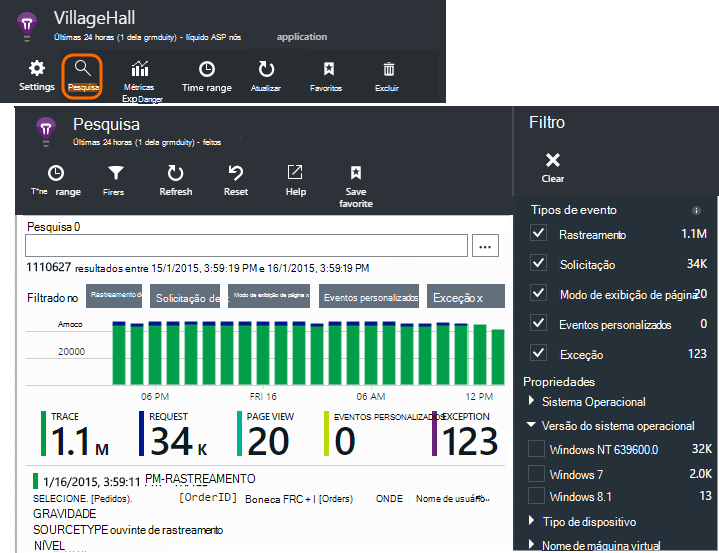

Também é aberta quando você clica em através de alguns gráficos e itens de grade. Nesse caso, seus filtros previamente são definidos para focalizar o tipo de item selecionado. 

Por exemplo, se seu aplicativo é um serviço da web, a lâmina de visão geral mostra um gráfico de volume de solicitações. Clique nele e chegar a um gráfico mais detalhado, com uma listagem mostrando quantas solicitações foram feitas para cada URL. Clique em qualquer linha e você receberá uma lista das solicitações individuais para essa URL:

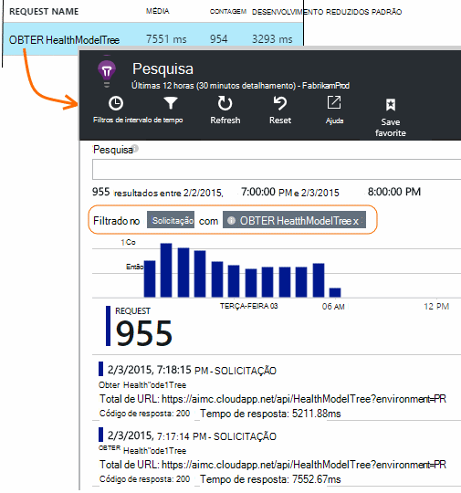

O corpo principal do diagnóstico de pesquisa é uma lista de itens de telemetria - solicitações de servidor, página exibições, eventos personalizados que você tenha codificados e assim por diante. Na parte superior da lista é um resumo gráfico mostrando contagens de eventos ao longo do tempo.

Eventos geralmente aparecem no diagnóstico pesquisa antes de aparecerem no Explorador de métrica. Embora a lâmina atualiza a mesmo em intervalos, você pode clicar em atualizar se você está esperando para um determinado evento.

### No Visual Studio

Abra a janela de pesquisa no Visual Studio:

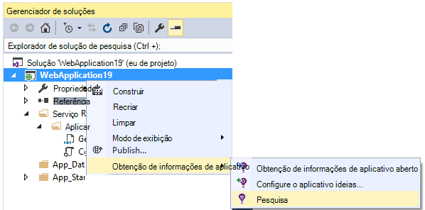

A janela Pesquisar tem os mesmos recursos de portal da web:

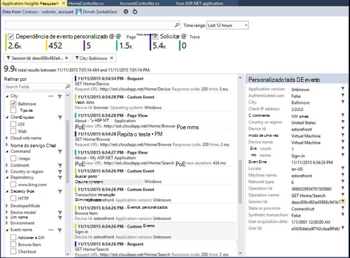

## Amostragem

Se seu aplicativo gera muitas telemetria (e você estiver usando o SDK do ASP.NET versão 2.0.0-beta3 ou posterior), o módulo de amostragem adaptativa reduz automaticamente o volume que é enviado para o portal enviando apenas uma fração representante de eventos. No entanto, eventos relacionados à mesma solicitação vai ser selecionados ou desmarcados como um grupo, para que você possa navegar entre eventos relacionados. 

[Saiba mais sobre amostragem](app-insights-sampling.md).

## Inspecionar itens individuais

Selecione qualquer item de telemetria para ver os campos de chave e itens relacionados. Se você quiser ver o conjunto completo de campos, clique em "...". 

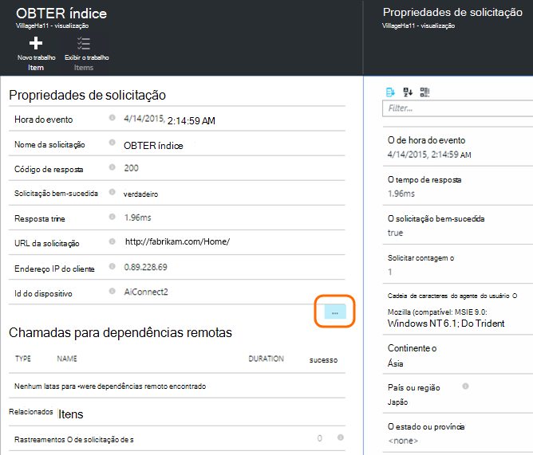

Para localizar o conjunto completo de campos, use cadeias de caracteres simples (sem curingas). Os campos disponíveis dependem do tipo de telemetria.

## Criar item de trabalho

Você pode criar um bug no Visual Studio Team Services com os detalhes de qualquer item de telemetria. 

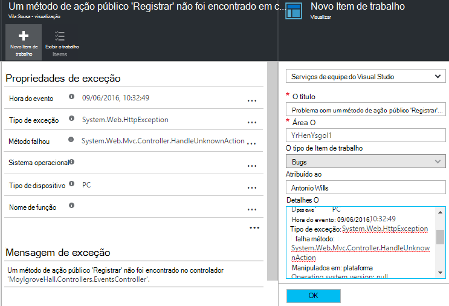

Na primeira vez que você fizer isso, você será solicitado para configurar um link para sua conta de serviços de equipe e projeto.

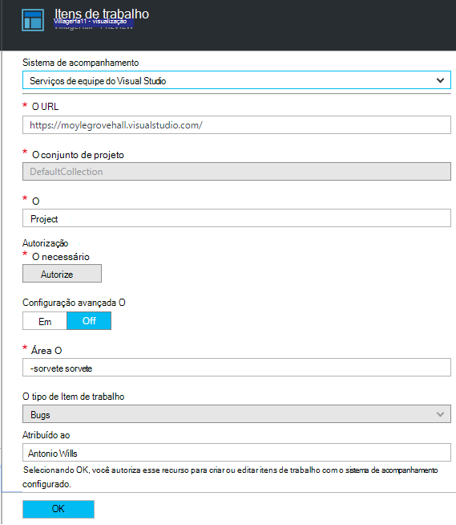

(Você também pode chegar a lâmina configuração em Configurações > itens de trabalho.)

## Tipos de eventos de filtro

Abra a lâmina de filtro e escolha os tipos de eventos que você deseja ver. (Se, mais tarde, você deseja restaurar os filtros com a qual você abriu a lâmina, clique em Redefinir.)

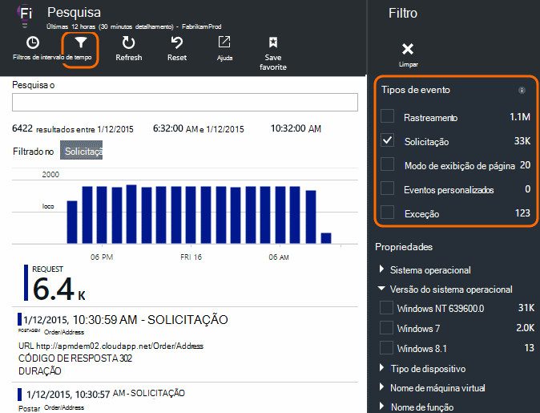

Os tipos de evento são:

* **Rastreamento** - logs de diagnóstico, incluindo as chamadas TrackTrace, log4Net, NLog e System.Diagnostic.Trace.
* **Solicitar** - solicitações HTTP recebidas pelo seu aplicativo de servidor, incluindo páginas, scripts, imagens, arquivos de estilo e dados. Esses eventos são usados para criar a solicitação e resposta gráficos de visão geral.
* **Modo de exibição de página** - telemetria enviada pelo cliente da web, usada para criar relatórios de modo de exibição de página. 
* **Evento personalizado** - se você inseriu chamadas para TrackEvent() em ordem para [monitorar o uso][track], você pode pesquisar aqui.
* **Exceção** - exceções não detectadas no servidor e aqueles que você faça logon usando TrackException().

## Filtrar valores de propriedade

Você pode filtrar eventos nos valores de suas propriedades. As propriedades disponíveis dependem os tipos de evento que você selecionou. 

Por exemplo, escolha solicitações com um código de resposta específica.

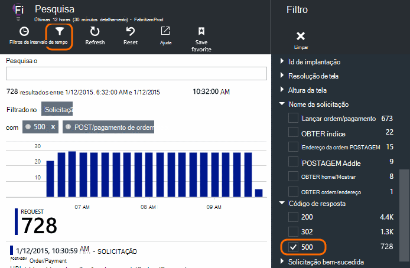

Escolhendo sem valores de uma propriedade específica tem o mesmo efeito que escolher todos os valores; ele desativa a filtragem na propriedade.

### Restringir a sua pesquisa

Observe que as contagens à direita dos valores de filtro mostram quantos ocorrências lá estão no conjunto filtrado atual. 

Neste exemplo, está claro que o `Reports/Employees` solicitação resultados na maioria dos 500 erros:

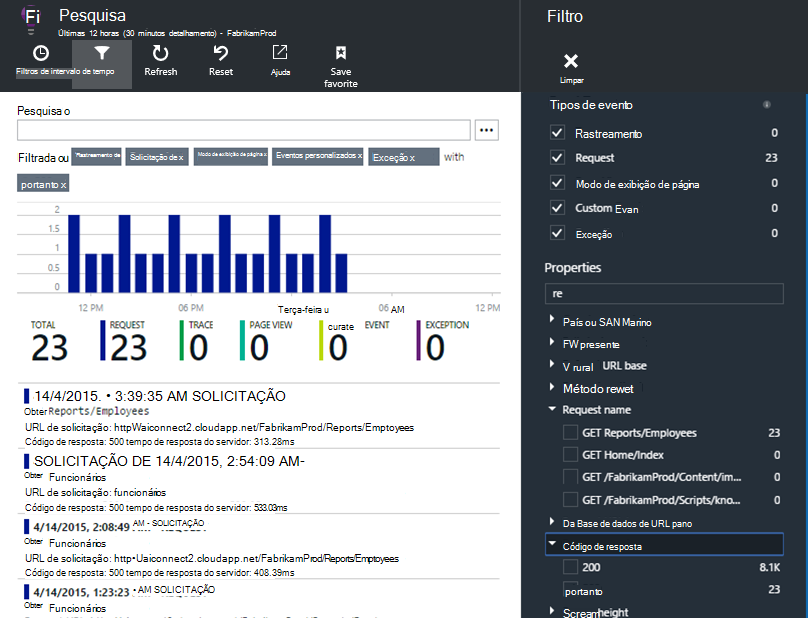

Além disso se desejar Consulte também que outros eventos foram acontecendo durante esse tempo, você pode verificar **incluir eventos com propriedades indefinidos**.

## Remover o tráfego de teste bot e da web

Usar o filtro de **tráfego Real ou sintético** e marque **Real**.

Você também pode filtrar pela **fonte de tráfego sintético**.

## Inspecionar ocorrências individuais

Adicionar esse nome de solicitação para o conjunto de filtro e, em seguida, você pode inspecionar ocorrências individuais desse evento.

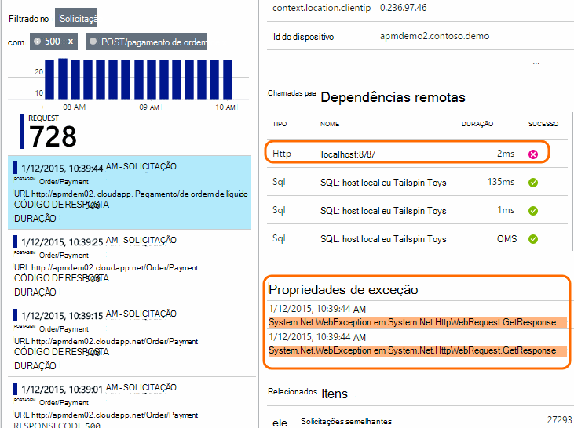

Para eventos de solicitação, os detalhes mostram exceções que ocorreram enquanto a solicitação foi sendo processada.

Clique em uma exceção para ver seus detalhes, incluindo o rastreamento de pilha.

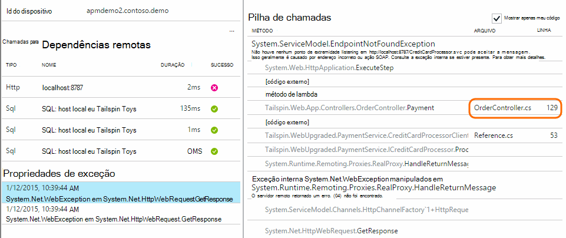

## Encontrar eventos com a mesma propriedade

Localize todos os itens com o mesmo valor de propriedade:

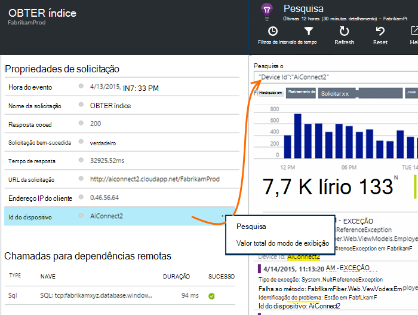

## Pesquisar por valor métrico

Obter solicitações resposta sempre > 5s.  Horários são representados em escalas: 10 000 escalas = 1 ms.

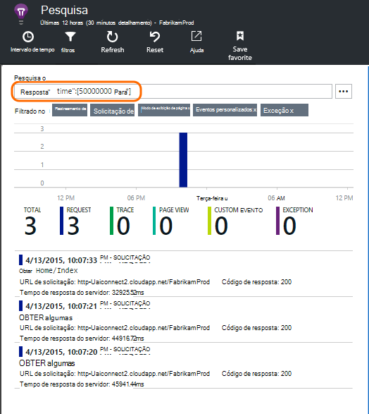

## Pesquisar os dados

Você pode procurar termos em qualquer um dos valores de propriedade. Isso é especialmente útil se você tiver gravado [eventos personalizados] [ track] com valores de propriedade. 

Talvez você queira definir uma hora de intervalo, como pesquisas ao longo de um intervalo menor são mais rápidos. 

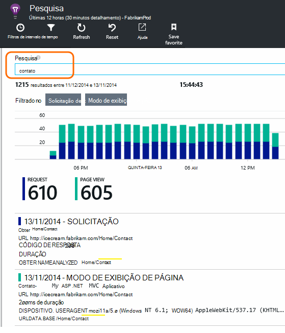

Pesquisar termos, não substrings. Termos são cadeias de caracteres alfanuméricos, incluindo alguns pontuação como '.' e '_'. Por exemplo:

termo|*não* correspondem aos|mas esses coincidem
---|---|---
HomeController.About|sobre Casa|h\*sobre Casa\*
IsLocal|local é \*local|ISL\* IsLocal i\*l\*
Atraso da novato|d w|Novo atraso n\* AND d\*

Aqui estão as expressões de pesquisa que você pode usar:

Exemplo de consulta | Efeito 
---|---
reduzir|Encontrar todos os eventos no intervalo de datas cujos campos incluem o termo "lenta"
banco de dados?|Correspondências database01, databaseAB,... ? não é permitido no início de um termo de pesquisa.
banco de dados * |Corresponde ao banco de dados, database01, databaseNNNN  * não permitidos no início de um termo de pesquisa
Apple e banana|Localize eventos que contenham ambos os termos. Use capital "e", não "e".
Apple banana ou banana da Apple|Localize eventos que contêm um dos termos. Use "Ou", não "ou". < /br/ > curta formulário.
Apple não banana Apple-banana|Localize eventos que contêm um termo, mas não a outro. Forma abreviada.
aplicativo * e banana-(grape pear)|Operadores lógicos e colchetes.
"Métrico": 0 até 500 "Métrico": até 500 * | Localize eventos que contêm as unidades de medida nomeada dentro do intervalo do valor.

## Salvar sua pesquisa

Quando você tiver definido todos os filtros desejado, você pode salvar a pesquisa como um favorito. Se você trabalha em uma conta organizacional, você pode optar por compartilhá-lo com outros membros da equipe.

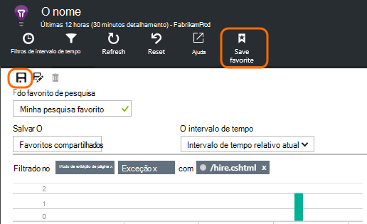

Para ver a pesquisa novamente, **vá para a lâmina de visão geral** e abrir favoritos:

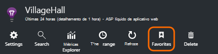

Se você salvou com o intervalo de tempo relativo, a lâmina reaberta tem os dados mais recentes. Se você salvou com o intervalo de tempo absoluto, você verá os mesmos dados sempre.

## Enviar telemetria mais de obtenção de informações de aplicativo

Além da telemetria de-prontos enviada por aplicativo ideias SDK, você pode:

* Capturar rastreamentos de log de sua estrutura de log favoritos no [.NET] [ netlogs] ou [Java][javalogs]. Isso significa que você pode pesquisar seus rastreamentos de log e correlação-los com modos de exibição de página, exceções e outros eventos. 
* [Escrever código] [ track] para enviar eventos personalizados, modos de exibição de página e exceções. 

[Saiba como enviar logs e telemetria personalizada de obtenção de informações do aplicativo][trace].

## P & r

### A quantidade de dados é mantido?

Até 500 eventos por segundo de cada aplicativo. Eventos são mantidos por sete dias.

### Como posso ver os dados de POSTAGEM nas minhas solicitações de servidor?

Podemos não registrar os dados de POSTAGEM automaticamente, mas você pode usar [chamadas TrackTrace ou log][trace]. Coloca os dados de POSTAGEM do parâmetro da mensagem. Você não pode filtrar a mensagem da mesma forma que propriedades, mas o limite de tamanho é mais longo.

## Próximas etapas

* [Enviar logs e telemetria personalizada de obtenção de informações de aplicativo][trace]
* [Configurar a disponibilidade e testes de capacidade de resposta][availability]
* [Solução de problemas][qna]

<!--Link references-->

[availability]: app-insights-monitor-web-app-availability.md
[javalogs]: app-insights-java-trace-logs.md
[netlogs]: app-insights-asp-net-trace-logs.md
[qna]: app-insights-troubleshoot-faq.md
[start]: app-insights-overview.md
[trace]: app-insights-search-diagnostic-logs.md
[track]: app-insights-api-custom-events-metrics.md

 