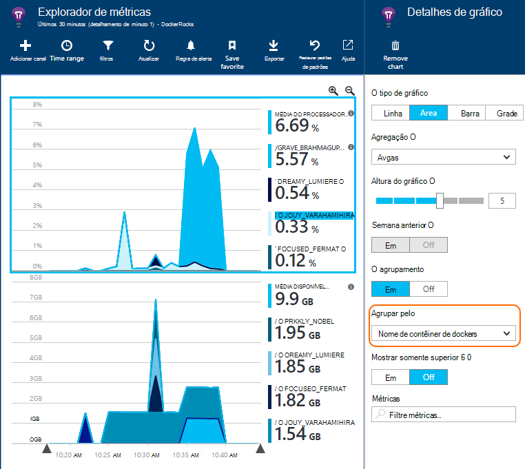

<properties 
    pageTitle="Monitorar aplicativos de Docker na obtenção de informações de aplicativo" 
    description="Exceções, eventos e contadores de desempenho de docker podem ser exibidas no aplicativo ideias, juntamente com a telemetria a partir dos aplicativos contida em recipiente." 
    services="application-insights" 
    documentationCenter=""
    authors="alancameronwills" 
    manager="douge"/>

<tags 
    ms.service="application-insights" 
    ms.workload="tbd" 
    ms.tgt_pltfrm="ibiza" 
    ms.devlang="na" 
    ms.topic="article" 
    ms.date="12/01/2015" 
    ms.author="awills"/>
 
# <a name="monitor-docker-applications-in-application-insights"></a>Monitorar aplicativos de Docker na obtenção de informações de aplicativo

Eventos de ciclo de vida e contadores de desempenho de [Docker](https://www.docker.com/) contêineres podem ser representados no aplicativo ideias. Instalar a imagem de [Obtenção de informações do aplicativo](app-insights-overview.md) em um contêiner em seu host, e ele exibirá contadores de desempenho do host, bem como para as outras imagens.

Com Docker você distribuir seus aplicativos em contêineres leves completos com todas as dependências. Eles executará em qualquer computador host que executa um mecanismo de Docker.

Quando você executa a [imagem de obtenção de informações do aplicativo](https://hub.docker.com/r/microsoft/applicationinsights/) em seu host de Docker, você receberá estas vantagens:

* Ciclo de vida telemetria sobre todos os contêineres em execução no host - iniciar, parar e assim por diante.
* Contadores de desempenho para todos os contêineres. CPU, memória, o uso da rede e muito mais.
* Se você [instalou o SDK do aplicativo ideias](app-insights-java-live.md) nos aplicativos em execução em contêineres, todos o telemetria desses aplicativos terá propriedades adicionais identificando a máquina contêiner e host. Por exemplo, se você tiver instâncias de um aplicativo executado em mais de um host, você facilmente poderá filtrar telemetria seu aplicativo por host.


## <a name="set-up-your-application-insights-resource"></a>Configurar o recurso de obtenção de informações de aplicativo

1. Entre no [Portal do Microsoft Azure](https://azure.com) e abra o recurso de obtenção de informações do aplicativo para o aplicativo; ou [Crie um novo](app-insights-create-new-resource.md). 

    *O recurso que devo usar?* Se os aplicativos que você está executando em seu host foram desenvolvidos por outra pessoa, você precisará [criar um novo recurso de obtenção de informações do aplicativo](app-insights-create-new-resource.md). Isso é onde você pode exibir e analisar a telemetria. (Selecione 'Outro' para o tipo de aplicativo).

    Mas se você for desenvolvedor de aplicativos, em seguida, esperamos que você [adicionou Application ideias SDK](app-insights-java-live.md) para cada um deles. Se eles estiverem todos os componentes realmente de um aplicativo de negócios única, você pode configurar todos eles para enviar telemetria para um recurso, e você vai usar o mesmo recurso para exibir os dados de desempenho e de ciclo de vida de Docker. 

    Um terceiro cenário é que você desenvolveu a maioria dos aplicativos, mas você estiver usando recursos separados para exibir seu telemetria. Nesse caso, você provavelmente também queira criar um recurso separado para os dados de Docker. 

2.  Adicionar o bloco de Docker: escolha **Adicionar bloco**, arraste o bloco de Docker da galeria e clique em **concluído**. 

    


3. Clique na lista suspensa **Essentials** e copie a chave de instrumentação. Você usará isso para informar o SDK onde enviar seu telemetria.


    

Manter janela Navegador útil, enquanto você vai voltar a ele breve para examinar seu telemetria.


## <a name="run-the-application-insights-monitor-on-your-host"></a>Executar o monitor de obtenção de informações do aplicativo em seu host
 
Agora que você tem algum lugar para exibir a telemetria, você pode configurar o aplicativo contida em recipiente que coletará e enviá-lo.

1.  Conecte a seu host de Docker. 
2.  Edite sua chave de instrumentação para esse comando e depois executá-la:
 
    ```

    docker run -v /var/run/docker.sock:/docker.sock -d microsoft/applicationinsights ikey=000000-1111-2222-3333-444444444
    ```

Apenas uma imagem de obtenção de informações de aplicativo é necessária por host Docker. Se seu aplicativo for implantado em vários hosts de Docker, em seguida, repita o comando em cada host.

## <a name="update-your-app"></a>Atualizar seu aplicativo

Se seu aplicativo tem como instrumentos com o [Aplicativo ideias SDK para Java](app-insights-java-get-started.md), adicione a seguinte linha no arquivo ApplicationInsights.xml em seu projeto, na `<TelemetryInitializers>` elemento:

```xml

    <Add type="com.microsoft.applicationinsights.extensibility.initializer.docker.DockerContextInitializer"/> 
```

Isso adiciona informações de Docker como contêiner e identificação de host para cada item de telemetria enviado a partir do seu aplicativo.

## <a name="view-your-telemetry"></a>Exibir seu Telemetria

Volte para o recurso de obtenção de informações de aplicativo no portal do Azure.

Clique no bloco de Docker.

Você verá em breve dados chegando no aplicativo Docker, especialmente se você tiver outros contêineres em execução no seu mecanismo de Docker.


Aqui estão alguns dos modos de exibição que você pode obter.

### <a name="perf-counters-by-host-activity-by-image"></a>Contadores de desempenho pelo host, atividade por imagem


Clique em qualquer nome de host ou imagem para obter mais detalhes.


Para personalizar o modo de exibição, clique em qualquer gráfico, a grade de título, ou use Adicionar gráfico. 

[Saiba mais sobre o explorer métricas](app-insights-metrics-explorer.md).

### <a name="docker-container-events"></a>Eventos de contêiner de docker


Para investigar eventos individuais, clique em [Pesquisar](app-insights-diagnostic-search.md). Pesquisa e filtro para encontrar os eventos que você deseja. Clique em qualquer evento para obter mais detalhes.
 
### <a name="exceptions-by-container-name"></a>Exceções por nome de contêiner
 


### <a name="docker-context-added-to-app-telemetry"></a>Contexto de docker adicionado à telemetria do aplicativo

Solicitação de telemetria enviada a partir do aplicativo instrumentado AI SDK, aprimorada com contexto de Docker:


Tempo do processador e contadores de desempenho de memória disponível, aprimorada e agrupadas por nome de contêiner de Docker:





## <a name="q--a"></a>P & r

*O que ideias de aplicativo dê que eu não consigo obter da Docker?*

* Divisão detalhada dos contadores de desempenho por contêiner e imagem.
* Integre o contêiner e aplicativo dados em um painel de controle.
* [Exportar telemetria](app-insights-export-telemetry.md) para análise posterior para um banco de dados, Power BI ou outro dashboard.

*Como obter telemetria do próprio aplicativo?*

* Instale as aplicativo ideias SDK no aplicativo. Saiba como para: [Java web apps](app-insights-java-get-started.md), [aplicativos web do Windows](app-insights-asp-net.md).
