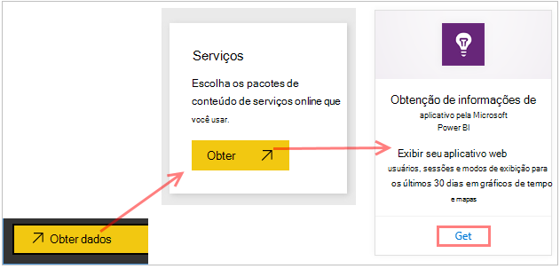
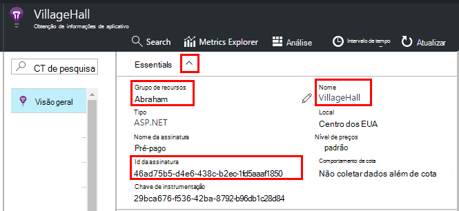
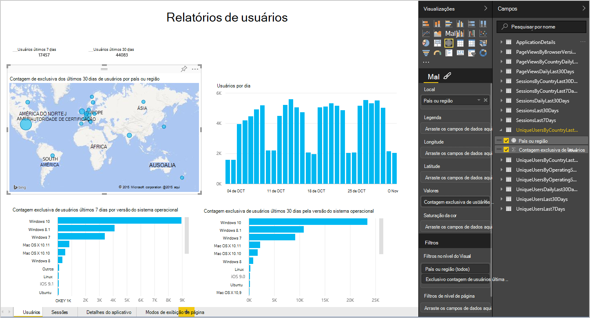
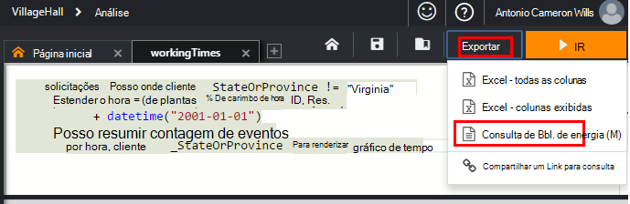
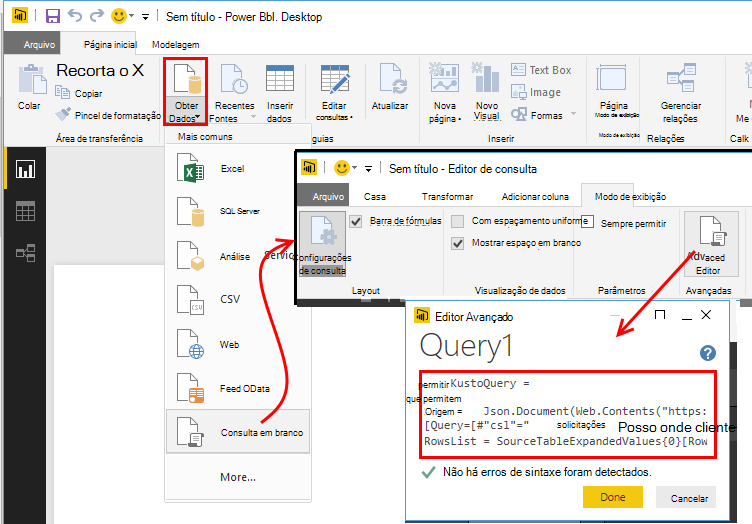
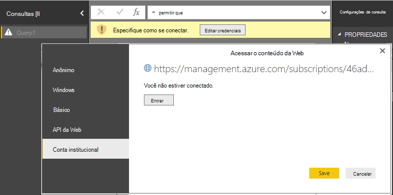
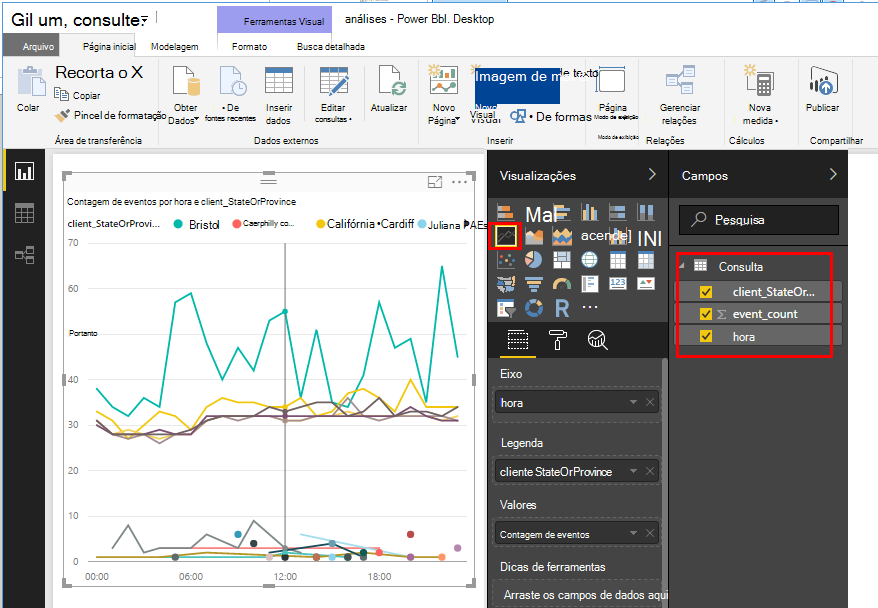
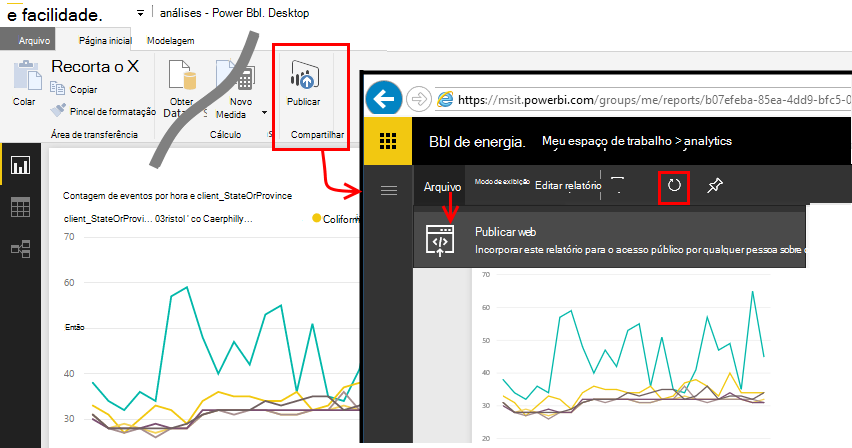

<properties 
    pageTitle="Exportar Power BI de obtenção de informações de aplicativo | Microsoft Azure" 
    description="Análise de consultas pode ser exibido no Power BI." 
    services="application-insights" 
    documentationCenter=""
    authors="noamben" 
    manager="douge"/>

<tags 
    ms.service="application-insights" 
    ms.workload="tbd" 
    ms.tgt_pltfrm="ibiza" 
    ms.devlang="na" 
    ms.topic="article" 
    ms.date="10/18/2016" 
    ms.author="awills"/>

# Feed do Power BI a partir de obtenção de informações de aplicativo

[Power BI](http://www.powerbi.com/) é um conjunto de ferramentas de análise de negócios que ajudam você a analisar dados e compartilhar ideias. Painéis de rich estão disponíveis em cada dispositivo. Você pode combinar dados de várias fontes, inclusive a análise de consultas de [Ideias de aplicativo do Visual Studio](app-insights-overview.md).

Há três métodos recomendados de exportação de dados de obtenção de informações do aplicativo Power BI. Você pode usá-los separadamente ou juntas.

* [**Adaptador de power BI**](#power-pi-adapter) - configurar um painel concluído de telemetria de seu aplicativo. O conjunto de gráficos é predefinido, mas você pode adicionar suas próprias consultas de outras fontes.
* [**Análise de exportar consultas**](#export-analytics-queries) - gravar nenhuma consulta desejada usando a análise e exportá-lo para Power BI. Você pode colocar essa consulta em um painel juntamente com quaisquer outros dados.
* [**Exportação de contínua e a análise de fluxo**](app-insights-export-stream-analytics.md) - isso envolve mais trabalho para configurar. É útil se você quiser manter os dados por longos períodos. Caso contrário, os outros métodos são recomendados.

## Adaptador de energia de BI

Este método cria um painel concluído de telemetria para você. O conjunto de dados inicial predefinido, mas você pode adicionar mais dados a ele.

### Obtenha o adaptador

1. Entrar no [Power](https://app.powerbi.com/)BI.
2. Abrir **obter dados**, **Serviços**, **obtenção de informações de aplicativo**

    

3. Forneça os detalhes do seu recurso de obtenção de informações do aplicativo.

    

4. Aguarde um ou dois minutos para os dados a serem importados.

    

Você pode editar no painel, combinar os gráficos de obtenção de informações do aplicativo com as de outras fontes e a análise de consultas. Não há uma galeria de visualização, onde você pode obter mais gráficos, e cada gráfico tiver um parâmetros que você pode definir.

Após a importação inicial, o painel de controle e os relatórios continuam a atualizar diariamente. Você pode controlar a programação de atualização no conjunto de dados.

## Exportar consultas de análise

Essa rota permite que você escrever qualquer consulta de análise que você gosta e exporte que a um painel do Power BI. (Você pode adicionar ao painel criado pelo adaptador.)

### Uma vez: instalar o Power BI Desktop

Para importar sua consulta de obtenção de informações do aplicativo, você deve usar a versão de área de trabalho do Power BI. Mas, em seguida, você poderá publicá-lo na web ou ao seu espaço de trabalho de nuvem do Power BI. 

Instale o [Power BI Desktop](https://powerbi.microsoft.com/en-us/desktop/).

### Exportar uma consulta de análise

1. [Análise de abrir e gravar sua consulta](app-insights-analytics-tour.md).
2. Testar e refinar a consulta até que você estiver satisfeito com os resultados.
3. No menu **Exportar** , escolha **Power BI (M)**. Salve o arquivo de texto.

    
4. Na área de trabalho do Power BI selecione **obter dados, a consulta em branco** e, em seguida, no editor de consulta, em **Exibir** , selecione **Editor de consulta avançada**.

    Cole o script do idioma M exportado no Editor de consulta avançada.

    

5. Você talvez precise fornecer credenciais para permitir que o Power BI acessar o Azure. Use 'conta organizacional' para entrar com sua conta da Microsoft.

    

6. Escolha uma visualização para a sua consulta e selecione os campos para o eixo x, y e segmentação dimensão.

    

7. Publica seu relatório no seu espaço de trabalho de nuvem do Power BI. A partir daí, você pode incorporar uma versão sincronizada em outras páginas da web.

    
 
8. Atualizar o relatório manualmente em intervalos ou configurar uma atualização programada na página de opções.

## Sobre amostragem

Se seu aplicativo envia muitos dados, o recurso de amostragem adaptativa pode operar e enviar apenas uma porcentagem do seu telemetria. O mesmo é verdadeiro se você definiu manualmente amostragem no SDK ou na inclusão. [Saiba mais sobre amostragem.](app-insights-sampling.md)
 

## Próximas etapas

* [Power BI – Saiba](http://www.powerbi.com/learning/)
* [Tutorial de análise](app-insights-analytics-tour.md)
