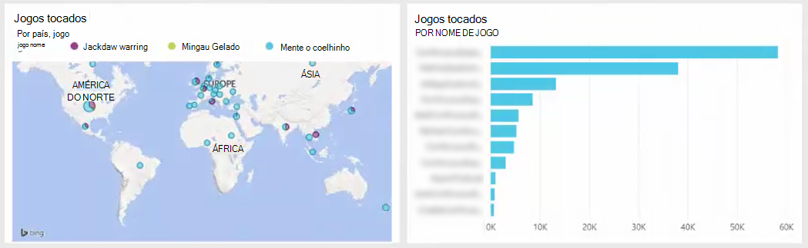

<properties 
    pageTitle="Usar a análise de fluxo para processar dados exportados de obtenção de informações de aplicativo | Microsoft Azure" 
    description="Análise de fluxo continuamente pode transformar, filtrar e rotear os dados que você exporta de obtenção de informações do aplicativo." 
    services="application-insights" 
    documentationCenter=""
    authors="noamben" 
    manager="douge"/>

<tags 
    ms.service="application-insights" 
    ms.workload="tbd" 
    ms.tgt_pltfrm="ibiza" 
    ms.devlang="na" 
    ms.topic="article" 
    ms.date="10/18/2016" 
    ms.author="awills"/>

# <a name="use-stream-analytics-to-process-exported-data-from-application-insights"></a>Usar a análise de fluxo para processar dados exportados de obtenção de informações de aplicativo

[Análise de fluxo de Azure](https://azure.microsoft.com/services/stream-analytics/) é a ferramenta ideal para processar dados [exportados de obtenção de informações do aplicativo](app-insights-export-telemetry.md). Análise de fluxo pode extrair dados de uma variedade de fontes. Pode transformar e filtrar os dados e, em seguida, roteá-la a uma variedade de receptores.

Neste exemplo, vamos criar um adaptador que obtém dados de obtenção de informações do aplicativo, renomeia processa alguns dos campos e pipes-la no Power BI.

> [AZURE.WARNING] Há muito melhor e mais fácil para [maneiras recomendadas de exibir dados de obtenção de informações de aplicativo no Power BI](app-insights-export-power-bi.md). O caminho ilustrado aqui é apenas um exemplo para ilustrar como processar dados exportados.


## <a name="create-storage-in-azure"></a>Criar um armazenamento no Azure

Exportar contínuo sempre saídas dados para uma conta de armazenamento do Azure, então você precisa criar o armazenamento primeiro.

1.  Crie uma conta de armazenamento "clássico" em sua assinatura no [portal do Azure](https://portal.azure.com).

    

2. Criar um contêiner

    

3. Copiar a chave de acesso de armazenamento

    Você precisará breve para configurar a entrada para o serviço de análise do fluxo.

    

## <a name="start-continuous-export-to-azure-storage"></a>Iniciar exportação contínua para armazenamento do Azure

[Exportar contínua](app-insights-export-telemetry.md) move dados do aplicativo ideias para armazenamento do Azure.

1. No portal do Azure, navegue até o recurso de obtenção de informações do aplicativo que você criou para seu aplicativo.

    

2. Crie uma exportação contínua.

    


    Selecione a conta de armazenamento que você criou anteriormente:

    
    
    Defina os tipos de eventos que você deseja ver:

    

3. Permitir que alguns dados acumular. A apresentação e permitir que as pessoas usam seu aplicativo por um tempo. Telemetria chegarão e você verá gráficos estatísticos no [Explorador de métricas](app-insights-metrics-explorer.md) e eventos individuais na [pesquisa de diagnóstico](app-insights-diagnostic-search.md). 

    E também, os dados serão exportar para o seu armazenamento. 

4. Inspecione os dados exportados. No Visual Studio, escolha **Exibir / nuvem Explorer**e abra o Azure / armazenamento. (Se você não tiver essa opção de menu, você precisa instalar o SDK do Azure: Abra a caixa de diálogo Novo projeto e Visual c# / nuvem / obter Microsoft Azure SDK do .NET.)

    

    Tome nota da parte comuns do nome do caminho, que é derivado da chave de nome e instrumentação do aplicativo. 

Os eventos são gravados blob arquivos no formato JSON. Cada arquivo pode conter um ou mais eventos. Portanto, podemos gostaria de ler os dados de evento e filtrar os campos que queremos. Existem em todos os tipos de coisas que podemos fazer com os dados, mas nosso plano hoje é usar a análise de fluxo para conduza os dados ao Power BI.

## <a name="create-an-azure-stream-analytics-instance"></a>Criar uma instância de análise de fluxo do Azure

No [Portal do Azure clássico](https://manage.windowsazure.com/), selecione o serviço de análise de fluxo do Azure e criar uma nova a análise de fluxo de trabalho:


Quando o novo trabalho for criado, expanda seus detalhes:


### <a name="set-blob-location"></a>Definir local do blob

Defina a entrada do seu blob exportar contínua:


Agora você precisará a chave primária de acesso da sua conta de armazenamento, que você anotou anteriormente. Defina isso como a chave da conta de armazenamento.


### <a name="set-path-prefix-pattern"></a>Conjunto padrão de prefixo de caminho 


**Certifique-se de definir o formato de data AAAA-MM-DD (com hífens).**

O caminho prefixo padrão especifica onde a análise de fluxo localiza arquivos de entrada no armazenamento. Você precisa defini-la para corresponder ao como exportar contínuo armazena os dados. Defina-o como esta:

    webapplication27_12345678123412341234123456789abcdef0/PageViews/{date}/{time}

Neste exemplo:

* `webapplication27`é o nome do aplicativo ideias recurso **todas as letras minúsculas**.
* `1234...`é fundamental instrumentação do recurso obtenção de informações do aplicativo, **omitindo traços**. 
* `PageViews`é o tipo de dados que você deseja analisar. Os tipos disponíveis dependem do filtro que você definir no exportar contínuo. Examine os dados exportados para ver os outros tipos de disponíveis e ver a [Exportar modelo de dados](app-insights-export-data-model.md).
* `/{date}/{time}`um padrão é escrito literalmente.

> [AZURE.NOTE] Inspecione o armazenamento para garantir que você obtenha o caminho certo.

### <a name="finish-initial-setup"></a>Concluir a configuração inicial

Confirme o formato de serialização:


Fechar o assistente e aguarde a instalação seja concluída.

> [AZURE.TIP] Use o comando de exemplo para fazer o download de alguns dados. Mantê-lo como uma amostra de teste para depurar sua consulta.

## <a name="set-the-output"></a>Definir a saída

Agora, selecione o seu trabalho e definir a saída.


Forneça seu **trabalho ou escola conta** para autorizar análises de fluxo para acessar o recurso de Power BI. Em seguida, crie um nome para a saída e para o conjunto de dados de Power BI de destino e a tabela.


## <a name="set-the-query"></a>Definir a consulta

A consulta controla a tradução da entrada de saída.


Use a função de teste para verificar que você obtém a saída da direita. Alterar os dados de exemplo que você fez na página de entradas. 

### <a name="query-to-display-counts-of-events"></a>Consulta para exibir contagens de eventos

Cole esta consulta:

```SQL

    SELECT
      flat.ArrayValue.name,
      count(*)
    INTO
      [pbi-output]
    FROM
      [export-input] A
    OUTER APPLY GetElements(A.[event]) as flat
    GROUP BY TumblingWindow(minute, 1), flat.ArrayValue.name
```

* entrada de exportação é o alias que fornecemos para o fluxo de entrada
* saída pbi é o alias de saída definimos
* Usamos [Externa GetElements aplicar](https://msdn.microsoft.com/library/azure/dn706229.aspx) porque o nome do evento está em uma arrray JSON aninhada. Em seguida, selecione seleciona o nome do evento, junto com uma contagem do número de instâncias com esse nome no período de tempo. Cláusula [Group By](https://msdn.microsoft.com/library/azure/dn835023.aspx) agrupa os elementos em períodos de tempo de um minuto.


### <a name="query-to-display-metric-values"></a>Consulta para exibir valores métricas


```SQL

    SELECT
      A.context.data.eventtime,
      avg(CASE WHEN flat.arrayvalue.myMetric.value IS NULL THEN 0 ELSE  flat.arrayvalue.myMetric.value END) as myValue
    INTO
      [pbi-output]
    FROM
      [export-input] A
    OUTER APPLY GetElements(A.context.custom.metrics) as flat
    GROUP BY TumblingWindow(minute, 1), A.context.data.eventtime

``` 

* Essa consulta detalha a telemetria métricas para obter a hora do evento e o valor de métrica. Os valores de métrica estão dentro de uma matriz, por isso usamos o padrão de GetElements aplicar externa para extrair as linhas. "myMetric" é o nome da métrica nesse caso. 

### <a name="query-to-include-values-of-dimension-properties"></a>Consulta para incluir valores de propriedades de dimensão

```SQL

    WITH flat AS (
    SELECT
      MySource.context.data.eventTime as eventTime,
      InstanceId = MyDimension.ArrayValue.InstanceId.value,
      BusinessUnitId = MyDimension.ArrayValue.BusinessUnitId.value
    FROM MySource
    OUTER APPLY GetArrayElements(MySource.context.custom.dimensions) MyDimension
    )
    SELECT
     eventTime,
     InstanceId,
     BusinessUnitId
    INTO AIOutput
    FROM flat

```

* Essa consulta inclui os valores das propriedades de dimensão sem dependendo de uma determinada dimensão sendo em um índice fixo na matriz dimensão.

## <a name="run-the-job"></a>Executar o trabalho

Você pode selecionar uma data no passado para iniciar o trabalho de. 


Aguarde até que o trabalho está em execução.

## <a name="see-results-in-power-bi"></a>Ver os resultados no Power BI

> [AZURE.WARNING] Há muito melhor e mais fácil para [maneiras recomendadas de exibir dados de obtenção de informações de aplicativo no Power BI](app-insights-export-power-bi.md). O caminho ilustrado aqui é apenas um exemplo para ilustrar como processar dados exportados.

Abra o Power BI com seu trabalho ou escola conta e selecione o conjunto de dados e a tabela que você definiu como a saída do trabalho a análise de fluxo.


Agora você pode usar este conjunto de dados em relatórios e painéis do [Power BI](https://powerbi.microsoft.com).





## <a name="no-data"></a>Nenhum dado?

* Verificar que você [definir o formato de data](#set-path-prefix-pattern) corretamente para AAAA-MM-DD (com hífens).


## <a name="video"></a>Vídeo

Noam Ben Zeev mostra como dados exportados usando a análise de fluxo de processo.

> [AZURE.VIDEO export-to-power-bi-from-application-insights]

## <a name="next-steps"></a>Próximas etapas

* [Exportar contínuo](app-insights-export-telemetry.md)
* [Referência para os tipos de propriedade e valores de modelo de dados detalhados.](app-insights-export-data-model.md)
* [Obtenção de informações de aplicativo](app-insights-overview.md)
* [Mais exemplos e instruções passo a passo](app-insights-code-samples.md)
 
