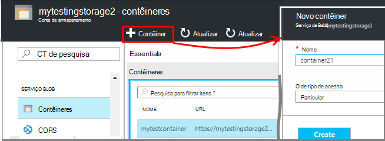
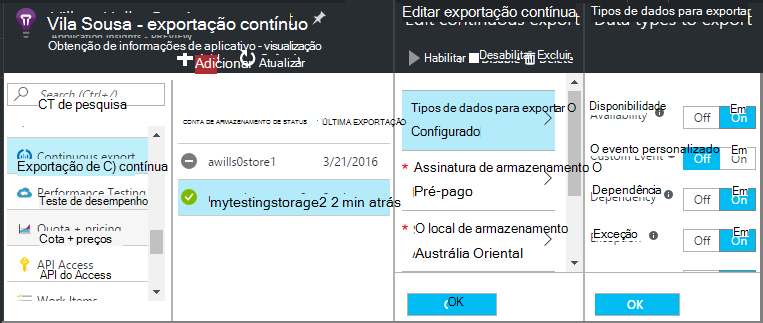
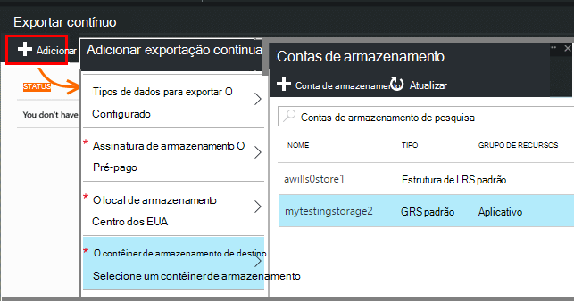
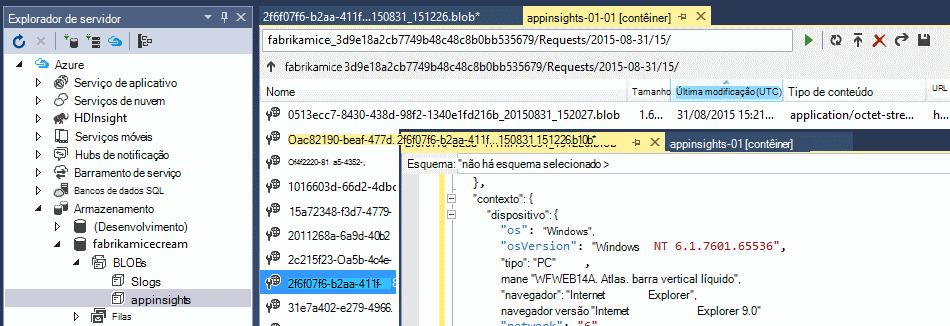
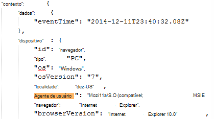
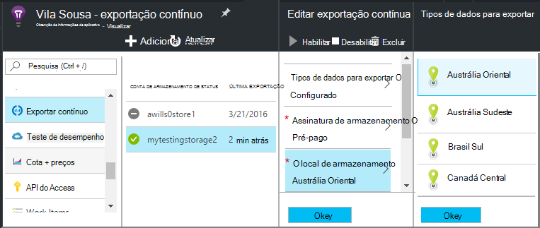

<properties 
    pageTitle="Exportação contínua de telemetria do aplicativo ideias | Microsoft Azure" 
    description="Exportar dados de diagnóstico e de uso para armazenamento no Microsoft Azure e baixe-o de lá." 
    services="application-insights" 
    documentationCenter=""
    authors="alancameronwills" 
    manager="douge"/>

<tags 
    ms.service="application-insights" 
    ms.workload="tbd" 
    ms.tgt_pltfrm="ibiza" 
    ms.devlang="na" 
    ms.topic="article" 
    ms.date="10/18/2016" 
    ms.author="awills"/>
 
# Exportar telemetria de obtenção de informações de aplicativo

Deseja manter seu telemetria for maior que o período de retenção padrão? Ou processar de alguma maneira especializada? Exportar contínuo é ideal para isso. Os eventos que você vê no portal de obtenção de informações de aplicativo podem ser exportados para armazenamento no Microsoft Azure no formato JSON. A partir daí, você pode baixar seus dados e gravar qualquer código que você precisa processar.  

Exportar contínua está disponível no período de avaliação gratuito e na [Standard e Premium os planos de preços](https://azure.microsoft.com/pricing/details/application-insights/).

Antes de configurar exportação contínua, há algumas alternativas que talvez você queira considerar:

* [Botão Exportar o](app-insights-metrics-explorer.md#export-to-excel) na parte superior de uma lâmina métricas ou pesquisa permite transferir tabelas e gráficos em uma planilha do Excel. 
* [Análise](app-insights-analytics.md) fornece uma linguagem de consulta avançada para telemetria e também pode exportar resultados.
* Se você estiver procurando para [explorar dados no Power BI](http://blogs.msdn.com/b/powerbi/archive/2015/11/04/explore-your-application-insights-data-with-power-bi.aspx), você pode fazer isso sem usar exportar contínuo.

## Criar uma conta de armazenamento

Se você ainda não tiver uma conta de armazenamento "clássico", crie um agora.

1. Crie uma conta de armazenamento em sua assinatura no [portal do Azure](https://portal.azure.com).

    

2. Crie um contêiner.

    

## Configurar exportar contínuo

No blade de visão geral do seu aplicativo no portal de obtenção de informações do aplicativo, abra exportar contínua: 

Adicione uma exportação contínua e, em seguida, escolha os tipos de eventos que você gostaria de exportar:

Escolha ou crie a [conta de armazenamento do Azure](../storage/storage-introduction.md) onde você deseja armazenar os dados:

Depois que você criou a exportação, ele começa indo. (Você só obtêm dados que chega depois de criar a exportação.) 

Pode haver um atraso de cerca de uma hora antes de dados aparecem no blob.

Se você quiser alterar os tipos de evento mais tarde, basta editar a exportação:

Para interromper o fluxo, clique em Desabilitar. Quando você clicar novamente em Ativar, o fluxo será reiniciada com novos dados. Você não receberá os dados que chegaram no portal enquanto exportação foi desabilitada.

Para interromper o fluxo permanentemente, exclua a exportação. Isso não exclui os dados do armazenamento.

#### Não é possível adicionar ou alterar uma exportação?

* Para adicionar ou alterar exportações, você precisa de direitos de acesso de proprietário, colaborador ou colaborador de obtenção de informações do aplicativo. [Saiba mais sobre funções][roles].

## Quais eventos você faz?

Os dados exportados serão a telemetria bruta que recebemos de seu aplicativo, exceto que podemos adicionar dados de local que podemos calcular a partir do endereço IP do cliente. 

Dados que foi descartados por [amostragem](app-insights-sampling.md) não estão incluídos nos dados exportados.

Outras medidas calculadas não são incluídas. Por exemplo, podemos não exportar utilização de CPU média, mas podemos exportar a telemetria bruta do qual a média é calculada.

Os dados também incluem os resultados de quaisquer [testes de web de disponibilidade](app-insights-monitor-web-app-availability.md) que você configurou. 

> [AZURE.NOTE] **Amostragem.** Se seu aplicativo envia muitos dados e você estiver usando o SDK do aplicativo ideias para ASP.NET versão 2.0.0-beta3 ou posterior, o recurso de amostragem adaptativa pode operar e enviar apenas uma porcentagem do seu telemetria. [Saiba mais sobre amostragem.](app-insights-sampling.md)

## Inspecionar os dados

Você pode inspecionar o armazenamento diretamente no portal. Clique em **Procurar**, selecione sua conta de armazenamento e abra **contêineres**.

Para inspecionar o armazenamento do Azure no Visual Studio, abra o **modo de exibição**, **Explorer de nuvem**. (Se você não tiver esse comando de menu, você precisa instalar o SDK do Azure: abrir a caixa de diálogo **Novo projeto** , expanda Visual c# / nuvem e escolha **Obter o SDK do Microsoft Azure para .NET**.)

Quando você abre seu armazenamento de blob, você verá um contêiner com um conjunto de arquivos de blob. O URI de cada arquivo derivado de seu nome de recurso de obtenção de informações do aplicativo, sua chave de instrumentação, telemetria-tipo/Data/hora. (O nome do recurso contém letras minúsculo, e a chave de instrumentação omite traços.)

A data e hora são UTC e quando a telemetria foi depositada da loja - não a hora em que ele foi gerado. Portanto se você escrever código para baixar os dados, ele pode mover linear através dos dados.

Aqui está a forma de caminho:

    $"{applicationName}_{instrumentationKey}/{type}/{blobDeliveryTimeUtc:yyyy-MM-dd}/{ blobDeliveryTimeUtc:HH}/{blobId}_{blobCreationTimeUtc:yyyyMMdd_HHmmss}.blob"
  
Onde 

-   `blobCreationTimeUtc`é hora de criação do blob no interno teste armazenamento
-   `blobDeliveryTimeUtc`é o tempo quando blob é copiado para o armazenamento de destino de exportação

## Formato de dados

* Cada blob é um arquivo de texto que contém vários ' \n'-separated linhas. Ele contém a telemetria processada por um período de tempo de aproximadamente metade um minuto.
* Cada linha representa um ponto de dados de telemetria como um modo de exibição de página ou a solicitação.
* Cada linha é um documento JSON não formatado. Se deseja ficam e como isso, abra-a no Visual Studio e escolha edite, Avançado, formato de arquivo:

Durações de tempo estão em escalas, onde 10 000 faz um tique = 1 ms. Por exemplo, esses valores mostram um tempo de 1 ms para enviar uma solicitação do navegador, 3ms recebê-lo e 1.8s para processar a página no navegador:

    "sendRequest": {"value": 10000.0},
    "receiveRequest": {"value": 30000.0},
    "clientProcess": {"value": 17970000.0}

[Referência para os tipos de propriedade e valores de modelo de dados detalhados.](app-insights-export-data-model.md)

## Os dados de processamento

Em uma pequena escala, você pode escrever algum código para separe seus dados, lê-la em uma planilha e assim por diante. Por exemplo:

    private IEnumerable<T> DeserializeMany<T>(string folderName)
    {
      var files = Directory.EnumerateFiles(folderName, "*.blob", SearchOption.AllDirectories);
      foreach (var file in files)
      {
         using (var fileReader = File.OpenText(file))
         {
            string fileContent = fileReader.ReadToEnd();
            IEnumerable<string> entities = fileContent.Split('\n').Where(s => !string.IsNullOrWhiteSpace(s));
            foreach (var entity in entities)
            {
                yield return JsonConvert.DeserializeObject<T>(entity);
            }
         }
      }
    }

Para uma amostra de código maior, consulte [usando uma função de trabalho][exportasa].

## Excluir seus dados antigos
Observe que você é responsável por gerenciar sua capacidade de armazenamento e excluindo os dados antigos, se necessário. 

## Se você gerar sua chave de armazenamento...

Se você alterar a chave para seu armazenamento, exportar contínuo irá parar de funcionar. Você verá uma notificação na sua conta do Azure. 

Abra a lâmina exportar contínua e edite a exportação. Editar o destino de exportação, mas deixe o mesmo armazenamento selecionado. Clique em Okey para confirmar.

A exportação contínua irá reiniciar.

## Exemplos de exportação

* [Exportar para o SQL usando uma função de trabalho][exportcode]
* [Exportar para o SQL usando a análise de fluxo][exportasa]
* [Exemplo de análise de fluxo 2](app-insights-export-stream-analytics.md)

Em escalas maiores, considere [HDInsight](https://azure.microsoft.com/services/hdinsight/) - Hadoop clusters na nuvem. HDInsight fornece uma variedade de tecnologias para gerenciar e analisar dados grandes.

## P & r

* *Mas tudo o que eu quero que é um download único de um gráfico.*  
 
    Sim, você pode fazer isso. Na parte superior da lâmina, clique em [Exportar dados](app-insights-metrics-explorer.md#export-to-excel).

* *Configurar uma exportação, mas não há nenhum dado no meu armazenamento.*

    Obtenção de informações de aplicativo recebeu qualquer telemetria de seu aplicativo desde que você configurar a exportação? Você receberá somente novos dados.

* *Tentou configurar uma exportação, mas teve acesso negado*

    Se a conta pertence pela sua organização, você precisa ser um membro dos grupos de proprietários ou colaboradores.

* *É possível exportar direto para meu próprio repositório local?* 

    Não, Desculpe. Nosso mecanismo de exportação atualmente só funciona com o armazenamento do Azure neste momento.  

* *Existe algum limite para a quantidade de dados que você coloca em meu armazenamento?* 

    Não. Nós será manter pressionando dados até que você exclua a exportação. Podemos vai parar se podemos acertar os limites de externos do armazenamento de blob, mas isso é muito grande. Ele é controlar quanto armazenamento você usar.  

* *Quantos blobs deverá ver no armazenamento?*

 * Para cada tipo de dados que você selecionou para exportar, um novo blob é criado cada minuto (se dados estiverem disponíveis). 
 * Além disso, para aplicativos com alto tráfego, unidades de partição adicionais são alocadas. Nesse caso cada unidade cria um blob cada minuto.

* *Posso gerado novamente a chave para meu armazenamento ou alterou o nome do contêiner, e agora a exportação não funciona.*

    Editar a exportação e abra a lâmina de destino de exportação. Deixe o mesmo armazenamento selecionado como antes e clique Okey para confirmar. Exportar será reiniciado. Se a alteração nos últimos alguns dias, você não perder dados.

* *Posso pausar a exportação?*

    Sim. Clique em Desativar.

## Exemplos de código

* [Analisar JSON exportado usando uma função de trabalho][exportcode]
* [Exemplo de análise de fluxo](app-insights-export-stream-analytics.md)
* [Exportar para o SQL usando a análise de fluxo][exportasa]

* [Referência para os tipos de propriedade e valores de modelo de dados detalhados.](app-insights-export-data-model.md)

<!--Link references-->

[exportcode]: app-insights-code-sample-export-telemetry-sql-database.md
[exportasa]: app-insights-code-sample-export-sql-stream-analytics.md
[roles]: app-insights-resources-roles-access-control.md

 
