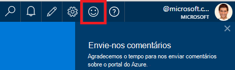
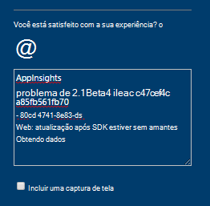
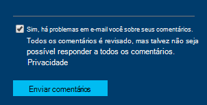

<properties 
    pageTitle="Como obter suporte técnico da equipe de desenvolvimento de obtenção de informações de aplicativo | Microsoft Azure" 
    description="Quando você tem um caso que requer suporte especial da equipe de desenvolvimento de obtenção de informações do aplicativo, isso é como você pode enviar os detalhes para obter suporte." 
    services="application-insights" 
    documentationCenter=""
    authors="alexbulankou" 
    manager="douge"/>
 
<tags 
    ms.service="application-insights" 
    ms.workload="tbd" 
    ms.tgt_pltfrm="ibiza" 
    ms.devlang="na" 
    ms.topic="article" 
    ms.date="06/01/2016" 
    ms.author="albulank"/>
    
# <a name="how-to-get-technical-support-from-application-insights-development-team"></a>Como obter suporte técnico da equipe de desenvolvimento de obtenção de informações de aplicativo
    
Quando você tiver um problema técnico com [Ideias de aplicativo do Visual Studio](app-insights-overview.md), aqui estão as opções para obter ajuda:

## <a name="1-check-the-documents"></a>1. verificar os documentos

* Dados ausentes? Seleção: [amostragem](app-insights-sampling.md), [cotas e a otimização](app-insights-pricing.md).
* Solução de problemas: [ASP.NET](app-insights-troubleshoot-faq.md) | [Java](app-insights-java-troubleshoot.md)

## <a name="2-search-the-forums"></a>2. pesquise os fóruns

* [Fórum do MSDN](https://social.msdn.microsoft.com/Forums/vstudio/home?forum=ApplicationInsights)
* [StackOverflow](http://stackoverflow.com/questions/tagged/ms-application-insights)

## <a name="3-azure-support-plan"></a>3. plano de suporte azure?

Há situações onde você gostaria que os desenvolvedores investigar seu caso específico. 

Se você tiver um [plano com Microsoft Azure de suporte](https://azure.microsoft.com/support/plans/) que você pode [Abrir um tíquete](https://portal.azure.com/?#blade/Microsoft_Azure_Support/HelpAndSupportBlade).

## <a name="4-contact-the-application-insights-team"></a>4. Contate a equipe de obtenção de informações de aplicativo

Se você não tiver um plano de suporte, nossa equipe de desenvolvimento está satisfeito oferecer melhor esforço suporte aos clientes de obtenção de informações do aplicativo, como podemos preparar para o marco de disponibilidade geral. Estamos introduzindo **uma nova opção de suporte**: você pode descrever o seu caso conosco enviando um formulário de comentários no portal do Azure e tem um desenvolvedor sobre o contato de equipe de obtenção de informações de aplicativo você volta para ajudar a resolver seu problema.


1. No [portal de obtenção de informações do aplicativo](https://portal.azure.com), clique em do smiley no canto superior direito:  

       

2. Na caixa de comentário não se esqueça de especificar **AppInsights** como a primeira linha e, em seguida, inclua as seguintes informações:   

    ```

    AppInsights   
    ikey: <instrumentation key>   
    sdk: <SDK that you are using, including name and version>  
    issue: <please describe the problem you are having>

    ```   

       

3. Marque "Sim, é okey para enviar a você por email". 

      

Um representante da equipe de obtenção de informações de aplicativo obterá em contato com você em breve. Como estamos fornecendo esse serviço individualmente de melhor esforço, sem SLA formal pode ser fornecida neste momento.


