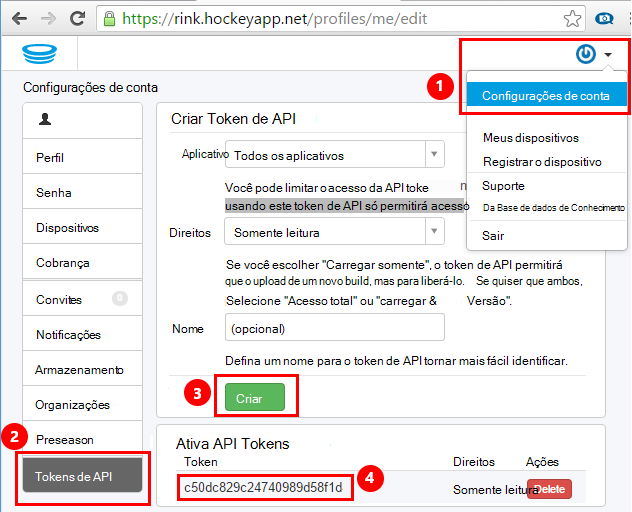
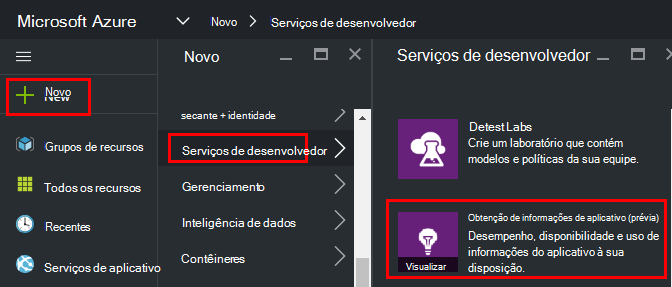
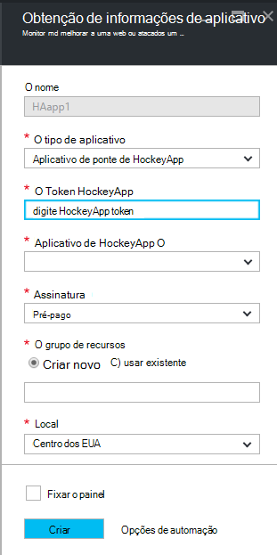
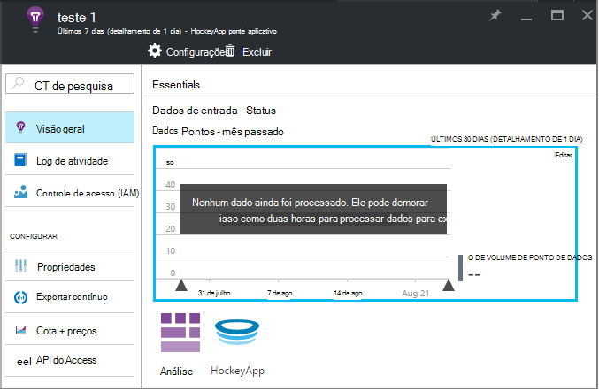
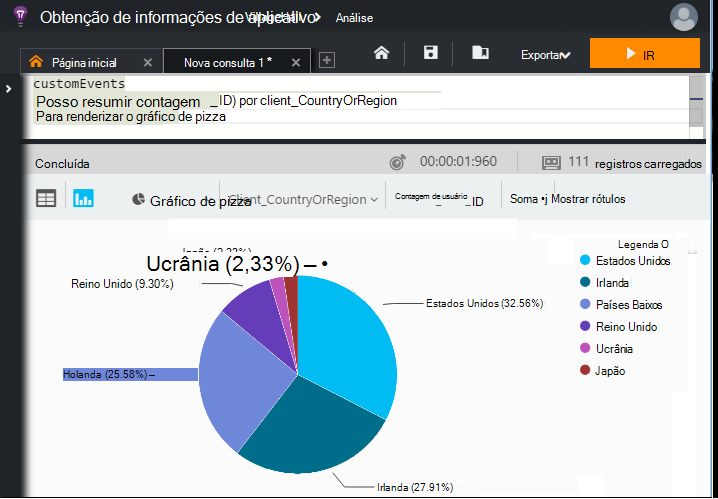

<properties 
    pageTitle="Explorar dados HockeyApp em ideias de aplicativo | Microsoft Azure" 
    description="Analise uso e o desempenho do seu aplicativo do Azure com ideias de aplicativo." 
    services="application-insights" 
    documentationCenter="windows"
    authors="alancameronwills" 
    manager="douge"/>

<tags 
    ms.service="application-insights" 
    ms.workload="tbd" 
    ms.tgt_pltfrm="ibiza" 
    ms.devlang="na" 
    ms.topic="article" 
    ms.date="08/25/2016" 
    ms.author="awills"/>

#  Explorar dados HockeyApp em ideias de aplicativo

[HockeyApp](https://azure.microsoft.com/services/hockeyapp/) é a plataforma recomendada para monitorar aplicativos de desktop e móveis ao vivo. De HockeyApp, você pode enviar personalizado e rastrear telemetria para monitorar o uso e ajudar no diagnóstico (além de obter dados de falha). Este fluxo de telemetria pode ser consultado usando o recurso de [análise](app-insights-analytics.md) avançado do [Ideias de aplicativo do Visual Studio](app-insights-overview.md). Além disso, você pode [Exportar personalizadas e rastrear telemetria](app-insights-export-telemetry.md). Para ativar esses recursos, você configurar uma ponte que envia os dados de HockeyApp de obtenção de informações do aplicativo.

## O aplicativo de ponte de HockeyApp

O aplicativo de ponte HockeyApp é o recurso de núcleo que permite que você acesse seus dados de HockeyApp no aplicativo ideias através a análise e recursos de exportar contínuo. Os dados coletados pelo HockeyApp após a criação do aplicativo HockeyApp ponte serão acessíveis a partir desses recursos. Vamos ver como configurar um desses aplicativos de ponte.

No HockeyApp, abra configurações de conta, [Tokens de API](https://rink.hockeyapp.net/manage/auth_tokens). Crie um novo símbolo ou reutilizar uma já existente. Os direitos mínimos necessários são "somente leitura". Faça uma cópia da API do token.

Abra o portal do Microsoft Azure e [criar um recurso de obtenção de informações do aplicativo](app-insights-create-new-resource.md). Definir o tipo de aplicativo "Aplicativo de ponte de HockeyApp":

Você não precisa definir um nome - isso será automaticamente definida do nome do HockeyApp.

Os campos de ponte HockeyApp aparecem. 

Insira o token de HockeyApp que você anotou anteriormente. Esta ação preenche o menu suspenso de "HockeyApp aplicativo" com todos os seus aplicativos de HockeyApp. Selecione aquele que deseja usar e preencha o restante dos campos. 

Abra o novo recurso. 

Observe que os dados levam algum tempo para iniciar fluindo.

Pronto! Agora, todos os dados coletados em seu aplicativo instrumentos HockeyApp deste ponto em diante também estão disponíveis para você nos recursos de análise e exportar contínua de obtenção de informações do aplicativo.

Vamos revisar rapidamente cada um desses recursos agora disponíveis para você.

## Análise

Análise é uma ferramenta poderosa para consultar ad hoc de seus dados, permitindo que você diagnosticar e analisar seu telemetria e descubra rapidamente causas e padrões.

* [Saiba mais sobre a análise](app-insights-analytics-tour.md)
* [Vídeo de Introdução](https://channel9.msdn.com/events/Build/2016/T666)
* [Conceitos avançados de vídeo](https://channel9.msdn.com/Events/Build/2016/P591)

## Exportar contínuo

Exportar contínua permite que você exporte os dados para um contêiner de armazenamento de Blob do Azure. Isso é muito útil se você precisar manter os dados for maior que o período de retenção atualmente oferecido pela obtenção de informações do aplicativo. Você pode manter os dados no armazenamento de blob, processo-la em um banco de dados do SQL ou seus dados preferenciais warehouse solução.

[Saiba mais sobre como exportar contínuo](app-insights-export-telemetry.md)

## Próximas etapas

* [Aplicar Analytics aos seus dados](app-insights-analytics-tour.md)

