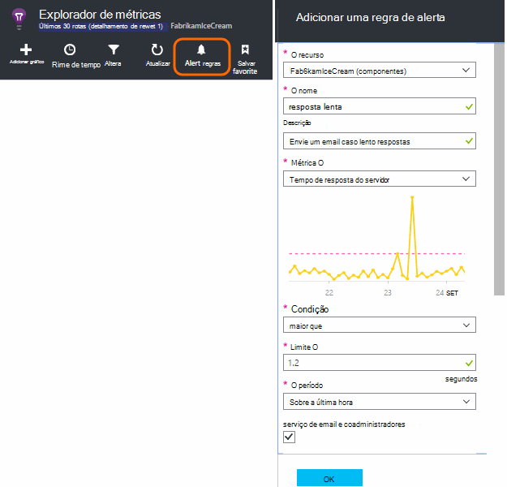
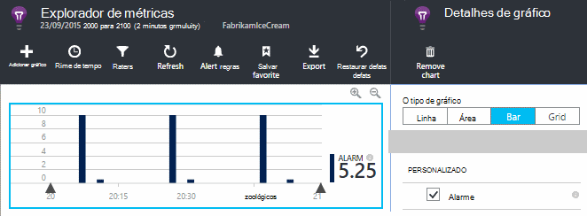
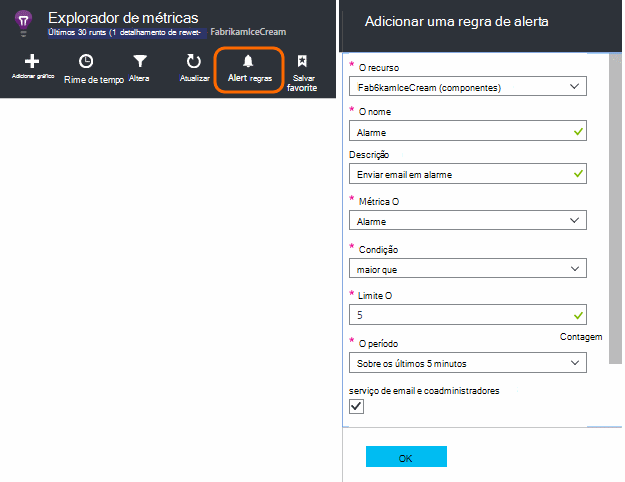
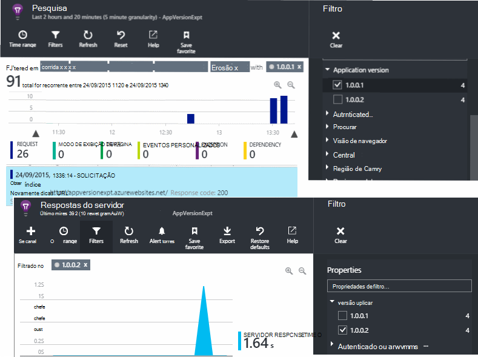
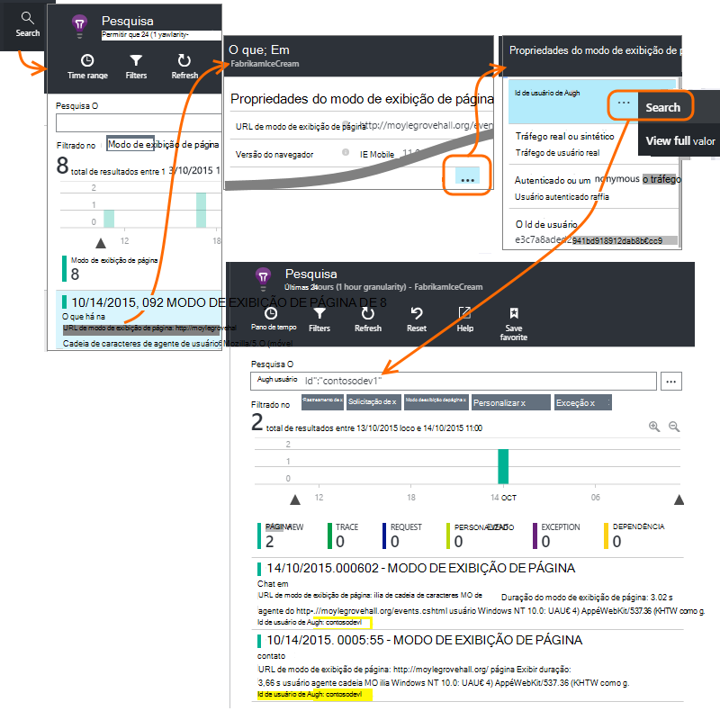
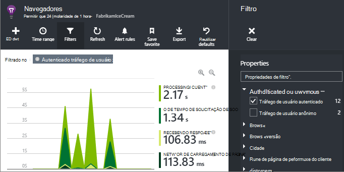
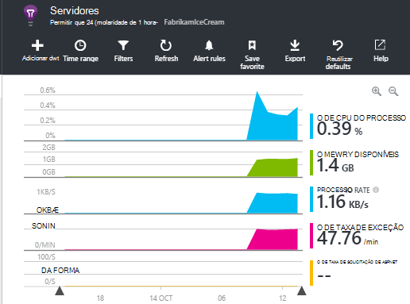

<properties 
    pageTitle="Como fazer … no aplicativo ideias | Microsoft Azure" 
    description="Perguntas Frequentes no aplicativo ideias." 
    services="application-insights" 
    documentationCenter=""
    authors="alancameronwills" 
    manager="douge"/>

<tags 
    ms.service="application-insights" 
    ms.workload="tbd" 
    ms.tgt_pltfrm="ibiza" 
    ms.devlang="na" 
    ms.topic="article" 
    ms.date="02/05/2016" 
    ms.author="awills"/>

# <a name="how-do-i--in-application-insights"></a>Como fazer … em ideias de aplicativo?

## <a name="get-an-email-when-"></a>Obter um email quando...

### <a name="email-if-my-site-goes-down"></a>Email se meu site for desligado

Defina um [teste da web de disponibilidade](app-insights-monitor-web-app-availability.md).

### <a name="email-if-my-site-is-overloaded"></a>Enviar email se meu site está sobrecarregado

Defina um [alerta](app-insights-alerts.md) no **tempo de resposta do servidor**. Um limite entre 1 e 2 segundos deve funcionar.



Seu aplicativo também pode mostrar sinais de esforço retornando códigos de falha. Defina um alerta em **solicitações de falha**.

Se você quiser definir um alerta em **exceções de servidor**, talvez seja necessário fazer [algumas configurações adicionais](app-insights-asp-net-exceptions.md) para ver os dados.

### <a name="email-on-exceptions"></a>Em exceções de email

1. [Configurar o monitoramento de exceção](app-insights-asp-net-exceptions.md)
2. [Definir um alerta](app-insights-alerts.md) sobre a métrica de contagem de exceção


### <a name="email-on-an-event-in-my-app"></a>Em um evento no meu aplicativo de email

Vamos supor que você gostaria de receber um email quando ocorrer um evento específico. Obtenção de informações de aplicativo não oferece esse recurso diretamente, mas pode [Enviar um alerta quando uma métrica exceder um limite](app-insights-alerts.md). 

Alertas podem ser definidas em [métricas personalizadas](app-insights-api-custom-events-metrics.md#track-metric), apesar eventos não personalizados. Escreva um código para aumentar uma métrica quando o evento ocorre:

    telemetry.TrackMetric("Alarm", 10);

ou:

    var measurements = new Dictionary<string,double>();
    measurements ["Alarm"] = 10;
    telemetry.TrackEvent("status", null, measurements);

Como alertas têm dois estados, você precisa enviar um valor baixo quando você considera o alerta para ter encerrado:

    telemetry.TrackMetric("Alarm", 0.5);

Crie um gráfico no [Explorador de métrica](app-insights-metrics-explorer.md) para ver o alarme:



Agora defina um alerta quando a métrica fica acima um valor médio por um período curto:




Defina o período de averaging no mínimo. 

Você vai receber emails quando a métrica fica acima e abaixo do limite.

Alguns pontos a considerar:

* Um alerta tem dois estados ("alerta" e "saúde"). O estado é avaliado somente quando uma métrica for recebida.
* Um email é enviado apenas quando o estado é alterado. Isso é por que você precisa enviar ambos alto e valor baixo métricas. 
* Para avaliar o alerta, a média é interpretada dos valores recebidos ao longo do período anterior. Isso ocorre sempre que uma métrica for recebida, para que emails podem ser enviados mais do que o período definido.
* Desde que emails são enviados tanto em "alerta" e "saúde", talvez você queira considerar pensando novamente seu evento única como uma condição de dois estados. Por exemplo, em vez de um evento de "trabalho concluído", ter uma condição de "trabalho em andamento", onde você recebe emails no início e no final de um trabalho.

### <a name="set-up-alerts-automatically"></a>Configurar alertas automaticamente

[Usar o PowerShell para criar novos alertas](app-insights-alerts.md#set-alerts-by-using-powershell)

## <a name="use-powershell-to-manage-application-insights"></a>Usar o PowerShell para gerenciar a obtenção de informações de aplicativo

* [Criar novos recursos](app-insights-powershell-script-create-resource.md)
* [Crie novos alertas](app-insights-alerts.md#set-alerts-by-using-powershell)

## <a name="application-versions-and-stamps"></a>Carimbos e versões de aplicativos

### <a name="separate-the-results-from-dev-test-and-prod"></a>Separar os resultados do desenvolvimento, teste e produção

* Para environmnents diferente, configure ikeys diferentes
* Para carimbos diferentes (desenvolvimento, teste, produto) marca a telemetria com valores de propriedade diferentes

[Saiba Mais](app-insights-separate-resources.md)
 

### <a name="filter-on-build-number"></a>Filtrar por número de compilação

Quando você publica uma nova versão do seu aplicativo, você precisa ser capaz de separar a telemetria do compilações diferentes.

Você pode definir a propriedade de versão do aplicativo para que você pode filtrar resultados de [pesquisa](app-insights-diagnostic-search.md) e o [Explorador de métrica](app-insights-metrics-explorer.md) . 




Há vários métodos diferentes de configuração da propriedade de versão do aplicativo.

* Defina diretamente:

    `telemetryClient.Context.Component.Version = typeof(MyProject.MyClass).Assembly.GetName().Version;`

* Quebre a linha em um [inicializador de telemetria](app-insights-api-custom-events-metrics.md#telemetry-initializers) para garantir que todas as instâncias de TelemetryClient estão definidas consistentemente.

* [ASP.NET] Definir a versão no `BuildInfo.config`. O módulo web selecionará a versão do nó BuildLabel. Incluir esse arquivo em seu projeto e lembre-se de definir a propriedade copiar sempre no Solution Explorer.

    ```XML

    <?xml version="1.0" encoding="utf-8"?>
    <DeploymentEvent xmlns:xsi="http://www.w3.org/2001/XMLSchema-instance" xmlns:xsd="http://www.w3.org/2001/XMLSchema" xmlns="http://schemas.microsoft.com/VisualStudio/DeploymentEvent/2013/06">
      <ProjectName>AppVersionExpt</ProjectName>
      <Build type="MSBuild">
        <MSBuild>
          <BuildLabel kind="label">1.0.0.2</BuildLabel>
        </MSBuild>
      </Build>
    </DeploymentEvent>

    ```
* [ASP.NET] Gere BuildInfo.config automaticamente no MSBuild. Para fazer isso, adicione algumas linhas ao arquivo. csproj:

    ```XML

    <PropertyGroup>
      <GenerateBuildInfoConfigFile>true</GenerateBuildInfoConfigFile>    <IncludeServerNameInBuildInfo>true</IncludeServerNameInBuildInfo>
    </PropertyGroup> 
    ```

    Isso gera um arquivo denominado *yourProjectName*. BuildInfo.config. O processo de publicação renomeia a BuildInfo.config.

    O rótulo de compilação contém um espaço reservado (AutoGen_...) quando você cria com o Visual Studio. Mas quando criado com MSBuild, ele é preenchido com o número de versão correta.

    Para permitir MSBuild gerar os números de versão, defina a versão como `1.0.*` em AssemblyReference.cs

## <a name="monitor-backend-servers-and-desktop-apps"></a>Monitorar os servidores de back-end e aplicativos da área de trabalho

[Usar o módulo do SDK do Windows Server](app-insights-windows-desktop.md).


## <a name="visualize-data"></a>Visualizar dados

#### <a name="dashboard-with-metrics-from-multiple-apps"></a>Painel com métricas de vários aplicativos

* No [Explorador de métrica](app-insights-metrics-explorer.md), personalizar seu gráfico e salvá-lo como um favorito. Fixe-painel Azure.


#### <a name="dashboard-with-data-from-other-sources-and-application-insights"></a>Painel com dados de outras fontes e a obtenção de informações de aplicativo

* [Exportar telemetria Power BI](app-insights-export-power-bi.md). 

Ou

* Use o SharePoint como seu painel, exibindo dados em web parts do SharePoint. [Use Exportar contínua e a análise de fluxo para exportar para o SQL](app-insights-code-sample-export-sql-stream-analytics.md).  Use PowerView para examinar o banco de dados e criar uma web part do SharePoint para PowerView.


<a name="search-specific-users"></a>
### <a name="filter-out-anonymous-or-authenticated-users"></a>Filtrar usuários anônimos ou autenticados

Se seus usuários entram, você pode definir o [autenticado id de usuário](app-insights-api-custom-events-metrics.md#authenticated-users). (Isso não acontece automaticamente.) 

Você poderá:

* Pesquisar ids de usuário específico



* Métricas de filtro para usuários anônimos ou autenticados



## <a name="modify-property-names-or-values"></a>Modificar a propriedade nomes ou valores

Crie um [filtro](app-insights-api-filtering-sampling.md#filtering). Isso permite modificar ou filtrar telemetria antes de ser enviado de seu aplicativo de obtenção de informações do aplicativo.

## <a name="list-specific-users-and-their-usage"></a>Usuários específicos de lista e seu uso

Se você quiser apenas de [pesquisa para usuários específicos](#search-specific-users), você pode definir o [autenticado id de usuário](app-insights-api-custom-events-metrics.md#authenticated-users).

Se quiser que uma lista de usuários com dados como as páginas que eles examinar ou frequência fizerem logon no, você tem duas opções:

* [Conjunto autenticado id de usuário](app-insights-api-custom-events-metrics.md#authenticated-users), [Exportar para um banco de dados](app-insights-code-sample-export-sql-stream-analytics.md) e usar ferramentas adequadas para analisar seus dados de usuário lá.
* Se você tiver apenas um pequeno número de usuários, envie eventos personalizados ou métricas, usando os dados de interesse como o nome de evento ou valor métrico e definindo a id de usuário como uma propriedade. Para analisar os modos de exibição de página, substitua a chamada de trackPageView JavaScript padrão. Para analisar telemetria do lado do servidor, use um inicializador de telemetria para adicionar a id de usuário para todos os telemetria do servidor. Você pode então métricas de filtro e segmento e pesquisas na id de usuário.


## <a name="reduce-traffic-from-my-app-to-application-insights"></a>Reduzir o tráfego do meu aplicativo de obtenção de informações de aplicativo

* Em [ApplicationInsights.config](app-insights-configuration-with-applicationinsights-config.md), desative quaisquer módulos que não é necessário, como o coletor de contador de desempenho.
* Use [amostragem e filtragem](app-insights-api-filtering-sampling.md) no SDK.
* Nas páginas da web, limite o número de chamadas de Ajax relatados para cada modo de exibição de página. No trecho de script após `instrumentationKey:...` , insira: `,maxAjaxCallsPerView:3` (ou um número adequado).
* Se você estiver usando [TrackMetric](app-insights-api-custom-events-metrics.md#track-metric), calcule a agregação de lotes de métricas valores antes de enviar o resultado. Não há uma sobrecarga de TrackMetric() que fornece para isso.


Saiba mais sobre [cotas e preços](app-insights-pricing.md).

## <a name="disable-telemetry"></a>Desabilitar Telemetria

Para **parar dinamicamente e iniciar** a coleção e transmissão de telemetria do servidor:

```

    using  Microsoft.ApplicationInsights.Extensibility;

    TelemetryConfiguration.Active.DisableTelemetry = true;
```


Para **Desabilitar coletores padrão selecionados** - por exemplo, contadores de desempenho, solicitações HTTP ou dependências - exclua ou comente as linhas relevantes no [ApplicationInsights.config](app-insights-api-custom-events-metrics.md). Você pode fazer isso, por exemplo, se você deseja enviar seus próprios dados TrackRequest.


## <a name="view-system-performance-counters"></a>Contadores de desempenho do sistema de modo de exibição

Entre as métricas que você pode mostrar no Explorador de métricas são um conjunto de sistema contadores de desempenho. Não há um blade predefinido intitulado **servidores** que exibe vários deles.



### <a name="if-you-see-no-performance-counter-data"></a>Se você não vir nenhum dado de contador de desempenho

* **Servidor IIS** no seu próprio computador ou em uma máquina virtual. [Instalar o Monitor de Status](app-insights-monitor-performance-live-website-now.md). 
* **Site do azure** - não suportamos contadores de desempenho ainda. Há várias métricas, que você pode obter como parte do painel de controle do Azure site da web padrão.
* **Servidor UNIX** - [instalar collectd](app-insights-java-collectd.md)

### <a name="to-display-more-performance-counters"></a>Para exibir mais contadores de desempenho

* Primeiro, [Adicione um novo gráfico](app-insights-metrics-explorer.md) e veja se o contador no basic definido que oferecemos.
* Caso contrário, [Adicione o contador no conjunto coletadas pelo módulo de contador de desempenho](app-insights-performance-counters.md).


