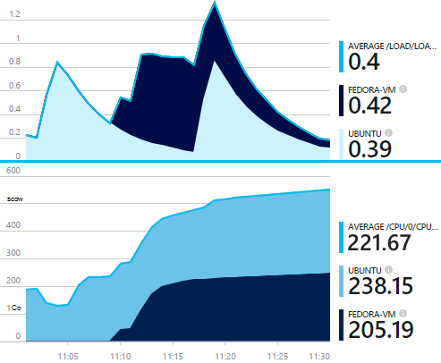

<properties 
    pageTitle="collectd: estatísticas de desempenho para Java em Unix na obtenção de informações de aplicativo" 
    description="Estendido monitoramento de seu site de Java com o CollectD plug-in para obtenção de informações de aplicativo" 
    services="application-insights" 
    documentationCenter="java"
    authors="alancameronwills" 
    manager="douge"/>

<tags 
    ms.service="application-insights" 
    ms.workload="tbd" 
    ms.tgt_pltfrm="ibiza" 
    ms.devlang="na" 
    ms.topic="article" 
    ms.date="08/24/2016" 
    ms.author="awills"/>
 
# <a name="collectd-unix-performance-metrics-in-application-insights"></a>collectd: métricas de desempenho do Unix em ideias de aplicativo

*Obtenção de informações de aplicativo está no modo de visualização.*

Para explorar métricas de desempenho do sistema Unix no [Aplicativo ideias](app-insights-overview.md), instale o [collectd](http://collectd.org/), juntamente com suas ideias de aplicativo plug-in. Essa solução de código-fonte aberto reúne várias estatísticas de sistema e de rede.

Normalmente você usará collectd se você já tiver [instrumentos seu serviço da web Java com ideias de aplicativo][java]. Ele fornece mais dados para ajudar a melhorar o desempenho do seu aplicativo ou diagnosticar problemas. 



## <a name="get-your-instrumentation-key"></a>Obter a sua chave de instrumentação

No [portal do Microsoft Azure](https://portal.azure.com), abra o recurso de [Obtenção de informações de aplicativo](app-insights-overview.md) onde deseja que os dados sejam exibidos. (Ou [criar um novo recurso](app-insights-create-new-resource.md)).

Faça uma cópia da chave instrumentação, que identifica o recurso.


## <a name="install-collectd-and-the-plug-in"></a>Instalar o plug-in e collectd

Nas máquinas de servidores Unix:

1. Instalar o [collectd](http://collectd.org/) versão 5.4.0 ou posterior.
2. Baixe o [plug-in Gravador de collectd de obtenção de informações de aplicativo](https://aka.ms/aijavasdk). Anote o número de versão.
3. Copiar o plug-in JAR em `/usr/share/collectd/java`.
3. Editar `/etc/collectd/collectd.conf`:
 * Certifique-se de que [o plug-in Java](https://collectd.org/wiki/index.php/Plugin:Java) está habilitado.
 * Atualize o JVMArg para o java.class.path para incluir o seguinte JAR. Atualize o número de versão para corresponder aquele que você baixou:
  * `/usr/share/collectd/java/applicationinsights-collectd-1.0.5.jar`
 * Adicione este trecho de código, usando a tecla de instrumentação do seu recurso:

```

     LoadPlugin "com.microsoft.applicationinsights.collectd.ApplicationInsightsWriter"
     <Plugin ApplicationInsightsWriter>
        InstrumentationKey "Your key"
     </Plugin>
```

Aqui é parte de um arquivo de configuração de exemplo:

    ...
    # collectd plugins
    LoadPlugin cpu
    LoadPlugin disk
    LoadPlugin load
    ...

    # Enable Java Plugin
    LoadPlugin "java"

    # Configure Java Plugin
    <Plugin "java">
      JVMArg "-verbose:jni"
      JVMArg "-Djava.class.path=/usr/share/collectd/java/applicationinsights-collectd-1.0.5.jar:/usr/share/collectd/java/collectd-api.jar"

      # Enabling Application Insights plugin
      LoadPlugin "com.microsoft.applicationinsights.collectd.ApplicationInsightsWriter"
                
      # Configuring Application Insights plugin
      <Plugin ApplicationInsightsWriter>
        InstrumentationKey "12345678-1234-1234-1234-123456781234"
      </Plugin>

      # Other plugin configurations ...
      ...
    </Plugin>
.   ...

Configure outros [collectd plug-ins](https://collectd.org/wiki/index.php/Table_of_Plugins), que pode coletar dados de várias origens diferentes.

Reinicie o collectd de acordo com seu [manual](https://collectd.org/wiki/index.php/First_steps).

## <a name="view-the-data-in-application-insights"></a>Exibir os dados de obtenção de informações de aplicativo

No seu recurso de obtenção de informações do aplicativo, abra [Explorer métricas e adicionar gráficos][metrics], selecionando as métricas que você deseja ver da categoria personalizada.


Por padrão, as métricas são agregadas em todas as máquinas de host do qual as métricas foram coletadas. Para exibir as métricas por host, na lâmina de detalhes de gráfico, ative o agrupamento e escolha Agrupar por CollectD-Host.


## <a name="to-exclude-upload-of-specific-statistics"></a>Para excluir o carregamento de estatísticas específicas

Por padrão, o plug-in ideias de aplicativo envia todos os dados coletados por todos o collectd enabled 'leitura' Plug-ins. 

Para excluir dados de fontes de dados ou plug-ins específicos:

* Edite o arquivo de configuração. 
* Em `<Plugin ApplicationInsightsWriter>`, adicionar linhas diretivas assim:

Diretiva | Efeito
---|---
`Exclude disk` | Excluir todos os dados coletados pela `disk` plug-in
`Exclude disk:read,write` | Excluir as fontes denominadas `read` e `write` do `disk` plug-in.

Diretivas separadas com uma nova linha.


## <a name="problems"></a>Problemas?

*Não vejo dados no portal*

* Abrir [pesquisa] [ diagnostic] para ver se os eventos brutos chegaram. Às vezes levar mais tempo para aparecer no Explorador de métricas.
* Talvez você precise [Definir exceções de firewall para dados de saída](app-insights-ip-addresses.md)
* Habilite o rastreamento o plug-in de obtenção de informações do aplicativo. Adicione esta linha dentro de `<Plugin ApplicationInsightsWriter>`:
 *  `SDKLogger true`
* Abra um terminal e iniciar collectd no modo de detalhe, para ver os problemas que ele está relatando:
 * `sudo collectd -f`


<!--Link references-->

[api]: app-insights-api-custom-events-metrics.md
[apiexceptions]: app-insights-api-custom-events-metrics.md#track-exception
[availability]: app-insights-monitor-web-app-availability.md
[diagnostic]: app-insights-diagnostic-search.md
[eclipse]: app-insights-java-eclipse.md
[java]: app-insights-java-get-started.md
[javalogs]: app-insights-java-trace-logs.md
[metrics]: app-insights-metrics-explorer.md
[usage]: app-insights-web-track-usage.md

 
