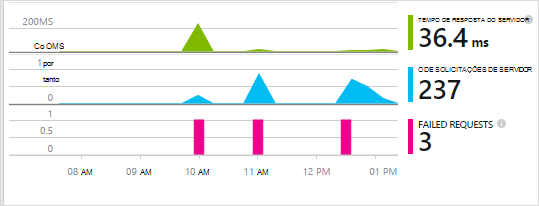

<properties 
    pageTitle="Introdução ao aplicativo ideias com Java no Eclipse" 
    description="Use o Eclipse plug-in para adicionar o monitoramento de desempenho e uso ao seu site de Java com ideias de aplicativo" 
    services="application-insights" 
    documentationCenter="java"
    authors="alancameronwills" 
    manager="douge"/>

<tags 
    ms.service="application-insights" 
    ms.workload="tbd" 
    ms.tgt_pltfrm="ibiza" 
    ms.devlang="na" 
    ms.topic="article" 
    ms.date="03/02/2016" 
    ms.author="awills"/>
 
# Introdução ao aplicativo ideias com Java no Eclipse

O SDK de ideias de aplicativo envia telemetria do seu aplicativo da web de Java para que você pode analisar o desempenho e uso. O Eclipse plug-in para obtenção de informações de aplicativo instala automaticamente o SDK no seu projeto para que você sair da telemetria a caixa, além de uma API que você pode usar para escrever telemetria personalizada.   

## Pré-requisitos

Atualmente a plug-in funciona para Maven projetos e dinâmico da Web no Eclipse. ([Adicionar o aplicativo ideias para outros tipos de projeto Java][java].)

Você precisará:

* Oracle JRE 1,6 ou posterior
* Uma assinatura do [Microsoft Azure](https://azure.microsoft.com/). (Você pode começar com a [avaliação gratuita](https://azure.microsoft.com/pricing/free-trial/)).
* [Eclipse IDE para desenvolvedores do Java EE](http://www.eclipse.org/downloads/), Indigo ou posterior.
* Windows 7 ou posterior, ou Windows Server 2008 ou posterior

## Instalar o SDK Eclipse (uma vez)

Você só precisa fazer dessa vez por máquina. Esta etapa instala um kit de ferramentas que possa adicionar o SDK para cada projeto da Web dinâmico.

1. No Eclipse, clique em Ajuda, instale o novo Software.

    

2. O SDK está em http://dl.windowsazure.com/eclipse, em Kit de ferramentas do Azure. 
3. Desmarque a opção de **contatar todos os sites de atualização...**

    

Siga as etapas restantes para cada projeto Java.

## Criar um recurso de obtenção de informações de aplicativo no Azure

1. Entrar no [portal do Azure](https://portal.azure.com).
2. Crie um novo recurso de obtenção de informações do aplicativo.  

      
3. Defina o tipo de aplicativo para aplicativo web Java.  

      
4. Encontre a chave de instrumentação do novo recurso. Você precisará colar isto no seu projeto de código em breve.  

      

## Adicionar a obtenção de informações de aplicativo ao projeto

1. Adicione ideias de aplicativo no menu de contexto do seu projeto de web Java.

    

2. Cole a chave de instrumentação obtido do portal do Azure.

    

A chave é enviada juntamente com todos os itens de telemetria e informa ideias de aplicativo para exibi-lo em seu recurso.

## Executar o aplicativo e ver métricas

Execute o aplicativo.

Retornar para o recurso de obtenção de informações do aplicativo no Microsoft Azure.

Dados de solicitações HTTP aparecerão na lâmina visão geral. (Se ele não estiver lá, aguarde alguns segundos e clique em Atualizar.)

 

Clique em qualquer gráfico para ver mais detalhadas métricas. 

[Saiba mais sobre métricas.][metrics]

 

E ao exibir as propriedades de uma solicitação, você pode ver os eventos de telemetria associados a ele como solicitações e exceções.
 

## Telemetria do lado do cliente

Da lâmina do início rápido, clique em código de Get para monitorar minhas páginas da web: 

Inserir o trecho de código no cabeçalho do seus arquivos HTML.

#### Exibir dados do lado do cliente

Abra suas páginas da web atualizado e usá-los. Espere um ou dois minutos, e em seguida, retornar para a obtenção de informações de aplicativo e abra a lâmina de uso. (Da lâmina Overview, role para baixo e clique em uso.)

Métricas de sessão, usuário e modo de exibição de página aparecerão na lâmina uso:

[Saiba mais sobre configuração de telemetria do lado do cliente.][usage]

## Publicar seu aplicativo

Agora publica seu aplicativo para o servidor, use permita que as pessoas e assistir a telemetria aparecem no portal.

* Verifique se seu firewall permite que o aplicativo enviar telemetria para essas portas:

 * DC.Services.VisualStudio.com:443
 * DC.Services.VisualStudio.com:80
 * F5.Services.VisualStudio.com:443
 * F5.Services.VisualStudio.com:80

* Em servidores Windows, instale:

 * [Microsoft Visual C++ redistribuível](http://www.microsoft.com/download/details.aspx?id=40784)

    (Isso permite contadores de desempenho.)

## Falhas de solicitação e exceções

Exceções sem tratamento são coletadas automaticamente:

Para coletar dados em outras exceções, você tem duas opções:

* [Inserir chamadas para TrackException em seu código](app-insights-api-custom-events-metrics.md#track-exception). 
* [Instalar o agente de Java no seu servidor](app-insights-java-agent.md). Especifique os métodos que você deseja inspecionar.

## Chamadas de método de monitor e dependências externas

[Instalar o agente de Java](app-insights-java-agent.md) fazer logon especificado métodos internos e chamadas feitas por meio de JDBC, com dados de tempo.

## Contadores de desempenho

Na sua blade de visão geral, role para baixo e clique no bloco de **servidores** . Você verá um intervalo de contadores de desempenho.

### Personalizar a coleta de contador de desempenho

Para desabilitar o conjunto do conjunto padrão de contadores de desempenho, adicione o seguinte código sob o nó raiz do arquivo ApplicationInsights.xml:

    <PerformanceCounters>
       <UseBuiltIn>False</UseBuiltIn>
    </PerformanceCounters>

### Coletar contador de desempenho adicional

Você pode especificar o contador de desempenho adicional para serem coletados.

#### Contadores JMX (expostos por máquina Virtual Java)

    <PerformanceCounters>
      <Jmx>
        <Add objectName="java.lang:type=ClassLoading" attribute="TotalLoadedClassCount" displayName="Loaded Class Count"/>
        <Add objectName="java.lang:type=Memory" attribute="HeapMemoryUsage.used" displayName="Heap Memory Usage-used" type="composite"/>
      </Jmx>
    </PerformanceCounters>

*   `displayName`– O nome exibido no portal de obtenção de informações do aplicativo.
*   `objectName`– O nome de objeto JMX.
*   `attribute`– O atributo do nome do objeto JMX para buscar
*   `type`(opcional) - o tipo de atributo do objeto JMX:
 *  Padrão: um tipo simples como int ou longa.
 *  `composite`: os dados do contador de desempenho estão no formato de 'Attribute.Data'
 *  `tabular`: os dados do contador de desempenho estão no formato de uma linha de tabela

#### Contadores de desempenho do Windows

Cada [contador de desempenho do Windows](https://msdn.microsoft.com/library/windows/desktop/aa373083.aspx) é um membro de uma categoria (da mesma forma que um campo é um membro de uma classe). Categorias podem ser globais, ou podem ter numerados ou instâncias nomeadas.

    <PerformanceCounters>
      <Windows>
        <Add displayName="Process User Time" categoryName="Process" counterName="%User Time" instanceName="__SELF__" />
        <Add displayName="Bytes Printed per Second" categoryName="Print Queue" counterName="Bytes Printed/sec" instanceName="Fax" />
      </Windows>
    </PerformanceCounters>

*   displayName – o nome exibido no portal de obtenção de informações do aplicativo.
*   nome de categoria – a categoria de contador de desempenho (objeto de desempenho) ao qual este contador de desempenho está associada.
*   counterName – o nome do contador de desempenho.
*   instanceName – o nome da instância de categoria de contador de desempenho, ou uma cadeia de caracteres vazia (""), se a categoria contém uma única instância. Se o nome de categoria é o processo e o contador de desempenho que você gostaria de coletar consta do processo de JVM atual de que seu aplicativo está em execução, especifique `"__SELF__"`.

Seus contadores de desempenho estão visíveis como personalizados de métricas no [Explorador de métricas][metrics].

### Contadores de desempenho do UNIX

* [Instalar o collectd com o plug-in de obtenção de informações do aplicativo](app-insights-java-collectd.md) para obter uma ampla variedade de dados de sistema e de rede.

## Testes de web de disponibilidade

Obtenção de informações de aplicativo pode testar seu site em intervalos regulares para verificar que cabe e responder bem. [Configurar][availability], role para baixo e clique em disponibilidade.

Se seu site falhar, você receberá gráficos da tempos de resposta, além de notificações por email.

[Saiba mais sobre testes de web de disponibilidade.][availability] 

## Logs de diagnóstico

Se você estiver usando Logback ou Log4J (v 1.2 ou v 2.0) para rastreamento, você pode ter os logs de rastreamento enviados automaticamente para a obtenção de informações de aplicativo onde você pode explorar e pesquise neles.

[Saiba mais sobre os logs de diagnóstico][javalogs]

## Telemetria personalizada 

Inserir algumas linhas de código em seu aplicativo web do Java para descobrir o que os usuários estão fazendo com ele ou para ajudar a diagnosticar problemas. 

Você pode inserir código na página da web JavaScript e de Java do lado do servidor.

[Saiba mais sobre telemetria personalizada][track]

## Próximas etapas

#### Detectar e diagnosticar problemas

* [Adicionar telemetria de cliente do web] [ usage] obter telemetria de desempenho do cliente da web.
* [Configurar testes web] [ availability] para garantir que seu aplicativo permaneça ao vivo e ágil.
* [Pesquisar eventos e logs de] [ diagnostic] para ajudar a diagnosticar problemas.
* [Capturar traços Log4J ou Logback][javalogs]

#### Controlar o uso

* [Adicionar telemetria de cliente do web] [ usage] para modos de exibição de página de monitor e métricas de usuário básica.
* [Controlar eventos personalizados e métricas] [ track] para saber mais sobre como o seu aplicativo é usado, tanto no cliente e servidor.

<!--Link references-->

[availability]: app-insights-monitor-web-app-availability.md
[diagnostic]: app-insights-diagnostic-search.md
[java]: app-insights-java-get-started.md
[javalogs]: app-insights-java-trace-logs.md
[metrics]: app-insights-metrics-explorer.md
[track]: app-insights-api-custom-events-metrics.md
[usage]: app-insights-web-track-usage.md

 