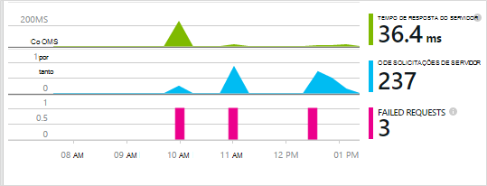
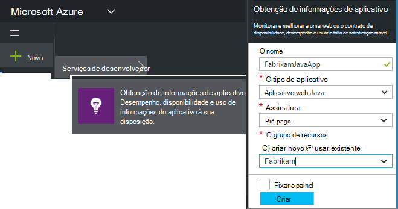
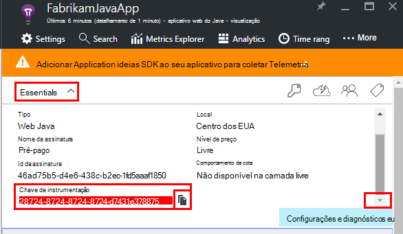
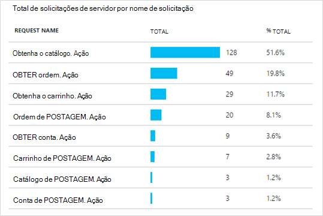
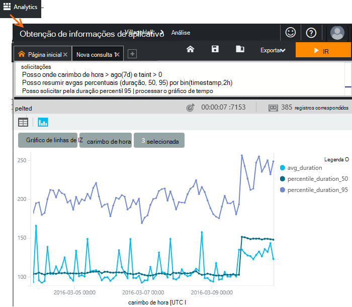
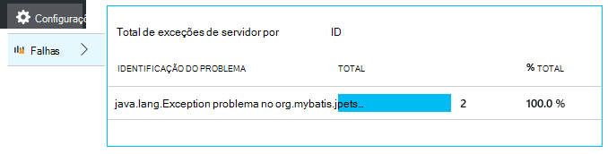
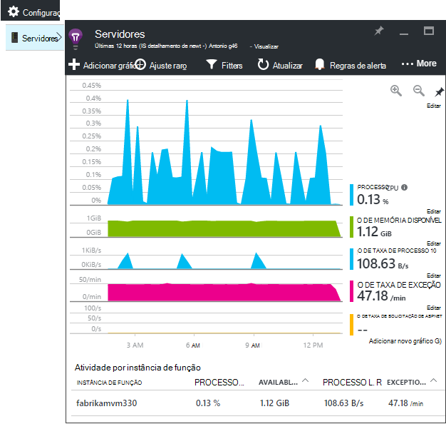
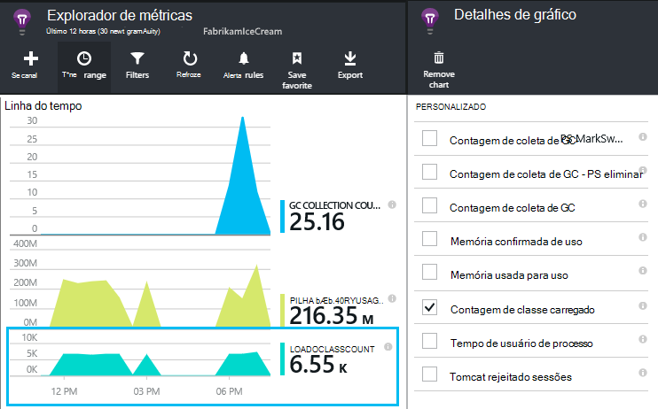
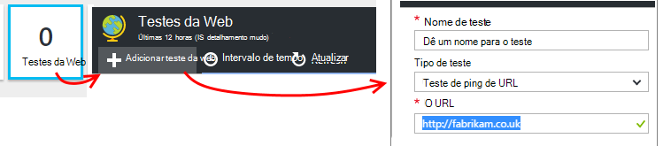
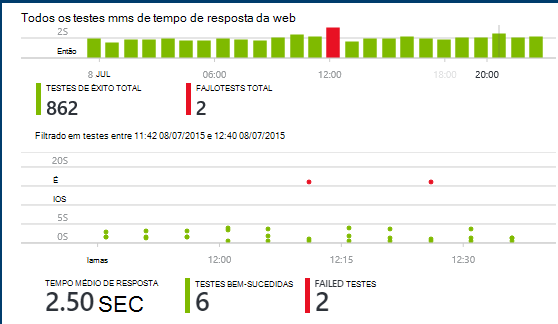

<properties
    pageTitle="Análise de aplicativo web Java com ideias de aplicativo | Microsoft Azure"
    description="Monitorar o desempenho e o uso do seu site de Java com ideias de aplicativo. "
    services="application-insights"
    documentationCenter="java"
    authors="alancameronwills"
    manager="douge"/>

<tags
    ms.service="application-insights"
    ms.workload="tbd"
    ms.tgt_pltfrm="ibiza"
    ms.devlang="na"
    ms.topic="get-started-article"
    ms.date="08/17/2016"
    ms.author="awills"/>

# Introdução ao aplicativo ideias em um projeto de web Java

*Obtenção de informações de aplicativo está no modo de visualização.*

[AZURE.INCLUDE [app-insights-selector-get-started](../../includes/app-insights-selector-get-started.md)]

[Obtenção de informações de aplicativo](https://azure.microsoft.com/services/application-insights/) é um serviço de análise extensível que ajuda você a entender o desempenho e o uso do seu aplicativo ao vivo. Usá-lo para [detectar e diagnosticar problemas de desempenho e exceções](app-insights-detect-triage-diagnose.md)e [escrever código] [ api] para controlar o que os usuários façam com seu aplicativo.

Obtenção de informações de aplicativo é compatível com aplicativos de Java em execução no Linux, Unix ou Windows.

Você precisa:

* Oracle JRE 1,6 ou posterior ou Zulu JRE 1,6 ou posterior
* Uma assinatura do [Microsoft Azure](https://azure.microsoft.com/). (Você pode começar com a [avaliação gratuita](https://azure.microsoft.com/pricing/free-trial/)).

*Se você tiver um aplicativo web que já está ao vivo, você poderia siga o procedimento alternativo para [Adicionar o SDK no tempo de execução no servidor web](app-insights-java-live.md). Essa alternativa evita recriando o código, mas você não recebe a opção para escrever código para controlar a atividade de usuário.*

## 1. obter uma chave de instrumentação de obtenção de informações de aplicativo

1. Entrar no [portal do Microsoft Azure](https://portal.azure.com).
2. Crie um recurso de obtenção de informações do aplicativo. Defina o tipo de aplicativo para aplicativo web Java.

    
4. Encontre a chave de instrumentação do novo recurso. Você precisará cole esta chave em seu projeto de código em breve.

    

## 2. adicionar o aplicativo ideias SDK para Java ao seu projeto

*Escolha o modo apropriado para o seu projeto.*

#### Se você estiver usando o Eclipse para criar um projeto Maven ou dinâmico da Web...

Usar o [SDK de ideias de aplicativo do plug-in Java][eclipse].

#### Se você estiver usando Maven...

Se seu projeto já estiver configurado para usar o Maven para construir, mescle o seguinte código ao seu arquivo de pom.xml.

Em seguida, atualize as dependências do projeto para obter os binários baixados.

    <repositories>
       <repository>
          <id>central</id>
          <name>Central</name>
          <url>http://repo1.maven.org/maven2</url>
       </repository>
    </repositories>

    <dependencies>
      <dependency>
        <groupId>com.microsoft.azure</groupId>
        <artifactId>applicationinsights-web</artifactId>
        <!-- or applicationinsights-core for bare API -->
        <version>[1.0,)</version>
      </dependency>
    </dependencies>

* *Construir ou soma de verificação de erros de validação?* Tente usar uma versão específica, tais como: `<version>1.0.n</version>`. Você encontrará a versão mais recente nas [notas de versão do SDK](https://github.com/Microsoft/ApplicationInsights-Java#release-notes) ou em nosso [artefatos Maven](http://search.maven.org/#search%7Cga%7C1%7Capplicationinsights).
* *Você precisa atualizar para um novo SDK?* Atualize dependências do seu projeto.

#### Se você estiver usando Gradle...

Se seu projeto já estiver configurado para usar o Gradle para construir, mescle o seguinte código ao seu arquivo de build.gradle.

Em seguida, atualize as dependências do projeto para obter os binários baixados.

    repositories {
      mavenCentral()
    }

    dependencies {
      compile group: 'com.microsoft.azure', name: 'applicationinsights-web', version: '1.+'
      // or applicationinsights-core for bare API
    }

* *Validação construir ou soma de verificação de erros? Tente usar uma versão específica, tais como:* `version:'1.0.n'`. *Você encontrará a versão mais recente nas [notas de versão do SDK](https://github.com/Microsoft/ApplicationInsights-Java#release-notes).*
* *Atualizar para um novo SDK*
 * Atualize dependências do seu projeto.

#### Caso contrário,...

Adicione manualmente o SDK:

1. Baixe o [aplicativo ideias SDK para Java](https://aka.ms/aijavasdk).
2. Extrair os binários do arquivo zip e adicioná-los ao seu projeto.

### Perguntas...

* *Qual é a relação entre a `-core` e `-web` componentes em zip?*

 * `applicationinsights-core`fornece a API vazia. Você sempre precisa este componente.
 * `applicationinsights-web`fornece métricas que rastreiam contagens de solicitação HTTP e tempos de resposta. Você pode omitir este componente se não quiser que essa telemetria coletada automaticamente. Por exemplo, se você quiser escrever sua própria.

* *Atualize o SDK quando podemos publicar alterações*
 * Baixe o mais recente do [Aplicativo ideias SDK para Java](https://aka.ms/qqkaq6) e substituir as antigas.
 * As alterações são descritas nas [notas de versão do SDK](https://github.com/Microsoft/ApplicationInsights-Java#release-notes).

## 3. adicionar um arquivo. XML de obtenção de informações de aplicativo

Adicionar ApplicationInsights.xml a pasta de recursos em seu projeto ou certificar-se de que ele é adicionado ao caminho de classe de implantação do seu projeto. Copie o seguinte XML para ela.

Substitua a chave de instrumentação obtido do portal do Azure.

    <?xml version="1.0" encoding="utf-8"?>
    <ApplicationInsights xmlns="http://schemas.microsoft.com/ApplicationInsights/2013/Settings" schemaVersion="2014-05-30">

      <!-- The key from the portal: -->

      <InstrumentationKey>** Your instrumentation key **</InstrumentationKey>

      <!-- HTTP request component (not required for bare API) -->

      <TelemetryModules>
        <Add type="com.microsoft.applicationinsights.web.extensibility.modules.WebRequestTrackingTelemetryModule"/>
        <Add type="com.microsoft.applicationinsights.web.extensibility.modules.WebSessionTrackingTelemetryModule"/>
        <Add type="com.microsoft.applicationinsights.web.extensibility.modules.WebUserTrackingTelemetryModule"/>
      </TelemetryModules>

      <!-- Events correlation (not required for bare API) -->
      <!-- These initializers add context data to each event -->

      <TelemetryInitializers>
        <Add   type="com.microsoft.applicationinsights.web.extensibility.initializers.WebOperationIdTelemetryInitializer"/>
        <Add type="com.microsoft.applicationinsights.web.extensibility.initializers.WebOperationNameTelemetryInitializer"/>
        <Add type="com.microsoft.applicationinsights.web.extensibility.initializers.WebSessionTelemetryInitializer"/>
        <Add type="com.microsoft.applicationinsights.web.extensibility.initializers.WebUserTelemetryInitializer"/>
        <Add type="com.microsoft.applicationinsights.web.extensibility.initializers.WebUserAgentTelemetryInitializer"/>

      </TelemetryInitializers>
    </ApplicationInsights>

* A chave de instrumentação é enviada juntamente com todos os itens de telemetria e informa ideias de aplicativo para exibi-lo em seu recurso.
* O componente de solicitação HTTP é opcional. Ela envia automaticamente telemetria sobre solicitações e tempos de resposta para o portal.
* Correlação de eventos é uma adição para o componente de solicitação HTTP. Ele atribui um identificador para cada solicitação recebida pelo servidor e adiciona esse identificador como uma propriedade para cada item de telemetria como a propriedade 'Operation.Id'. Ele permite que você correlação a telemetria associada com cada solicitação definindo um filtro na [pesquisa diagnóstico][diagnostic].
* A chave de obtenção de informações de aplicativo pode ser passada dinamicamente a partir do portal Azure como uma propriedade de sistema (-DAPPLICATION_INSIGHTS_IKEY = your_ikey). Se não houver nenhuma propriedade definida, ela verifica a variável de ambiente (APPLICATION_INSIGHTS_IKEY) nas configurações de aplicativo do Azure. Se as propriedades indefinidas, o padrão InstrumentationKey é usado em ApplicationInsights.xml. Esta sequência ajuda você a gerenciar InstrumentationKeys diferentes para diferentes ambientes dinamicamente.

### Maneiras alternativas para definir a chave de instrumentação

Aplicativo ideias SDK procura a chave nesta ordem:

1. Propriedade do sistema:-DAPPLICATION_INSIGHTS_IKEY = your_ikey
2. Variável de ambiente: APPLICATION_INSIGHTS_IKEY
3. Arquivo de configuração: ApplicationInsights.xml

Você também pode [configurá-lo no código](app-insights-api-custom-events-metrics.md#ikey):

    telemetryClient.InstrumentationKey = "...";

## 4. adicionar um filtro HTTP

A última etapa de configuração permite que o componente de solicitação HTTP efetuar a cada solicitação da web. (Não obrigatório se você quiser apenas a API vazia.)

Localize e abra o arquivo Web. XML no seu projeto e mesclar o seguinte código sob o nó de aplicativo web, onde os seus filtros de aplicativo estão configurados.

Para obter os resultados mais precisos, o filtro deve ser mapeado antes de todos os outros filtros.

    <filter>
      <filter-name>ApplicationInsightsWebFilter</filter-name>
      <filter-class>
        com.microsoft.applicationinsights.web.internal.WebRequestTrackingFilter
      </filter-class>
    </filter>
    <filter-mapping>
       <filter-name>ApplicationInsightsWebFilter</filter-name>
       <url-pattern>/*</url-pattern>
    </filter-mapping>

#### Se você estiver usando Spring Web MVC 3.1 ou posterior

Edite esses elementos para incluir o pacote de obtenção de informações do aplicativo:

    <context:component-scan base-package=" com.springapp.mvc, com.microsoft.applicationinsights.web.spring"/>

    <mvc:interceptors>
        <mvc:interceptor>
            <mvc:mapping path="/**"/>
            <bean class="com.microsoft.applicationinsights.web.spring.RequestNameHandlerInterceptorAdapter" />
        </mvc:interceptor>
    </mvc:interceptors>

#### Se você estiver usando Struts 2

Adicione este item para o arquivo de configuração de Struts (normalmente chamado de struts.xml ou struts-default.xml):

     <interceptors>
       <interceptor name="ApplicationInsightsRequestNameInterceptor" class="com.microsoft.applicationinsights.web.struts.RequestNameInterceptor" />
     </interceptors>
     <default-interceptor-ref name="ApplicationInsightsRequestNameInterceptor" />

(Se você tiver interceptores definidos em uma pilha de padrão, o interceptador pode simplesmente ser adicionado ao pilha.)

## 5. Execute o aplicativo

Execute-o no modo de depuração em sua máquina de desenvolvimento ou publicar seu servidor.

## 6. exibir seu telemetria em ideias de aplicativo

Retornar para o recurso de obtenção de informações de aplicativo de [portal do Microsoft Azure](https://portal.azure.com).

Dados de solicitações HTTP aparecem na lâmina visão geral. (Se ele não estiver lá, aguarde alguns segundos e clique em Atualizar.)

[Saiba mais sobre métricas.][metrics]

Clique em qualquer gráfico para ver mais detalhadas métricas agregadas.

> Obtenção de informações de aplicativo assume o formato de solicitações HTTP para aplicativos MVC é: `VERB controller/action`. Por exemplo, `GET Home/Product/f9anuh81`, `GET Home/Product/2dffwrf5` e `GET Home/Product/sdf96vws` são agrupadas em `GET Home/Product`. Esse agrupamento permite agregações significativas de solicitações, como o número de solicitações e tempo médio de execução para solicitações.

### Dados da instância 

Clique em um tipo de solicitação específica para ver instâncias individuais. 

Dois tipos de dados são exibidos no aplicativo ideias: dados agregados, armazenados e exibidas como somas; contagens e médias e instância dados - relatórios individuais de solicitações HTTP, exceções, modos de exibição de página ou eventos personalizados.

Ao exibir as propriedades de uma solicitação, você pode ver os eventos de telemetria associados a ele como solicitações e exceções.

### Analytics: Linguagem de consulta poderosa

Conforme você acumular mais dados, você pode executar consultas tanto para agregar dados e localizar instâncias individuais. [Análise]() é uma ferramenta poderosa para ambos para uso e Noções básicas sobre desempenho e para fins de diagnóstico.

## 7. Instale o seu aplicativo no servidor

Agora publica seu aplicativo para o servidor, use permita que as pessoas e assistir a telemetria aparecem no portal.

* Verifique se seu firewall permite que o aplicativo enviar telemetria para essas portas:

 * DC.Services.VisualStudio.com:443
 * F5.Services.VisualStudio.com:443

* Em servidores Windows, instale:

 * [Microsoft Visual C++ redistribuível](http://www.microsoft.com/download/details.aspx?id=40784)

    (Esse componente permite contadores de desempenho.)

## Falhas de solicitação e exceções

Exceções sem tratamento são coletadas automaticamente:

Para coletar dados em outras exceções, você tem duas opções:

* [Inserir chamadas para trackException() no seu código][apiexceptions]. 
* [Instalar o agente de Java no seu servidor](app-insights-java-agent.md). Especifique os métodos que você deseja inspecionar.

## Chamadas de método de monitor e dependências externas

[Instalar o agente de Java](app-insights-java-agent.md) fazer logon especificado métodos internos e chamadas feitas por meio de JDBC, com dados de tempo.

## Contadores de desempenho

Abra **configurações**, **servidores**, para ver um intervalo de contadores de desempenho.

### Personalizar a coleta de contador de desempenho

Para desabilitar o conjunto do conjunto padrão de contadores de desempenho, adicione o seguinte código sob o nó raiz do arquivo ApplicationInsights.xml:

    <PerformanceCounters>
       <UseBuiltIn>False</UseBuiltIn>
    </PerformanceCounters>

### Coletar contador de desempenho adicional

Você pode especificar o contador de desempenho adicional para serem coletados.

#### Contadores JMX (expostos por máquina Virtual Java)

    <PerformanceCounters>
      <Jmx>
        <Add objectName="java.lang:type=ClassLoading" attribute="TotalLoadedClassCount" displayName="Loaded Class Count"/>
        <Add objectName="java.lang:type=Memory" attribute="HeapMemoryUsage.used" displayName="Heap Memory Usage-used" type="composite"/>
      </Jmx>
    </PerformanceCounters>

*   `displayName`– O nome exibido no portal de obtenção de informações do aplicativo.
*   `objectName`– O nome de objeto JMX.
*   `attribute`– O atributo do nome do objeto JMX para buscar
*   `type`(opcional) - o tipo de atributo do objeto JMX:
 *  Padrão: um tipo simples como int ou longa.
 *  `composite`: os dados do contador de desempenho estão no formato de 'Attribute.Data'
 *  `tabular`: os dados do contador de desempenho estão no formato de uma linha de tabela

#### Contadores de desempenho do Windows

Cada [contador de desempenho do Windows](https://msdn.microsoft.com/library/windows/desktop/aa373083.aspx) é um membro de uma categoria (da mesma forma que um campo é um membro de uma classe). Categorias podem ser globais, ou podem ter numerados ou instâncias nomeadas.

    <PerformanceCounters>
      <Windows>
        <Add displayName="Process User Time" categoryName="Process" counterName="%User Time" instanceName="__SELF__" />
        <Add displayName="Bytes Printed per Second" categoryName="Print Queue" counterName="Bytes Printed/sec" instanceName="Fax" />
      </Windows>
    </PerformanceCounters>

*   displayName – o nome exibido no portal de obtenção de informações do aplicativo.
*   nome de categoria – a categoria de contador de desempenho (objeto de desempenho) ao qual este contador de desempenho está associada.
*   counterName – o nome do contador de desempenho.
*   instanceName – o nome da instância de categoria de contador de desempenho, ou uma cadeia de caracteres vazia (""), se a categoria contém uma única instância. Se o nome de categoria é o processo e o contador de desempenho que você gostaria de coletar consta do processo de JVM atual de que seu aplicativo está em execução, especifique `"__SELF__"`.

Seus contadores de desempenho estão visíveis como personalizados de métricas no [Explorador de métricas][metrics].

### Contadores de desempenho do UNIX

* [Instalar o collectd com o plug-in de obtenção de informações do aplicativo](app-insights-java-collectd.md) para obter uma ampla variedade de dados de sistema e de rede.

## Obter dados de usuário e sessão

Okey, você está enviando telemetria do seu servidor web. Agora para acessar o modo de exibição de 360 graus completo do seu aplicativo, você pode adicionar mais monitoramento:

* [Adicionar telemetria às suas páginas da web] [ usage] para modos de exibição de página de monitor e métricas de usuário.
* [Configurar testes web] [ availability] para garantir que seu aplicativo permaneça ao vivo e ágil.

## Capturar traços de log

Você pode usar o aplicativo ideias para logs fatia e dados Log4J, Logback ou outras estruturas de log. Você pode correlacionar os logs com solicitações HTTP e outra telemetria. [Saiba como][javalogs].

## Envie sua próprias Telemetria

Agora que você instalou o SDK, você pode usar a API para enviar sua própria telemetria.

* [Controlar eventos personalizados e métricas] [ api] para saber o que os usuários estão fazendo com seu aplicativo.
* [Pesquisar eventos e logs de] [ diagnostic] para ajudar a diagnosticar problemas.

## Testes de web de disponibilidade

Obtenção de informações de aplicativo pode testar seu site em intervalos regulares para verificar que cabe e responder bem. [Configurar][availability], clique em testes da Web.

Se seu site falhar, você receberá gráficos da tempos de resposta, além de notificações por email.

[Saiba mais sobre testes de web de disponibilidade.][availability] 

## Dúvidas? Problemas?

[Solução de problemas de Java](app-insights-java-troubleshoot.md)

## Próximas etapas

Para obter mais informações, consulte o [Java Developer Center](/develop/java/).

<!--Link references-->

[api]: app-insights-api-custom-events-metrics.md
[apiexceptions]: app-insights-api-custom-events-metrics.md#track-exception
[availability]: app-insights-monitor-web-app-availability.md
[diagnostic]: app-insights-diagnostic-search.md
[eclipse]: app-insights-java-eclipse.md
[javalogs]: app-insights-java-trace-logs.md
[metrics]: app-insights-metrics-explorer.md
[usage]: app-insights-web-track-usage.md
