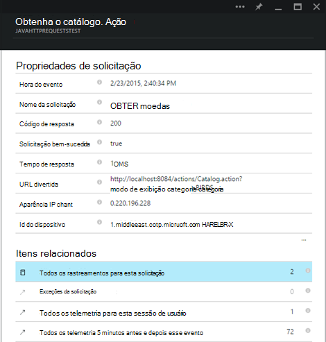

<properties 
    pageTitle="Obtenção de informações de aplicativo Java web Apps que já estão live" 
    description="Iniciar um aplicativo web que já está sendo executado no seu servidor de monitoramento" 
    services="application-insights" 
    documentationCenter="java"
    authors="alancameronwills" 
    manager="douge"/>

<tags 
    ms.service="application-insights" 
    ms.workload="tbd" 
    ms.tgt_pltfrm="ibiza" 
    ms.devlang="na" 
    ms.topic="article" 
    ms.date="08/24/2016" 
    ms.author="awills"/>
 
# Obtenção de informações de aplicativo Java web Apps que já estão live

*Obtenção de informações de aplicativo está no modo de visualização.*

Se você tiver um aplicativo web que já está sendo executado no seu servidor J2EE, você pode iniciar monitoramento com [Ideias de aplicativo](app-insights-overview.md) sem a necessidade de fazer alterações de código ou recompilar o seu projeto. Com essa opção, você obtenha informações sobre solicitações HTTP enviadas ao seu servidor, exceções sem tratamento e medidores de desempenho.

Você precisará de uma assinatura do [Microsoft Azure](https://azure.com).

> [AZURE.NOTE] O procedimento nesta página adiciona o SDK para o seu aplicativo web em tempo de execução. Essa instrumentação runtime é útil se você não quiser atualizar ou reconstruir seu código-fonte. Mas, se possível, recomendamos que você [Adicionar o SDK ao código-fonte](app-insights-java-get-started.md) em vez disso. Que oferece mais opções como escrever código para controlar a atividade de usuário.

## 1. obter uma chave de instrumentação de obtenção de informações de aplicativo

1. Entre [portal do Microsoft Azure](https://portal.azure.com)
2. Criar um novo recurso de obtenção de informações de aplicativo

    
3. Defina o tipo de aplicativo para aplicativo web Java.

    
4. Encontre a chave de instrumentação do novo recurso. Você precisará cole esta chave em seu projeto de código em breve.

    

## 2. Baixe o SDK

1. Baixe o [aplicativo ideias SDK para Java](https://aka.ms/aijavasdk). 
2. No seu servidor, extraia o conteúdo do SDK ao diretório da qual seus binários de projeto são carregados. Se você estiver usando o Tomcat, este diretório normalmente seria em`webapps\<your_app_name>\WEB-INF\lib`

## 3. adicionar um arquivo xml de obtenção de informações de aplicativo

Crie ApplicationInsights.xml na pasta na qual você adicionou o SDK. Coloca no XML a seguir.

Substitua a chave de instrumentação obtido do portal do Azure.

    <?xml version="1.0" encoding="utf-8"?>
    <ApplicationInsights xmlns="http://schemas.microsoft.com/ApplicationInsights/2013/Settings" schemaVersion="2014-05-30">

      <!-- The key from the portal: -->

      <InstrumentationKey>** Your instrumentation key **</InstrumentationKey>

      <!-- HTTP request component (not required for bare API) -->

      <TelemetryModules>
        <Add type="com.microsoft.applicationinsights.web.extensibility.modules.WebRequestTrackingTelemetryModule"/>
        <Add type="com.microsoft.applicationinsights.web.extensibility.modules.WebSessionTrackingTelemetryModule"/>
        <Add type="com.microsoft.applicationinsights.web.extensibility.modules.WebUserTrackingTelemetryModule"/>
      </TelemetryModules>

      <!-- Events correlation (not required for bare API) -->
      <!-- These initializers add context data to each event -->

      <TelemetryInitializers>
        <Add   type="com.microsoft.applicationinsights.web.extensibility.initializers.WebOperationIdTelemetryInitializer"/>
        <Add type="com.microsoft.applicationinsights.web.extensibility.initializers.WebOperationNameTelemetryInitializer"/>
        <Add type="com.microsoft.applicationinsights.web.extensibility.initializers.WebSessionTelemetryInitializer"/>
        <Add type="com.microsoft.applicationinsights.web.extensibility.initializers.WebUserTelemetryInitializer"/>
        <Add type="com.microsoft.applicationinsights.web.extensibility.initializers.WebUserAgentTelemetryInitializer"/>

      </TelemetryInitializers>
    </ApplicationInsights>

* A chave de instrumentação é enviada juntamente com todos os itens de telemetria e informa ideias de aplicativo para exibi-lo em seu recurso.
* O componente de solicitação HTTP é opcional. Ela envia automaticamente telemetria sobre solicitações e tempos de resposta para o portal.
* Correlação de eventos é uma adição para o componente de solicitação HTTP. Ele atribui um identificador para cada solicitação recebida pelo servidor e adiciona esse identificador como uma propriedade para cada item de telemetria como a propriedade 'Operation.Id'. Ele permite que você correlação a telemetria associada com cada solicitação definindo um filtro na [pesquisa de diagnóstico](app-insights-diagnostic-search.md).

## 4. adicionar um filtro HTTP

Localize e abra o arquivo Web. XML no seu projeto e mesclar o seguinte trecho de código sob o nó de aplicativo web, onde os seus filtros de aplicativo estão configurados.

Para obter os resultados mais precisos, o filtro deve ser mapeado antes de todos os outros filtros.

    <filter>
      <filter-name>ApplicationInsightsWebFilter</filter-name>
      <filter-class>
        com.microsoft.applicationinsights.web.internal.WebRequestTrackingFilter
      </filter-class>
    </filter>
    <filter-mapping>
       <filter-name>ApplicationInsightsWebFilter</filter-name>
       <url-pattern>/*</url-pattern>
    </filter-mapping>

## 5. exceções do firewall seleção

Talvez seja necessário [Definir exceções para enviar dados de saída](app-insights-ip-addresses.md).

## 6. Reinicie seu aplicativo web

## 7. exibir seu telemetria em ideias de aplicativo

Retornar para o recurso de obtenção de informações de aplicativo de [portal do Microsoft Azure](https://portal.azure.com).

Telemetria sobre solicitações HTTP aparece na lâmina visão geral. (Se ele não estiver lá, aguarde alguns segundos e clique em Atualizar.)

 

Clique em qualquer gráfico para ver mais detalhadas métricas. 

 

E ao exibir as propriedades de uma solicitação, você pode ver os eventos de telemetria associados a ele como solicitações e exceções.
 

[Saiba mais sobre métricas.](app-insights-metrics-explorer.md)

## Próximas etapas

* [Adicionar telemetria às páginas da web](app-insights-web-track-usage.md) para modos de exibição de página de monitor e métricas de usuário.
* [Configurar testes da web](app-insights-monitor-web-app-availability.md) para garantir que seu aplicativo permaneça ao vivo e ágil.
* [Capturar traços de log](app-insights-java-trace-logs.md)
* [Logs e eventos de pesquisa](app-insights-diagnostic-search.md) para ajudar a diagnosticar problemas.

 
