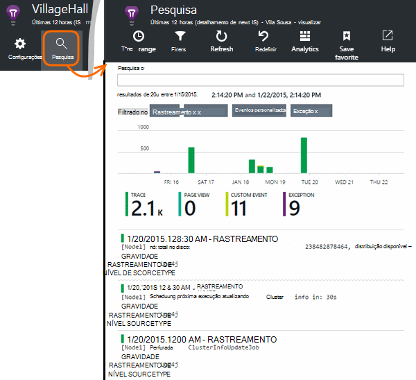

<properties 
    pageTitle="Explorar Java logs de rastreamento na obtenção de informações de aplicativo" 
    description="Pesquisa Log4J ou Logback rastreamentos em ideias de aplicativo" 
    services="application-insights" 
    documentationCenter="java"
    authors="alancameronwills" 
    manager="douge"/>

<tags 
    ms.service="application-insights" 
    ms.workload="tbd" 
    ms.tgt_pltfrm="ibiza" 
    ms.devlang="na" 
    ms.topic="article" 
    ms.date="07/12/2016" 
    ms.author="awills"/>

# Explorar Java logs de rastreamento na obtenção de informações de aplicativo

Se você estiver usando Logback ou Log4J (v 1.2 ou v 2.0) para rastreamento, você pode ter os logs de rastreamento enviados automaticamente para a obtenção de informações de aplicativo onde você pode explorar e pesquise neles.

Instalar o [Aplicativo ideias SDK para Java][java], se ainda não fez que.

## Adicionar bibliotecas de log ao seu projeto

*Escolha o modo apropriado para o seu projeto.*

#### Se você estiver usando Maven...

Se seu projeto já estiver configurado para usar o Maven para construir, mescle um dos seguintes trechos de código em seu arquivo de pom.xml.

Em seguida, atualize as dependências do projeto, para obter os binários baixados.

*Logback*

    <dependencies>
       <dependency>
          <groupId>com.microsoft.azure</groupId>
          <artifactId>applicationinsights-logging-logback</artifactId>
          <version>[1.0,)</version>
       </dependency>
    </dependencies>

*V 2.0 Log4J*

    <dependencies>
       <dependency>
          <groupId>com.microsoft.azure</groupId>
          <artifactId>applicationinsights-logging-log4j2</artifactId>
          <version>[1.0,)</version>
       </dependency>
    </dependencies>

*V 1.2 Log4J*

    <dependencies>
       <dependency>
          <groupId>com.microsoft.azure</groupId>
          <artifactId>applicationinsights-logging-log4j1_2</artifactId>
          <version>[1.0,)</version>
       </dependency>
    </dependencies>

#### Se você estiver usando Gradle...

Se seu projeto já estiver configurado para usar o Gradle para construir, adicione uma das linhas a seguir para o `dependencies` grupo no seu arquivo de build.gradle:

Em seguida, atualize as dependências do projeto, para obter os binários baixados.

**Logback**

    compile group: 'com.microsoft.azure', name: 'applicationinsights-logging-logback', version: '1.0.+'

**V 2.0 Log4J**

    compile group: 'com.microsoft.azure', name: 'applicationinsights-logging-log4j2', version: '1.0.+'

**V 1.2 Log4J**

    compile group: 'com.microsoft.azure', name: 'applicationinsights-logging-log4j1_2', version: '1.0.+'

#### Caso contrário,...

Baixar e extrair o appender apropriado, adicione a biblioteca apropriada ao seu projeto:

Agente de log | Baixar | Biblioteca
----|----|----
Logback|[SDK com Logback appender](https://aka.ms/xt62a4)|applicationinsights-log-logback
V 2.0 Log4J|[SDK com Log4J v2 appender](https://aka.ms/qypznq)|applicationinsights-log-log4j2 
V 1.2 Log4j|[SDK com Log4J v 1.2 appender](https://aka.ms/ky9cbo)|applicationinsights-log-log4j1_2 

## Adicionar o appender à sua estrutura de log

Para começar a receber rastreamentos, mescle o trecho de código para o arquivo de configuração Log4J ou Logback relevante: 

*Logback*

    <appender name="aiAppender" 
      class="com.microsoft.applicationinsights.logback.ApplicationInsightsAppender">
    </appender>
    <root level="trace">
      <appender-ref ref="aiAppender" />
    </root>

*V 2.0 Log4J*

    <Configuration packages="com.microsoft.applicationinsights.Log4j">
      <Appenders>
        <ApplicationInsightsAppender name="aiAppender" />
      </Appenders>
      <Loggers>
        <Root level="trace">
          <AppenderRef ref="aiAppender"/>
        </Root>
      </Loggers>
    </Configuration>

*V 1.2 Log4J*

    <appender name="aiAppender" 
         class="com.microsoft.applicationinsights.log4j.v1_2.ApplicationInsightsAppender">
    </appender>
    <root>
      <priority value ="trace" />
      <appender-ref ref="aiAppender" />
    </root>

Appenders a obtenção de informações de aplicativo podem ser referenciadas por qualquer agente de log configurado, mas não necessariamente pelo agente de log de raiz (conforme mostrado nos exemplos de código acima).

## Explore seus rastreamentos no portal de obtenção de informações de aplicativo

Agora que você configurou seu projeto para enviar rastreamentos de obtenção de informações do aplicativo, você pode exibir e pesquisar esses rastreamentos no portal de obtenção de informações do aplicativo, na [pesquisa] [ diagnostic] blade.

## Próximas etapas

[Pesquisa de diagnóstico][diagnostic]

<!--Link references-->

[diagnostic]: app-insights-diagnostic-search.md
[java]: app-insights-java-get-started.md

 
