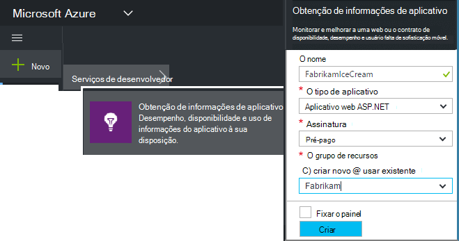

<properties
    pageTitle="Aplicativos da web de obtenção de informações de aplicativo para JavaScript | Microsoft Azure"
    description="Obtenha contagens de modo de exibição e sessão de página, dados de cliente da web e controlar os padrões de uso. Detecte problemas de desempenho e exceções em páginas da web de JavaScript."
    services="application-insights"
    documentationCenter=""
    authors="alancameronwills"
    manager="douge"/>

<tags
    ms.service="application-insights"
    ms.workload="tbd"
    ms.tgt_pltfrm="ibiza"
    ms.devlang="na"
    ms.topic="get-started-article"
    ms.date="08/15/2016"
    ms.author="awills"/>

# Obtenção de informações de aplicativo para páginas da web

[AZURE.INCLUDE [app-insights-selector-get-started-dotnet](../../includes/app-insights-selector-get-started-dotnet.md)]

Saiba mais sobre o desempenho e o uso da sua página da web ou o aplicativo. Se você adicionar ideias de aplicativo do Visual Studio ao seu script de página, você obtém os intervalos dos carregamentos de página e chamadas de AJAX, contagens e detalhes de exceções do navegador, falhas de AJAX, bem como usuários e contagens de sessão. Todos esses podem ser segmentados por página, sistema operacional cliente e versão do navegador, localização geográfica e outras dimensões. Você também pode definir alertas nos contagens de falha ou carregamento de página lento.

Você pode usar o aplicativo ideias com páginas da web - você adicionar apenas um breve trecho de JavaScript. Se seu serviço da web for [Java](app-insights-java-get-started.md) ou [ASP.NET](app-insights-asp-net.md), você pode integrar telemetria do seu servidor e clientes.

Você precisa de uma assinatura do [Microsoft Azure](https://azure.com). Se sua equipe tiver uma assinatura organizacional, peça ao proprietário para adicionar sua Account Microsoft a ele. Há um nível de preços gratuito, desenvolvimento e uso de pequena escala não custam nada.

## Configurar o aplicativo ideias para sua página da web

Primeiro, você precisa adicionar aplicativo ideias para páginas da web? Você pode já tiver feito isso. Se você optar por adicionar ideias de aplicativo para o seu aplicativo web na caixa de diálogo Novo projeto no Visual Studio, o script foi adicionado depois. Nesse caso, você não precisa fazer mais.

Caso contrário, você precisa adicionar um trecho de código suas páginas da web, da seguinte maneira.

### Abrir um recurso de obtenção de informações de aplicativo

O recurso de obtenção de informações de aplicativo é onde os dados sobre desempenho e o uso da sua página são exibidos. 

Entrar no [portal do Azure](https://portal.azure.com).

Se você configurou o monitoramento do lado do servidor do seu aplicativo, você já possui um recurso:

Se você não tiver uma, criá-lo:

*Já perguntas?* [Mais sobre a criação de um recurso](app-insights-create-new-resource.md).

### Adicione o script SDK para seus aplicativos ou páginas da web

Início rápido, obtenha o script para páginas da web:

Insira o script logo antes do `</head>` marca de cada página que você deseja controlar. Se seu site tem uma página mestra, você pode colocar o script lá. Por exemplo:

* Em um projeto do ASP.NET MVC, você deve colocá-lo`View\Shared\_Layout.cshtml`
* Em um site do SharePoint, no painel de controle, abra [configurações do Site / página mestra](app-insights-sharepoint.md).

O script contém a chave de instrumentação que direciona os dados para o recurso de obtenção de informações do aplicativo. 

([Explicação mais profunda do script.](http://apmtips.com/blog/2015/03/18/javascript-snippet-explained/))

*(Se você estiver usando uma estrutura de página da web conhecidos, procure em torno adaptadores de obtenção de informações do aplicativo. Por exemplo, há [um módulo de AngularJS](http://ngmodules.org/modules/angular-appinsights).)*

## Configuração detalhada

Há vários [parâmetros](https://github.com/Microsoft/ApplicationInsights-JS/blob/master/API-reference.md#config) que você pode definir, embora na maioria dos casos, você não precisa. Por exemplo, você pode desabilitar ou limitar o número de chamadas de Ajax relatados por modo de exibição de página (para reduzir o tráfego). Ou você pode definir o modo de depuração ter telemetria mover rapidamente pelo pipeline de sem sendo em lote.

Para definir esses parâmetros, procure por essa linha no trecho de código e adicionar mais itens separados por vírgula depois dele:

    })({
      instrumentationKey: "..."
      // Insert here
    });

Os [parâmetros disponíveis](https://github.com/Microsoft/ApplicationInsights-JS/blob/master/API-reference.md#config) incluem:

    // Send telemetry immediately without batching.
    // Remember to remove this when no longer required, as it
    // can affect browser performance.
    enableDebug: boolean,

    // Don't log browser exceptions.
    disableExceptionTracking: boolean,

    // Don't log ajax calls.
    disableAjaxTracking: boolean,

    // Limit number of Ajax calls logged, to reduce traffic.
    maxAjaxCallsPerView: 10, // default is 500

    // Time page load up to execution of first trackPageView().
    overridePageViewDuration: boolean,

    // Set these dynamically for an authenticated user.
    appUserId: string,
    accountId: string,

## Executar o aplicativo

Executar o aplicativo web, usá-lo um pouco para gerar telemetria e aguarde alguns segundos. Você pode executá-lo usando a tecla **F5** em sua máquina de desenvolvimento, ou publicá-lo e permitir que os usuários brincar com ele.

Se você quiser verificar a telemetria envio de um aplicativo web de obtenção de informações do aplicativo, use ferramentas de depuração do seu navegador (**F12** em muitos navegadores). Dados são enviados para dc.services.visualstudio.com.

## Explore seus dados de desempenho do navegador

Abra a lâmina navegadores para mostrar dados de desempenho agregado de navegadores dos usuários.

*Sem dados ainda? Clique em * *Atualizar* * na parte superior da página. Ainda nada? Consulte [solução de problemas](app-insights-troubleshoot-faq.md).*

A lâmina navegadores é um [blade métricas Explorer](app-insights-metrics-explorer.md) com seleções de gráfico e filtros predefinidos. Você pode editar o intervalo de tempo, filtros e configuração de gráfico se desejar e salvar o resultado como um favorito. Clique em **Restaurar padrões** para voltar para a configuração de blade original.

## Desempenho de carregamento de página

Na parte superior é um gráfico segmentado dos tempos de carregamento de página. A altura total do gráfico representa o tempo médio para carregar e exibir páginas de seu aplicativo em navegadores dos usuários. O tempo é medido da quando o navegador envia a solicitação HTTP inicial até carga síncrona todos os eventos tiverem sido processados, inclusive layout e executar scripts. Ele não inclui tarefas assíncronas como carregar web parts de chamadas AJAX.

O gráfico segmentos o tempo de carregamento de página total para os [intervalos padrão definidos pelo W3C](http://www.w3.org/TR/navigation-timing/#processing-model). 

Observe que o tempo de *conexão de rede* com frequência é menor do que o esperado, porque ele é uma média sobre todas as solicitações do navegador para o servidor. Muitas solicitações individuais têm um tempo de conexão de 0 porque já existe uma conexão ativa no servidor.

### Carregamento lento?

Carregamentos de página lenta são uma grande fonte de insatisfação para seus usuários. Se o gráfico indica carregamentos de página lenta, é fácil fazer algumas pesquisas de diagnóstico.

O gráfico mostra a média de todos os carregamentos de página em seu aplicativo. Para ver se o problema é restrita ao páginas em particular, veja mais abaixo a lâmina, onde não há uma grade segmentada por URL da página:

Observe que a contagem de modo de exibição de página e o desvio padrão. Se a contagem de páginas está muito baixa, em seguida, o problema não está afetando usuários muito. Um desvio padrão alto (comparável para a média próprio) indica muita variação entre medidas individuais.

**Amplie uma URL e modo de exibição de uma página.** Clique em qualquer nome de página para ver uma lâmina de gráficos de navegador filtrado apenas para essa URL; e, em seguida, em uma instância de um modo de exibição de página.

Clique em `...` para uma lista completa das propriedades para esse evento, ou inspecionar as chamadas Ajax e eventos relacionados. Chamadas de Ajax lentas afetam o tempo de carregamento de página geral se estiverem síncronos. Eventos relacionados incluem solicitações de servidor para a mesma URL (se você configurou o aplicativo ideias no servidor web).

**Desempenho de página ao longo do tempo.** Voltar ao blade navegadores, altere a grade de tempo de carregamento do modo de exibição de página em um gráfico de linhas para ver se houvesse picos em momentos específicos:

**Segmento por outras dimensões.** Talvez as páginas estão mais lentas ao carregar em um determinado navegador, sistema operacional cliente ou localidade do usuário? Adicionar um novo gráfico e experimentar a dimensão **Agrupar por** .

## Desempenho do AJAX

Certifique-se de quaisquer chamadas AJAX nas páginas da web estão realizando bem. Eles geralmente são usados para preencher partes da sua página assíncrona. Embora a página geral pode carregar imediatamente, seus usuários podem ser frustrados diante de partes da web em branco, aguardando dados sejam exibidos neles.

Chamadas de AJAX feitas a partir de sua página da web são mostradas na lâmina navegadores como dependências.

Há gráficos de resumo na parte superior da lâmina:

e detalhadas grades mais baixo:

Clique em qualquer linha para obter detalhes específicos.

> [AZURE.NOTE] Se você excluir o filtro de navegadores na lâmina, servidor e as dependências de AJAX são incluídas nestes gráficos. Clique em Restaurar padrões para reconfigurar o filtro.

**Para analisar falhas de chamadas de Ajax** Role para baixo até a grade de falhas de dependência e, em seguida, clique em uma linha para ver instâncias específicas.

Clique em `...` para a telemetria completa para uma chamada de Ajax.

### Não há chamadas Ajax informado?

Chamadas AJAX incluem qualquer chamadas HTTP feitas a partir de script da página da web. Se você não vê-los relatado, verifique se o trecho de código não definida a `disableAjaxTracking` ou `maxAjaxCallsPerView` [parâmetros](https://github.com/Microsoft/ApplicationInsights-JS/blob/master/API-reference.md#config).

## Exceções do navegador

Na lâmina navegadores, há um gráfico de resumo de exceções e uma grade dos tipos de exceção ainda mais para baixo a lâmina.

Se você não vir exceções de navegador relatadas, verifique se o trecho de código não definida na `disableExceptionTracking` [parâmetro](https://github.com/Microsoft/ApplicationInsights-JS/blob/master/API-reference.md#config).

## Inspecionar eventos de modo de exibição de página individual

Geralmente telemetria do modo de exibição de página é analisada pela obtenção de informações de aplicativo e você verá apenas cumulativos relatórios, média de todos os seus usuários. Mas, para fins de depuração, você também pode examinar eventos de modo de exibição de página individual.

Na pesquisa de diagnóstico blade, definir filtros para modo de exibição de página.

Selecione qualquer evento para ver mais detalhes. Na página detalhes, clique em "..." para ver mais detalhes.

> [AZURE.NOTE] Se você usar a [pesquisa](app-insights-diagnostic-search.md), observe que você tem para palavras inteiras: "Abou" e "sobre" não coincidem "Sobre".

Você também pode usar a [linguagem de consulta de análise](app-insights-analytics-tour.md) de poderosos pesquisar modos de exibição de página.

### Exibir propriedades de página

* **Duração do modo de exibição de página** 

 * Por padrão, o tempo necessário para carregar a página, do cliente de solicitação de carga completa (incluindo arquivos auxiliares, mas excluindo tarefas assíncronas como Ajax chama). 
 * Se você definir `overridePageViewDuration` na [configuração de página](#detailed-configuration), o intervalo entre o cliente solicitar a execução do primeiro `trackPageView`. Se você moveu trackPageView de sua posição normal após a inicialização do script, ele refletirá um valor diferente.
 * Se `overridePageViewDuration` é definido e uma duração argumento é fornecido na `trackPageView()` chamar, e em seguida, o valor do argumento será usado. 

## Contagens de página personalizado

Por padrão, uma contagem de página ocorre sempre que uma nova página carrega no navegador do cliente.  Mas talvez você queira contar modos de exibição de página adicional. Por exemplo, uma página pode exibir seu conteúdo nas guias e quiser contar uma página quando o usuário alterna entre guias. Ou código JavaScript na página pode carregar novo conteúdo sem alterar a URL do navegador.

Inserir uma chamada de JavaScript assim no ponto apropriado no seu código do cliente:

    appInsights.trackPageView(myPageName);

O nome de página pode conter os mesmos caracteres como uma URL, mas nada após "#" ou "?" será ignorada.

## Uso de rastreamento

Deseja descobrir o que seus usuários fazem com seu aplicativo?

* [Saiba mais sobre o uso de rastreamento](app-insights-web-track-usage.md)
* [Saiba mais sobre métricas API e eventos personalizados](app-insights-api-custom-events-metrics.md).

#### Vídeo: Uso de rastreamento

> [AZURE.VIDEO tracking-usage-with-application-insights]

## Próximas etapas

* [Controlar o uso](app-insights-web-track-usage.md)
* [Métricas e eventos personalizados](app-insights-api-custom-events-metrics.md)
* [Aprenda a compilação-medida](app-insights-overview-usage.md)

