<properties 
    pageTitle="Explorando métricas no aplicativo ideias | Microsoft Azure" 
    description="Como interpretar gráficos no Explorador de métrica e como personalizar blades explorer métrica." 
    services="application-insights" 
    documentationCenter=""
    authors="alancameronwills" 
    manager="douge"/>

<tags 
    ms.service="application-insights" 
    ms.workload="tbd" 
    ms.tgt_pltfrm="ibiza" 
    ms.devlang="na" 
    ms.topic="article" 
    ms.date="10/15/2016" 
    ms.author="awills"/>
 
# Explorando métricas em ideias de aplicativo

Métricas no [Aplicativo ideias] [ start] são valores de medida e contagens de eventos que são enviadas em Telemetria do seu aplicativo. Eles ajudam a detectar problemas de desempenho e assistir tendências em como o seu aplicativo está sendo usado. Há uma grande variedade de métricas padrão, e você também pode criar seus próprios personalizados de métricas e eventos.

Contagens de métricas e eventos são exibidas nos gráficos de valores agregados como somas, médias ou contagens.

Aqui está um exemplo de gráfico:

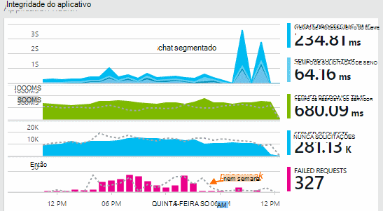

Alguns gráficos são segmentados: a altura total do gráfico em qualquer ponto é a soma das métricas exibidas. A legenda por padrão mostra as quantidades maior.

Linhas pontilhadas mostram o valor da métrica de uma semana anteriormente.

## Intervalo de tempo

Você pode alterar o intervalo de tempo coberto pelas gráficos ou grades em qualquer blade.

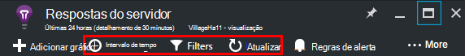

Se você está esperando alguns dados que não foi apareciam ainda, clique em Atualizar. Atualizar gráficos próprios intervalos, mas os intervalos são mais para intervalos de tempo maiores. No modo release, pode levar alguns instantes para dados venham pelo pipeline de análise em um gráfico.

Para ampliar parte de um gráfico, arraste sobre ele:

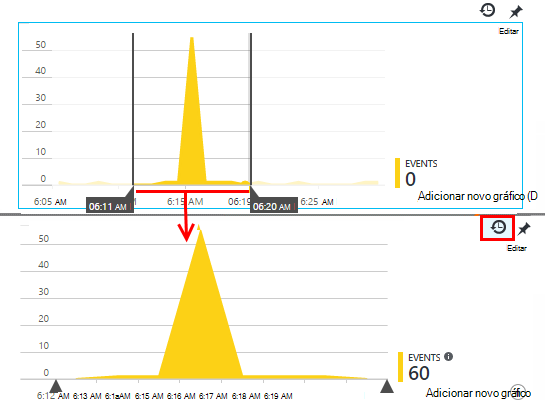

Clique no botão Desfazer Zoom para restaurá-la.

## Valores de detalhamento e ponto

Passe o mouse sobre o gráfico para exibir os valores das métricas nesse momento.

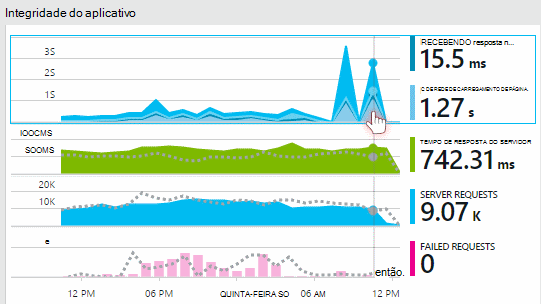

O valor da métrica em um determinado ponto é agregado no intervalo de amostragem anterior. 

O intervalo de amostragem ou "detalhamento" é mostrado na parte superior da lâmina. 

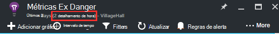

Você pode ajustar o detalhamento na lâmina de intervalo de tempo:

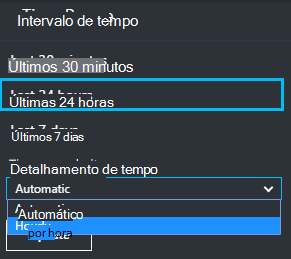

As granularidades disponíveis dependem do intervalo de tempo que você selecionar. As granularidades explícitas são alternativas para o detalhamento "automático" para o intervalo de tempo. 

## Explorador de métricas

Clique em qualquer gráfico na lâmina visão geral para ver um conjunto mais detalhado de grades e gráficos relacionados. Você pode editar esses gráficos e grades para focalizar os detalhes que você está interessado.

Ou você pode apenas clicar no botão de métricas Explorer no cabeçalho da lâmina visão geral.

Por exemplo, clique em por meio de gráfico de solicitações com falha do aplicativo da web:

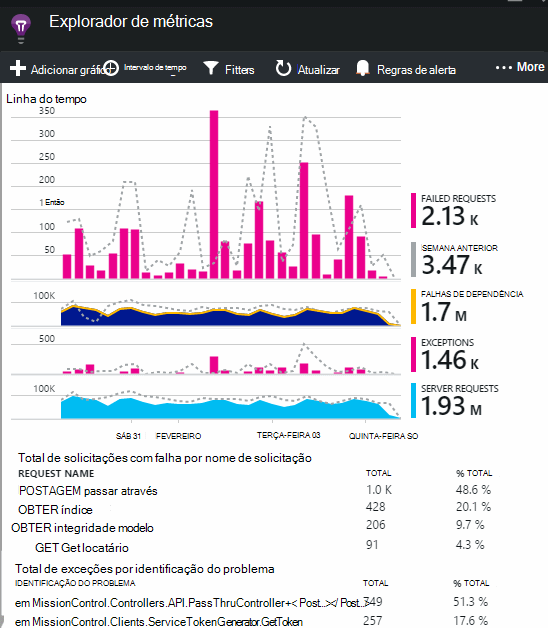

## O que significam os números?

A legenda ao lado por padrão geralmente mostra o valor agregado ao longo do período do gráfico. Quando você focaliza o gráfico, ele mostra o valor nesse momento.

Cada ponto de dados no gráfico é uma agregação dos valores de dados recebidos no intervalo de amostragem anterior ou "detalhamento". O detalhamento é mostrado na parte superior da lâmina e varia de acordo com a escala de tempo geral do gráfico.

Métricas podem ser agregadas de maneiras diferentes: 

 * **Soma** adiciona os valores de todos os pontos de dados recebidos sobre o intervalo de amostragem ou o período do gráfico.
 * **Média** divide a soma pelo número de pontos de dados recebidos no intervalo.
 * Contagens de **exclusivos** são usadas para contagens de usuários e contas. Sobre o intervalo de amostragem, ou ao longo do período do gráfico, a figura mostra a contagem de usuários diferentes visto no momento.

Você pode alterar o método de agregação:

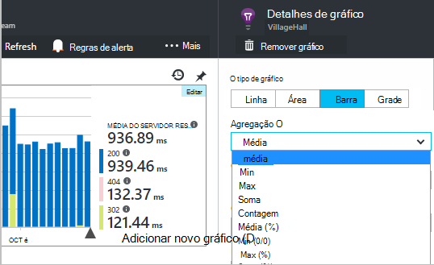

O método padrão para cada métrica é mostrado quando você cria um novo gráfico ou quando todas as métricas estão desmarcadas:

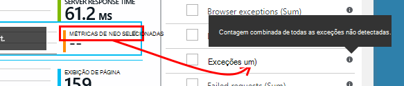

## Edição de gráficos e grades

Para adicionar um novo gráfico lâmina:

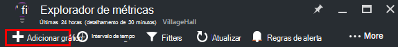

Selecione **Editar** em um gráfico novo ou existente para editar o que ele mostra:

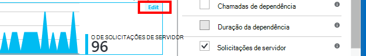

Você pode exibir mais de uma métrica em um gráfico, embora existam restrições sobre as combinações que podem ser exibidas juntas. Assim que você escolher uma métrica, alguns dos outros estão desabilitados. 

Se você codificados [personalizados de métricas] [ track] em seu aplicativo (chamadas TrackMetric e TrackEvent) eles serão listados aqui.

## Segmentação de dados

Você pode dividir uma métrica por propriedade - por exemplo, para comparar modos de exibição de página em clientes com sistemas operacionais diferentes. 

Selecione uma grade ou gráfico, alterne sobre agrupamento e escolha uma propriedade para agrupar por:

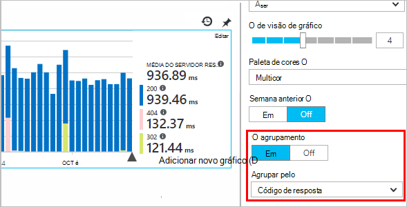

> [AZURE.NOTE] Quando você usa o agrupamento, os tipos de área e gráfico de barras fornecem uma exibição empilhada. Isso é adequado onde o método de agregação é a soma. Mas onde o tipo de agregação é média, escolha os tipos de exibição de linha ou grade. 

Se você codificados [personalizados de métricas] [ track] em seu aplicativo e elas incluem valores de propriedade, você poderá selecionar a propriedade na lista.

O gráfico é muito pequeno para dados segmentados? Ajuste a altura:

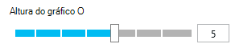

## Filtrar seus dados

Para ver apenas as métricas para um conjunto de valores de propriedade selecionados:

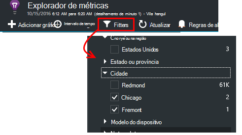

Se você não selecionar todos os valores de uma determinada propriedade, é o mesmo que selecionar todas elas: não há nenhum filtro na propriedade.

Observe as contagens de eventos junto com cada valor de propriedade. Quando você selecionar valores de propriedade, as contagens junto com outros valores de propriedade são ajustadas.

Filtros de aplicam a todos os gráficos em uma lâmina. Se você quiser filtros diferentes aplicados a gráficos diferentes, crie e salve blades métricas diferentes. Se desejar, você pode fixar gráficos de blades diferentes ao painel, para que você possa vê-los junto com os outros.

### Remover o tráfego de teste bot e da web

Usar o filtro de **tráfego Real ou sintético** e marque **Real**.

Você também pode filtrar pela **fonte de tráfego sintético**.

### Para adicionar propriedades à lista de filtros

Você gostaria de telemetria em uma categoria de sua preferência de filtro? Por exemplo, talvez você divide seus usuários em categorias diferentes e que você gostaria de segmento seus dados por essas categorias.

[Criar sua própria propriedade](app-insights-api-custom-events-metrics.md#properties). Configurá-lo em um [Inicializador de telemetria](app-insights-api-custom-events-metrics.md#telemetry-initializers) para que ele apareça em todos os telemetria - incluindo a telemetria padrão enviada por diferentes módulos SDK.

## Editar o tipo de gráfico

Observe que você pode alternar entre grades e gráficos:

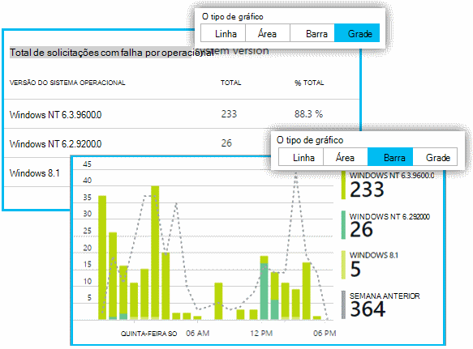

## Salvar seu blade métricas

Quando você criou alguns gráficos, salvá-los como um favorito. Você pode optar por compartilhá-lo com outros membros da equipe, se você usa uma conta organizacional.

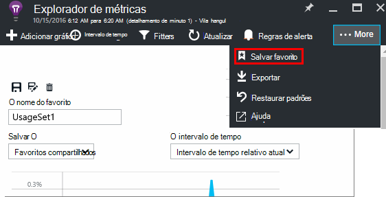

Para ver a lâmina novamente, **vá para a lâmina de visão geral** e abrir favoritos:

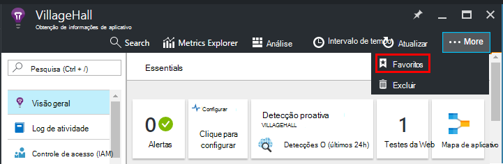

Se você escolheu o intervalo de tempo relativo quando você salva, a lâmina será atualizada com as últimas métricas. Se você escolheu o intervalo de tempo absoluto, ele mostrará os mesmos dados sempre.

## Redefinir a lâmina

Se você editar um blade, mas depois que você gostaria de voltar para o original salvo conjunto, clique em Redefinir.

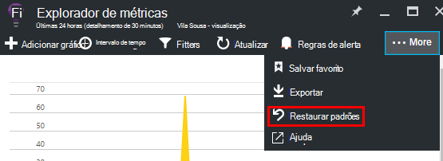

## Fluxo de métricas ao vivo: métricas instantâneas para monitoramento fechar

Fluxo de métricas ao vivo mostra suas métricas de aplicativos neste momento muito, com uma latência de tempo real próximo de 1 segundo. Isso é muito útil quando você estiver liberar uma nova compilação e certifique-se de que tudo está funcionando conforme esperado ou investigação de um incidente em tempo real.

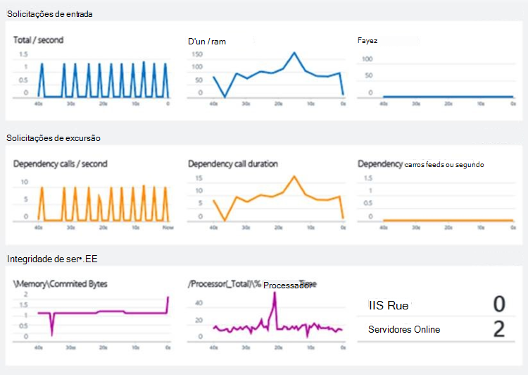

Diferentemente métricas Explorer, o fluxo de métricas ao vivo exibe um conjunto fixo de métricas. Os dados persistem somente para desde que ele está no gráfico e, em seguida, é descartado. 

Fluxo de métricas ao vivo está disponível com o SDK de ideias de aplicativo do ASP.NET, versão 2.1.0 ou posterior.

## Definir alertas

Para ser notificado por email de valores incomuns de qualquer métrica, adicione um alerta. Você pode escolher enviar o email para os administradores de conta ou endereços de email específico.

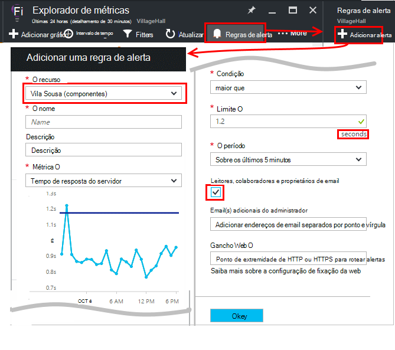

[Saiba mais sobre alertas][alerts].

## Exportar para o Excel

Você pode exportar dados métricos que serão exibidos no Explorador de métrica para um arquivo do Excel. Os dados exportados incluem dados de todos os gráficos e tabelas conforme visto no portal. 

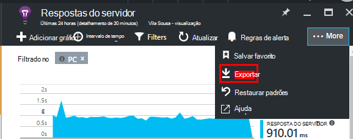

Os dados para cada tabela ou gráfico são exportados para uma planilha separada no arquivo do Excel.

O que você vê é o que é exportado. Altere o intervalo de tempo ou filtros se você quiser alterar o intervalo de dados exportados. Para tabelas, se o comando **carregar mais** estiver visível, você pode clicar nele antes de clicar em Exportar, para ter mais dados exportados.

*Exporte funciona somente para o Internet Explorer e Chrome no momento. Estamos trabalhando para adicionar suporte para outros navegadores.*

## Exportar contínuo

Se você quiser dados exportados continuamente para que você possa processar externamente, considere o uso [contínuo exportar](app-insights-export-telemetry.md).

### Power BI

Se você quiser ainda melhores modos de exibição de seus dados, você pode [Exportar para o Power BI](http://blogs.msdn.com/b/powerbi/archive/2015/11/04/explore-your-application-insights-data-with-power-bi.aspx).

## Análise

[Análise](app-insights-analytics.md) é uma maneira mais versátil para analisar seu telemetria usando uma linguagem de consulta avançada. Usá-lo se desejar combinar ou calcular resultados a partir métricas ou realizar uma exploração em deph de desempenho recentes do seu aplicativo. Por outro lado, use métricas Explorer se quiser que a atualização automática, gráficos no painel de controle e alertas.

## Solução de problemas

*Não vejo todos os dados em meu gráfico.*

* Filtros de aplicam a todos os gráficos na lâmina. Certifique-se de que, enquanto estiver concentrado em um gráfico, você não definir um filtro que exclui todos os dados em outra. 

    Se você quiser configurar filtros diferentes em gráficos diferentes, crie-os em lâminas diferentes, salvá-los como separados Favoritos. Se desejar, você pode fixá-los ao painel para que você possa vê-los junto com os outros.

* Se você agrupar um gráfico por uma propriedade que não é definida na métrica, em seguida, haverá nada no gráfico. Tente limpar 'Agrupar por' ou escolha uma propriedade de agrupamento diferente.
* Dados de desempenho (CPU, taxa es e assim por diante) está disponível para serviços web Java, aplicativos de desktop Windows, [aplicativos e serviços se você instalar o monitor de status de web IIS](app-insights-monitor-performance-live-website-now.md)e [Serviços de nuvem do Azure](app-insights-azure.md). Ele não está disponível para sites Azure.

## Próximas etapas

* [Uso do monitoramento com ideias de aplicativo](app-insights-overview-usage.md)
* [Usando a pesquisa de diagnóstico](app-insights-diagnostic-search.md)

<!--Link references-->

[alerts]: app-insights-alerts.md
[start]: app-insights-overview.md
[track]: app-insights-api-custom-events-metrics.md

 