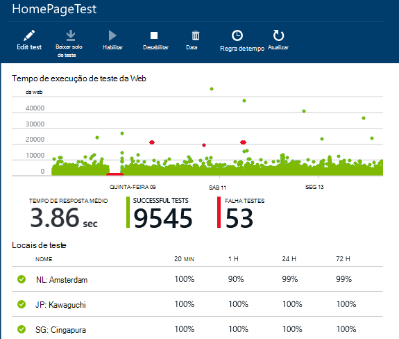
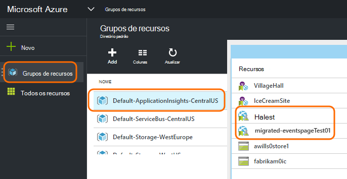
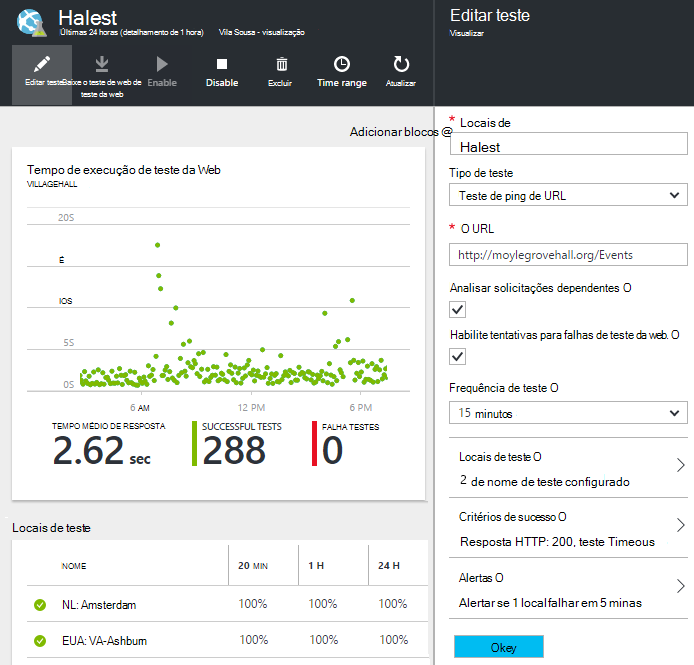

<properties 
    pageTitle="Migrar o ponto de extremidade do Azure para testes de disponibilidade de obtenção de informações de aplicativo" 
    description="Migrando clássicos testes de monitoramento de ponto de extremidade do Azure para obtenção de informações de aplicativo testes de disponibilidade por 31 de outubro de 2016."
    services="application-insights" 
    documentationCenter=""
    authors="soubhagyadash" 
    manager="douge"/>

<tags 
    ms.service="application-insights" 
    ms.workload="tbd" 
    ms.tgt_pltfrm="ibiza" 
    ms.devlang="na" 
    ms.topic="article" 
    ms.date="07/25/2016" 
    ms.author="awills"/>
 
# Mover de ponto de extremidade Azure monitoramento testes de disponibilidade de obtenção de informações de aplicativo

Você usa o [monitoramento de ponto de extremidade](https://blogs.msdn.microsoft.com/mast/2013/03/03/windows-azure-portal-update-configure-web-endpoint-status-monitoring-preview/) para os aplicativos do Azure? Por *31 de outubro de 2016*, elas serão substituídas com os [testes de disponibilidade](app-insights-monitor-web-app-availability.md)de novo e mais eficiente. Já criamos alguns dos novos testes, embora ele estão desabilitados até 31 de outubro de 2016. 

Você pode editar os novos testes e fazer a mudança por conta própria se desejar. Você as encontrará [portal Azure](https://portal.azure.com) no grupo de recursos padrão-ApplicationInsights-CentralUS.

## O que são testes de disponibilidade?

Testes de disponibilidade é um recurso do Azure que verifica continuamente que qualquer site ou serviço está acima e execução enviando solicitações HTTP para ela (testes de ping única ou testes de web do Visual Studio) de até 16 locais em todo o mundo. 

No [portal do Azure clássico](https://manage.windowsazure.com), esses testes foram chamados monitoramento de ponto de extremidade. Eles foram mais escopo limitados. Os novos testes de disponibilidade são um aperfeiçoamento substancial:

* Até 10 testes de web do Visual Studio ou testes de ping por recurso de obtenção de informações do aplicativo. 
* Até 16 locais em todo o mundo para enviar solicitações de teste para seu aplicativo web. Maior controle de critérios de sucesso do teste. 
* Teste qualquer site ou serviço - aplicativos web não apenas Azure.
* Testar tentativas: reduzir alertas falsos positivos devido a problemas de rede temporário. 
* Webhooks pode receber notificações de HTTP POST para os alertas.

Leia mais sobre [testes de disponibilidade aqui](app-insights-monitor-web-app-availability.md).

Testes de disponibilidade fazem parte de [Ideias de aplicativo do Visual Studio](app-insights-overview.md), que é um serviço de análise extensível para qualquer aplicativo da web.

## O que está acontecendo com o meu ponto de extremidade testa assim?

* Podemos copiou seu ponto de extremidade monitoramento testes para os novos testes de disponibilidade de obtenção de informações do aplicativo.
* Os novos testes de disponibilidade estão desabilitados e os testes de ponto de extremidade antigos ainda estão em execução.
* O alerta regras *não* foram migradas. Os novos testes inicialmente tem sido configurados com uma regra padrão:
 * Disparadores quando mais de 1 local relata falhas em 5 minutos.
 * Envia email aos administradores de assinatura.

No [portal do Azure](https://portal.azure.com), você pode encontrar os testes migrados no grupo de recursos "Padrão-ApplicationInsights-CentralUS". Os nomes de teste são precedidos "Migrated-". 

## O que eu preciso fazer?

* Se alguma forma, podemos perdido migrando os testes, os novos testes de disponibilidade são [fáceis de configurar](app-insights-monitor-web-app-availability.md).

### Opção r: fazer nada. Deixe-nos.

**Em 31 de outubro de 2016,** podemos irá:

* Desative os antigo testes de ponto de extremidade.
* Habilite os testes de disponibilidade migrados.

### Opção b: você gerenciar e/ou habilitar os novos testes.

* Revisar e editar os novos testes de disponibilidade no novo [portal Azure](https://portal.azure.com). 
 * Examine os critérios do disparador
 * Examine os destinatários de email
* Habilitar os novos testes
* Podemos desativará o ponto de extremidade herdado monitoramento testes em 31 de outubro de 2016 

### Opção c: Opt-out

Se você não quiser usar testes de disponibilidade, você pode excluí-las do [portal do Azure](https://portal.azure.com). Também há um link de Cancelar assinatura na parte inferior dos emails de notificação.

Ainda estamos excluirá os testes de ponto de extremidade antigo em 31 de outubro de 2016. 

## Como para editar os novos testes?

Entrar no [portal do Azure](https://portal.azure.com) e localizar os testes de web 'Migrated-': 

Editar e/ou habilitar o teste:

## Por que isso acontece?

Serviço melhor. O serviço de ponto de extremidade antigo estava muito mais estreito. Você pode fornecer apenas dois URLs para testes de ping simples de 3 locais geográfica em um aplicativo web ou de máquina virtual do Azure. Os novos testes podem executar testes de web de várias etapas de até 16 locais e você pode especificar até 10 testes para um aplicativo. Você pode testar qualquer URL - ele não precisa ser um site do Azure.

Os novos testes são configurados separadamente do aplicativo web ou máquina virtual que você está testando. 

Vamos migrar os testes para garantir que você continue tenham controle sobre eles enquanto estiver usando o novo portal. 

## O que é a obtenção de informações de aplicativo?

Os novos testes de disponibilidade fazem parte de [Ideias de aplicativo do Visual Studio](app-insights-overview.md). Aqui está um [vídeo de 2 minutos](http://go.microsoft.com/fwlink/?LinkID=733921).

## Estou pagando para os novos testes?

Os testes migrados estão configurados em um recurso de obtenção de informações de aplicativo no plano de gratuito do padrão. Isso permite que o conjunto até 5 milhões de pontos de dados. Que aborda facilmente o volume de dados que os testes usará atualmente. 

Claro, se você obtenção de informações do aplicativo, como e cria mais testes de disponibilidade ou adotar mais dos seus recursos de diagnóstico e de monitoramento de desempenho, você vai gerar mais pontos de dados.  No entanto, o resultado apenas seria que você pode pressionar a cota para o plano de livre. Você não receberá uma fatura, a menos que você optar por usar em para os planos de Standard ou Premium. 

[Saiba mais sobre preços de obtenção de informações de aplicativo e monitoramento de cota](app-insights-pricing.md). 

## O que é e não é migrado?

Preservadas de seu antigo testes de ponto de extremidade:

* URL do ponto de extremidade a ser testado.
* Locais de localização geográfica do qual as solicitações são enviadas.
* Frequência de teste permanece 5 minutos.
* Tempo limite de teste permanece 30 segundos. 

Não migrados:

* Regra de disparador de alerta. A regra que definimos disparadores quando 1 local relata falhas em 5 minutos.
* Alerta destinatários. E-mails de notificação serão enviadas para os proprietários de assinatura e proprietários de colegas. 

## Como posso encontrar os novos testes?

Você pode editar qualquer um dos novos testes agora se desejar. Entre [portal do Azure](https://portal.azure.com), abra a **Grupos de recursos** e selecione **Padrão-ApplicationInsights-CentralUS**. Nesse grupo, você encontrará os novos testes da web. [Saiba mais sobre os novos testes de disponibilidade](app-insights-monitor-web-app-availability.md).

Observe que os novos emails de alerta serão enviados deste endereço: alertas de obtenção de informações de aplicativo(ai-noreply@microsoft.com)

## O que acontece se eu não fizer nada?

Opção A serão aplicadas. Nós permitem testes migrados e configurar as regras de alerta padrão conforme mencionado acima. Você precisará adicionar as regras de alerta personalizadas, destinatários conforme mencionado acima. Podemos desativará o ponto de extremidade herdado monitoramento testes. 

## Onde pode fornecer comentários sobre isso? 

Agradecemos os seus comentários. Faça [um e-mail](mailto:vsai@microsoft.com). 

