<properties
    pageTitle="Diagnosticar problemas de desempenho em um site do IIS em execução | Microsoft Azure"
    description="Monitore o desempenho de um site sem implantá-lo novamente. Use autônomo ou com o SDK do aplicativo ideias para obter telemetria de dependência."
    services="application-insights"
    documentationCenter=".net"
    authors="alancameronwills"
    manager="douge"/>

<tags
    ms.service="application-insights"
    ms.workload="tbd"
    ms.tgt_pltfrm="ibiza"
    ms.devlang="na"
    ms.topic="get-started-article"
    ms.date="10/24/2016"
    ms.author="awills"/>

# Aplicativos da web de instrumentos em tempo de execução com ideias de aplicativo

*Obtenção de informações de aplicativo está no modo de visualização.*

Você pode instrumentar um aplicativo web ao vivo com a obtenção de informações de aplicativo de Studio Visual, sem precisar modificar ou reimplantar seu código. Em seus aplicativos são hospedados por um servidor IIS local, instale o Monitor de Status; ou, se elas são aplicativos web Azure ou executar em uma máquina virtual do Azure, você pode instalar a extensão de obtenção de informações do aplicativo. (Também há separados artigos sobre instrumentação [live J2EE web aplicativos](app-insights-java-live.md) e [Serviços de nuvem do Azure](app-insights-cloudservices.md).)

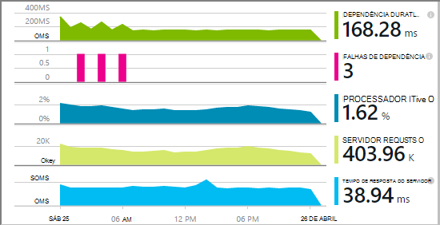

Você tem uma opção de três rotas para aplicar a obtenção de informações de aplicativo aos aplicativos web .NET:

* **Criar horário:** [Adicionar a obtenção de informações do aplicativo SDK] [greenbrown] ao seu código de aplicativo web. 
* **Tempo de execução:** Instrumentar seu aplicativo web no servidor, conforme descrito abaixo, sem recriar e reimplantar o código.
* **Ambas:** Criar o SDK no seu código de aplicativo da web e também aplicar as extensões de tempo de execução. Obtenha o melhor de ambas as opções. 

Aqui está um resumo dos quais você recebe por cada rota:

||Hora da compilação|Tempo de execução|
|---|---|---|
|Solicitações & exceções|Sim|Sim|
|[Exceções mais detalhadas](app-insights-asp-net-exceptions.md)||Sim|
|[Diagnóstico de dependência](app-insights-asp-net-dependencies.md)|No .NET 4.6 +|Sim|
|[Contadores de desempenho do sistema](app-insights-performance-counters.md)||Serviço de nuvem IIS ou Azure, não Azure web app|
|[API para telemetria personalizada][api]|Sim||
|[Integração do log de rastreamento](app-insights-asp-net-trace-logs.md)|Sim||
|[Dados de usuário & modo de exibição de página](app-insights-javascript.md)|Sim||
|Não é necessário recriar o código|Não||

## Instrumentar seu aplicativo web em tempo de execução

Você precisa de uma assinatura do [Microsoft Azure](http://azure.com) .

### Se seu aplicativo for um aplicativo do Azure web ou serviço de nuvem

* Selecione a obtenção de informações de aplicativo no painel de controle do aplicativo no Azure. 

    [Saiba mais](app-insights-azure.md).

### Se seu aplicativo estiver hospedado em seu servidor IIS

1. Em seu servidor de web IIS, entre com credenciais de administrador.
2. Baixe e execute o [instalador do Monitor de Status](http://go.microsoft.com/fwlink/?LinkId=506648).
4. No Assistente de instalação, entrar no Microsoft Azure.

    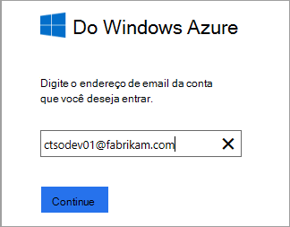

    *Erros de Conexão? Consulte [solução de problemas](#troubleshooting).*

5. Escolha o aplicativo web instalados ou o site que você deseja monitorar e depois configurar o recurso na qual você deseja ver os resultados no portal de obtenção de informações do aplicativo.

    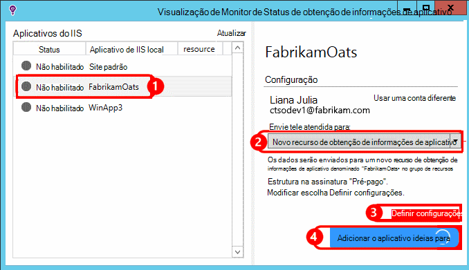

    Normalmente, você optar por configurar um novo recurso e o [grupo de recursos][roles].

    Caso contrário, use um recurso existente se você já configurou [web testa] [ availability] para seu site ou [monitoramento de clientes do web][client].

6. Reinicie o IIS.

    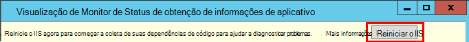

    Seu serviço da web será interrompido por um período curto.

6. Observe que ApplicationInsights.config foi inserido em aplicativos da web que você deseja monitorar.

    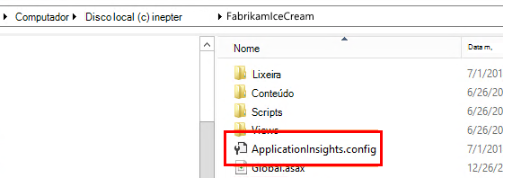

   Também existem algumas alterações para Web. config.

#### Deseja (re) configurar mais tarde?

Depois de concluir o assistente, você pode configurar novamente o agente sempre que desejar. Você também pode usar esta opção se você tiver instalado o agente, mas houve alguns problemas com a configuração inicial.

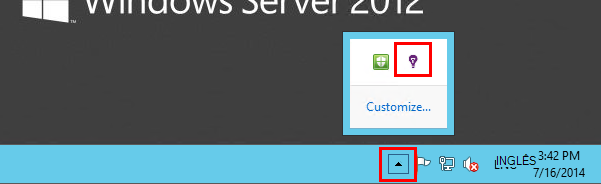

## Telemetria de desempenho do modo de exibição

Entrar no [portal do Azure](https://portal.azure.com), navegue ideias de aplicativo e abra o recurso que você criou.

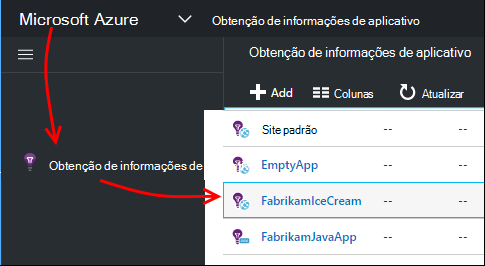

Abra a lâmina de desempenho para ver a solicitação, tempo de resposta, dependência e outros dados.

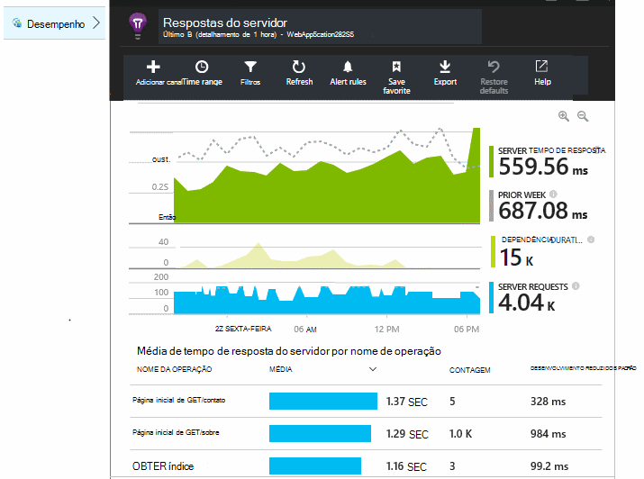

Clique em qualquer gráfico para abrir uma exibição mais detalhada.

Você pode [Editar, reorganizar, salvar](app-insights-metrics-explorer.md), e fixar gráficos ou a lâmina toda a um [painel](app-insights-dashboards.md).

## Dependências

O gráfico de dependência duração mostra o tempo gasto por chamadas de seu aplicativo para componentes externos como bancos de dados, APIs REST ou armazenamento de blob do Microsoft Azure.

Para o gráfico de segmento por chamadas para dependências diferentes: editar o gráfico, ativar o agrupamento e, em seguida, agrupar por dependência, tipo de dependência ou dependência de desempenho.

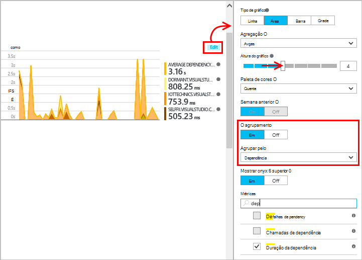

## Contadores de desempenho 

(Não para aplicativos web Azure.) Clique em servidores na lâmina visão geral para ver gráficos de contadores de desempenho do servidor como o uso de memória e ocupação de CPU.

Se você tiver várias instâncias de servidor, você talvez queira editar os gráficos para agrupar por instância de função.

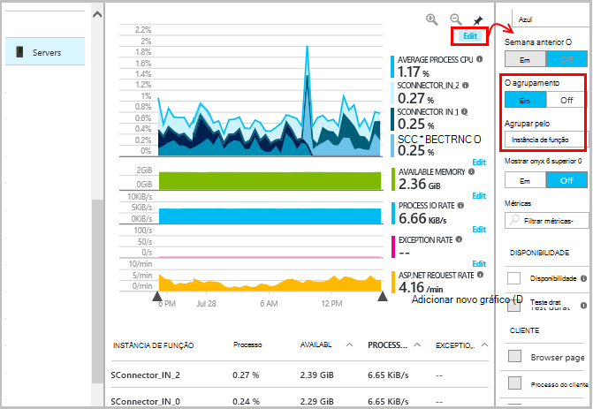

Você também pode [alterar o conjunto de contadores de desempenho que são relatados pelo SDK](app-insights-configuration-with-applicationinsights-config.md#nuget-package-3). 

## Exceções

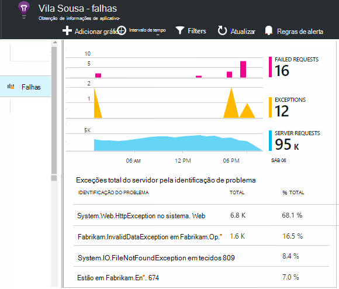

Você pode fazer drill down exceções específicas (nos últimos sete dias) e obter dados de contexto e rastreamentos de pilha.

## Amostragem

Se seu aplicativo envia muitos dados e você estiver usando o SDK do aplicativo ideias para ASP.NET versão 2.0.0-beta3 ou posterior, o recurso de amostragem adaptativa pode operar e enviar apenas uma porcentagem do seu telemetria. [Saiba mais sobre amostragem.](app-insights-sampling.md)

## Solução de problemas

### Erros de Conexão

Você precisa abrir [algumas portas de saída](app-insights-ip-addresses.md#outgoing-ports) no firewall do seu servidor para permitir que o Monitor de Status trabalhar.

### Nenhum Telemetria?

  * Use seu site, para gerar alguns dados.
  * Aguarde alguns minutos para permitir que os dados chegam, em seguida, clique em **Atualizar**.
  * Abrir pesquisa diagnóstico (o bloco de pesquisa) para ver os eventos individuais. Eventos geralmente são visíveis no diagnóstico de pesquisa antes de agregar dados aparecem nos gráficos.
  * Abra o Monitor de Status e selecione seu aplicativo no painel esquerdo. Verificar se há quaisquer mensagens de diagnóstico para este aplicativo na seção "Configuração notificações":

  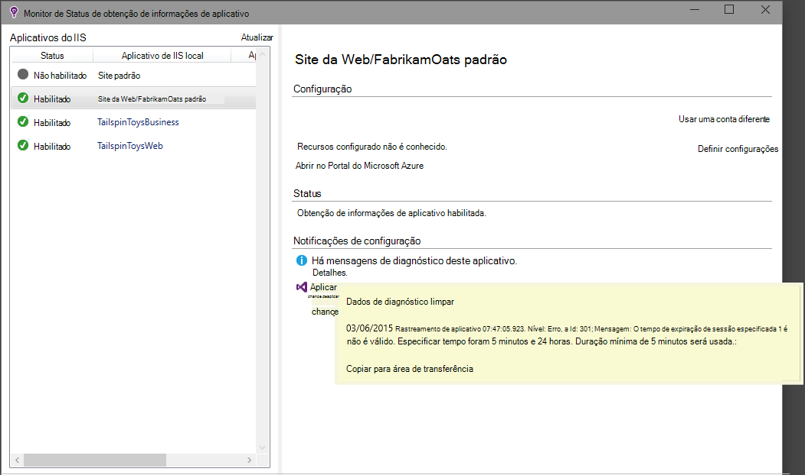

  * Verifique se que seu firewall do servidor permite o tráfego de saída nas portas listadas acima.
  * No servidor, se você vir uma mensagem sobre "permissões insuficientes", tente o seguinte:
    * No Gerenciador do IIS, selecione o pool de aplicativos, abra **Configurações avançadas**e em **Modelo de processo** , observe a identidade.
    * No painel de controle do gerenciamento de computador, adicione essa identidade ao grupo de usuários de Monitor de desempenho.
  * Se você tiver instalado no seu servidor MMA/SCOM, algumas versões podem entrar em conflito. Desinstale o SCOM e o Monitor de Status e instalar novamente as versões mais recentes.
  * Consulte [solução de problemas][qna].

## Requisitos do sistema

Suporte de sistema operacional para o Monitor de Status de ideias de aplicativo no servidor:

- Windows Server 2008
- Windows Server 2008 R2
- Windows Server 2012
- Servidor Windows 2012 R2

com mais recente SP e .NET Framework 4.0 e 4,5

No lado do cliente no Windows 7, 8 e 8.1, novamente com .NET Framework 4.0 e 4,5

O suporte do IIS é: IIS 7, 7.5, 8, 8.5 (IIS é necessário)

## Automação com o PowerShell

Você pode iniciar e parar monitoramento usando o PowerShell no servidor IIS.

Importe primeiro o módulo de obtenção de informações do aplicativo:

`Import-Module 'C:\Program Files\Microsoft Application Insights\Status Monitor\PowerShell\Microsoft.Diagnostics.Agent.StatusMonitor.PowerShell.dll'`

Descobrir quais aplicativos estão sendo monitorados:

`Get-ApplicationInsightsMonitoringStatus [-Name appName]`

* `-Name`(Opcional) O nome de um aplicativo web.
* Exibe a obtenção de informações de aplicativo monitoramento de status para cada aplicativo web (ou o aplicativo nomeado) nesse servidor IIS.

* Retorna `ApplicationInsightsApplication` para cada aplicativo:
 * `SdkState==EnabledAfterDeployment`: O aplicativo está sendo monitorado e foi instrumentos em tempo de execução pela ferramenta Monitor de Status, ou por `Start-ApplicationInsightsMonitoring`.
 * `SdkState==Disabled`: O aplicativo não é instrumentos para obtenção de informações do aplicativo. Ele nunca foi instrumentado tanto tempo de execução monitoramento foi desabilitada com a ferramenta Monitor de Status ou com `Stop-ApplicationInsightsMonitoring`.
 * `SdkState==EnabledByCodeInstrumentation`: O aplicativo foi instrumentos adicionando o SDK ao código-fonte. O SDK não pode ser atualizada ou interrompido.
 * `SdkVersion`mostra a versão em uso para monitoramento este aplicativo.
 * `LatestAvailableSdkVersion`mostra a versão atualmente disponível na Galeria do NuGet. Para atualizar o aplicativo para essa versão, use `Update-ApplicationInsightsMonitoring`.

`Start-ApplicationInsightsMonitoring -Name appName -InstrumentationKey 00000000-000-000-000-0000000`

* `-Name`O nome do aplicativo no IIS
* `-InstrumentationKey`O ikey do recurso ideias de aplicativo onde deseja que os resultados sejam exibidos.

* Esse cmdlet afeta somente os aplicativos que não são instrumentados já - ou seja, SdkState = = NotInstrumented.

    O cmdlet não afeta a um aplicativo que já está instrumentos, em tempo de compilação, adicionando o SDK ao código ou tempo de execução por um uso anterior desse cmdlet.

    A versão SDK usada para instrumentar o aplicativo é a versão mais recentemente baixada para este servidor.

    Para baixar a versão mais recente, use ApplicationInsightsVersion de atualização.

* Retorna `ApplicationInsightsApplication` sucesso. Se ele falhar, ele registrará um rastreamento para stderr.

    
          Name                      : Default Web Site/WebApp1
          InstrumentationKey        : 00000000-0000-0000-0000-000000000000
          ProfilerState             : ApplicationInsights
          SdkState                  : EnabledAfterDeployment
          SdkVersion                : 1.2.1
          LatestAvailableSdkVersion : 1.2.3

`Stop-ApplicationInsightsMonitoring [-Name appName | -All]`

* `-Name`O nome de um aplicativo no IIS
* `-All`Paradas de monitoramento todos os aplicativos no servidor IIS para o qual`SdkState==EnabledAfterDeployment`

* Monitorar aplicativos especificados e remove instrumentação. Ele funciona somente para aplicativos que tenham sido instrumentados em tempo de execução usando a ferramenta de monitoramento de Status ou iniciar ApplicationInsightsApplication. (`SdkState==EnabledAfterDeployment`)

* Retorna ApplicationInsightsApplication.

`Update-ApplicationInsightsMonitoring -Name appName [-InstrumentationKey "0000000-0000-000-000-0000"`]

* `-Name`: O nome de um aplicativo web no IIS.
* `-InstrumentationKey`(Opcional). Use isto para alterar o recurso ao qual telemetria do aplicativo é enviada.
* Esse cmdlet:
 * Atualiza o nomeado para a versão do SDK mais recentemente baixado neste computador. (Só funciona se `SdkState==EnabledAfterDeployment`)
 * Se você fornecer uma chave de instrumentação, o aplicativo nomeado é reconfigurar para enviar telemetria ao recurso com essa chave. (Funciona se `SdkState != Disabled`)

`Update-ApplicationInsightsVersion`

* Baixa o SDK de ideias de aplicativo mais recente no servidor.

## Próximas etapas

* [Criar testes web] [ availability] para garantir que seu site permanece ao vivo.
* [Pesquisar eventos e logs de] [ diagnostic] para ajudar a diagnosticar problemas.
* [Adicionar telemetria de cliente do web] [ usage] para ver exceções a partir de código de página da web e permitem que você inserir chamadas de rastreamento.
* [Adicionar Application ideias SDK ao seu código de serviço web] [ greenbrown] para que você pode inserir o rastreamento e chamadas de log no código de servidor.

<!--Link references-->

[api]: app-insights-api-custom-events-metrics.md
[availability]: app-insights-monitor-web-app-availability.md
[client]: app-insights-javascript.md
[diagnostic]: app-insights-diagnostic-search.md
[greenbrown]: app-insights-asp-net.md
[qna]: app-insights-troubleshoot-faq.md
[roles]: app-insights-resources-roles-access-control.md
[usage]: app-insights-web-track-usage.md
