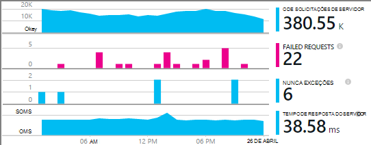
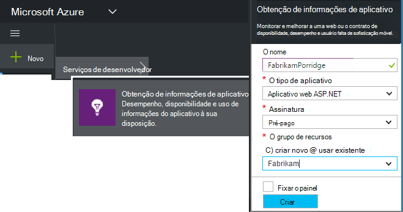
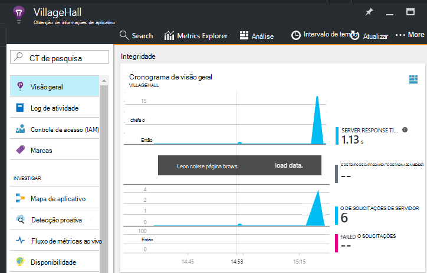

<properties
    pageTitle="Adicionar aplicativo ideias SDK para monitorar seu aplicativo Node | Microsoft Azure"
    description="Analise uso, disponibilidade e desempenho de seu local ou um aplicativo web do Microsoft Azure com ideias de aplicativo."
    services="application-insights"
    documentationCenter=""
    authors="alancameronwills"
    manager="douge"/>

<tags
    ms.service="application-insights"
    ms.workload="tbd"
    ms.tgt_pltfrm="ibiza"
    ms.devlang="na"
    ms.topic="get-started-article"
    ms.date="08/30/2016"
    ms.author="awills"/>


# <a name="add-application-insights-sdk-to-monitor-your-nodejs-app"></a>Adicionar aplicativo ideias SDK para monitorar seu aplicativo Node

*Obtenção de informações de aplicativo está no modo de visualização.*

[Obtenção de informações do Visual Studio aplicativo](app-insights-overview.md) monitora seu aplicativo ao vivo para ajudá-lo a [detectar e diagnosticar problemas de desempenho e exceções](app-insights-detect-triage-diagnose.md)e [Descubra como o seu aplicativo é usado](app-insights-overview-usage.md). Ele funciona para aplicativos que são hospedados em seus próprios servidores IIS local ou em VMs do Azure, bem como aplicativos web Azure.


O SDK fornece coleta automática de entrada taxas de solicitação HTTP e respostas, contadores de desempenho (CPU, memória, RPS) e exceções não tratadas. Além disso, você pode adicionar chamadas personalizadas para rastrear dependências, métricas ou outros eventos.




#### <a name="before-you-start"></a>Antes de começar

Você precisa:

* Visual Studio 2013 ou posterior. Posteriormente, é melhor.
* Uma assinatura do [Microsoft Azure](http://azure.com). Se a sua equipe ou organização tiver uma assinatura do Azure, o proprietário pode adicioná-lo a ele, usando sua [conta da Microsoft](http://live.com).

## <a name="add"></a>Criar um recurso de obtenção de informações de aplicativo

Entre [portal do Azure][portal]e crie um novo recurso de obtenção de informações do aplicativo. Um [recurso] [ roles] no Azure é uma instância de um serviço. Esse recurso é onde telemetria de seu aplicativo será analisada e apresentada.



Escolha outro como o tipo de aplicativo. A escolha do tipo de aplicativo define o conteúdo padrão das lâminas de recursos e as propriedades visível no [Explorador de métricas][metrics].

#### <a name="copy-the-instrumentation-key"></a>Copiar a chave de instrumentação

A chave identifica o recurso e você vai instalá-lo em breve no SDK para direcionar dados para o recurso.


## <a name="sdk"></a>Instalar o SDK em seu aplicativo

```
npm install applicationinsights --save
```

## <a name="usage"></a>Uso

Isso permitirá monitoramento de solicitação, controle de exceção não tratada e monitoramento (CPU/memória/RPS) de desempenho do sistema.

```javascript

var appInsights = require("applicationinsights");
appInsights.setup("<instrumentation_key>").start();
```

A chave de instrumentação também pode ser definida na variável de ambiente APPINSIGHTS_INSTRUMENTATIONKEY. Se isso for feito, nenhum argumento é necessário ao chamar `appInsights.setup()` ou `appInsights.getClient()`.

Você pode experimentar o SDK sem enviar telemetria: definir a chave de instrumentação como uma cadeia de caracteres não vazio.


## <a name="run"></a>Executar o projeto

Executar o aplicativo e testá-la: abrir páginas diferentes para gerar algumas telemetria.


## <a name="monitor"></a>Exibir seu Telemetria

Volte para o [portal do Azure](https://portal.azure.com) e procure o recurso de obtenção de informações do aplicativo.


Procure por dados na página Visão geral. Primeiro, você verá apenas um ou dois pontos. Por exemplo:



Clique em qualquer gráfico para ver mais detalhadas métricas. [Saiba mais sobre métricas.][perf]

#### <a name="no-data"></a>Nenhum dado?

* Use o aplicativo, abrindo páginas diferentes para que ele gera alguns telemetria.
* Abra o bloco de [pesquisa](app-insights-diagnostic-search.md) , para ver eventos individuais. Às vezes, leva eventos um pouco enquanto mais tempo para obter pelo pipeline de métricas.
* Aguarde alguns segundos e clique em **Atualizar**. Gráficos de atualizar próprios periodicamente, mas você pode atualizar manualmente, se você está aguardando para alguns dados apareça.
* Consulte [solução de problemas][qna].

## <a name="publish-your-app"></a>Publicar seu aplicativo

Agora implantar seu aplicativo para IIS ou do Azure e assista os dados são acumulados.


#### <a name="no-data-after-you-publish-to-your-server"></a>Nenhum dado depois de publicar seu servidor?

Abra essas portas para tráfego de saída no firewall do seu servidor:

+ `dc.services.visualstudio.com:443`
+ `f5.services.visualstudio.com:443`


#### <a name="trouble-on-your-build-server"></a>Problemas no seu servidor de compilação?

Consulte [este item de solução de problemas](app-insights-asp-net-troubleshoot-no-data.md#NuGetBuild).


## <a name="customized-usage"></a>Uso personalizados 

### <a name="disabling-auto-collection"></a>Desabilitando o conjunto de automático

```javascript
import appInsights = require("applicationinsights");
appInsights.setup("<instrumentation_key>")
    .setAutoCollectRequests(false)
    .setAutoCollectPerformance(false)
    .setAutoCollectExceptions(false)
    // no telemetry will be sent until .start() is called
    .start();
```

### <a name="custom-monitoring"></a>Monitoração personalizada

```javascript
import appInsights = require("applicationinsights");
var client = appInsights.getClient();

client.trackEvent("custom event", {customProperty: "custom property value"});
client.trackException(new Error("handled exceptions can be logged with this method"));
client.trackMetric("custom metric", 3);
client.trackTrace("trace message");
```

[Saiba mais sobre a API de telemetria](app-insights-api-custom-events-metrics.md).

### <a name="using-multiple-instrumentation-keys"></a>Usando várias teclas de instrumentação

```javascript
import appInsights = require("applicationinsights");

// configure auto-collection with one instrumentation key
appInsights.setup("<instrumentation_key>").start();

// get a client for another instrumentation key
var otherClient = appInsights.getClient("<other_instrumentation_key>");
otherClient.trackEvent("custom event");
```

## <a name="examples"></a>Exemplos

### <a name="tracking-dependency"></a>Dependência de acompanhamento

```javascript
import appInsights = require("applicationinsights");
var client = appInsights.getClient();

var startTime = Date.now();
// execute dependency call
var endTime = Date.now();

var elapsedTime = endTime - startTime;
var success = true;
client.trackDependency("dependency name", "command name", elapsedTime, success);
```


### <a name="manual-request-tracking-of-all-get-requests"></a>Controle de solicitação manual de todas as solicitações de "Obter"

```javascript
var http = require("http");
var appInsights = require("applicationinsights");
appInsights.setup("<instrumentation_key>")
    .setAutoCollectRequests(false) // disable auto-collection of requests for this example
    .start();

// assign common properties to all telemetry sent from the default client
appInsights.client.commonProperties = {
    environment: process.env.SOME_ENV_VARIABLE
};

// track a system startup event
appInsights.client.trackEvent("server start");

// create server
var port = process.env.port || 1337
var server = http.createServer(function (req, res) {
    // track all "GET" requests
    if(req.method === "GET") {
        appInsights.client.trackRequest(req, res);
    }

    res.writeHead(200, { "Content-Type": "text/plain" });
    res.end("Hello World\n");
}).listen(port);

// track startup time of the server as a custom metric
var start = +new Date;
server.on("listening", () => {
    var end = +new Date;
    var duration = end - start;
    appInsights.client.trackMetric("StartupTime", duration);
});
```

## <a name="next-steps"></a>Próximas etapas

* [Monitorar seu telemetria no portal](app-insights-dashboards.md)
* [Gravar a análise de consultas sobre sua Telemetria](app-insights-analytics-tour.md)


<!--Link references-->

[knowUsers]: app-insights-overview-usage.md
[metrics]: app-insights-metrics-explorer.md
[perf]: app-insights-web-monitor-performance.md
[portal]: http://portal.azure.com/
[qna]: app-insights-troubleshoot-faq.md
[roles]: app-insights-resources-roles-access-control.md
